# Packages

This article provides a guide to uploading, validating, certifying, and publishing game builds by using the latest **Packages** experience in Partner Center. The [Packages (classic experience)](packages-overview.md) article is available during the transition to the new experience. Microsoft will disable the classic experience in a future release. During preview, switching between both experiences doesn't affect existing packages or configurations.

## Switching between the default and classic experiences

Partner Center supports switching between the default experience and the classic experience at any time. 

- Switching doesn't affect your packages, certification status, publishing, or history.
- Both experiences show the same packages and submissions.
- Use the toggle if you encounter an issue or need to reference the classic UI.

Use the latest experience and share feedback. Your input helps Microsoft improve the experience.

---

## Overview of Packages

**Packages** is a single place to manage your game's packages.

| Action | Description |
| ---- | ------------- |
| Upload your game build | Upload your packages to Partner Center: XVC packages for Xbox consoles or MSIXVC packages for PC. |
| Review validation errors | Validation errors appear automatically when you upload a package. You resolve errors before submitting your build for certification. |
| Submit for certification | Submit your build for certification. |
| Test with a limited audience | Use flights to test your build with internal teams or partners before broad release. |
| Publish to players | Publish your build to a developer sandbox, or to the RETAIL sandbox after certification. |
| Roll back a build | Restore a previous certified build in the RETAIL sandbox without reuploading or re-certification. |

### Packages terminology and features

Use the following terminology to understand the features available in Packages.

- **Branch gallery (Packages page):** The main view of the **Packages** page, showing the product's branches split by **Draft** and **Live**.
- **Branch:** A container for package files and their associated configuration.
- **Branch menu:** The options available after selecting the **...** for any specific branch. Depending on the branch (Main versus others), menu options might include **View and Edit**, **Create Flight**, **Promote to Main**, and **Delete**.
- **History:** The log of actions taken within specific branches or flights.
- **Certify:** The option to begin submission to Xbox Certification.
- **Review and Publish:** The option to begin publishing to a development sandbox or RETAIL.

---

## Branches: working on multiple builds

Branches let you work on multiple versions of your game at the same time without them interfering with each other. Think of each branch as a separate workspace for a specific purpose. 

### Why use branches?

- Certify a stable build on one branch while uploading and testing a different build elsewhere.
- Test risky changes without touching your live build.
- Create a hotfix branch to isolate urgent fixes from ongoing development.
- Prepare localization or regional variants independently.

---

## Branch gallery: draft and live

When you open the **Packages** page, you see two views: **Draft** and **Live**. These views represent different states of branches.

### Draft view

The **Draft** view is your active working area. **Draft** supports package upload, certification status checks, and preparation of builds for testing or publishing. The **Draft** view shows two sections:

- **Main branch:** Shows the working draft linked to your current public release. Only the main branch can be published to RETAIL.
- **Additional branches:** Shows all other branches. 

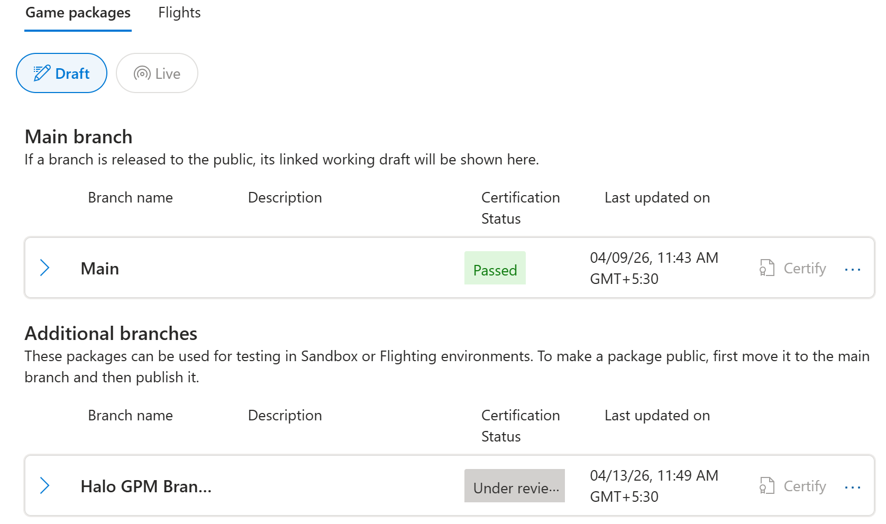

### Draft view menu options
Each branch has a menu (select the **...** icon) with branch-specific actions.

| Branch type | Available actions |
| ----------- | ----------------- |
| Main branch | **View & Edit:** Opens the branch to upload and manage packages. **Create flight:** Creates a flight directly from this branch. |
| Additional branches (sandbox or flight) |  **View & Edit:** Opens the branch to upload and manage packages. **Create flight:** Creates a flight directly from this branch. **Promote to main branch:** Replaces the entire contents of the Main branch with packages from this branch. Previous packages in Main are permanently deleted and can't be recovered. **Delete:** Permanently deletes this branch. |

### Live view

The **Live** view displays published packages that are available to players. This view includes packages published for general availability in the Microsoft Store, active flight branches, and sandbox branches in a published state. 

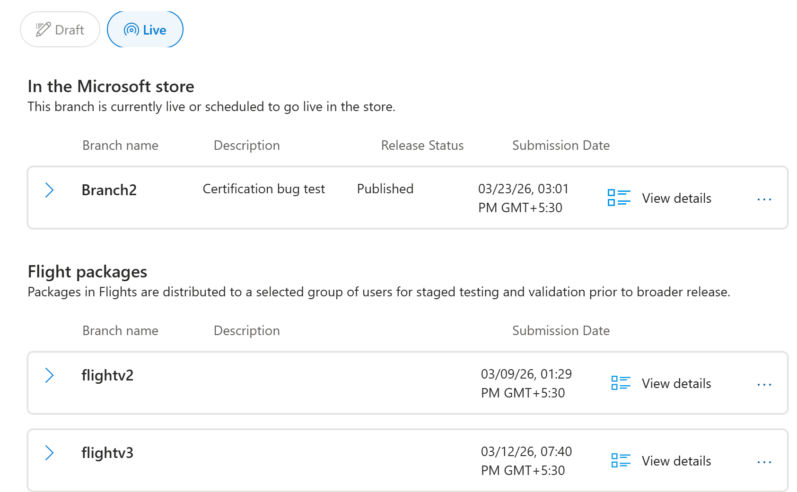

### Live view menu options

Each branch has a menu (select the **More options** (**…**) icon) that includes branch‑specific actions.

| Branch type | Available actions |
| ----------- | ----------------- |
| Main branch (RETAIL) | **Rollback:** Instantly restores a previously certified build without reuploading or re-certifying. Rollback is available on the main branch. |
| Flight branches | **Promote to main branch:** Replaces the entire contents of the Main branch with packages from this branch. Previous packages in Main are permanently deleted and can't be recovered. |
| Sandbox branches | **Promote to main branch:** Replaces the entire contents of the Main branch with packages from this branch. Previous packages in Main are permanently deleted and can't be recovered. |

> [!NOTE]
> You work in **Draft**. Players see **Live**. Switching between the two views clarifies the difference between in‑progress builds and published content.

---

## How to create a branch 

 1. Open the **Packages** page.
 1. In the **Draft** view, select **Add branch**.
 1. Enter a **Name** (for example, Testing, Hotfix, Localization, or Experiment) and a **Description** for the branch.
 1. After you create the branch, it appears under **Additional branches**.

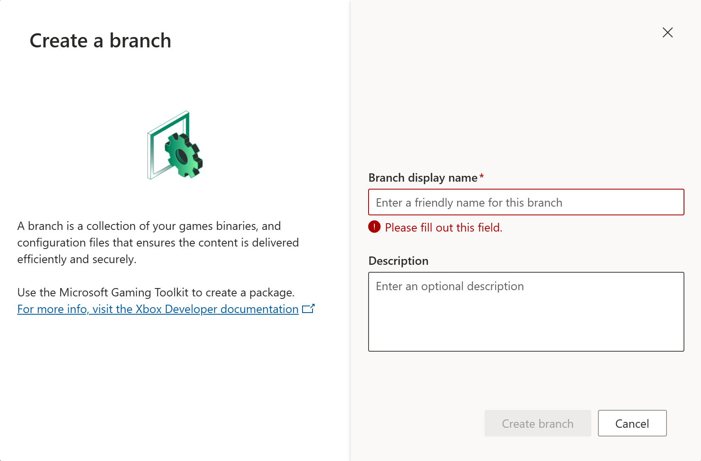

---

## View and edit a branch

When you open a branch by using **View & Edit**, you're taken to the **Edit branch** page. Use this page to manage packages for the branch.

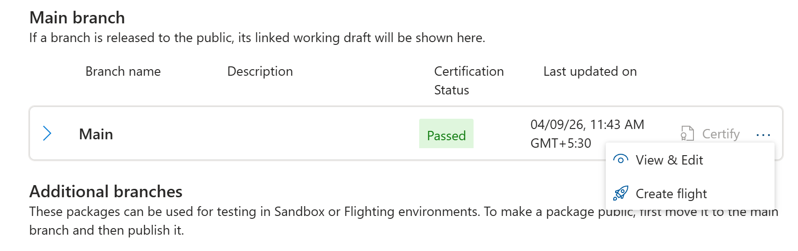

### Top action bar

At the top of the **Edit branch** page, the following actions are available.

| Button | Description |
| ------ | ------------ |
| **History** | Opens a log of all activity on this branch, including certification submissions, publishing events, and rollbacks, along with details about who performed each action and when. |
| **Certify** | Submits the branch for Xbox certification after packages are complete and all validation errors are resolved. |
| **Save as draft** | Saves your changes without submitting the branch for certification or publishing. |
| **Review & publish** | Opens the [Review and publish](modular-submission.md) page, where you can review the branch and publish packages to developer sandboxes and **RETAIL**. |

### Branch details
You can also edit the **Display name** and **Description** fields for a branch.

- **Branch display name:** The name shown for this branch across Partner Center.
- **Description:** A short note that describes the purpose of the branch, for example, _To be released_ or _April hotfix_.

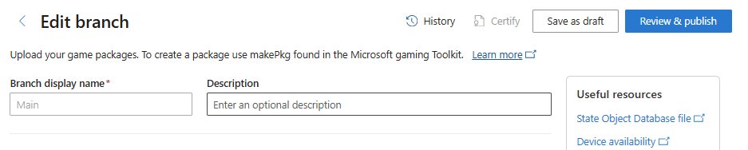

---

## Required package files: what to upload

When you upload a game build, some files are mandatory and some are optional. The **Edit branch** page clearly lists each file slot to indicate which files you can upload.

### Package formats

Your game package format depends on the target device. The package type that you submit must match the device family availability that you select.

| Device | Who can download | Required format | How to create |
| ------ | ---------------- | --------------- | ------------- |
| Xbox console | Players on Xbox consoles | XVC | [Getting started with packaging titles for Xbox consoles](/gaming/gdk/_content/gc/packaging/overviews/packaging-getting-started-for-console) |
| Windows PC | Windows 10 or Windows 11 devices | MSIXVC | [Getting started with packaging for PC games](/gaming/gdk/_content/gc/packaging/overviews/packaging-getting-started-for-pc) |

> [!TIP]
> Always increment your version number for each new package. Use the `Version` attribute in the `Identity` element of the MicrosoftGame.Config file. You can use the same version number across packages for different platforms, if you choose. Xbox Certification might reject packages if you don't increment the version number for each new submission.

### Mandatory files

| File | Description |
| ----- | ------------- |
| Packaged build (.xvc/.msixvc) | Your main package file containing the prepared game build. |
| Encryption Key Bundle (EKB) | Required for both MSIXVC and XVC packages. Ensures correct encryption for player distribution. Package upload doesn't proceed until you upload this file. |

### Optional but recommended files

| File | Description | When you need it |
| ----- | ------------- | --------------- |
| Symbols (.zip) | Enables comprehensive crash dump reporting for debugging.  | Recommended for all releases. |
| Disc layout file (.xml)  | Defines disc structure and install order for disc-based releases. | Only needed for disc-based or multi-disc games. Not applicable for digital-only games. |
| Submission Validator log (.xml) | Submission Validator is a component of the Microsoft Game Development Kit (GDK) that runs a series of basic quality checks on a game package. The output is an XML log file containing the results of the package validation. For packages intended for certification or RETAIL publishing, you must upload this file in Partner Center and the log must either display an overall pass result, or you must have an approved exception for each issue tagged as **failure**. You should also check the log file for any issues tagged as **warning** and make sure the warnings are expected. Always ensure that you're using the [latest version of Submission Validator](https://aka.ms/currentsubvalzip) (Note: This link downloads the latest zip folder). An error with instructions to update is displayed in the log if the version you're using is expired. Inline validation results are displayed if warnings or errors are present in the log. | Required for packages submitted for certification or publishing to RETAIL. |
| State Object Database (SODB) | An SODB file contains a collection of D3D12 pipeline state objects (PSOs) captured from your game. When submitted alongside your package to Xbox Partner Center, Microsoft compiles these state objects offline into a Precompiled Shader Database (PSDB) optimized for each GPU/driver combination. PSDBs are delivered automatically to players through Windows Update or the Microsoft Store. This reduces or eliminates runtime shader compilation, which can cause long load times and in‑game stutter on PC. | Recommended for all PC packages where you want to eliminate shader compilation stutter and reduce load times. |

> [!IMPORTANT]
> The disc layout file is different from the layout.xml file generated by the **makepkg** tool that specifies the package chunk layout. Don't upload this layout.xml to the disc layout.

---

## Package validations: catching issues before certification
Packages are automatically validated when they're uploaded. Validations check that your package is complete and ready for certification or publishing. Resolving issues at this stage reduces the risk of rejection and failure in certification.

- All branch and package validation errors are displayed directly in the UI.
- Required files are automatically validated. The EKB and Submission Validator log files must be present.
- If the Submission Validator log contains warnings or errors, they're clearly displayed inline for your review.
- If you configure market-specific packages, the configuration for each variant is validated before publishing is allowed.

---

## Default packages: uploading and managing files

The Default packages section supports assembly of packages for a branch. Default packages are available in all markets. [Market-specific packages](#market-specific-packages-and-regional-variants) for individual countries or regions are uploaded and managed separately.

### Upload options

- **Import:** Copies packages from another branch into this one without reuploading. The **Import** button appears at the top of the **Default packages** section alongside **Upload package**.
- **Upload package:** Upload game files by dragging and dropping one or more files, or by using **Browse files** for individual selection. The system automatically detects and categorizes files into the correct slots.

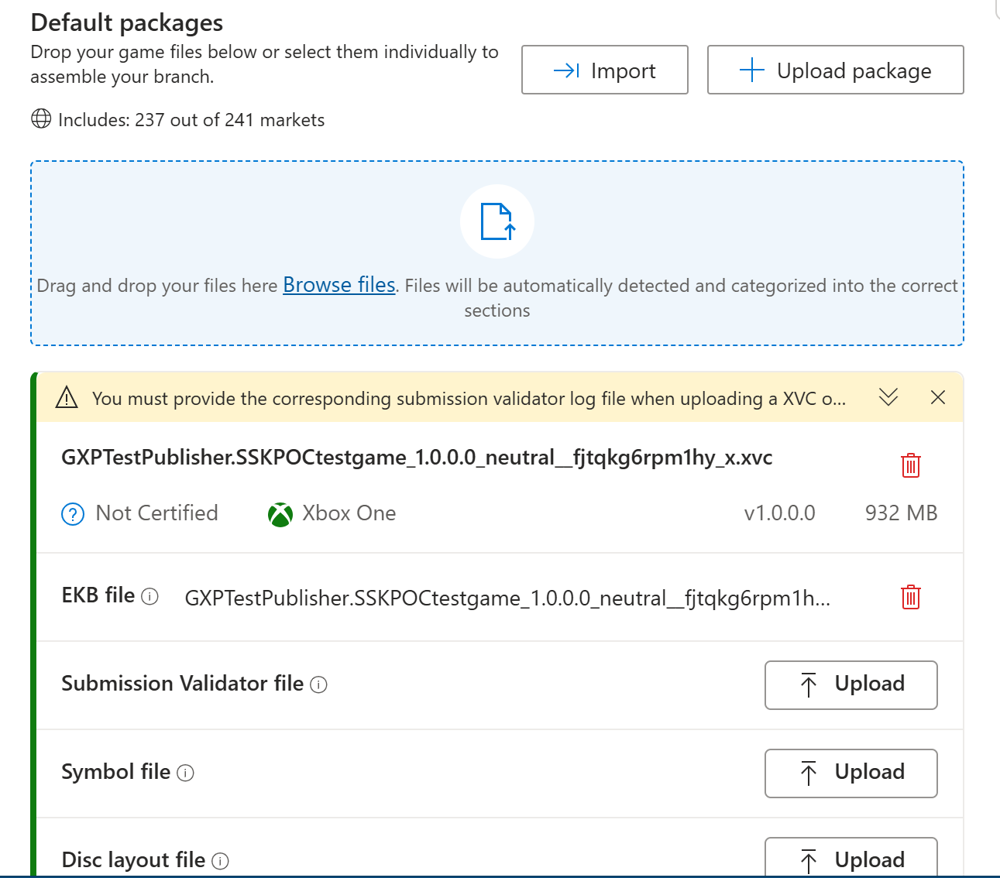

### Package status icons

| Status | What it means | What to do |
| ------ | ------------- | ---------- |
| Passed | Package passed certification. | No action needed—ready to publish. |
| Certify | Package isn't ready to certify—validation incomplete or files missing. | Resolve all validation errors first. |
| Failed | Package failed certification. | Fix the issues and upload a new build. |
| Passed with notes | Package passed but has warnings. | Review the notes—might need action before next submission. |
| Delete icon | Permanently removes this package file from the branch. | Use with caution—this action can't be undone. |

---

## Market-specific packages and regional variants

The **Market-specific packages** section shows all regional variants configured for selected markets. This section applies when you need different builds to meet country/region‑specific or regulatory requirements.

### Actions available

- **Import**: Copies packages from another branch into a specific market group.
- **Add market-specific package:** Creates a new regional variant for a market group.
- Each market group (for example, Germany) has a three-dot (**...**) menu with **Edit** and **Delete** options.

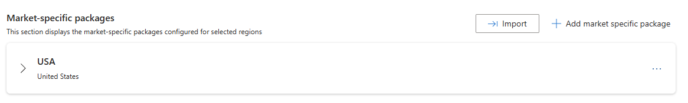

### Create a new market-specific group

 1. Confirm you're viewing the **Edit branch** page for the intended branch.
 1. Select **Add market-specific package**.
 1. Enter a **Market group name** (for example, Germany) by specifying a new name or selecting an existing name.
 1. Upload a package for each group.

---

## Advanced options: pre-order and schedule package updates
At the bottom of the **Edit branch** page, the Advanced options section gives you two features: pre-order configuration using placeholder packages, and scheduling Content Update (CU) availability dates.

### Placeholder package for pre-order

If you configure a pre-order date in your Pricing and availability settings, select **Configure placeholder package(s) to enable pre-order** in **Advanced options** and specify the **Expected maximum file size** for the final package. This value appears on your product's Microsoft Store Product Details Page (PDP). It directs customers who pre-order to install the product on a drive with enough disk space for the full package. This process ensures sufficient storage is available when the product releases.

At least one week before your product's release date, publish an updated package that replaces the placeholder so customer devices start installing the full package before release. When you publish the updated package, clear the **Configure placeholder package(s) to enable pre-order** checkbox.

> [!NOTE]
> Contact your Microsoft representative if you plan to use a placeholder package.

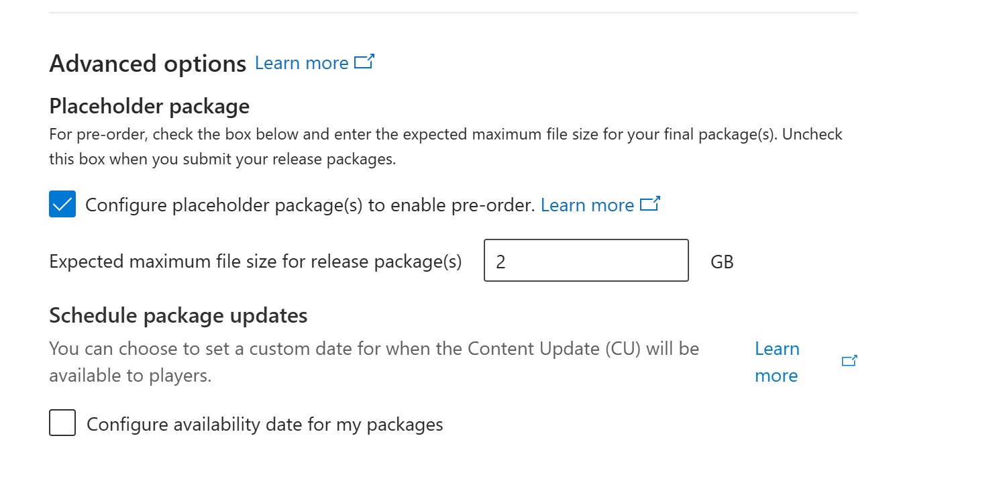

### Schedule package updates

CUs support custom availability dates for release to players. Select **Configure availability date for my package(s)** to enable scheduling. Once enabled, set two dates per package.

| Date type | What it controls | Required? |
| --------- | ---------------- | --------- |
| Availability date | Defines when the CU becomes required. If the update isn't installed, the game can't be played while connected to the Xbox network. | Mandatory for scheduled CUs. |
| Predownload date | Defines when the update can be downloaded in the background on devices where this functionality is enabled. This setting enables players to use the update immediately on the availability date. | Optional, but recommended. |

> [!TIP]
> Set your **predownload date** at least 48 hours before the availability date. This timing gives players time to download the update in the background and jump in immediately on launch day without waiting.

### What happens with different date configurations

- **Same predownload and availability date:** no early download, update applies on that date.
- **No predownload date set:** update downloads only on the availability date.
- **No availability date set:** update is available immediately after it publishes to the RETAIL sandbox.
- **Market-specific packages:** set availability and predownload per market independently.

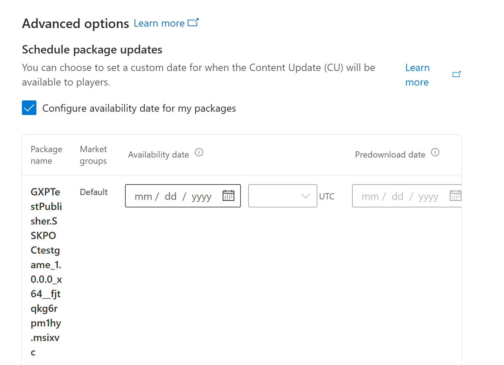

---

## Flights: testing with a limited audience

Use flights to test a branch with a limited group of users before publishing broadly. This testing method is useful for internal testing, partner previews, or early access groups. 

### How to create a flight

 1. Go to the **Flights** tab on the **Packages** page.
 1. Select **Create new flight**.
 1. Enter a **name** for the flight and select the **audience** (device or user groups).
 1. Select the **Branch** you want to test.
 1. (Optional) Set **start** and **end** dates.
 1. Select **Save**. The flight appears in your flight list immediately.

> [!TIP]
> You can also create flights directly from the **Branch gallery**. Select a branch and choose **Create Flight** from the menu (**...** icon). The branch is preselected and the experience is identical.

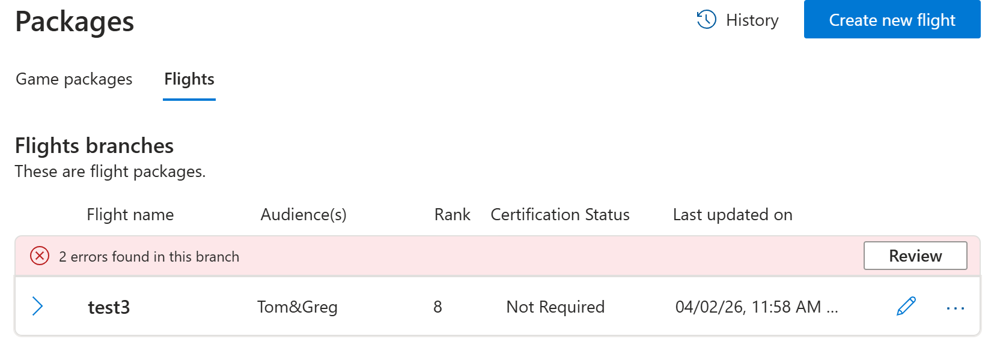
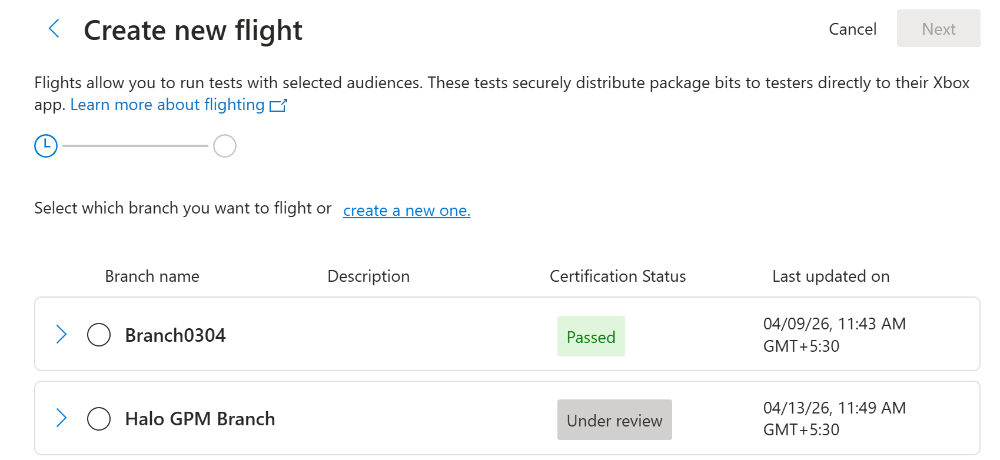

### Editing a flight

After you create a flight, you can add or remove audience groups as needed. The Microsoft Store immediately reflects these changes. You can also edit flight ranking after flight creation.

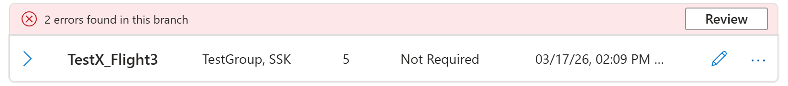
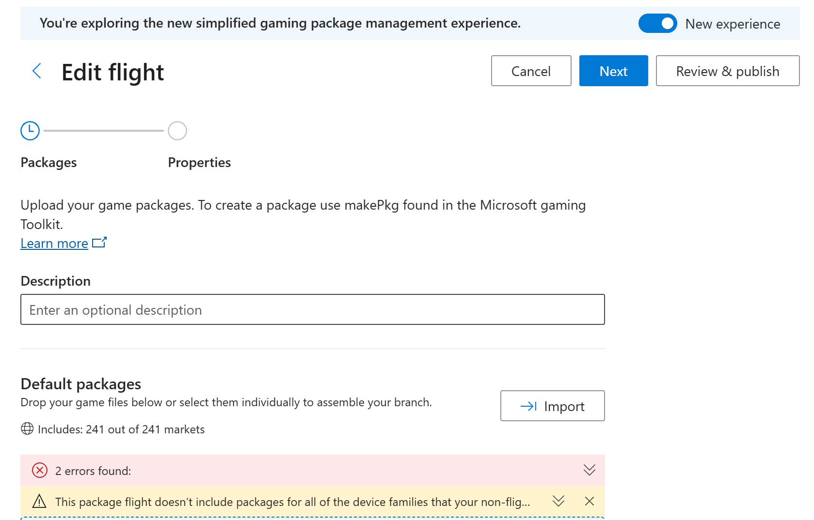

## Certification: Getting your build approved

Xbox Certification verifies that your build meets all platform requirements before you can publish it to players. Select **Certify** for a branch and follow the prompts to submit your build for Xbox Certification. For more information, see [Certify a game](../tutorial-xbox-managed/how-to-certify-a-game.md).

| Outcome | Description | What to do next |
| ------- | ------------- | --------------- |
| Pass | Build meets all requirements. | Proceed to publish. |
| Certified with notes | Build passes with notes. Minor issues flagged. | Review notes, decide whether to publish or fix first. |  
| Fail | Build doesn't meet requirements. | Fix the issues, upload a new build, and resubmit. |
| Not certified | Package isn't submitted for certification yet and remains in draft. | Complete all required fields and files, resolve validation errors, and then select the **Certify** button. |
| Under review | Certification is currently in progress. Package is under review. | Wait for the outcome. No changes are permitted in this branch during review. |

> [!NOTE]
> Before submitting any packages for certification, complete the [Certification questionnaire](certification/certification-supplemental-info.md) for the product by selecting **Certification** from the product's page navigation.

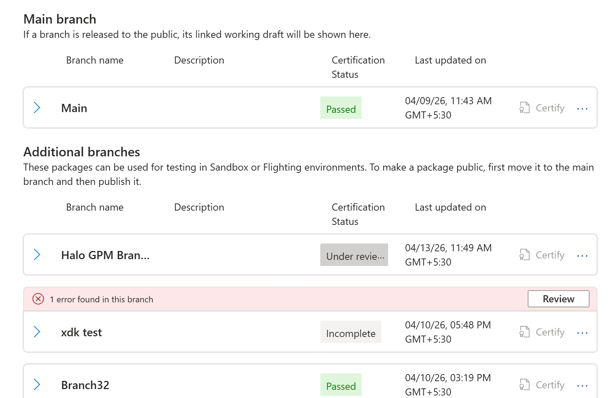

---

## Rollback: recovering from a bad release

When a released build causes player problems, you can restore a previously certified build without re-uploading or re-certifying. In **Packages**, you can trigger a rollback from two places.

### How to roll back

From the **Draft view (Main Branch)**, follow these steps to roll back a package.

 1. Open the **Main Branch** menu (**...** icon).
 1. Select **Rollback** from the menu options. This option gives you quick access to **Rollback** without switching views.

From the **Live view (Main Branch menu)**, follow these steps to roll back a package.

 1. Go to the **Live view** on the **Packages** page.
 1. Find the **Main Branch** under **In the Microsoft Store**.
 1. Open the branch menu (**...** icon) and select **Rollback**. Use this entry point when you want to see the currently published state first before deciding which build to restore.

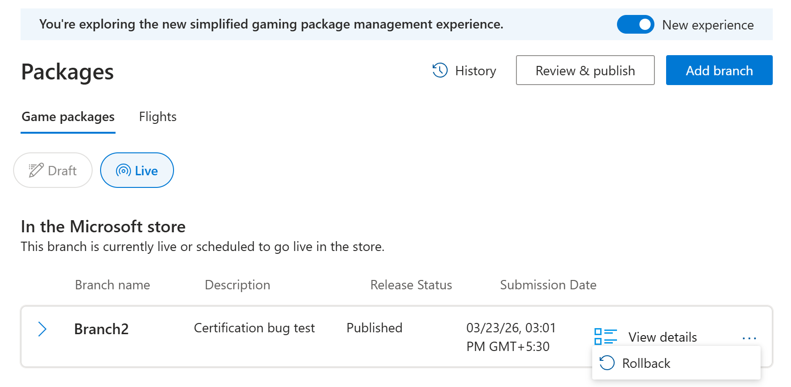

### What happens when you roll back

When you select **Rollback**, a guided modal opens that takes you through four steps before making any changes. 

**Step 1 - Select the previous publish:** You see a list of previously certified and published builds. Select the build you want to restore. Each entry shows the build version, certification date, and who submitted it to help you identify the right one. 

**Step 2 - View details:** The full details of the selected build, such as package names, versions, device families, and certification status, are displayed. Review this information carefully to confirm it's the correct build before proceeding. 

**Step 3 - Compare current and target packages:** A side-by-side comparison of the current live build and the build you're about to restore is displayed. This step is critical—it lets you see exactly what changes for players after the rollback is complete. Check that no important builds or device families are lost in the process.  

**Step 4 - Acknowledge and submit** Before the rollback is executed, you explicitly acknowledge that you understand what changes. After you confirm, the rollback is submitted and the older stable build goes live immediately—no reupload or re-certification needed.  

> [!NOTE]
> Use **History** to find the exact build you want to restore. **History** shows all activity across all branches - uploads, certification submissions, publishing events, flights, and rollbacks—with who did what and when.

---

## See also

- [Create and upload a game package](../tutorial-xbox-managed/how-to-create-a-package.md)  
- [Overview of packaging](/gaming/gdk/_content/gc/packaging/overviews/packaging)
