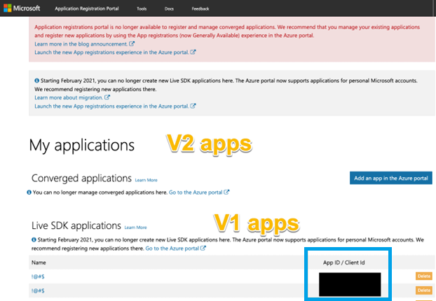
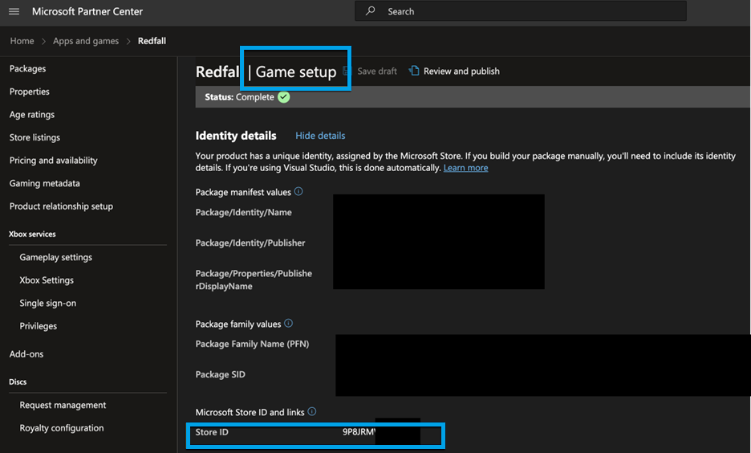
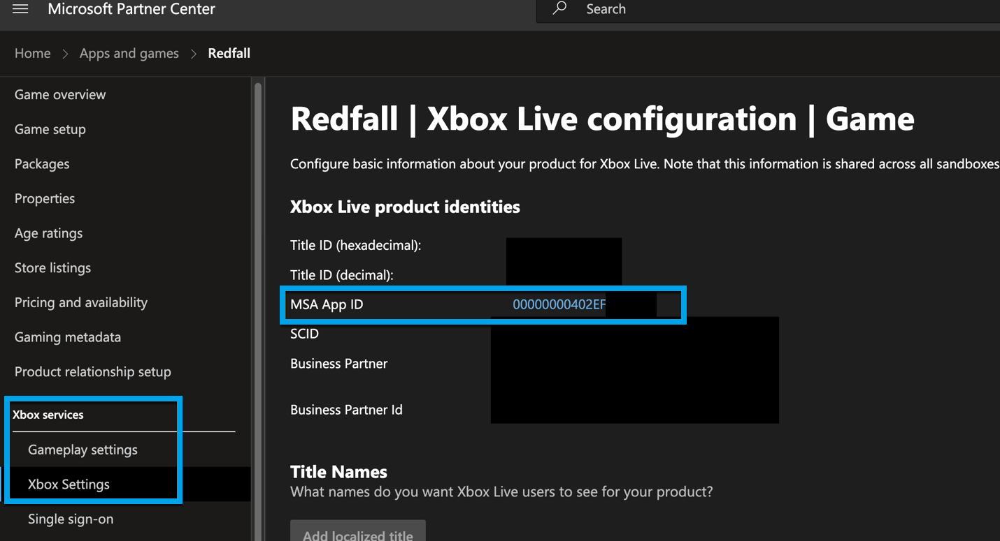
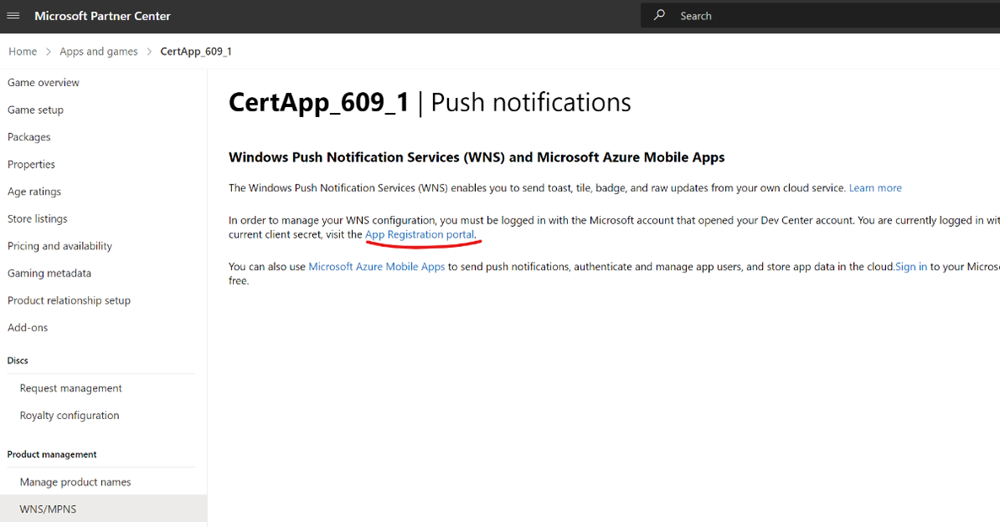

# Game reparenting

Reparenting enables a gaming product (and its add-ons) to be moved from one publisher to another within Partner Center and other downstream services. This is typically done after the publisher of record changes for a specific product. This guide walks you through the steps to reparent a product.

## Who is reparenting designed for?

Reparenting is used when there's new ownership of gaming products from Managed Creators, such as games, add-ons and bundles, due to business or legal reasons.

## Which products are eligible for reparenting?

- Published Xbox console and PC games leveraging MSA v1, including bundles and addons
  - Available to Xbox managed games
  - Available to products that are already published to public audience

## Which products are **not** eligible for reparenting?

- Games leveraging MSA v2 (games created in Partner Center in March 2022 or later)
- Products from the Game Developer Network Portal (GDNP)
  
## How long will reparenting take?

The exact time depends on when the request was submitted. Microsoft ingests a list of products requesting reparenting on the first business day of each month and it takes about 6 weeks for all systems to be fully updated. In some cases, reparenting can begin while this process is progressing, while in others, your Microsoft Contacts might recommend waiting until all systems are fully updated.

The reparenting process has a service-level agreement (SLA) of **3 days for each key step**:

- **3 days: Validation** - Return product validation results to publisher, allowing you to make corrections to the product to enable reparenting.
- **3 days: Execution** - Post validation. From request for execution, to completion, enabling publisher to modify product(s).

**Locking the product(s)**

You'll not be able to modify the reparented product(s) for 3 days, starting from the day a publisher requests the execution of reparenting:

- **Day 0:** [Not Available] Publisher requests reparenting, has completed pre-checklist tasks, has received validation results (passing), then requests reparenting.
- Around **Day 3:** [Available] Target publisher can modify newly received product(s).

## What happens after my product(s) is reparented?

The target (receiving) publisher will receive their product(s) in a draft state and can republish at their convenience. The certification status of the product will transfer over as well. Customers of your products are unaffected and unaware of the reparenting process. Your products will continue to operate without interruption. 

## How do I request reparenting?

Complete a **Title Transfer agreement**, then contact your Microsoft representative to initialize a reparenting request.

Work with your Microsoft representative to provide the following:

1. Name of product to be reparented
2. Store ID of product to be reparented
3. Application (client) ID of product to be reparented
4. Source publisher seller ID & name (for example, 00012345, MSFT Softworks)
5. Source publisher seller ID & name
6. Microsoft Account (MSA) email address for source publisher app owner 
7. MSA email address for target publisher app owner

If you'd like to locate these IDs on your own, find the steps outlined in [How do I identify the information required for reparenting?](#how-do-i-identify-the-information-required-for-reparenting).

## Who will assist with reparenting?

Your [Microsoft contacts](../resources/managed-support/overview-microsoft-representatives-and-contacts.md) will guide you through the reparenting process.

## What steps must a publisher perform prior to reparenting?

Publishers must cancel or complete the following steps prior to reparenting: 

- Ongoing submissions
- Pre-orders
- Xbox Insider Flights
- Package Flights
- Experiments
- Graduate Package Rollouts (UWP only)

Once reparenting has completed, a publisher can begin submissions, flights, and so on again.

## What is involved in the reparenting process?

There are several steps publishers need to complete with the account team prior to reparenting their product(s).

## What if I change ownership of my entire catalog of gaming products?

The source (giving) publisher can grant full MSA account access to the target (receiving) publisher, who can then control all aspects of the products from within Partner Center.

## Is there a checklist of manual tasks which need to be performed to enable reparenting?

Yes, a checklist of tasks to be completed both prior to and post reparenting is available. Your Microsoft contacts will walk you through this process. If any of the pre-reparenting checklist actions are not completed prior to reparenting, reparenting can't proceed. 

## What is the MSA for an application and how is it used?

The MSA (for example, company@outlook.com) used to create the Partner Center account for the publisher is the MSA you should provide for reparenting, as this is the owner of the gaming product.

The MSA is a Microsoft Account. Microsoft accounts are set up by a user to get access to consumer-oriented Microsoft products and cloud services, such as Outlook, OneDrive, Xbox network, or Microsoft 365. The account is created and stored in the Microsoft consumer identity account system, run by Microsoft.

## How do I determine if an app is MSA V1 or V2?

Navigate to the **Game Setup** module for your product in Partner Center to find the the MSA App ID. If the value is a **GUID** (like 01943-ed57-44e4-b5a9-918aa7a0abef), it's a V2 app. If it's **hexadecimal** (like 0000000012345678), it's a **V1** app.

## How do I identify the information required for reparenting?

Use the following guidance to identify the IDs required for the reparenting process.

### How do I determine who the MSA app owner is for an application?

[Application Registration Portal](https://apps.dev.microsoft.com/) displays apps the currently signed in user owns.

If you don't have access to this value, notify your Microsoft contacts, who can help locate it in other ways. 

### How do I determine the Store ID/BigID of a product?

Navigate to your product in [Partner Center](https://partner.microsoft.com/dashboard) and then select the **Setup** page, for example **Game Setup** for Game products. Within **Game Setup**, expand the **Identity Details** section. This contains the Store ID of a game product. The Store ID can be found on the Setup page for any gaming product, including add-ons and bundles.

### How do I determine the Application (client) ID of a product?

Publishers can locate the Application (client) ID in multiple ways:

#### Via the product in Partner Center

1. Go to [Partner Center](https://partner.microsoft.com/dashboard), select **Apps and Games** and then select the product to be reparented.
2. Select **Xbox Services** > **Xbox Settings** from the page navigation.
3. Observe the MSA App ID

#### Via the Application Registration Portal

1. If the application is a V1 (created prior to March 2022) app, the application and application ID appears on [Application Registration Portal](https://apps.dev.microsoft.com/).

#### Via Windows Push Notification Services in Partner Center

1. Sign in to [Partner Center](https://partner.microsoft.com/dashboard) using the owner MSA.
2. Go to **Apps and Games** and select the product you want the App ID for.
3. Select **Product Management** > **WNS/MPNS** from the page navigation.

The Application ID is on the **WNS/MPNS** page. If you don't have access to the owning MSA account, speak to your Microsoft contacts, as they have other methods for locating this.

