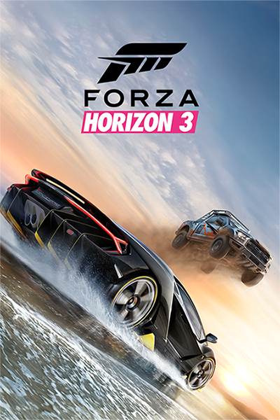
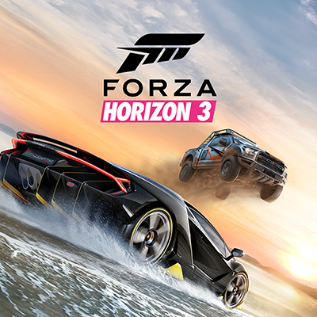
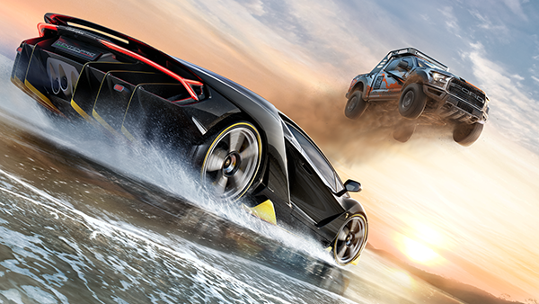
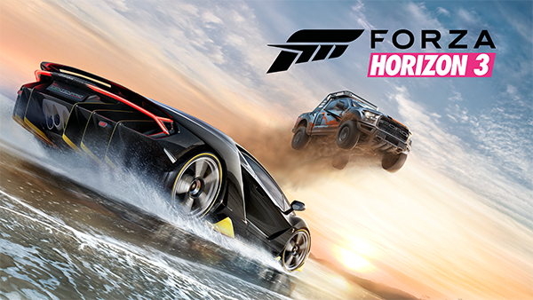
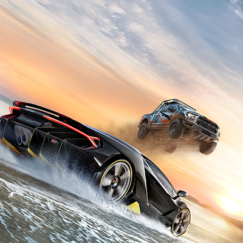
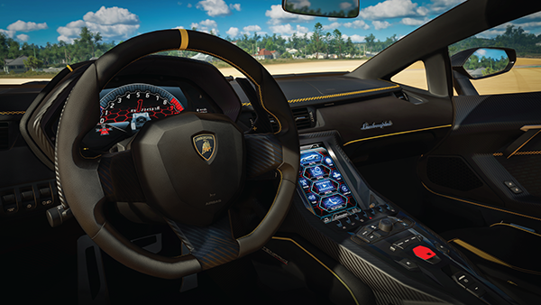
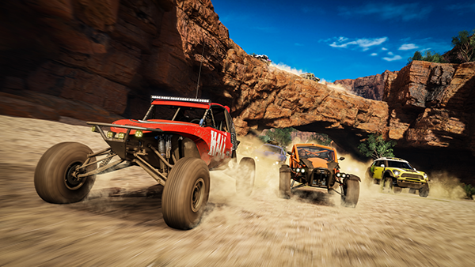
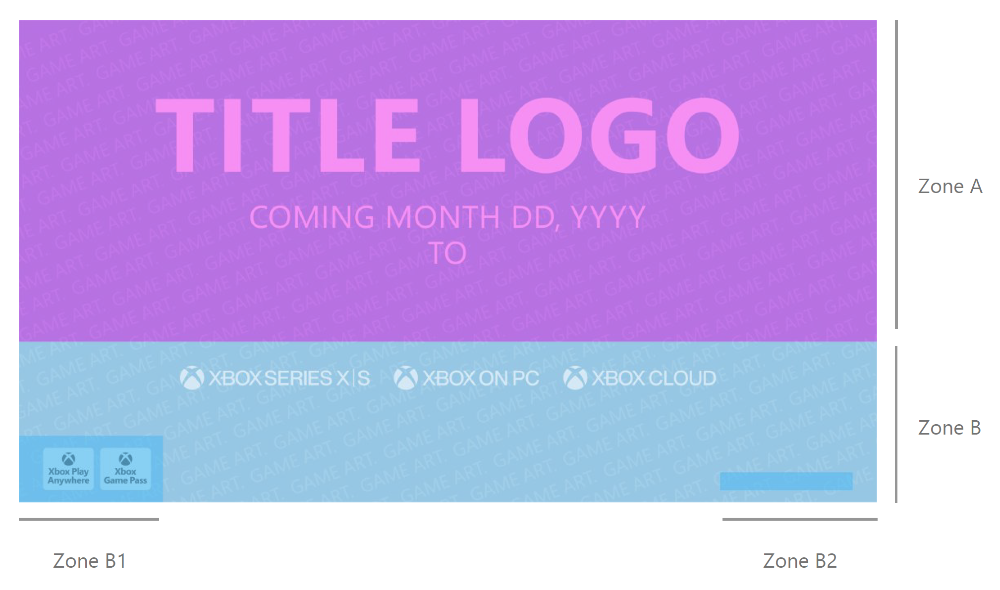
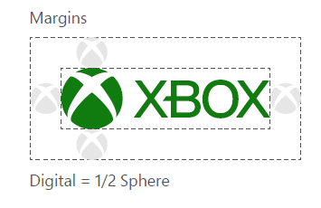

# Store listings

[!INCLUDE [reminder](../includes/same-as-apps-with-specific-info.md)]

**Store listings** is the section in Partner Center that lets you configure the text, images, and trailers that customers will see displayed on the game's Product Details Page (PDP) in the Microsoft Store. To publish a product, you need to configure a Store listing in at least one language.

Many of the fields in the Store listings are optional. However, we suggest providing multiple images and as much information as possible to make your listing stand out. In order to complete the **Store listings** step in the submission process, you must provide a text description and at least one screenshot in one language.

We also recommend configuring Store listings in each language that is spoken in the markets where you'll make your game available. Your Store listings languages don't need to match the languages that your game package supports, but we recommend having Store listings in these languages if possible.

This article provides guidelines for the text and the artwork when using the Partner Center portal to create a Store listing. There are different requirements depending on the device family your title runs on. If your title runs on Xbox devices, make sure that the assets uploaded, and configuration meet the Xbox requirements needed. If your title runs on multiple devices, make sure the requirements for each device family type are met.

For walkthrough instructions, see [Create a store listing for titles on Xbox devices](../tutorial-xbox-managed/how-to-create-a-store-listing.md) if you're a managed partner.

Main categories in a Store listing:

| Categories | Description           | Required?  |
|------------|-----------------------|-----------|
| [Text](#text) | Product name, product description, what's new in this version, product features | Mostly required. See [Text](#text) for details. |
| [Store logos](#store-logos) | Box Art, Poster Art | Required |
| Additional assets | Windows 10 and Xbox image ([Super Hero Art](#super-hero-art)), Xbox images ([Titled Hero Art](#titled-hero-art), [Featured Promotional Square Art](#featured-promotional-square-art)) | Required
| [Screenshots](#screenshots) | Desktop screenshots, Xbox screenshots, mobile screenshots | Required |
| [Trailers](#trailers) | Specifications, including [Xbox mnemonics](#xbox-mnemonics) |
| [Supplemental fields](#supplemental-fields) | Short title, Sort title, Voice title, Short description | Mostly optional but recommended. Voice title is required for physical discs. |
| [Additional information](#additional-information) | Keywords, Copyright and trademark info, Additional license terms, Developed by, Published by | Optional |

## Text

This is a list of required and optional text information that you need to provide for your title.

| Field | Required or optional | Description |
|-------|----------------------|--------------------------------------------|
| Product name | Required | The product name dropdown list lets you specify which name should be used in the Store listing (if you've reserved more than one name for your game). The **Product name** you select only applies to the Microsoft Store listing in the language you're working in. It doesn't impact the name displayed when a customer installs your game; that name comes from the manifest of the package that gets installed. To avoid confusion, we recommend that each language's package(s) and Store listing use the same name. |
| Description | Required | The description field is where you can tell customers what your game does. This field is required and will accept up to 10,000 characters of plain text. For tips on making your description stand out, see [Write a great app description](/windows/apps/publish/publish-your-app/write-great-app-description). |
| What's new in this version | Depends on release. See description. | If this is the first time you're submitting your game, leave this field blank. For an update to an existing game, this is where you can let customers know what's changed in the latest release. This field has a 1500-character limit. Previously, this field was called **Release notes**.|
| Product features | Required | These are short summaries of your game's key features. They're displayed to the customer as a bulleted list in the **Features** section of your Store listing, in addition to the **Description**. Keep these brief, with just a few words (and no more than 200 characters) per feature. You can include up to 20 features. |

## Art assets reference list

The reference list to help you identify which art assets are required in a Store listing when you submit a game to the Store. Note that there are still text requirements that aren't included in the list below.

### Required art assets

Game submissions require the following images:

* [Box art](#box-art)
* [Poster art](#poster-art)
* [Featured Promotional Square Art](#featured-promotional-square-art)
* [Super Hero Art](#super-hero-art)
* [Titled Hero Art](#titled-hero-art)
* [Screenshots](#screenshots)

DLC submissions require these images:

* [Box art](#box-art)
* [Poster art](#poster-art)
* [Featured Promotional Square Art](#featured-promotional-square-art)
* [Super Hero Art](#super-hero-art)

### Optional art assets

* [Trailers](#trailers) (but highly recommended)

### No longer required

The Branded Key Art format has been removed from use. Don't submit it for Xbox submissions.

### Title Placement

The only placement requirement that will be enforced as part of the certification process is that your title, when applicable, must be located within the upper two-thirds of the image.

To ensure your marketing images look their best, please refer to the following images, which display all clear space limitations for both the square and rectangular formats. In the example images, red areas indicate zones where the storefront may apply text or gradient overlays. Avoid placing important content there.

## Store logos

Store logos create a more customized display in the Microsoft Store. We recommend that you provide these images so that your game's listing appears optimally on all of the devices and OS versions that your game supports. The image files can't be larger than 50 MB and should follow the guidelines below.

* [Poster art](#poster-art) - Highly recommended
* [Box art](#box-art) - Highly recommended

### Poster art

Poster art is used as the main logo image for customers on Windows 10, Windows 11, and Xbox devices. This image can be used in search results or in editorially curated collections.

**Requirements:**

* It's highly recommended that you provide this image to ensure your game's proper display in your Microsoft Store listing.
* Poster art isn't age-gated so must be acceptable for general audiences. 
* The game's title is required in this image format. DLC can include game title, DLC title, or both. Make sure the product title is positioned within the upper two-thirds of the image, as the storefront may place text and/or a gradient overlay on the lower third.
* File format: PNG
* Dimensions:
  * 720x1080 pixels or
  * 1440x2160 pixels (preferred)
* DON'T include:
  * Transparent layers in your image.
  * Titles in the lower third of your image, as the system may automatically apply text or gradient overlays in that area.
  * Publisher logos, developer logos, or age rating icons.
  * Game award icons or marketing-related imagery or messaging.

#### Poster art example

### Box art

Box art can appear in various Microsoft Store pages for Windows 10, Windows 11, and Xbox devices. If you don't provide a poster art image, the box art image will be used as your main logo.

**Requirements:**

* The game's title is required in this image format. DLC can include game title, DLC title, or both. Make sure the product title is positioned within the upper two-thirds of the image, as the storefront may place text and/or a gradient overlay on the lower third.
* Box art isn't age-gated so must be acceptable for general audiences.
* File format: PNG
* Dimensions:
  * 1080x1080 pixels or
  * 2160x2160 pixels (preferred)
* DON'T include:
  * Transparent layers in your image.
  * Titles in the lower third of your image, as the system may automatically apply text or gradient overlays in that area.
  * Publisher logos, developer logos, or age rating icons.
  * Game award icons or marketing-related imagery or messaging.

#### Box art example

## Windows 10 and Xbox image

This is a 16:9 art asset, known as Super Hero Art, that appears at the top of your Store listing (or after any trailers finish playing) for customers on Windows 10, version 1607 or later (which includes Xbox). This is required if you want one of your trailers to appear at the top of the Store listing.

## Super Hero Art

* File format: PNG
* Artwork only NO game title or text (apps and DLC content can include title and/or DLC title).
* Super Hero Art isn't age-gated so must be acceptable for general audiences.
* Less than 50 MB
* Dimensions:
  * 1920x1080 pixels or
  * 3840x2160 pixels (preferred)
* Don't:
  * Include transparent layers in your image.
  * Include publisher logos, developer logos, or age rating icons.
  * Include game award icons or marketing-related imagery or messaging.

### Super Hero Art example

## Xbox images

There are two different image formats that are required if you publish your game to Xbox.

### Titled hero art

**Requirements:**

* The game's title is required. DLC can include game title, DLC title, or both. Make sure the product title is positioned within the upper two-thirds of the image, as the storefront may place text and/or a gradient overlay on the lower third.
* Titled hero art isn't age-gated so must be acceptable for general audiences.
* Less than 50 MB
* File format: PNG
* Dimensions:
  * 1920x1080 pixels
  * 4K isn't supported.
* DON'T include:
  * Transparent layers in your image.
  * Titles in the lower third of your image, as the system may automatically apply text or gradient overlays in that area.
  * Publisher logos, developer logos, or age rating icons.
  * Game award icons or marketing-related imagery or messaging.

#### Titled hero art example

### Featured Promotional Square Art

**Requirements:**

* Featured promotional art is required for physical discs.
* Artwork only. NO game title or text (apps and DLC content can include title and/or DLC title).
* Featured promotional square art isn't age-gated so must be acceptable for general audiences.
* Less than 50 MB
* File format: PNG
* Dimensions:
  * 1080x1080 pixels
  * 4K isn't supported
* Don't:
  * Include transparent layers in your image.
  * Include publisher logos, developer logos, or age rating icons.
  * Include game award icons or marketing-related imagery or messaging.

#### Featured Promotional Square Art example

## Screenshots

One screenshot is required in order to submit your title. We recommend providing at least four screenshots for each device type that your title supports so that people can see how it will look on their device type. If your title is on both desktop and Xbox, at least four of each type is recommended.

| Devices your game is on | Screenshots requirements |
|-------------------------|-------------------------------|
| Desktop                 | One screenshot that meets the [Desktop screenshots requirements](#desktop-screenshot-requirements) is required. At least four screenshots are recommended. |
| Xbox                    | One screenshot that meets the [Xbox screenshots requirements](#xbox-screenshot-requirements) is required. At least four screenshots are recommended. |
| Mobile                  | One screenshot that meets the [Mobile screenshots requirements](#mobile-screenshot-requirements) is required. At least four screenshots are recommended. |

### Desktop screenshot requirements

Screenshots should be screen captures taken when your game is running on the PC or game artwork that visually communicate the content of your game.

**Requirements:**

* At least one screenshot is required, up to eight (8) are supported; at least four screenshots are strongly recommended
* File format: PNG
* Dimensions:
  * 3840x2160 pixels (preferred)
  * 1366x768 pixels or larger
* DON'T include:
  * Game titles unless part of the game UI
  * Imagery or elements that aren't appropriate for the game's rating (for example, alcohol references on an E-rated title)
  * Publisher or Developer logos
  * Age rating icons
  * Button glyphs from other platforms

### Xbox screenshot requirements

Screenshots should be screen captures (running on Xbox) or game artwork that visually communicate the content of your game or app.

This format is primarily intended for in-game images shown in your game's Microsoft Store listing. The screenshot image format may also be used for images that include text that explains gameplay, outlines what’s included in a specific edition or DLC, or highlights accolades and awards the game has received (note that competitor references aren't allowed in publication names).

**Requirements:**

* At least one screenshot is required, up to eight (8) are supported; at least four screenshots are strongly recommended
* File format: PNG
* Dimensions:
  * 3840x2160 pixels (preferred) or
  * 1920x1080 pixels
* DON'T include:
  * Game titles unless part of the game UI
  * Imagery or elements that aren't appropriate for the game's rating (for example, alcohol references on an E-rated title)
  * Publisher or Developer logos
  * Age rating icons
  * Button glyphs from PC or other platforms

### Mobile screenshot requirements

Screenshots should be screen captures (running on mobile devices) or game artwork that visually communicate the content of your game or app.

They're images of your game that are displayed to customers in your game's Microsoft Store listing. They can include text that educates users about the gameplay itself, and include statements about the specific product offering, or images dedicated to outlining what is included in an edition or DLC.

**Requirements:**

* At least one screenshot is required, up to eight (8) are supported; at least four screenshots are strongly recommended
* File format: PNG
* Dimensions:
  * 1080 x 1920 or 1920 x 1080 pixels
  * 768 x 1280 or 1280 x 768 pixels
  * 720 x 1280 or 1280 x 720 pixels
  * 800 x 480 or 480 x 800 pixels
* DON'T include:
  * Game titles unless part of the game UI
  * Publisher or Developer logos
  * Age rating icons
  * Button glyphs from PC or other platforms

### Alt text

This feature is optionally available for screenshots and Xbox screenshots for managed gaming products.

Alt text should describe the image and convey its purpose to the user in 1-2 sentences. This text won't be visible to users, but rather will be utilized by screen reader software.
Consider what is important about an image. For example, important context might be the setting, the emotions on people's faces, the colors, or the relative sizes.

#### Screenshots examples

## Trailers

Trailers give customers a way to see your product in action, thus helping them understand what it's like and whether it's something on which they'd want to spend their money. Trailers are shown on the product's Store listing and are your chance to show off your product and let everyone see how awesome it is. Trailers are supported for apps, games, bundles, and durables with packages.

To make trailers more accessible for users with disabilities, you can upload closed captions and audio descriptions.
 - Closed captions provide text alternatives for audio for individuals who are deaf or is a person with a hearing disability.
 - Audio descriptions help provide audio alternatives for visual elements for individuals who are blind or is a person with low vision.

You can also configure the Store listing to position one of the uploaded trailers at the top of the Store listing page for your product. Remember to upload a [Super Hero Art](#super-hero-art) as part of the requirement for a trailer to appear at the top.

> [!NOTE]
> If your product uses sandboxes, you won't be able to see your trailers on the product's Store listing until you upload them to **RETAIL**. You can still upload trailers to development sandboxes, but they won't show up in the Microsoft Store.

### General requirements for trailers

* Video file resolution: 1920x1080 pixels.
* The video format must be MOV or MP4.
* A product can have up to 15 trailers.
* The video's duration must be less than 30 minutes.
* The thumbnail must be a PNG file with a resolution of 1920 x 1080 pixels.
* The title can't exceed 255 characters.
* The file size of the trailer can't exceed 10 GB.
* All trailers submitted to Partner Center must include both intro and end mnemonics.
* The closed caption file must be in Web VTT (.vtt) format and the file size must be less than 50 MB
* The audio description file must be in MP3 (.mp3) format and the file size must be less than 500 MB
* Don't include controller button glyphs (for example, R1, R2, ZL, ZR), platform branding, or references to competing platforms or services within the body of your trailer.
* Don't include imagery or elements that aren't appropriate for the game's rating. (for example, alcohol references on an E-rated title)

### Age ratings in trailers

Trailers submitted to Partner Center must be unrated (including pack shots and end slates).

> [!IMPORTANT]
> Ensure trailers submitted to Partner Center are ratings free. This exception applies only for trailers on the Microsoft Store product detail page; any trailer that isn't destined for the Microsoft Store product detail page must still display embedded rating information, where required, in accordance with the appropriate rating authorities' guidelines. After April 1, 2020, don't submit trailers to Partner Center that contain embedded age rating information.

### Requirements specific to the trailer file on the Store listing page

|              | MOV | MP4 |
|--------------|-----|-----|
| **Video** | - 1080p ProRes (HQ where appropriate) - Native framerate; 29.97 FPS preferred | - Codec: H.264 - Progressive scan (no interlacing) - High Profile - Two (2) consecutive B frames - Closed GOP; GOP of half the frame rate - CABAC - 50 Mbps - Color Space: 4:2:0 |
| **Audio** | - Stereo required - Recommended Audio Level: -16 LKFS/LUFS | - Codec: AAC-LC - Channels: Stereo or surround sound - Sample rate: 48 kHz - Audio bitrate: 384 kbps (stereo), 512 kbps (surround sound) |

### Recommendations for H.264 Mezzanine files

* Container: MP4
* No Edit Lists; otherwise, you might lose AV sync
* moov atom at the front of the file (Fast Start)

Like the other fields on the **Store listing** page, trailers must pass certification before you can publish them to the Store. Be sure your trailers comply with the [Microsoft Store Policies](/windows/apps/publish/store-policies).

### Recommendations for making your trailers even better

* Trailers should be of good quality.
* Frame rate and resolution should match the source material. For example, content shot at 1080p30 should be encoded and uploaded at 1080p30. See [Requirements specific to the trailer file on the Store listing page](#requirements-specific-to-the-trailer-file-on-the-store-listing-page) section above for full encoding specifics.
* Each trailer should have a different thumbnail, to help customers distinguish it. Customers won't select thumbnails that look like duplicates.
* To make trailers more accessible for users with disabilities, include closed captions and audio descriptions.

### Xbox mnemonics

Trailers hosted on the Xbox Store must begin with the Branded Intro mnemonic and conclude with the Xbox mnemonic.

The mnemonic timings are as follows:

**Branded Intro:**  
*	For videos **6 seconds or shorter**: 1.2-second branded intro
*	For videos **longer than 6 seconds**: 2.0-second branded intro

**End Mnemonic:**  
*	**Not required** for videos **6 seconds or shorter**  
*	Use a **2.25-second end mnemonic** for videos **longer than 6 seconds**
  
The mnemonics are located on the [Microsoft Game Dev Portal](https://developer.microsoft.com/en-us/games/resources/xbox-brand-assets/)  

A Partner Center account is required to access this site. Contact your own company Admin if you don't have a Partner Center account. 

**Business Message / End Card**

Use the Xbox branded logos and badges accurate for your title for the Universal end card from the following:

Xbox branded logos  
*	Xbox Game Pass
*	Xbox Series X|S
*	Xbox on PC
*	Xbox Cloud Gaming
*	Xbox One

Badges  
*	Xbox Play Anywhere
*	Xbox Game Pass

Don't use the Xbox Game Pass logo in the Universal end card when the Xbox Play Anywhere and Xbox Game Pass badges are used.

Don’t use non-Xbox branded logos (Battle.net, Steam, Epic Games Store, PlayStation®5, PlayStation®4, Nintendo Switch 2, Nintendo Switch) in trailers for your Store Listing.

“PlayStation 5” and “PlayStation 4” are registered trademarks or trademarks of Sony Interactive Entertainment Inc.

**Universal End Card Zones**

There are two Zones where elements are placed in the Universal end card. 

Zone A is reserved for only the game art, the title logo, and game availability message. No other logos or badges should appear in Zone A.  
Studio & Publisher logos, if included, are placed in Zone B2 These logos shouldn't be placed elsewhere other than this zone.

Refer to the [Xbox Games Partner Advertising Guidelines](https://developer.microsoft.com/en-us/games/resources/xbox-brand-assets/) for further information on trailers.

#### Logo clear space

If the platform logos are used in your trailer, ensure the branding includes the required clear space. Clear space around the logo should be equal to or greater than half the height (or width) of the logo sphere:

## Supplemental fields

The fields in this section of the **Store listings** page are optional. Although optional, the **Short description** is recommended for most submissions. These are the fields in this section.

| Field | Description |
|-------|-------------|
| **Short title** | A shorter version of your game’s name. |
| **Sort title** | A sortable version of your game's name to aid customer search. |
| **Voice title** | An alternate name for your game that can be used when a customer uses a headset. |
| **Short description** | A shorter, more catchy description of your game. |
| **Additional system requirements** | Enter the minimum and recommended hardware configurations that customers need to play your game. |

## Additional information

The items in this section help customers discover and understand your title.

The **Additional system requirements** section describes minimum and recommended hardware configurations that customers need to play your game. These requirements are in addition to the information provided in **Technical Capabilities** of the **Properties** page. This section is especially important if your game requires hardware that isn't available on every computer. These items are displayed in a bulleted list in your game's Microsoft Store listing.

These are the fields in this section.

| Field | Description |
|-------|-------------|
| **Keywords** | Keywords are single words or short phrases (search terms) that can help make your game more discoverable in the Microsoft Store when customers search using those terms. You can include up to seven search terms with a maximum of 40 characters each, and can use no more than 21 separate words across all search terms.|
| **Copyright and trademark info** | Provides additional copyright and/or trademark information. This field has a 200-character limit. |
| **Additional license terms** | Provides your license terms if they're different from the **Standard Application License Terms**. Leave this field blank if you want your game to be licensed to customers under the terms of the **Standard Application License Terms**. You can enter a single URL into this field, and it will be displayed to customers as a link they can select to read your additional license terms. You can also enter up to 10,000 characters of text in this field. Customers will see these additional license terms displayed as plain text. |
| **Developed by** | Enter text in this field if you want to include a **Developed by field** in your game's store listing. This field has a 255-character limit. |
| **Published by** | It lists the publisher display name associated with your account, whether or not you provide a value for the **Developed by** field. This field has a 255-character limit. |

## Next steps

* [Create a store listing tutorial for ID@Xbox and managed partners](../tutorial-xbox-managed/how-to-create-a-store-listing.md)

## See also

* [Import and export Store listings](/windows/apps/publish/publish-your-app/import-and-export-store-listings)
* [Microsoft Store Policies](/windows/apps/publish/store-policies)
