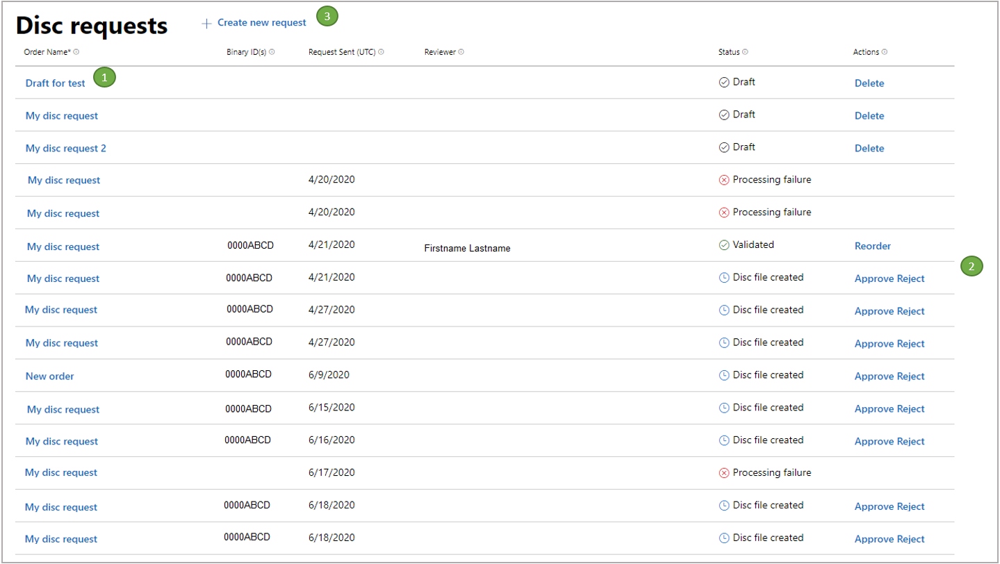

# How to request and manage discs

[!INCLUDE [reminder](../includes/managed-creators-only-feature.md)]

## Overview of disc requests

**Figure: Disc requests page**

The numbered areas of this figure are described as follows.

1. Select an order name to view its details.

2. The **Actions** column displays all optional and required actions that are related to the order.

3. To begin a new request, select the **Create a new request** link. The product will determine whether a single-product request flow or a bundle request flow is required.

## Creating a disc for a single product

This request will take you through the steps to configure disc contents for one product.
These steps will be determined for you, based on the selected product chosen prior to entering the disc request tool.

### Create a new disc request

When a new request creation is initiated, you will get prompted to start by naming your order, and then configuring the disc contents.

1. In the **Order name** field, enter a custom order name that will aid in tracking the request.
   Use a friendly name to help you identify your product.

2. The product name is fetched automatically, based on product setup outside disc creation.

3. In the **Listing instance** dropdown list, choose one of the available store listing instances for this product.
   Listings will be displayed after they're submitted to CERT or are used in RETAIL.
   They will become selectable by the user if they have a featured promotional art asset. This is the image used on disc and is therefore required.

4. **Region** is used to indicate content to be sold in China. 

> [!IMPORTANT]
> If **This product will be sold in China** is selected during Disc Request creation, the discs will not be compatible with consoles sold outside China. You can't create a single disc order to generate discs for use in both China and other regions.

### Step 1: Configure disc content for a single product

1. When an order is initiated, the product details (including age ratings) will be displayed throughout the order UI.
   Select **Edit** at any time to return to editing the order name or product listing instance.

2. Packages and package types

   Adding at least one package is required for completing your order.
   In the previous example, you will notice two package types: Xbox One and Xbox Series X|S.
   This dual-type option will only appear when a product had been configured to support multiple platforms.
   If packages uploaded are all for Xbox One only, you'll see a single dropdown list for packages.

   > [!IMPORTANT]
   > Disc files that are greater than 50 GB will automatically be made into multiple disc binaries.
   > If you're concerned with the size being close to the single disc limit, talk to you Microsoft contacts to verify the number of disc binaries that will be produced before passing the disc to the "test printing" stage.
   > You can also use a `maxDiscs` variable in your disc layout file to guarantee a "failure" error when the size is too large.

   Selecting dual packages will provide the user with the native Smart Delivery experience, where the user's console, even while offline, will fetch the best package for its generation.
   For instance, when the disc is inserted into an Xbox One console, it will install the Xbox One package. When the same disc is inserted into an Xbox Series X console, it will install the Xbox Series X package.

   Subset selection becomes available when a package chosen was uploaded with a disc layout file that contained subsets.
   If the file is correctly formatted, it will be parsed into the subsets defined. The user can select one or none to determine what content is used on disc from the XVC file.

3. **Save draft**
   This option to save partial drafts isn't currently available.
   To save a draft, you must have a viable draft and use the **Save** button on the summary page.

### Step 2: Select authorized replicators

After the disc contents had been defined, it's time to choose one or more authorized replicators (ARs) for retail disc manufacturing.
This is usually based on the region that the final product is being distributed in.

The files that are required to make the disc will be sent directly to the replicators.
However, the replicators won't print discs until everything else is in place, including the following.

* Your approval of the test discs.
* Approval of the test discs by Microsoft.
* A valid BOM.
* An order placed with the AR.

Although Microsoft facilitates the sending of the disc files to the intended authorized replicators, the placing of an order at an AR and the associated financial arrangements are the responsibility of the partner.

The general process is as follows.

* New disc request created, including AR selection.
* Disc files are sent to ARs, ready for final replication (and to Microsoft test disc manufacturing sites for test disc production).
* Test discs are manufactured, shipped, and approved by the partner and by Microsoft.
* BOM is progressed to a Release to Manufacturing (RTM) state, which means the game has released to manufacturing.
* ARs are notified by Microsoft of the RTM state.
* If the AR has an order and PO from the partner, the AR can begin final product replication.

> [!NOTE]
> The selection of ARs is separate from the process of test disc manufacturing.
> The process of test disc manufacturing is handled automatically by Microsoft.

### Step 3: Ship test discs

1. Test discs will be printed, and one primary recipient will receive 20 discs, and up to two secondary recipients will receive 10 discs.
   The primary recipient is required to complete the order.

2. Test discs will be sent to the recipients listed in this section.
   This is a preliminary step that allows the requestor to evaluate the product alongside the Microsoft Certification team prior to submitting to the BOM.

Test discs are normally ordered by Microsoft when the submission has passed initial smoke checks, known as Build Verification Tests (BVTs).
Test discs will be shipped to the locations you specify in the **Ship Test Discs** section of the Partner Center UI.

It's important that you make the selection for test discs to be sent to the correct location for your internal media verification checks.
The partner has the ultimate responsibility for validating that test discs work as expected and providing approval.
Test disc production and distribution generally takes three to five business days, depending on location.

1. Select **Primary (20 discs)** or **Secondary (10 discs)**.

2. Complete the contact information fields.

The requestor will have an opportunity to approve or reject these discs.
Approval is required to proceed with the order, and the requestor will be prompted in the disc request overview and disc order summary page.

### Step 4: Submit the order

This final step provides the requestor one last opportunity to review and/or edit their selections before the approval and manufacturing process is triggered.
This step is required to complete the order.

### Order summary

After an order is submitted, an email will be sent to your Microsoft representative for review.
You can view the order details and status anytime by selecting the order name on the disc order overview page.

### Reorders

A disc request can be reordered.
This is a good option if you would like to sell more copies of an already released disc.
This process simply involves sending the disc file that's already been created and tested previously to an AR.

There are no changes to the file itself. We take the original file exactly as it is and send it to the AR that's selected by the publisher at reorder time.
As a publisher, you must make arrangements with the AR for replication in the same way as a novel disc request.
Because this disc has already been approved and replicated, no certification or test discs are created.

The reorder option will become available after you approve a disc request in the disc request management UI.

## Ordering discs for a bundle product

This section walks you through the workflow you will see if you're ordering discs for a bundle product instead of for a single product and highlights the differences.

The bundle ordering process is the same as a single product except for "Step 1: Configure disc content for a single product."
Configuring disc contents requires the requestor to list sub-products and their associated listing instances.

Initiating a request for a bundle product will trigger a different order UI.

1. The parent product is shown in the **Bundle product** section.

2. In the **Bundle listing instance** dropdown list, select a listing instance.

### Step 1: Configure disc content for a bundle product

1. To add products, select **Add products from this bundle**.

   Bundle products orders require an extra step for selecting available products from the bundle to include on the disc.
   This allows the publisher the flexibility of selecting only a subset of the bundle's digital product members to include on the physical disc.

   Each in-bundle product the publisher wants to include on disc requires associating its own listing instance and package. This is in addition to the parent product and listing instance.

   Each product configuration must meet the requirement of containing the featured promotional art piece and physical age ratings.
   This policy is subject to change with the new feature of manual age ratings from a bundle.

The major steps 2-4 for a bundle product are the same as for a single product.

* [Step 2: Select authorized replicators](#step-sar)
* [Step 3: Ship test discs](#step-std)
* [Step 4: Submit the order](#step-sto)

### Publisher approval

After you receive your test discs and have validated them, you must approve or reject your order.

Approving or rejecting your order will permanently change the state of the disc order.
There will be a record of who made this state change, and it will be visible in the disc request.

If you reject the order, the order remains in the system and has a permanent status of "Rejected."
To create an order for a new set of discs, submit a new request.

To proceed with RTM, follow the process detailed in [Approve discs for manufacture](../publishing-processes/managed-creators/publishing-processes-rtm.md).

## FAQ

**Why can't I change an order when reordering?**

Reorders bypass the testing and certification phase.
Reorders don't require any disc authoring because the existing disc file that's already been approved is sent to a selected AR.
This is why selecting the AR is the only publisher selection required from the UI.

Changing content and configuration of a disc requires the same certification protocol that's done for a new disc request.

**Why can't I see my listings or packages?**

Packages will only be visible in the UI if they're in the RETAIL sandbox or if they've been submitted to certification. Listings will only be visible in the UI after they're certified and approved.
If the listings and packages aren't visible and you believe that you've submitted them to certification, check to see if they were rejected in the certification step.

**How much time does the test disc process take after submitting my order?**

The Service-Level Agreement (SLA) for certifying a disc submission is six business days, but many submissions are completed sooner.
When initial [Build Verification Tests (BVTs)](../concepts/certification/certification-console-bvt-guide.md) have been completed, test discs are ordered.
Test discs usually take three to five business days to arrive at partner addresses.

**Do packages need to have passed Certification before I can include them in the disc order?**

No. Packages can be included in a disc order if they've been submitted to Certification or if they're published to RETAIL. If the packages haven't been tested and approved, the disc order won't be processed until after the packages have passed BVTs. Any packages that were previously approved through the Cert Bypass program must be tested by Certification.

**How much time should I allow for final product replication?**

In typical circumstances, allow at least four weeks for final product replication, although this can vary because of seasonality.
Submit your disc request at least six weeks prior to the date that your final product will be on shelves in stores.
To get an ETA, contact your replicator.

**Does approving my order in Partner Center provide Microsoft with approval for RTM?**

No. After approving the order in Partner Center, you must still send a request for RTM. For more information, see [Approve discs for manufacture](../publishing-processes/managed-creators/publishing-processes-rtm.md).

## See also

* [Discs overview](../concepts/discs-overview.md)
