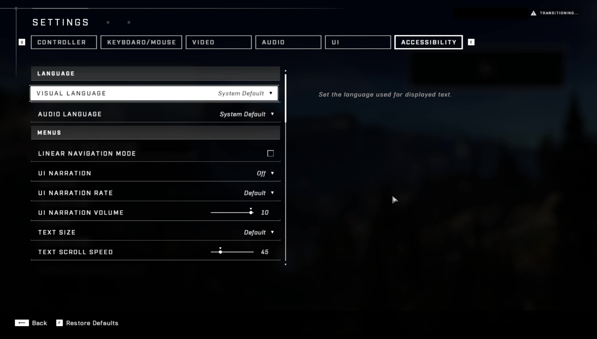
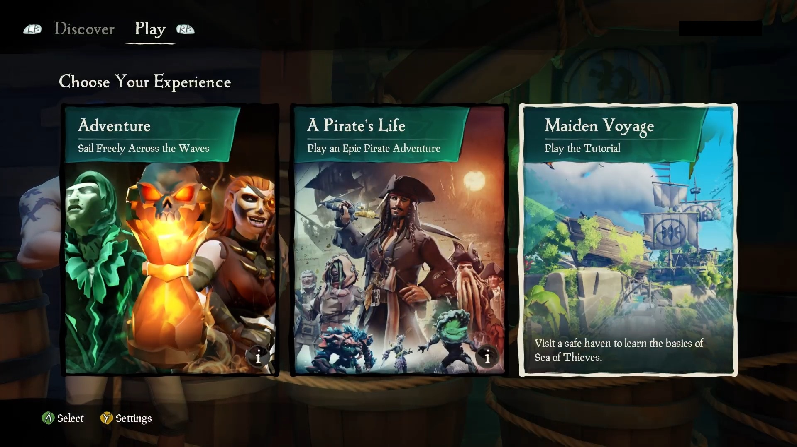
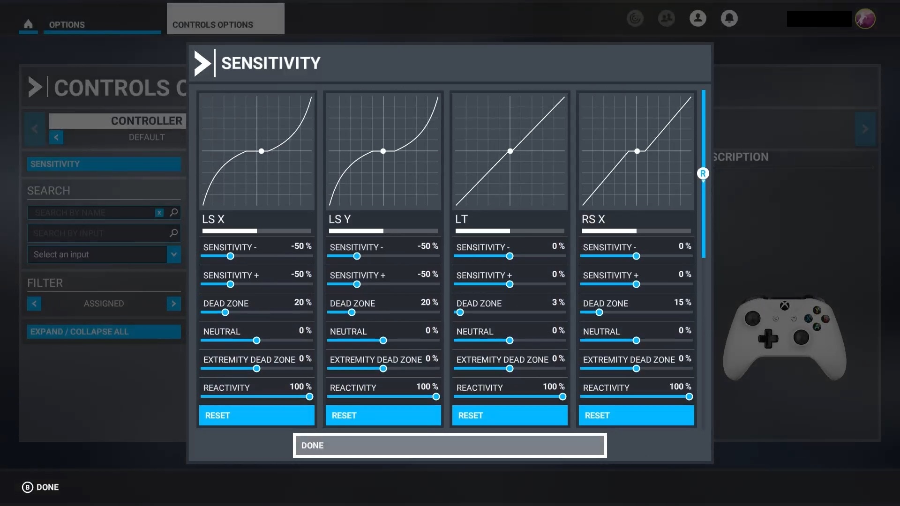
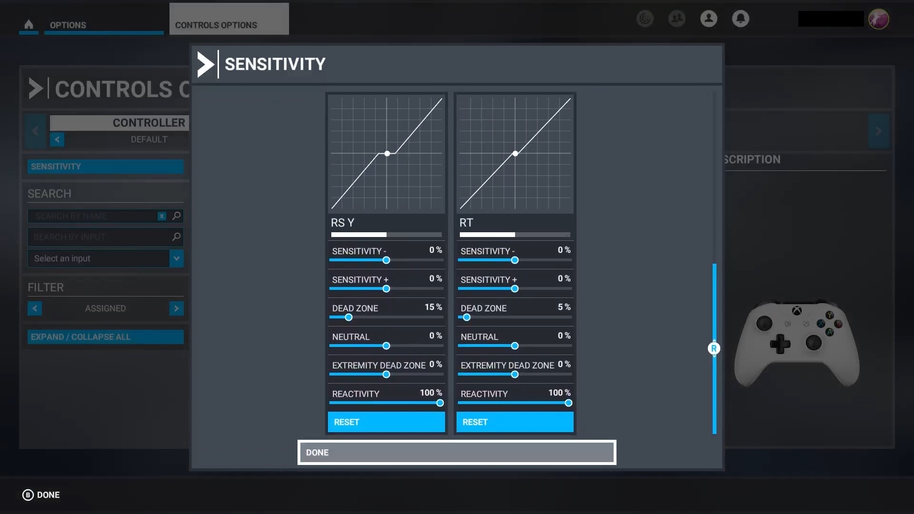
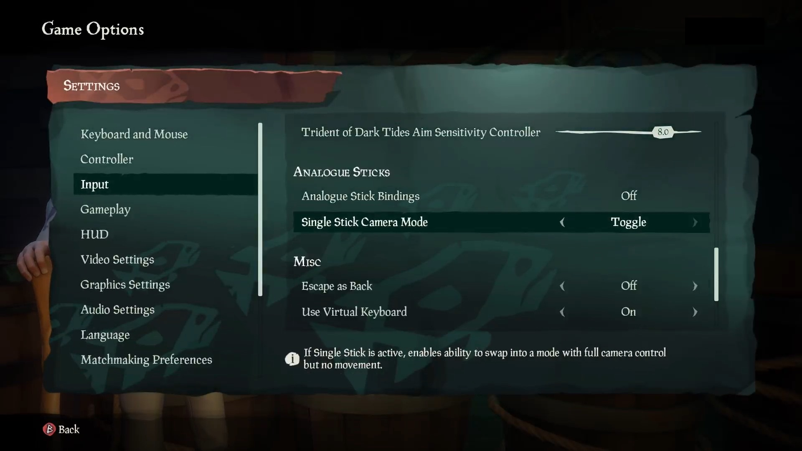

# Accessibility Feature Tags Version 2.0.1

Version 2.0.1 was published on March 14th, 2025. To view the feature tag change history, see [Accessibility Feature Tags version history](tag-version-history.md).

There are two different types of accessibility tags:

- [Accessible Games Intitiative](https://www.accessiblegames.com) Feature Tags, created by the Entertainment Software Association (ESA). 
- Xbox Accessibility Feature Tags, created by Microsoft prior to the Accessible Games Initiative.
    - Note: All Xbox Accessibility Feature Tags with Accessible Games Initiative equivalents have been renamed. 6 tags without equivalents remain and are indicated below.

Developers can identify accessibility features in their games by *tagging* the features by using the **Accessibility** feature in the **Gaming Metadata** module. Players can filter game catalogs to find games tagged with the specific accessibility features they need.

Specific criteria must be met before a feature can be tagged as having a certain accessibility feature. These criteria ensure that features are implemented in a useful and helpful way. For example, a game might include subtitles. If they are small and hard to distinguish from the game's background, they won't help a player who relies on subtitles to understand game narrative.

These criteria, described in this article, are validated by Microsoft to ensure accuracy *after* a Catalog Listing is published for a product. That's why it's critical that developers or publishers fill these fields out accurately. *If your game is incorrectly tagged as meeting all of the criteria for a specific feature when it doesn't, your Microsoft Representative will contact you and ask you to update your Catalog Listing to remove the feature tag.*

If your game doesn't meet **all** of the criteria for one or more tags, we encourage you to consider adding / updating accessibility features in a future update. Catalog Listings can be updated with newly supported accessibility features whenever they're added.

If you have any questions on whether your game meets specific criteria or, are looking for more guidance or tips on how to implement accessibility features in your games, see the [Xbox Accessibility Guidelines](guidelines.md). If you still have questions, reach out to [Xbox Partner Accessibility Questions](mailto:xpaq@microsoft.com).

## Accessible Games Initiative Tags

*This list is sourced directly from [Accessible Games Intitiative](https://www.accessiblegames.com) documentation. It additionally includes information on how Microsoft tests games for these tags.*

There are 24 Accessible Games Initiative tags.

---

### Auditory Features - Multiple Volume Controls

#### Player-Facing Description:
Separate volume controls are available for different types of sounds.

- The volume can be changed separately for music, speech, sound effects, background audio, text-to-speech audio, accessibility audio cues, and voice chat.
- All game sounds can also be changed at once using one volume control.

#### Goal:
Let players adjust the volume of each type of sound so they can reduce distracting sounds and focus on sounds that they need to hear.

#### Developer-Facing Requirements:
- Provide separate volume controls for each type of audio used in the game:
  - Sound effects (noises that communicate important information or that help players perform, such as footsteps approaching, gunshots offscreen, bushes rustling to indicate that there is a hidden creature).
  - Speech (character and narrative voices that communicate important information).
  - Ambient audio (background effects like whistling winds that don’t impact players’ decisions).
  - Music (background soundtrack or effects that don’t influence players’ decisions).
  - Voice chat (doesn’t apply if chat is only handled externally, or only by platform-level services).
  - Menu narration (text-to-speech audio).
  - Accessible audio cues (extra audio to help with accessibility such as directional indicator sounds for players with low vision).
- Provide a single control to change the volume of all game sounds at once.

#### Tips & Context:
- If the game contains multiple types of sound effects that are important, consider offering separate channels for each. For example, consider having separate controls for gunshot volume and footstep volume or for engine volume and tire volume. This will allow players to distinguish them from each other and from less important sounds covered by the general sound effects channel. Separate channels let players lower the volume of sounds they find overwhelming or that impact conditions like post-traumatic stress disorder (PTSD), and helps players focus on sounds that improve their ability to succeed or compete.
- Some games might also benefit from creating separate channels for active and passive in-game speech. For example, reducing the volume of background speech or making it more distinguishable from traffic noise lets players focus on important character speech.

#### Microsoft Test Steps:
1. Launch and engage with the title's various forms of gameplay for 30 minutes. 
2. Identify and list what types of sounds the title has: 
    a. Sound effects? 
    b. Ambient sounds? 
    c. Speech? 
    d. Music? 
    e. Voice chat (Only in-game voice chat, not platform voice chat)? 
    f. Menu narration? 
    g. Accessible audio cues?
3. Navigate through all the title's settings/options and verify that all sound types have an associated volume control.
4. Verify that the volume controls correctly apply to each type of sound.
5. Verify that all volume controls can be muted.
6. Did it qualify? 
    a. Does the title provide individual volume controls for all types of sounds? 
    b. Does the title provide a method to adjust all volume with a single control?

#### Pass Test Examples:
1. The title contains dialogue, ambient audio, sound effects and music and contains a volume slider for all of these and a master volume to adjust them all at once.
2. The title contains both music and sound effects (the sound effects do not impact player decisions or help the player perform) and the title only contains a master, music and sound effect slider.
3. The title contains only music and the title contains a single slider to adjust its volume.

#### Fail Test Examples:
1. The title contains sound effects that help the player perform and ambient sound effects that do not impact the user's decision and only provides a single volume control for all sound effects.
2. The title only contains a master volume slider but has sound effects and music.
3. The title has music, voice chat and menu narration but only contains a master volume slider, voice volume slider (including both voice chat and menu narration) and music volume slider.

---

### Auditory Features - Mono Sound

#### Player-Facing Description:
Lets you play with mono audio.
- The same audio will be sent to all channels (e.g., both left and right headphones), effectively providing a single, combined audio channel.

#### Goal:
Provide mono audio for players who have difficulty hearing sounds from one side.

#### Requirements:
- Let players convert stereo and surround sound audio to mono audio that’s sent to all channels.
- The option to turn this on through system preferences does not meet the requirements. Players must be able to choose mono sound within the game itself.

#### Tips & Context:
- Compressing all audio into a single channel meets the requirements, but it can make it harder for players to distinguish important audio cues. Therefore, it’s useful to produce a specific “mono mix” with sounds balanced specifically for mono playback.
- It’s useful to communicate that mono sound is on within the game itself (e.g., in the settings menu).

#### Microsoft Test Steps:
1. Launch and engage with the title's various forms of gameplay for 30 minutes.
2. Identify and list all important audio cues.
3. Navigate through the title's settings/options from the main menu and enable mono audio if the title supports it.
4. Verify that all important audio cues is output in mono audio.
5. Did it qualify? 
    a. Does the title contain important audio cues? 
    b. Does the title allow the user to enable mono audio or does it output mono audio by default?

#### Pass Test Examples:
1. The title contains stereo audio by default and the title level option allows the user to output mono audio instead.
2. The title outputs music as stereo audio but allows the user to output mono audio for all other sound effects.

#### Fail Test Examples:
1. The title does not contain audio.
2. The title does not contain important audio cues.
3. The title contains stereo audio by default and does not provide an option to switch this to mono audio.

---

### Auditory Features - Stereo Sound

#### Player-Facing Description:
Lets you play with stereo audio.
- Sounds communicate how far to the left or right they are coming from.
- Sounds will not communicate whether they are coming from above, below, ahead, or behind you.

#### Goal:

Provide stereo audio that helps players know which direction the game sounds are coming from.

#### Requirements:
- For sounds that have in-game locations, provide audio that communicates whether they are to the left or right of the player.
- The game can automatically turn this setting on or off, based on system preferences.

#### Tips & Context:
- It’s useful to communicate that stereo sound is on within the game itself (e.g., in the settings menu).

#### Microsoft Test Steps:
1. Launch and ensure any in-title stereo sound settings are enabled.
2. Engage with the title's various forms of gameplay for 30 minutes.
3. Identify and list all important audio cues.
4. Verify that all important audio cues that have an in-game location only communicate if they are left or right of the player.
5. Did it qualify? 
    a. Does the title's important sound cues only communicate if they are left and right of the player?

#### Pass Test Examples:
1. The title contains stereo audio by default and all important audio cues that have a location in game are output using stereo audio.
2. The title's audio is mono by default and contains a settings to provide stereo audio for important audio cues that have a location in game.
3. The title's audio is surround by default and contains a settings to convert all important audio cues that have a location in game to stereo audio.

#### Fail Test Examples:
1. The title does not contain audio.
2. The title only supports mono audio.
3. The title does not contain important audio cues.
4. The title supports some audio that is stereo, such as music or ambient sound effects, but also contains audio cues that should be distinguished via stereo audio but only outputs those audio cues in mono audio.
5. The title contains audio cues that occur above, below, ahead, or behind the player in addition to left and right and does not provide an option to limit the audio cues to just stereo audio.

---

### Auditory Features - Surround Sound

#### Player-Facing Description:
Lets you play with surround sound.
- Sounds communicate where they are coming from, which may include any direction.

#### Goal:
Provide surround sound that helps players know precisely which direction the game sounds are coming from.

#### Requirements:
- Provide audio that communicates the direction of sounds that have in-game locations.
- When relevant to gameplay, this audio must provide more directional information than stereo sound could communicate.
- The game can automatically turn this setting on or off, based on system preferences.

#### Tips & Context:
- It’s useful to communicate that surround sound is on within the game itself (e.g., in the settings menu).
- Surround sound might include outputting with 3.1, 5.1, or 7.1 surround sound or similar technologies, and/or virtually created surround, spatial, binaural, or similar technologies.

#### Microsoft Test Steps:
1. Launch the title and ensure any in-title surround sound relevant settings are enabled. 
2. Engage with the title's various forms of gameplay for 30 minutes.
3. Identify all important audio cues where surround sound would provide more directional information than stereo sound.
4. Verify that all these audio cues are outputted in surround sound that provides more directional information than stereo audio can.
5. Did it qualify? 
    a. Does the title contain important audio cues? 
    b. Would the important audio cues provide more directional information if output in surround sound? 
    c. Are those audio cues output in surround sound?

#### Pass Test Examples:
1. The title contains important audio cues such as footsteps and gunshots (in a 3D environment) that are output in surround sound.
2. The title outputs stereo sound by default and contains important audio cues such as footsteps and gunshots (in a 3D environment) that can be changed to output in surround sound.
3. The title outputs music and cinematics in stereo sound but outputs important audio cues such as footsteps and gunshots (in a 3D environment) in surround sound.

#### Fail Test Examples:
1. The title only supports mono audio.
2. The title only supports stereo audio.
3. The title does not contain important audio cues.
4. The title supports surround sound for music and only supports stereo or mono audio for all important audio cues. 
5. The title supports surround sound for important audio cues but it does not provide more directional information than just left and right audio.

---

### Auditory Features - Narrated Menus

#### Player-Facing Description:
Lets you use screen readers or voice narration for menus and notifications.
- Screen readers can access all menus, or the game provides similar functionality.
- Interactions and context changes are controlled by you and announced through narration.
- You can move through menus one item at a time, rather than steering a cursor.

#### Goal:
Help players understand and use menus and notifications without needing to see the text.

#### Requirements:
- Either provide narration for all menus and notifications (including non-interactive text) or support platform screen readers.
- Narrate headings and subheadings.
- Non-decorative images should have a brief narrated textual equivalent that summarizes what the image intends to communicate (alt text).
- For interactive elements, narrate their name, role, and state or value (such as “Accept, button,” “Full screen, checkbox, checked,” and “Volume, slider, 60%”).
 Narrate what the new context is (such as the title of a new screen) 
whenever the player’s context changes. This includes when the player 
initiates the change (such as moving to a new screen or changing which 
element is currently highlighted) and also when it happens automatically 
(such as a transition out of a loading screen or when the contents of a 
screen significantly change).
- Narrate significant changes that the game itself makes to information on 
the screen (such as a countdown timer, button prompt, or text updating 
that shows how many players were found in matchmaking).
- When the player moves to a new element, stop the narration of the 
previous element and start narration of the new element.
- Let players navigate all interfaces by shifting focus directly from one UI 
element to the next by a single action (through button/keypress, a single 
stick direction press, or a single touch-based action), without having 
to steer a cursor (such as a mouse pointer or moving a cursor using an 
analog stick).
- Don’t narrate any content in menus that’s purely decorative, used only for 
visual formatting, or is not presented visually.

#### Tips & Context:
- These settings should be available to players before they’re needed, like before gameplay and navigating game menus.
- Less important information that may clash/overwhelm can be deprioritized (prevented, limited, modified) in favor of other narration, or communicated by other means (e.g., audio cues). Examples include autosave notifications and countdowns.
- Good practice for headings/subheadings is to narrate their level. The main heading on the page is a level 1 heading, subheadings under that are level 2, further levels under those are level 3.
- Include information in your storefront listings about which languages are available for narration, either alongside other localization information or as part of the game’s feature listing text.
- It is good practice to let players cancel or repeat a narration through an input action such as pressing a button or key.
- It is good practice to let players adjust the speed of narration (some listen at 400%).
- If specific screen readers have been tested, the game should provide a list of compatible screen readers for players.

#### Microsoft Test Steps:
1. Launch the title and ensure screen narration is enabled both in game and on the platform.
2. Navigate through all of the title's menus (progress in gameplay may be necessary to ensure all menus are found) and ensure that narration is provided for the following: 
    a. Menu text 
            - Menu selection elements 
            - Button prompts 
            - Text providing the user information about the menu or the menu's goal 
            - Notifications 
            - Icons/Glyphs 
            - Etc.
    b. Headings and subheadings 
    c. Non-decorative images 
    d. Interactive elements 
            - Ensure that their name, role, state and value are narrated if applicable 
    e. Context changes (both user initiated and automatic) 
    f. Significant information changes
3. Verify that the title stops narration of the previous element and starts the narration of a new element when the user moves focus to a new element.
4. Verify that all menus can be navigated using a single action/key press/button press.
5. Verify that the title does not narrate decorative content.
6. Did it qualify? 
    a. Does the title properly narrate all menu text, headings, subheadings, non-decorative images, interactive elements, context changes and significant information changes? 
    b. Does the title allow the user to navigate menus using a single action? 
    c. Does the title ignore any decorative content? 

#### Pass Test Examples:
1. The title narrates all menus properly, does not narrate decorative elements, allows the user to navigate menus using a single action and stops narration of previous elements and starts narration of new elements when navigating.

#### Fail Test Examples:
1. The title does not support menu narration.
2. The title does not narrate the settings menus.
3. The title uses only a cursor to navigate its menus.
4. The title narrates a decorative image.

---

### Gameplay Features - Difficulty Levels

#### Player-Facing Description:
Lets you select from multiple difficulty options, including at least one option that reduces the intensity of the challenges.
- Differences between difficulty levels are also described.

#### Goal:
Give players options for the game’s difficulty so they can choose an option that better matches their abilities and preferences.

#### Requirements:
- Provide multiple difficulty levels preset options.
- Provide at least one difficulty level that significantly reduces the intensity of the challenges.
- Describe the difference between the difficulty level options, such as which variables are changed (e.g., number of enemies, character health) and how they are changed (e.g., 50% more, slightly increased). See Tips & Context for examples.

#### Tips & Context:
- Examples of variables that can be changed to significantly affect the intensity of challenges:
  - Enemy or player health
  - Enemy or player damage
  - Number of lives before having to restart
  - Resource availability
  - Enemy AI
- Providing granular control over settings is strongly recommended to let players match their abilities and preferences to the intended game experience.
- When naming or describing different difficulty options, avoid:
  - Indicating or explicitly stating that one option is better than another (such as, “This mode is the intended experience”).
  - Naming or describing the difficulty levels in a way that demeans players (such as, “Baby mode”).

#### Microsoft Test Steps:
1. Launch the title and navigate through the title's options.
2. Verify there are multiple (2 or more) difficulty level presets.
3. Verify that each difficulty preset describes what changes between each level.
4. Engage with gameplay for 30 minutes using the default difficulty.
5. Engage with gameplay for 30 minutes using the lowest difficulty and verify that it significantly reduces the intensity of challenge.
6. Did it qualify? 
    a. Does the title have multiple difficulty presets? 
    b. Does the lowest difficulty preset significantly lower the intensity of challenge? 
    c. Does each difficulty preset describe the differences between each option?

#### Pass Test Examples:
1. The title contains 2 difficulty presets with descriptions that describe the differences between each and the lowest difficulty preset significantly lowers the intensity of challenges.
2. The title contains 10 difficulty presets with descriptions that describe the differences between each and the lowest difficulty preset significantly lowers the intensity of challenges.

#### Fail Test Examples:
1. The title contains 2 difficulty presets that do not have descriptions.
2. The title does not contain any difficulty presets.
3. The title contains 2 difficulty presets with descriptions however, the lowest difficulty preset does not significantly reduce the difficulty.
4. The title contains 2 difficulty presets with descriptions however, the default difficulty is the lowest difficulty preset.

---

### Gameplay Features - Save Anytime

#### Input Features - Player-Facing Description:
Lets you manually save your progress at any time. Exceptions:
- The game is saving or loading.
- When saving could result in game-breaking scenarios or blocked progress, such as during death animations.

#### Goal:
Give players control over when they save their progress so they can safely stop playing when they need to.

#### Requirements:
- Let players manually save progress at any time during gameplay, with two exceptions:
  - The game is saving or loading.
  - When creating a save, and then loading from it, could result in game-breaking scenarios or blocked progress, such as saving during death animations or guaranteed failure states.
- Provide at least one (1) manual save slot that is separate from auto-save slots.
- Do not let auto-saves override manual saves.
- Quick-saves qualify as a type of manual save.
- To meet these requirements, the player must be loaded into exactly the same spot on resume even if it’s in the middle of an active scene such as a boss fight or a race.
 
#### Tips & Context:
- Auto-saves may be created at any time.
- While a single slot is enough to meet these requirements, you should offer multiple slots if possible (e.g., players might want to create a new slot if they’re unsure whether they’re saving in a circumstance they can progress from).

#### Glossary:
- Manual saving means that players can choose to save their progress at any time.
- Quick-saves are a single reserved save slot that can be overwritten by a single input at any time without the need to reach a save or check point.

#### Microsoft Test Steps:
1. Launch and engage with the title's various forms of gameplay for 30 minutes. 
2. Attempt to save at various locations throughout gameplay.
3. After saving, leave gameplay then load the save that was just made.
4. Verify that the title returns the user to exact same spot when saving.
5. Did it qualify? 
    a. Does the title allow the user to save at any time during gameplay? 
    b. Does the save return the user exact spot it was made? 
    c. Does the title provide at least 1 manual save slot? 
    d. Do the title's auto saves never override manual saves?

#### Pass Test Examples:
1. The title allows the user to save manually at any time and does not support auto saves.
2. The title allows the user to save manually at any time and contains 2 save slots, one for auto saves and one for manual saves.

#### Fail Test Examples:
1. The title does not allow the user to save except at checkpoints.
2. The title does not allow the user to save during dialogue.
3. The title has a single save slot that is used by both manual and auto saves.
4. The title automatically saves the user's progress at all times.
5. The title allows the user to save at any time but loads the user to a main hub.

---

### Input Features - Basic Input Remapping

#### Player-Facing Description:
Lets you rearrange the button controls.
- Button controls can be swapped or rearranged by some other method.
- The “Full Input Remapping” tag lets you remap all game controls, not just button controls, and remap them by choosing which action is performed by which input.

#### Goal:
Let players rearrange the digital controls so they can play.

#### Requirements:
- Provide a way to rearrange digital controls. Rearrangement must be available for all supported inputs (such as keyboard, mouse, controller, and virtual on-screen controller). Any method is permitted, including simple swaps of buttons (such as swapping A with B).
- These requirements do apply to:
  - Digital input interactions carried out using analog inputs such as sticks, triggers, touch-based surfaces, and motion-based functionality.
- These requirements do not apply to:
  - Inputs that can’t be remapped due to reserved system functions, such as the home or share button
  - Menu controls
  - Analog input interactions (see Tips & Context)

#### Tips & Context:
- Offering a choice of preset control schemes is useful but, on its own, doesn’t meet these requirements. Nor does relying on system-level remapping. Remapping must be provided by the game itself.
- Button prompts should ideally update to reflect any changes in mappings.

#### Glossary:
- Input interactions are either digital or analog and are independent of the device used to provide that input to the game.
  - Digital input interactions result in binary input (0 or 1, active or inactive), such as pressing a controller face button providing an active/inactive input, a trigger pull past a fixed threshold providing an active/inactive input.
  - Analog input interactions result in non-binary inputs, such as deflecting a stick to specific x- and y-axis values, or a trigger pull providing variable inputs within a 0-255 range.
- Supported inputs are the inputs that are identified on the game’s store page or website as being supported. If no inputs are indicated as being supported, then the game’s input support can’t be evaluated and the game can’t meet the requirements.

#### Microsoft Test Steps:
1. Launch and engage with the title's various forms of gameplay for 30 minutes.
2. Verify that all digital game mechanics can be reassigned in any way.
3. Identify the supported input devices listed on the title's website or store page. 
4. Repeat step [2] for all supported input devices.
5. Did it qualify? 
    a. Does the title allow the user to remap or swap all digital game mechanics on all supported devices? 
    b. Does the title have a website/store page listing the supported devices?

#### Pass Test Examples:
1. The title only uses the A and B buttons and allows the user to swap the A button to the X button and swap the B button to the Y button.
2. The title allows the user to fully remap all digital inputs.  

#### Fail Test Examples:
1. The title allows any digital game mechanic to be remapped to any input except pausing.
2. The title does not provide any remapping options.
3. The title only allows the user to remap using presets.
4. The title allows the user to remap any game mechanic but does not allow them to remap mechanics that are mapped to the View button.
5. The title does not list supported inputs on their website or store page.

---

### Input Features - Full Input Remapping

#### Player-Facing Description:
Lets you choose which action in the game is assigned to which control.
- All game controls can be remapped for all directly supported input methods, e.g. keyboard, mouse, controllers, and virtual on-screen controllers.
- Controller stick functionality can be swapped.
- The “Basic Input Remapping” tag lets you remap only button controls, and remap by simple methods like button swap.

#### Goal:
Let players fully remap game actions so they can play in a way that meets their specific needs and preferences, including the need for actions on the same input by default to be remapped separately.

#### Requirements:
- Provide a way to reassign which game action is controlled by each input for all supported inputs, whether analog or digital (such as keyboard, mouse, controller, and virtual on-screen controller).
- If your game uses either or both analog sticks of a controller, provide a way to swap the functions of the sticks.
- These requirements do not apply to:
  - Inputs that can’t be remapped due to reserved system functions, such as the Home or Share button
  - Menu controls

#### Tips & Context:
- These requirements are generally achieved by providing a list of actions and letting players choose which input should execute each action on the list.
- Button prompts should update to reflect any changes in mappings.

#### Glossary:
- Input interactions are either digital or analog and are independent of the device used to provide that input to the game.
  - Digital input interactions result in binary input (0 or 1, active or inactive), such as pressing a controller face button providing an active/inactive input, a trigger pull past a fixed threshold providing an active/inactive input.
  - Analog input interactions result in non-binary inputs, such as deflecting a stick to specific x- and y-axis values, or a trigger pull providing variable inputs within a 0-255 range.
- Supported inputs are the inputs that are identified on the game’s store page or website as being supported. If no inputs are indicated as being supported, then the game’s input support can’t be evaluated and the game can’t meet the requirements.

#### Microsoft Test Steps:
1. Launch and engage with the title's various forms of gameplay for 30 minutes.
2. Verify that all game mechanics can be remapped to any input (except stick controls).
3. Verify that the title allows the user to swap stick functionality (if any stick is used).
4. Identify the supported input devices listed on the title's website or store page.
5. Repeat steps [2] - [3] for all supported input devices.
6. Did it qualify? 
    a. Does the title allow the user to remap all game mechanics to any input on all devices (except stick controls)? 
    b. Does the title allow the user to swap sticks? 
    c. Does the title have a website/store page listing the supported devices?  

#### Pass Test Examples:
1. The title allows the user to remap all game mechanics to any input on all devices and does not use the left or right sticks. 
2. The title only supports controller input and allows any game mechanics to be remapped to any input and the sticks to be swapped.

#### Fail Test Examples:
1. The title allows any game mechanic to be remapped to any input except the pause button.
2. The title does not provide any remapping options.
3. The title only allows the user to remap using presets.
4. The title allows the user to remap any game mechanic but does not allow them to remap to the View button.
5. The title does not list supported inputs on their website or store page.

---

### Input Features - Stick Inversion

#### Player-Facing Description:
Lets you change how direction inputs such as thumbsticks affect game movement in the up and down and left and right directions.
- Examples of these directional inputs include thumbsticks and flight sticks.

#### Goal:
Let players hold their input devices upside down or in other directions when playing.

#### Requirements:
- For analog inputs with both X and Y axes (such as left and right controller sticks or a flight stick), let players invert each input separately.
- This applies to any stick that is used by default and any stick that actions can be remapped onto.

#### Glossary:
- Analog input interactions result in non-binary inputs, such as deflecting a stick to specific x- and y-axis values, or a trigger pull providing variable inputs within a 0-255 range.

#### Microsoft Test Steps:
1. Launch and engage with the title's various forms of gameplay for 30 minutes.
2. Identify all sticks that use analog inputs.
3. Navigate through the title's settings/options from the main menu and gameplay and invert each X axis and Y axis that is used.
4. Verify that each axes has been inverted.
5. Did it qualify? 
    a. Does the title allow the user to invert each axis on all sticks that use analog inputs? 

#### Pass Test Examples:
1. The title provides individual inversion options for each analog input with X and Y axes.
2. The title only uses the Y axis on the right and left stick but provides options to invert both the right and left stick individually. 

#### Fail Test Examples:
1. The title does not support analog inputs.
2. The title contains analog inputs with both an X and Y axis and does not provide an option to invert them.
3. The title uses an analog input for the camera on the right stick (with both X and Y axis) but only provides an option to invert the Y axis.

---

### Input Features - Playable without Button Holds

#### Player-Facing Description:
Lets you play without button holds.
- The game doesn’t require digital inputs (like keys or buttons) to be held.
- Some analog inputs (like sticks and triggers) may still require holds.

#### Goal:
Let players avoid digital input holds that might be impossible or uncomfortable for them.

#### Requirements:
- Either don’t include digital input holds in your game, or offer an alternative:
  - A single input press instead of an input hold.
  - A toggle instead of an input hold.
  - A double-press or double-tap of an input instead of an input hold.
  - Remap the digital input hold to an analog input hold.
- These requirements do apply to:
  - All digital input holds that are required for gameplay.
  - Digital inputs holds using inputs that are typically used for analog interactions, such as sticks, triggers, touch-based surfaces, and motion-based functionality.
- These requirements do not apply to:
  - Digital input holds that do not block gameplay. For example, the requirements do not apply to holding a button to skip a cutscene since players can advance by letting the cutscene play out.
  - Analog input interactions. See Tips & Context for more information.

#### Tips & Context:
- If a game has continuous analog inputs for moments like holding a left stick in a direction to move a character, developers are still encouraged to provide alternatives, but this is not part of the requirements for this tag.

#### Glossary:
- A hold is considered to be any input with a required duration. Some examples include holding a controller’s face buttons to swap equipped weapons, open a container, make a menu selection, or complete a quick-time event (QTE).
- Input interactions are either digital or analog and are independent of the device used to provide that input to the game.
- Digital input interactions result in binary input (0 or 1, active or inactive), such as pressing a controller face button providing an active/inactive input, a trigger pull past a fixed threshold providing an active/inactive input. Analog input interactions result in non-binary inputs, such as deflecting a stick to specific x- and y-axis values, or a trigger pull providing variable inputs within a 0-255 range.
- Playable means that a player can complete the game without being blocked. Optional game content may be inaccessible.

#### Microsoft Test Steps:
1. Launch the title and navigate through the title's settings/options from the main menu and in gameplay to turn off all button holds or enable all alternatives.
2. Engage with the title's various forms of gameplay for 30 minutes.
3. Verify that the title does not require the user to hold a digital input to progress through gameplay.
4. Navigate through the title's settings/options from the main menu and in gameplay and verify if any remaining button holds can be remapped to an analog input.
5. Verify that the title uses an analog input method when using the hold.
6. Did it qualify? 
    a. Does the title contain any digital holds that cannot be disabled? 
	b. Does the title provide options to remap the hold to an analog input? 

#### Pass Test Examples:
1. The title only contains analog input holds.
2. The title contains digital holds but allow the user to switch them to a toggle/single press or double press in the options.
3. The title only contains one mechanic requiring a hold that can be done with both digital and analog inputs.
4. The title only contains one mechanic that requires a digital hold on keyboard but can be done using analog inputs on controller.

#### Fail Test Examples:
1. The title contains digital holds that are required to progress through gameplay and no options to enable an alternative.
2. The title contains a required hold on a physical analog input but acts as a digital input and does not provide an alternative.
3. The title contains required digital holds and provides gameplay assists to avoid using these holds. However, these assists do not work during required boss fights.

---

### Input Features - Playable without Rapid Button Presses

#### Player-Facing Description:
Lets you avoid repetitive button actions like button mashing and quick-time events.

#### Goal:
Give players ways to avoid repetitive button actions that might be impossible or uncomfortable for them.

#### Requirements:
- Either don’t require repetitive button actions in your game or offer an alternative.
- This requirement applies to:
  - All rapid button presses, such as those required for executing combos (e.g., hitting X, then hitting Y within one second to execute a combo).
  - Examples:
    - Let players avoid sequences of one or more precisely-timed button presses (e.g., actions that require players to hit X within one second then Y within one second).
    - Let players avoid rapid repeated tapping actions (e.g., hitting X 10 times within two seconds to lift a heavy object).

#### Tips & Context:
- It is good practice to avoid requiring rapidly repeated inputs of any type, such as waggling sticks to escape an enemy’s grab.
- Some events require multiple simultaneous inputs. Simultaneous inputs are not part of the requirements for this tag, but it is still good practice to avoid these when possible.

#### Glossary:
- Playable means that a player can complete the game without being blocked. Optional game content may be inaccessible.

#### Microsoft Test Steps:
1. Launch and engage with the title's various forms of gameplay for 30 minutes.
2. Identify and list all mechanics that require repetitive button presses or sequences of one or more precisely timed button presses to progress through gameplay.
3. Navigate through the title's settings/options from the main menu ensure all options are enabled that would avoid repetitive button actions and precisely timed button presses.
4. Verify that all required repetitive button actions are disabled or provided alternatives.
5. Did it qualify? 
    a. Does the title allow users to avoid rapid button inputs to progress through gameplay? 
    b. Does the title allow users to avoid precisely timed button presses to progress through gameplay? 

#### Pass Test Examples:
1. The title does not contain any rapid repeated button presses or precisely timed button presses. 
2. The title contains rapid repeated button presses but allows the user to bypass these sections.
3. The title provides two methods to complete a minigame, one requiring a button hold and the other requiring rapid button presses. The user will gain extra currency when using rapid button presses but is able to complete the minigame using a button hold.

#### Fail Test Examples:
1. The title contains combos that require rapid, precisely timed repeated inputs to complete.
2. The title requires the user to mash an input to progress through gameplay.
3. The title contains rapid button presses and provides gameplay assists to avoid using these rapid button presses however, these assists do not work during required boss fights.
4. The title requires the user to make a single input within a precise window in order to succeed a quick-time event or complete a gameplay sequence.

---

### Input Features - Playable with Keyboard Only

#### Player-Facing Description:
Lets you play using only your keyboard.
- The game can be played with a keyboard alone, without any other devices.

#### Goal:
Support players who can use only a keyboard or who prefer playing that way.

#### Requirements:
- Let players play the game using only a keyboard.

#### Tips & Context:
- This keyboard-only option also makes the game more accessible to players using hardware that maps to keyboard inputs (such as accessibility switches).

#### Glossary:
- Playable means that a player can complete the game without being blocked. Optional game content may be inaccessible.

#### Microsoft Test Steps:
1. Launch the title with only keyboard connected.
2. Navigate and verify all settings/options can be adjusted. 
3. Navigate and verify all menus can be accessed.
4. Enter gameplay and ensure all core mechanics can be completed using keyboard input.
5. Did it qualify? 
    a. Does the title allow the user to navigate all menus and adjust all settings using keyboard input? 
    b. Does the title allow the user to complete the title using keyboard input? 

#### Pass Test Examples:
1. The title can be fully navigated and the player can complete the game using keyboard input. 
2. The title can be fully navigated and all mechanics can be completed using keyboard input except for an optional mechanic used to adjust the user's clothing color.

#### Fail Test Examples:
1. The title can be fully navigated but requires the user to use a mouse to aim and shoot.
2. The title requires a controller to be connected to take keyboard input.
3. The title cannot navigate past the main menu using keyboard input.

---

### Input Features - Playable with Mouse Only

#### Player-Facing Description:
Lets you play using only your mouse.
- This also lets you play using adaptive tech that maps to mouse inputs.

#### Goal:
Support players who can use only a mouse or who prefer playing that way.

#### Requirements:
- Let players play the game using only a 2-button computer mouse.

#### Tips & Context:
- Mouse support also makes the game more accessible to players using hardware that maps to mouse movements (such as eye-trackers or head pointers).

#### Glossary:
- Playable means that a player can complete the game without being blocked. Optional game content may be inaccessible.

#### Microsoft Test Steps:
1. Launch the title with mouse input.
2. Navigate and verify all settings/options can be adjusted. 
3. Navigate and verify all menus can be accessed.
4. Enter gameplay and ensure all core mechanics can be completed using mouse input.
5. Did it qualify? 
    a. Does the title allow the user to navigate all menus and adjust all settings using mouse input? 
    b. Does the title allow the user to complete the title using mouse input?

#### Pass Test Examples:
1. The title can be fully navigated and all core mechanics can be completed using mouse input. 
2. The title can be fully navigated and all mechanics can be completed using mouse input except for an optional mechanic used to adjust the user's clothing color.

#### Fail Test Examples:
1. The title can be fully navigated but requires the keyboard to move the character.
2. The title requires a controller to be connected to take mouse input.
3. The title cannot navigate past the main menu using mouse input.

---

### Input Features - Playable with Buttons Only

#### Player-Facing Description:
Lets you play using only buttons where the amount of pressure doesn’t affect the controls.
- The game and menus can be controlled using only digital inputs (like buttons or keys).

#### Goal:
Support players who can’t easily adjust how much physical pressure they put on input controls or who prefer to use digital input methods.

#### Requirements:
- Let players play the game and navigate all interfaces using only digital inputs (such as d-pad, face buttons) instead of analog inputs (such as analog triggers, thumb sticks, and mouse).
- These requirements do apply to:
  - Digital interactions using analog inputs such as sticks, triggers, touch-based surfaces, and motion-based functionality.
  - If analog triggers have simple on-off functionality (such as to fire or not fire) rather than an analog range (such as controlling how fast or slow the player is moving), then they count as a digital input.

#### Tips & Context:
- Digital input is more easily mapped to some types of assistive technology like accessibility switches.

#### Glossary:
- Input interactions are either digital or analog and are independent of the device used to provide that input to the game.
- Digital input interactions result in binary input (0 or 1, active or inactive), such as pressing a controller face button providing an active/inactive input, a trigger pull past a fixed threshold providing an active/inactive input.
- Analog input interactions result in non-binary inputs, such as deflecting a stick to specific x- and y-axis values, or a trigger pull providing variable inputs within a 0-255 range.
- Playable means that a player can complete the game without being blocked. Optional game content may be inaccessible.

#### Microsoft Test Steps:
1. Complete test for Playable with Keyboard Only tag (This test case will pass if Playable with Keyboard Only passes).
2. Launch the title using controller input.
3. Navigate and enable all options that allow for digital input gameplay. 
    a. Controller remapping? 
    b. Remapping presets? 
    c. Buttons-only mode? 
    d. Etc.
4. Navigate and verify all menus and options can be navigated and adjusted using digital inputs.
5. Enter gameplay and ensure all core mechanics can be completed using digital inputs.
6. Did it qualify? 
    a. Does the title allow the user to navigate all menus and adjust all settings using digital inputs? 
    b. Does the title allow the user to complete the title using digital inputs?

#### Pass Test Examples:
1. The title can be fully navigated and all core mechanics can be completed using digital inputs. 
2. The title can be fully navigated and all mechanics can be completed using digital inputs except for an optional mechanic used to adjust the user's clothing color.
3. The title can be fully navigated and all core mechanics can be completed using keyboard input.

#### Fail Test Examples:
1. The title can be fully navigated but requires the left stick to move (movement speed changes based on how far the user presses the left stick).
2. The title requires the right trigger to accelerate at varying speeds and this function cannot be remapped to a digital input.

---

### Input Features - Playable with Touch Only

#### Player-Facing Description:
Lets you play using only touch controls.
- Players are not required to use any type of non-touch controls, such as buttons or analog sticks.

#### Goal:
Support players who can use only touch-based controls or who prefer playing that way.

#### Requirements:
- Let players play using only touch input like a controller touchpad or a touchscreen on a mobile device.

#### Glossary:
- Playable means that a player can complete the game without being blocked. Optional game content may be inaccessible.

#### Microsoft Test Steps:
1. Launch the title with touch input.
2. Navigate and verify all settings/options can be adjusted.
3. Navigate and verify all menus can be accessed.
4. Enter gameplay and ensure all core mechanics can be completed using touch input.
5. Did it qualify? 
    a. Does the title allow the user to navigate all menus and adjust all settings using touch input? 
    b. Does the title allow the user to complete the title using touch input?

#### Pass Test Examples:
1. The title can be fully navigated and all core mechanics can be completed using touch input. 
2. The title can be fully navigated and all mechanics can be completed using touch input except for an optional mechanic used to adjust the user's clothing color.

#### Fail test examples
1. The title can be fully navigated but requires controller input to move the character.
2. The title requires a controller to be connected to take touch input.
3. The title cannot navigate past the main menu using touch input.

---

### Input Features - Playable without Motion Controls

#### Player-Facing Description:
Lets you play without using motion controls.

#### Goal:
If motion controls are used, players can turn them off or map them to something else.

#### Requirements:
- Let players play without motion controls such as gyroscopes or accelerometers, and without the automatic detection of player movement.

#### Tips & Context:
- Motion controls can be a useful accessibility feature for some players.

#### Glossary:
- Playable means that a player can complete the game without being blocked. Optional game content may be inaccessible.

#### Microsoft Test Steps:
1. Complete test for Playable with Keyboard Only, Playable with Mouse Only, Playable with Buttons Only and Playable with Touch Only tags (This test case will pass if any of these tags pass).
2. Launch and engage with the title's various forms of gameplay for 30 minutes.
3. Identify and list all mechanics that require motion controls to progress through gameplay.
4. Navigate through the title's settings/options from the main menu ensure all options are enabled that would avoid motion controls.
5. Verify that all required motion control actions are disabled or provided alternatives.
6. Did it qualify? 
    a. Does the title allow users to avoid motion controls to progress through gameplay?

#### Pass Test Examples:
1. The title does not require motion controls to complete the title.
2. The title can be full completed using keyboard and mouse.
3. The title can be full completed using controller input.

#### Fail Test Examples:
1. The title requires motion controls to navigate the title.
2. The title requires motion controls to engage with a mechanic that's required to progress through gameplay.

---

### Input Features - Playable without Touch Controls

#### Player-Facing Description:
Lets you play without using touchpads or touchscreens.

#### Goal:
If touch input is used, players can turn it off or map it to something else.

#### Requirements:
- Let players play without resistive, capacitive, or other touch screen or touchpad input.

#### Tips & Context:
- Touch input can be a useful accessibility feature for some players.

#### Glossary:
- Playable means that a player can complete the game without being blocked. Optional game content may be inaccessible.

#### Microsoft Test Steps:
1. Complete test for Playable with Keyboard Only, Playable with Mouse Only and Playable with Buttons Only (This test case will pass if any of these tags pass).
2. Launch and engage with the title's various forms of gameplay for 30 minutes. 
3. Identify and list all mechanics that require touch controls to progress through gameplay.
4. Navigate through the title's settings/options from the main menu ensure all options are enabled that would avoid touch controls.
5. Verify that all required touch control actions are disabled or provided alternatives.
6. Did it qualify? 
    a. Does the title allow users to avoid touch controls to progress through gameplay? 

#### Pass Test Examples:
1. The title does not require touch controls to complete the title.

#### Fail Test Examples:
1. The title requires touch controls to navigate the title.
2. The title requires touch controls to engage with a mechanic that's required to progress through gameplay.

---

### Input Features - Chat Speech-to-Text & Text-to-Speech*

#### Player-Facing Description:
Lets you use text-to-speech and speech-to-text for game chats with other players.
- Text chats can be narrated out loud in real-time.
- Voice chats can be read as a text transcript in real-time.

#### Goal:
Make sure your social experiences are available to everyone by letting players communicate with each other using text-to-speech and speech-to-text for all game chats.

#### Requirements:
- If the game lets players communicate with each other using text, support text-to-speech so that players can hear the conversation narrated in real-time.
- If the game lets players communicate with each other using voice, support these options:
  - Speech-to-text so that players can read a text transcript in real-time.
  - Outgoing text-to-speech so that players can send a message to the voice chat.
  - Support text-to-speech for any text-based canned messages (such as “Hello” and “Nice job”).
  - Show speech-to-text messages in the same on-screen location as text chat so that players can easily read them together. That location must allow players to access the past four messages either by displaying them all at once, allowing players to scroll back to view the last four messages, or allowing players to expand the message view to see the last four messages.

#### Tips & Context:
- Quick chat or canned chat on their own do not meet these requirements.

#### Microsoft Test Steps:
1. Launch the title and ensure text-to-speech and speech-to-text is enabled in the title.
2. If the title has voice chat verify the following: 
    a. Verify that the title translates all voice communication to text. 
    b. Verify that the title allows the user to participate in voice chat using a text entry field (Text-to-speech).
3. If the title has text communication, verify the following: 
    a. Verify that the title narrates text chat (including canned messages).
4. Verify that the title shows speech-to-text in the same location as text chat.
5. Verify that the title displays at least 4 lines at once, allows the user to scroll or allows the user to expand to see 4 messages.
6. Did it qualify? 
    a. Does the title display 4 lines at once, allow the user to scroll, or expand to see 4 message? 
    b. If the title supports voice chat, does the title translate voice communication to text? 
    c. If the title supports voice chat, does the title allow user to participate in voice chat using a text entry field (Text-to-speech)? 
    d. If the title supports text chat, does it narrate text chat and canned message? 
    e. If the title supports voice and text chat, does the title show speech-to-text in the same location as text chat?

#### Pass Test Examples:
1. The title supports both text and voice communication and provides narration for all text communication and translates voice to text for all voice communication. The title also allows the user to scroll back and view all previous messages.
2. The title supports text communication and provides options to narrate all of text chat (including canned messages). The title also allows the user to scroll back and view all previous messages.
3. The title supports voice communication and provides options to translate voice to text chat and provides an option to engage in voice chat using a text entry field. The title also allows the user to scroll back and view all previous messages.

#### Fail Test Examples:
1. The title does not support communication between users.
2. The title supports text communication but does not narrate text chat.
3. The title supports text communication but does not narrate canned messages.
4. The title supports voice communication but does not provide voice translation.
5. The title supports voice communication but does not provide a method to engage in voice chat using a text entry field.
6. The title supports text and voice communication between users but only supports text-to-speech.
7. The title supports text and voice communication between users and supports text-to-speech and speech-to-text but this is only provided through system level chat.
8. The title supports both voice and text communication but only displays 3 messages at a time and does not allow users to go back to view previous messages.

---

### Visual Features - Clear Text

#### Player-Facing Description:
Text in menus, control panels, and settings is a reasonable size. You can adjust the contrast.
- Text is at a reasonable size relative to the device’s screen resolution and typical viewing distance.
- Font is less stylized or can be changed to a less stylized option (e.g., sans serif).
- Text has, or can be adjusted to, a reasonable contrast against all backgrounds. (See “Large & Clear Subtitles” tag for subtitle text options.)

#### Goal:
Make the text in your game easier to read for as many players as possible.

#### Requirements:
- Minimum default text height in PC and console games:
  - 4K: 52 pixels
  - 1080p: 26 pixels
  - 720p: 17 pixels
- Use a sans-serif font or provide the option to use one.
- Use a text color that has a minimum contrast ratio of 4:5:1 against all backgrounds. Providing the option of using an opaque background container that ensures a minimum contrast ratio of 4:5:1 between the text and the background is sufficient to meet these requirements.
- These requirements do apply to:
  - All front-end menu text in the game such as menus, settings, maps, 
and inventory screens. This includes text in full caps and other text 
without ascenders/descenders.
  - All heads-up display (HUD) text such as on-demand radial menus, 
health bars, waypoints, or diegetic UI.
- These requirements do not apply to:
  - Subtitles (covered in ”Large & Clear Subtitles” tag).
  - Writing that appears in-world such as billboards, newspapers, or 
clothing.
  - Text that is purely decorative such as binary numbers used as an 
aesthetic device on the background of a menu.
  - Screens outside of menus and gameplay such as credits.

#### Tips & Context:
- Avoid fonts that have very large or very small x-height. If you use a font with a small x-height, consider using larger font height (ascender to descender height) than you normally would to make up for the smaller lowercase letterforms.
- Text must always be measured on the basis of ascender to descender, not just cap height. There are three ways to do this:
  - Measure other text in the game that is in the same font and size and has descenders.
  - If that is not possible, input some text in your design software in the font and size that has ascenders and descenders, and then measure that.
  - If neither of those is possible, estimate cap height to be around 75%, e.g., 20px full caps = 26px asc-desc.
- Text settings should be available to players before they’re needed, like before gameplay and navigating menus.
- For dialogue text, see the “Large & Clear Subtitles” tag.

#### Glossary:
- Sans-serif font is a letter or typeface without serifs. Serifs are short lines stemming from and at an angle to the upper and lower ends of the strokes of a letter.
- Text height is the total distance between ascender (top of lower case “h”) and descender (bottom of lower case “p”).

#### Microsoft Test Steps:
1. Launch the title and ensure any option to use a sans-serif font is enabled.
2. Verify that all text reaches a default contrast ratio of 4.5:1 against all backgrounds and is in a sans-serif font and all Asc-Desc Text has a default text size of at least 26 pixels (at 1080p).
3. Engage with the title's gameplay for 30 minutes and verify that all text reaches a default contrast ratio of 4.5:1 against all backgrounds, is in a sans-serif font, and all Asc-Desc Text has a default text size of at least 26 pixels (at 1080p).
4. Repeat steps 2-3 but ensure any text that is a different size from Asc-Desc Text and does not have an ascender/descender itself has a text size of at least 20 pixels (at 1080p).
5. Did it qualify? 
    a. Does all text reach a default height of 26 pixels (at 1080p)? 
    b. Does the title display all text in a sans-serif font or provide an option to do so? 
    c. Does all required text reach a contrast ratio of 4.5:1 or does the title provide an option to reach this value?

#### Pass Test Examples:
1. The title displays text at a height larger than 26 pixels (at 1080p), in a sans-serif font and with 4.5:1 contrast against all backgrounds by default.
2. The title displays text at a height larger than 26 pixels (at 1080p) by default, in a sans-serif font and allows the user to enable a black background on all text to reach a 4.5:1 contrast ratio for all important text. 

#### Fail Test Examples:
1. The title displays text in the settings menu at a contrast ratio below 4.5:1.
2. The title displays all text at a text size of 18 pixels.
3. The title displays all text with a serif font.
4. The title displays full caps text (this text does not have an ascender or descender) at a text size of 15 pixels.

---

### Visual Features - Large Text

#### Player-Facing Description:
Lets you use a large font size for text in menus, control panels, and settings.
- Text can be in a large size relative to the device’s screen resolution and typical viewing distance. (See “Large & Clear Subtitles” tag for subtitle text options.)

#### Goal:
Help everyone comfortably read the text in your game by either providing a very large font size or letting players adjust the size.

#### Requirements:
- Either set the default text height to the following minimum size or give players a way to adjust it to this size on PC and console games:
  - 4K: 76 pixels
  - 1080p: 38 pixels
  - 720p: 25 pixels
- These requirements do apply to:
  - All front-end menu text in the game (such as menus, settings, maps, and inventory screens). This includes text in full caps and other text without ascenders/descenders.
  - All heads-up display (HUD) text (such as on-demand radial menus, health bars, waypoints, or diegetic UI).
- These requirements do not apply to:
  - Subtitles (covered in ”Large & Clear Subtitles” tag).
  - Writing that appears in-world (such as billboards, newspapers, or 
clothing).
  - Text that is purely decorative (such as binary numbers used as an 
aesthetic device on the background of a menu).
  - Screens outside of menus and gameplay (such as credits).

#### Tips & Context:
- Avoid fonts that have very large or very small x-height. If you use a font with a small x-height, consider using larger font height (ascender to descender height) than you normally would to make up for the smaller lowercase letterforms.
- Text must always be measured on the basis of ascender to descender, not just cap height. There are three ways to do this:
  - Measure other text in the game that is in the same font and size and has descenders.
  - If that is not possible, input some text in your design software in the font and size that has ascenders and descenders, and then measure that.
  - If neither of those is possible, estimate cap height to be around 75%, e.g., 20px full caps = 26px asc-desc.
- Text settings should be available to players before they’re needed, like before gameplay and navigating menus.
- For dialogue text, see the “Large & Clear Subtitles” tag.

#### Glossary:
- Text height is the total distance between ascender (top of lower case “h”) and descender (bottom of lower case “p”).
- x-height is the height of a lowercase “x” relative to a lower case “h.”

#### Microsoft Test Steps:
1. Launch the title and ensure that the title's text size options are set to their highest values.
2. Navigate the title's menus and verify that all Asc-Desc Text has a text size of at least 38 pixels (at 1080p).
3. Engage with the title's gameplay for 30 minutes and verify that all text reaches at least 38 pixels in height.
4. Repeat steps 2-3 but ensure any text that is a different size from Asc-Desc Text and does not have an ascender/descender itself has a text size of at least 29 pixels (at 1080p).
5. Did it qualify? 
    a. Does the title allow the user to increase the size of all text to reach 38 pixels (at 1080p) in height or does it reach that height by default?

#### Pass Test Examples:
1. The title displays all text at a text size of 38 pixels (at 1080p) by default.
2. The title allows the user to increase the text size of all text to 38 pixels (at 1080p).
3. The title displays decorative text below 38 pixels but all other text reaches 38 pixels (at 1080p).
4. The title displays all text in full caps (this text does not have an ascender or descender) that reach 29 pixels (at 1080p) by default.

#### Fail Test Examples:
1. The title does not provide an option to adjust text size and displays all text at 26 pixels by default.
2. The title provides an option to adjust text size but it only increases the size of text to 30 pixels.

---

### Visual Features - Large & Clear Subtitles

#### Player-Facing Description:
Subtitles are available for all dialogue.
- Text is at a reasonable size relative to the device’s screen resolution and typical viewing distance.
- The subtitle background transparency can be adjusted.
- Subtitles don’t overlap with important game elements.
- Font is less stylized or can be changed to a less stylized option (e.g., sans serif).
- This tag covers spoken game dialogue only and doesn’t include text displayed for other audio such as speaker tone or environmental sounds that are typically included in captions.

#### Goal:
Players can use subtitles to follow all the game’s dialogue and have options to make the subtitles easier to read.

#### Requirements:
- Provide subtitles for all spoken content.
- Don’t position the game HUD elements behind or over subtitles.
- Identify who’s speaking or make that an option for players to turn on.
- Minimum default text height for 1080p for PC and console games: 32p.
- Provide the option to scale the text height up to at least 46 pixels at 1080p on PC games.
- For all other resolutions, scale the numbers accordingly to remain equivalent to the 1080p sizes.
- Use a sans-serif font or provide the option to use one.
- Provide the option of a background container with adjustable transparency. Include the option to choose a solid black background with white text and no transparency.
- Not every word must be subtitled. Practices such as prioritization systems that selectively display NPC dialogue and editing of repeated words are permitted.

#### Tips & Context:
- It’s recommended to show a maximum of 40 characters per line and 2 lines on-screen at a time.
- Avoid fonts that have very large or very small x-height. If you use a font with a small x-height, consider using larger font height (ascender to descender height) than you normally would to make up for the smaller lowercase letterforms.
- Text height must always be measured on the basis of ascender to descender. You can’t just measure cap height. There are three ways to do this:
  - Measure other text in the game that is in the same font and size and has descenders.
  - If that is not possible, input some text in your design software in the font and size that has ascenders and descenders, and then measure that.
  - If neither of those is possible, estimate cap height to be around 75%, e.g., 20px full caps = 26px asc-desc.
- Subtitles should be on by default, with an option to be able to turn them off. If they’re off by default, let players turn them on before they are first needed (e.g., before gameplay and cutscenes).
- Fonts that are less stylized are generally easier to read, e.g., fonts that have consistent letter sizing, stroke width, and aren’t slanted or crooked.
- Distinguishing speakers by color alone is permitted but would exclude the game from the “Color Alternatives” tag.

#### Glossary:
- Sans-serif font is a letter or typeface without serifs. Serifs are short lines stemming from and at an angle to the upper and lower ends of the strokes of a letter.
- Text height is the total distance between ascender (top of lower case “h”) and descender (bottom of lower case “p”).
- x-height is the height of a lowercase “x” relative to a lower case “h.”

#### Microsoft Test Steps:
1. Launch and ensure that subtitles are turned on.
2. Engage with the title's various forms of gameplay for 30 minutes. 
    a. Verify that all subtitles use a default font size of 32 pixels or greater (at 1080p).
    b. Verify that subtitles are not behind or in front of the game HUD. 
    c. Verify that subtitles are provided for all spoken content.
3. Navigate through the title's settings/options from the main menu and gameplay and adjust any of the following supported settings: 
    a. Enable speaker identification. 
    b. Adjust subtitle text size to their largest size. 
    c. Enable a sans-serif font.
4. Verify that the title either provides a background container or an option to enable one.
5. Verify that the title allows the user to adjust the transparency of the background container.
6. Verify that the title allows the user to enable a solid black background with white text and no transparency.
7. Engage with the title's various forms of gameplay for 30 minutes. 
    a. Verify that speaker is identified at all times. 
    b. Verify subtitle text size reaches at least 46 pixels (at 1080p). 
    c. Verify that subtitle text is in a sans-serif font.
8. Did it qualify? 
    a. Are subtitles provided for all spoken content? 
    b. Do the subtitles reach a text size of 32 pixels (at 1080p) by default? 
    c. Does the title allow the user to scale the text size of subtitles to 46 pixels (at 1080p)? 
    d. Do subtitles appear behind or in front of the game HUD? 
    e. Do subtitles provide speaker identification or have options to enable it? 
    f. Does the title provide a background container and have options to adjust its transparency? 
    g. Does the title provide a solid black background container with white text or have options to enable one? 
    h. Does subtitles use a sans-serif font or have options to enable it?

#### Pass Test Examples:
1. The title provides subtitles that reach 50 pixels (at 1080p) by default, in a sans serif font, with a solid black background and white text that identifies the speaker at all times and does not overlap with any game HUD and provides an option to adjust the background transparency.
2. The title provides subtitles that overlap game HUD elements when set to large but reach 46 pixels (at 1080p) on medium and do not overlap game HUD elements (They also qualify for all other criteria).

#### Fail Test Examples:
1. The title provides subtitles that meet all the criteria except it has a solid black background by default and does not provide an option to adjust its transparency.
2. The title provides subtitles that meet all the criteria except it only has an option to enable a white background with black text.
3. The title's subtitles are 25 pixels in height by default.
4. The title's subtitles use a serif font and does not provide an option to change it.
5. The title does not contain spoken content.

---

### Visual Features - Color Alternatives

#### Player-Facing Description:
Color is not used to communicate important information or can be adjusted.
- Shape, pattern, icons, or text is used to communicate information instead of color.

#### Goal:
Don’t rely only on color to communicate or differentiate important information. Not everyone can see colors in the same way.

#### Requirements:
- Either don’t use color to communicate or differentiate important information, or offer at least one of the following:
  - Provide other visual cues like shape, pattern, icons, or text to represent the colors’ meanings.
  - Provide settings that let the player change the colors of color-dependent elements.
- These requirements apply to information provided through text, such as subtitles. For example, only using color to communicate the identity of the subtitle speaker doesn’t meet the requirements for this tag.
- Providing full-screen filters that affect the whole palette doesn’t meet these requirements (like shifting all blues in the game towards green).

#### Tips & Context:
- Providing pre-set color schemes for specific types of colorblindness can be useful. However, players may also want the ability to freely choose which colors to use.

#### Microsoft Test Steps:
1. Launch and engage with the title's various forms of gameplay for 30 minutes.
2. Identify and list all important content that only uses color to communicate information and does not have an additional Visual signifier. 
    a. Teams? 
    b. Colored puzzles? 
    c. Etc.
3. Navigate through the title's settings/options from the main menu and gameplay and adjust any setting to add a visual signifier.
4. Navigate through the title's settings/options from the main menu and gameplay and adjust the colors of all color content.
5. Verify that visual signifiers have been added and/or the colors have changed.
6. Verify that the color options are not only a full-screen filter.
7. Did it qualify? 
    a. Does all important color content have a visual signifier? 
    b. Does the title allow the user to change the colors of color content? 
    c. Does the title allow the user to change the colors without the use of a full-screen filter?

#### Pass Test Examples:
1. The title uses only color to communicate important information but provides an option to adjust those colors in the options (not full-screen filter).
2. The title provides shapes in addition to color to communicate important information to the user.
3. The title does not use any color to communicate information to the user.
   
#### Fail Test Examples:
1. The title uses only audio cues in addition to color to communicate information to the user and does not allow the user to change these colors.
2. The title provides options to adjust the color of color content but uses a full-screen filter. 
3. The title does not provide options for color content and only communicates important information using color.

---

### Visual Features - Camera Comfort

#### Player-Facing Description:
There are no camera effects that may cause discomfort or harm (e.g., nausea, headaches) or those effects can be turned off or adjusted.
- ‘Camera effects’ include, but are not limited to: shaking, swaying, bobbing, motion blur, camera speed, and forced narrative-based movement.

#### Goal:
Let players avoid camera movements and visual effects that might cause discomfort or harm.

#### Requirements:
- If your game has any player-controlled camera movement, let players decrease the camera movement speed. This includes effects that mimic camera movement, such as vection or a distortion of world proportions.
- Either don’t use these visual effects in your game, or let players turn them off or adjust them:
  - Screen shake effects.
  - Bob effects (swaying the camera or weapon up and down as a character walks).
  - Motion blur (e.g., visual blurring or streaking when moving quickly).
  - Arm sway (e.g., swaying the camera in any direction as a player is aiming).
  - Narrative-based camera movement (like in dream sequences or scenes where characters are disoriented, or automatically turning the camera to face a point of interest).
- These requirements apply to camera movement during gameplay.
- These requirements do not apply to camera movement during cutscenes and other cinematics.

#### Tips & Context:
- This is not an exhaustive list of all that can be done to mitigate simulation sickness.
- One way to provide player control for narrative-based camera movement is to require their interaction. For example, a crash is heard during a scene and the player is prompted to press Y to look or investigate.
- Sliders to control intensity can be useful. However, to meet the requirements, the slide must go to zero or have an option to turn the effect off.

#### Microsoft Test Steps:
1. Launch and engage with the title's various forms of gameplay for 30 minutes.
2. Identify and list what camera movement and visual effects the title has: 
    a. Screen shake? 
    b. Bob effects? 
    c. Motion Blur? 
    d. Arm Sway? 
    e. Narrative-based camera movement?
3. Navigate through the title's settings/options from the main menu and disable all visual effects and camera movements.
4. Navigate through the title's settings/options from each game mode and disable all visual effects and camera movements.
5. Engage with the title's various forms of gameplay for 30 minutes. 
    a. Verify that all visual effects and camera movements are disabled. 
    b. Verify that the user is able to decrease the user controlled camera movements in all game modes.
6. Did it qualify? 
    a. If any visual effects and camera movements are unable to be disabled or still present after disabling them, the title does not qualify for the tag. 
    b. If the user is unable to adjust the user controlled camera movements in all game modes, the title does not qualify for the tag.

#### Pass Test Examples:
1. The title does not contain any visual effects or camera movements and allows the user to adjust the sensitivity of the right stick which is used to control the camera.
2. The title contains screen shake and a user controlled camera and provides an option to disable screen shake and a sensitivity slider for the camera movement.

#### Fail Test Examples:
1. The title contains screen shake and an option to disable it but still the screen still shakes during gameplay.
2. The title contains a slider that allows the user to reduce screen shake to a minimum of 10% of its original intensity.
3. The title allows the user to disable bob effects, arm sway and screen shake but contains user controlled camera movements and no option to adjust it.
4. The title allows the user to disable bob effects, arm sway and screen shake but there is a dream sequence that cannot be disabled.

---

## Xbox Accessibility Feature Tags

There are 6 Xbox Accessibility Feature tags.

### Additional accessibility information

#### Player-Facing Description:
A link to a page that provides additional information about the game’s accessibility. This may include information about other accessibility features the game supports beyond the features listed here.

#### Goal: 
Players can easily obtain official, detailed information about the accessibility of a game.

#### Requirements:
-   The accessibility page must be specific to your game, not a general accessibility page that covers multiple games.
-   The URL shouldn't contain locale or language identifiers.
    -   It is acceptable to provide a URL without locale or language identifiers that redirects, based on a client's settings, to a language/locale-specific URL.

#### Tips and Context: 
-   It is not a requirement to have the name of the game in the URL itself.
-   It is highly recommended that the information page itself be accessible. 
-   [Accessibility Insights for Web](https://aka.ms/keros) is a free Microsoft tool makes it easier to test your game's accessibility information page.

#### Microsoft Test Steps:
1. Navigate to the title's website.
2. Verify the publisher provides detailed accessibility feature information.  It can contain reference to Xbox Accessibility Feature Tags and/or other info about accessiblity features related to the game will suffice.  If Xbox Accessibility Feature Tags are referenced, only tags that the title qualifies for should be mentioned.
3. Verify that the URL is game-specific and does not contain any locale/language identifiers.  

#### Pass Test Examples:
1. The publisher provides a game-specific URL with no locale/language identifiers that provides detailed accessibility feature information. 
 ex. https://www.gearsofwar.com/games/gears-5/accessibility/
 ex. https://support.forzamotorsport.net/hc/articles/360001999047-Accessibility-Support

#### Fail Test Examples:
1. The publisher does not provide a webpage containing any additional accessibility feature information. ex. https://www.xbox.com/en-US/games/store/p/9P4KMR76PLLQ
2. The publisher provides a webpage containing information about the game but not specifically related to its accessibility features. ex. https://www.xbox.com/en-US/games/gears-5
3. The publisher provides a webpage containing accessibility feature information but the URL is not game-specific. ex. https://www.xbox.com/en-US/community/for-everyone/accessibility
4. The publisher provides a webpage containing accessibility feature information but the URL contains locale/language identifiers. ex. https://www.gearsofwar.com/en-us/games/gears-5/accessibility/ 

#### Relevant XAG:
[XAG 121](xbox-accessibility-guidelines/121.md)

---

### Gameplay Features - Accessibility on launch

#### Player-Facing Description:
When a player launches a game for the first time, they’ll see accessibility settings before any game content or videos begin. This helps ensure that players can turn on any specific support functions they need before diving into game content.

#### Goal:
Players can easily enable the accessibility feature that they need to enjoy opening cinematics and navigate game menus before gameplay. 

#### Requirements:
-   The game prompts players to configure accessibility settings on the first screen that appears when the game launches&mdash;before a main menu, any cinematic content, and gameplay.
    -   If a player has configured and saved their accessibility settings, any subsequent launches can use the stored settings.
    -   If the game supports menu narration, navigation and configuration of the accessibility settings dialog must be narrated.
    -   At a minimum, the following accessibility settings supported by the game must be available on this screen:
        -   Custom volume controls: All individual volume levels
        -   Narrated game menus: On/off
        -   Adjustable text size: Text size or scale
        -   Subtitle options: On/off, speaker identification, font size, mixed case, sans serif font, and solid background
        -   Text contrast options: High contrast on/off
    -   If there are more accessibility settings, either they can be included on this screen or a message can be added that states that additional accessibility settings are available and where they are.
 -   The game provides the player access to all game settings before gameplay starts or in the very first moments of gameplay.
    -   This ensures that players can change any settings that they need to before engaging in gameplay.

#### Microsoft Test Steps:
1. Sign into an applicable profile with no previous save data and launch the title. 
2. Verify that the user is able to configure accessibility settings before encountering any other UI element, cinematics, or gameplay.
3. Verify that the minimum required settings (as stated above) are available to the user.
4. Verify that if additional accessibility settings are supported, the user is provided with those settings during step 2 or is notified with the location to navigate to in order to configure those settings.
5. Verify that the configured accessibility settings maintain throughout subsequent launches.

#### Pass Test Examples:
1. The title provides an accessibility settings menu as the first dialog the user encounters that include all of the title's supported accessibility features.
2. The title provides an accessibility settings menu as the first dialog the user encounters that include the minimum required settings (like individual volume levels) and notifies the user where to configure the rest of the accessibility features within the title.
3. Halo Infinite presents this accessibility settings menu as the first screen that a player encounters when they launch the game for the first time. 
   

   
(Expand to see related screenshot. )
   

   
   

#### Fail Test Examples:
1. The title does not present accessibility settings on initial launch before the user experiences any other content.
2. The title provides an accessibility settings menu on initial launch, but it does not provide one or more of the minimum required accessibility settings that are supported by the title.

#### Relevant XAG:
[XAG 112](xbox-accessibility-guidelines/112.md)

---

### Gameplay Features - On-demand tutorials

#### Player-Facing Description:
Tutorials are available that explain and demonstrate core gameplay. These tutorials can be accessed without losing game progress. This provides players a way to refresh themselves on key gameplay mechanics.

#### Goal:
Players who may have forgotten how to perform in-game actions can remind themselves using previous tutorial information / experiences.

#### Requirements:
-   The game provides one or more tutorials that explain the basic controls and core mechanics of the game. 
    -   Tutorials must either actively walk the player through the mechanics via simulated or real gameplay, or be passive videos that demonstrate the mechanics and associated controls necessary to activate them.
    -   A simple, static screen that displays the controls available to a player doesn't meet this criteria.
-   The tutorial is available on-demand and can be accessed without losing any game progress.

#### Tips & Context:
-   It's highly recommended that developers ensure these tutorials are accessible by ensuring they are subtitled when narration is present, and tutorials need to reflect latest button remapping by the player.  For example, if the tutorial references an action mapped to the B button, but that action has been remapped to the A button, then the tutorial needs to display the A button when referencing that action instead.

#### Microsoft Test Steps:
1. Sign into an applicable profile and launch the title.
2. Navigate all areas of the title and locate all tutorials.
3. Verify the tutorials found during step 2 are on-demand and are either explanatory videos or simulated/real gameplay that thoroughly explains basic controls and core mechanics of the game.

#### Pass Test Examples:
1. The title provides on-demand tutorials that explain the basic controls and core mechanics of the title via active gameplay and/or passive videos.
2. In Sea of Thieves, it offers the Maiden Voyage Tutorial that users can revisit at any time to learn the basics of gameplay as well as descriptive tutorial prompts that explain how to perform individual game mechanics. 
   

   
(Expand to see related screenshots.)
   

   
   
   

#### Fail Test Examples:
1. The title does not provide tutorials in any format.
2. The title provides tutorials to the user that are not on-demand. 
3. The title provides on-demand tutorials that do not explain the basic controls and core mechanics of the game.
4. The title provides on-demand tutorials in the Help menu that consist of static text and images and do not explain all gameplay mechanics using simulated gameplay or passive videos. 

#### Relevant XAG:
[XAG 109](xbox-accessibility-guidelines/109.md)

---

### Gameplay Features - Pausable

#### Player-Facing Description:
A game can be paused at any time, except during save/loading screens and when playing online multiplayer modes. This helps players who may need to take a break from gameplay for any reason.

#### Goals:
To ensure that players who may need to take an unexpected break during game play can do so without fear of missing content or failing the game.

#### Requirements:
-   The game must be able to be paused at any time. 
    -   This tag applies only to games with single player, local multiplayer, and local split-screen gameplay.
    -   Both active gameplay as well as cinematic content (intros, video cut scenes, and scripted cut scenes) must be able to be paused.
    -   Loading and saving screens don't need to be able to be paused.
    
#### Tips & Context:

-   If a game includes additional online multiplayer modes, it isn't a requirement to be able to pause those modes.

#### Microsoft Test Steps:
1. Sign into an applicable profile and launch the title.
2. Navigate to all areas of the title containing cinematics and identify all local game modes.
3. Verify the cinematics found during step 2 can be paused.
4. Verify that active gameplay in all local game modes can be paused at any time.

#### Pass Test examples:
1. The title provides the user with the ability to pause the game state at any time.

#### Fail Test Examples:
1. The title does not allow the user to pause during cinematics or cutscenes.
2. The title does not allow the user to pause in one or more areas of local active game play. 

#### Relevant XAG:
[XAG 108](xbox-accessibility-guidelines/108.md)

---

### Input Features - Adjustable input sensitivity

#### Player-Facing Description:
The sensitivity of sticks, triggers, race wheels, mouse movement, and other types of analog input can be increased or decreased. This can be useful for individuals who have difficulty making small movements with their fingers or hands, as well as players who are looking for more responsive controls.

#### Goal:
To provide players, such as those with fine motor disabilities, ways to increase or decrease the sensitivity of certain inputs to allow them to control the game as effectively as possible.

#### Requirements:
-   The sensitivity of each analog control used must be able to be adjusted individually, including analog sticks, analog triggers, race wheels, and mouse movement (as applicable). 
    -   Platform-level adjustments to sensitivity of analog controls alone don't meet this criteria.
-   Sensitivity must be able to be increased and reduced by at least 50% of the default sensitivity.

#### Microsoft Test Steps:
1. Sign into an applicable profile and launch the title.
2. Navigate all settings menus. 
3. Verify the title provides a method to control the sensitivity of each analog control to at least 50% above or below the default sensitivity.

#### Pass Test Examples:
1. The title provides a method to control the sensitivity of each analog control to at least 50% above or below the default sensitivity. 
2. In Flight Simulator, individual sensitivity options are provided for all analog controls. 
   

   
(Expand to see related screenshots.)
   

   
   
   

#### Fail Test Examples:
1. The title does not support a method to adjust the sensitivity of each individual supported analog control. 
2. The titles provides a method to control the sensitivity of each analog control, but the sensitivity cannot be adjusted 50% above and/or below the default sensitivity.

#### Relevant XAG:
[XAG 107](xbox-accessibility-guidelines/107.md)

---

### Input Features - Single stick gameplay

#### Player-Facing Description:
The game can be played using only a single analog stick or D-pad, along with additional buttons or triggers. This may be useful for users who have difficulty with fine movements of their fingers, or for those using assistive technology such as the Xbox Adaptive Controller or “sip-and-puff-style” controllers.

#### Goal:
To ensure that player who only have the ability to move a single analog stick are still able to enjoy the game.

#### Requirements:
-   The game doesn't require the use of two analog sticks (or an analog stick and a D-pad) to complete any mechanics. 
    -   Some games recognize a press-in (or "click") of the stick as an input. Even if the game isn't using the second stick for directional input, if a click is required on that second stick, this tag can't be used unless the game supports remapping that second click to another _unused_ button.
    -   Some games use D-pad for behaviors beyond character movement, such as weapon or item selection. If a game requires using a D-pad for such input, the tag can't be used unless each D-pad input ("up/down/left/right") can be remapped in-game to other _unused  buttons or activated through other means other than analog sticks (such as from a menu).

#### Tips & Context:
-   Some games natively support a single stick due to the style or genre of game. However, even games that traditionally require two sticks (such as first person shooters) can include options for a single stick control (such as Gears 5) to meet this requirement.

#### Microsoft Test Steps:
1. Sign into an applicable profile and launch the title.
2. Navigate all areas of the title.
3. Verify that the title does not require the use of two analog sticks (or an analog stick and a d-pad) to complete any mechanics.
4. If gameplay mechanics requiring the use of two analog stick or an analog stick and a d-pad simultaneously are found during step 3, verify that the title supports an option to remap the controls to only require one stick or the d-pad. 

#### Pass Test Examples:
1. The title does not require the use of two analog sticks (or an analog stick and a d-pad) to complete any mechanics.
2. The title does require the use of two analog sticks (or an analog stick and a d-pad) to complete one or more mechanic but provides an option to remap the controls to only require one stick or the d-pad. 
3. In Sea of Thieves, a Single Stick Camera Mode is provided which allows the player to control Movement and Camera using one analog stick.
   

   
(Expand to see related screenshot.)
   

   
   

#### Fail Test Examples:
1. The title requires the use of two analog sticks (or an analog stick and a d-pad) to complete one or more mechanic and does not support an option to remap the controls to only require one stick or the d-pad. 
2. The title requires the use of both analog sticks for movement and camera and these inputs cannot be remapped.

#### Relevant XAG:
[XAG 107](xbox-accessibility-guidelines/107.md)

---

### See also
* [Gaming Metadata Overview](https://developer.microsoft.com/games/xbox/partner/metadata-overview) (secure link)
* [Supported Languages](https://developer.microsoft.com/games/xbox/partner/metadata-supported-languages) (secure link)
* [Xbox Accessibility Guidelines](guidelines.md)
* [Xbox Gaming and Disability Player Experience Guide](gadpeg.md)