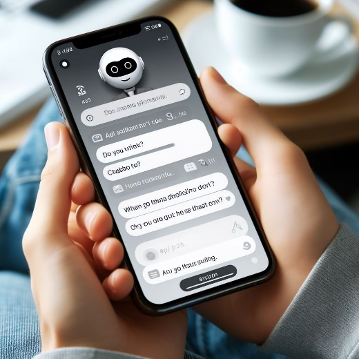

# Accessibility of gaming AI experiences 

Artificial intelligence (AI) is a rapidly evolving field that has the potential to enhance various aspects of human life, such as health, education, and productivity. The same holds true for gaming, where AI has the capability to dramatically improve experiences for gamers with disabilities, with the potential to lead to technology that benefits everyone. Accessibility refers to the design of products, services, or environments that can be used by all people, regardless of their abilities. 

This article explains why, in general, accessibility of frontends driven by AI does not differ from those that are not. It also discusses areas to pay special attention to when developing AI-driven frontends and explores situations where AI-driven backend systems may create inaccessibility in games. Finally, it discusses some of the opportunities that can greatly improve the accessibility of games through the use of artificial intelligence. 

## Setting context – what is AI? 

Artificial Intelligence, as it has historically been thought about, relied primarily on explicitly programmed rule-based systems. This is the sort of “AI” one might stumble across driving the behavior of non-player characters (NPCs) in traditional video games. However, these lacked the capability of handling complex, real-world scenarios or considering variables outside of the predefined rule set.

Over the last few years, however, AI has undergone a significant evolution. This evolution has been driven by a variety of factors, including increased computational power, availability of large data sets, and advancements in machine learning algorithms.

Now, we largely think of AI as systems such as Large Language Models (GPT, BERT), Computer Vision Models (YOLO, ResNet), and Reinforcement Learning Models (AlphaGo). These systems learn from data, are trained on it, taught to recognize patterns in said data, and generalize from the data they are trained on to make predictions on new, unseen data. 

In this article, we’ll only consider AI in this newer context, along with the accessibility implications and potential impact it brings.

## Similarities between AI and non-AI frontends in games 

AI experiences are those that involve the use of AI systems or components, such as natural language processing, computer vision, speech recognition, or machine learning. AI experiences can be delivered through various ways, including websites, mobile apps, voice assistants, chatbots, and video games. Frontends are the interfaces that allow users to interact with AI systems or components in these experiences. They are responsible for presenting the information, feedback, or functionality that the AI system or component provides. Non-AI experiences are those that do not involve the use of AI systems or components, but rather rely on conventional software development approaches despite potentially appearing to be AI like complex decision trees. Non-AI experiences can also be delivered through similar frontends.

*Figure 1 - AI chatbots often use text interfaces similar to non-AI
experiences.*

From an accessibility perspective, AI and non-AI frontends for gaming
experiences are generally similar in design and technology, and they
share the same principles, guidelines, and standards for ensuring
accessibility. For example, just as both AI and non-AI frontends should
follow the [Web Content Accessibility Guidelines
(WCAG)](https://www.w3.org/TR/WCAG22/) for web-based interfaces, AI and
non-AI frontends in games should follow guidelines such as the [Xbox
Accessibility Guidelines](https://aka.ms/xags) or [Game Accessibility
Guidelines](https://gameaccessibilityguidelines.com/). These guidelines
provide recommendations for making frontends perceivable, operable,
understandable, and robust for all users, regardless of their abilities,
preferences, or circumstances.

### Common accessibility features or best practices

Examples of common accessibility features or best practices that are found in such guidelines and apply to both AI and non-AI frontends.

* Providing alternative text for images, icons, or graphics 

* Using clear and consistent labels, headings, and navigation 

* Ensuring sufficient color contrast and font size 

* Supporting keyboard, mouse, controller, touch, or voice input and output 

* Offering multiple modalities or options for interaction 

* Allowing users to adjust or customize the interface settings 

* Testing the frontend with different devices or assistive technologies 

## Potential pitfalls in game AI frontends 

While accessibility of AI-driven game frontends generally does not differ from other, non-AI experiences, there are some specific areas where developers should pay extra attention to ensure that gamers with disabilities have the best possible experience. Some of these include: 

* Ensuring the quality, accuracy, and reliability of the AI system or component, especially when it involves complex or sensitive tasks, such as making purchases with real or in-game currencies or providing technical assistance that may be destructive (for example, suggesting the deletion of game saves, adjusting system settings, and more). 

* Providing clear and meaningful explanations, feedback, and error messages for a game’s AI systems or components, especially when they involve uncertainty, ambiguity, or unpredictability. In cases where errors occur, simple and quick recovery options are valuable. 
 
* Respecting the privacy, security, and consent of gamers, especially when the AI system or component involves collecting, processing, or sharing personal or sensitive data regarding a person’s health or disability (for example, not making a gamer’s accessibility settings known to other players, not sending inferred data regarding a player’s disability to other systems, and more). 

* Addressing the potential bias, discrimination, or exclusion of the game’s AI systems or components, especially when they involve social, cultural, or ethical implications related to disability, such as facial / skeletal recognition, player sentiment analysis, speech recognition, or game recommendation systems. 

## AI-induced inaccessibility via backend systems 

While game frontends are responsible for rendering the game’s graphics and user interface, backend systems are responsible for managing the game’s mechanics, processing user input from the frontend, and updating the game’s graphics and user interface in response to changes in game state. 

While game frontends that allow direct interaction between a player and an AI system are unlikely to experience major accessibility issues beyond any other similar frontends which do not utilize AI, there is a potential to indirectly introduce accessibility issues to the overall experience of games through their backend systems. This is especially true for gaming experiences where AI may be used to generate aspects of a game on the fly or monitor user behavior.

Here are some examples. 

* Dynamic AI-generated game content (for example, levels, maps, and more) and mechanics beyond those associated with more traditional content generation systems, such as procedural generation, might also introduce inaccessibility. AI systems rely on data to learn and make decisions. If the data used to train an AI system is biased or unrepresentative, the AI system may generate dynamic experiences in games that exclude individuals with disabilities. For example, if a game uses an AI system to dynamically generate levels or challenges based on player data, and the data used to train the AI system does not include sufficient information about players with disabilities, the AI system may generate levels or challenges that are inaccessible or unplayable for those players. For instance, an AI might generate a challenge that requires pressing many buttons simultaneously, making it difficult or impossible for someone with a fine motor disability. 

*Figure 2 - A game generating levels on demand may introduce situations
where button chords (for example, pressing "A" and "Right Trigger" to activate a
combo) are required that are inaccessible for players with limited fine
motor input.*

* AI systems designed to promote fairness in game play may accidentally flag users of assistive software or devices as cheating if they are not trained to recognize and accommodate these tools. For example, an AI system designed to detect cheating in online games may flag the use of hardware-injected macros or co-piloted game controllers submitting input faster than a human normally could as suspicious behavior, even though these tools are necessary for some players with disabilities to experience the content. 

## Addressing the accessibility of AI-driven game experiences 

It is important to adopt a user-centered, inclusive, and participatory approach to the design, development, and evaluation of game AI experiences. This means involving users with diverse abilities, preferences, and circumstances throughout the entire process of creating and testing these experiences, and ensuring that their needs, expectations, and feedback are considered. This also means collaborating with multidisciplinary teams of experts, such as gaming accessibility specialists, AI researchers, developers, designers, testers, user experience researchers, and advocates, to ensure that AI experiences in games are accessible, usable, and desirable for all players. 

Additionally, it is especially critical that AI developers work to include diverse and representative data to train their AI models, including data from individuals with different forms of disabilities impacting hearing, vision, speech, fine motor movement, cognitive processing, mental health conditions, and more. Also, developers should provide clear and transparent information as to how their AI systems operate and how they make decisions, so that users can understand and challenge any incorrect assumptions or errors. 

Finally, when testing with a diverse array of gamers from the disability community, it is important to validate game AI experiences through a variety of input modalities (for example, keyboard, mouse, controller, speech) and output modalities (for example, graphical, audio, haptic) in conjunction with different commonly used assistive technologies. These technologies may be software based, such as screen readers, screen magnifiers, and speech input systems. Assistive technologies may also be hardware based, such as adaptive controllers, switch input systems, and eye tracking systems. 

For general best practices as they relate to game accessibility, see [Xbox Accessibility Guidelines](https://aka.ms/xags).

## Opportunities for advancing the accessibility of game experiences via AI 

Beyond simply ensuring that AI gaming experiences are accessible for people with disabilities, developers are encouraged to consider how artificial intelligence has the potential to revolutionize the way video games are designed and developed, particularly when it comes to accessibility. While traditional methods and technology have made significant strides in producing game experiences that are more accessible, there are still many challenges that need to be addressed. AI can help to overcome these challenges and advance accessibility in ways that traditional methods and technology cannot. 

Some ways in which AI can be used to advance accessibility in games include: 

* Personalization: AI can be used to personalize the user experience for individuals with disabilities. For example, AI can learn about an individual’s preferences, abilities, and needs, and then adapt the interface, content, and functionality of a game or gaming-related experience such as website and application, to make it more accessible and user-friendly for the gaming and disability community. 
 
* Predictive text and speech recognition: AI can be used to improve the accuracy and reliability of predictive text and speech recognition technologies. This can help individuals with disabilities, such as those with mobility or speech disabilities, more easily interact with games and game platforms. As an example, AI can improve speech-to-text accuracy for systems designed to caption voice communications for gamers who are deaf or hard-of-hearing.

*Figure 3 - AI-driven speech recognition can enable individuals with fine motor disabilities to communicate more easily during online game text chat.*

* Image and video recognition: AI can be used to dynamically generate descriptions of in-game scenes to output through speech synthesis, making these games more accessible to individuals with vision disabilities. 

* Automated accessibility testing: AI can be used to automate the process of testing games, their related websites / applications, and more for accessibility. This can help to identify and fix accessibility issues more quickly, efficiently, and earlier in the development cycle, making these experiences more usable for individuals with disabilities. That said, it is important to note that automated accessibility testing, even with AI, cannot replace the testing performed by, and feedback garnered from, individuals with a wide array of abilities. 

* Support: AI can be used to develop advanced chatbots that provide real-time assistance to players in-game, answering queries and providing guidance when they encounter difficulties, using the player’s current state for context. This may prevent gamers from abandoning a game due to getting “stuck,” increasing their engagement with the title and (when applicable) franchise. 

Developers looking to utilize AI to address these or other barriers that gamers with disabilities face in an innovative way should engage the gaming and disability community to identify what challenges they find most vexing. Together, developers and community members can brainstorm new and innovative ways that AI may be able to address them. 

## Conclusion 

In general, accessibility of AI-driven game experiences does not differ from other, non-AI experiences, as AI frontends are generally similar in design and technology. However, there are a few pitfalls to avoid, which require a user-centered, inclusive, and participatory approach to their concept, design, development, and evaluation. Additionally, backend systems may introduce accessibility issues indirectly into games if not properly designed and validated in a similar fashion. 

Additionally, AI has the potential to advance accessibility in video games in ways that traditional methods and technology cannot. By leveraging the power of AI, we can create more personalized, user-friendly, and accessible digital entertainment experiences for individuals with disabilities. 

In summary, with thoughtful approaches to AI and accessibility, no gamer will be left behind in the AI revolution and people with disabilities will experience significant improvements in their gaming experiences. 

## Resources 

Few resources currently exist which directly address AI and the accessibility of gaming. Some of those, along with additional resources on general software AI and accessibility, can be found below: 

-   [Equal Entry \| AI for Accessibility: Opportunities and Challenges](https://equalentry.com/ai-for-accessibility-opportunities-and-challenges/)

-   [Innovation and AI for Accessibility \| Microsoft Accessibility](https://www.microsoft.com/accessibility/innovation)

-   [Microsoft \| AI Show Live -- Using AI to Make Experiences Accessible and Inclusive](/shows/ai-show/ai-show-live-using-ai-to-make-experiences-accessible-and-inclusive)

-   [Microsoft \| Using AI to empower people with disabilities](https://blogs.microsoft.com/on-the-issues/2018/05/07/using-ai-to-empower-people-with-disabilities/)

-   [Youtube \| Brannon Zahand -- Humans in AI](https://www.youtube.com/watch?v=Z0YANisVqsM&pp=ygUOYnJhbm5vbiB6YWhhbmQ%3D)

> [!NOTE]
> Some content contained within this document was generated with AI.
