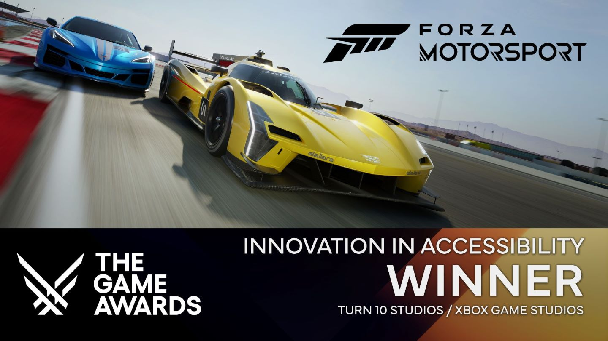

# Game Accessibility Workshop Toolkit

***“The results of inclusive design for accessibility always lead to a better product for everyone." - Phil Spencer***

The Game Accessibility Workshop Toolkit is a resource created by the Xbox Research Accessibility Team that provides developers with the tools to host their own [Game Accessibility workshops](#overview-of-game-accessibility-workshops).

The toolkit includes:
- Guidance on what to consider when setting up a Game Accessibility Workshop.
- Visual assets to use in conducting the workshop along with instructions on how to use those visual assets.
- A video recording of our introductory presentation used at the start of the workshop to give attendees an overview of why inclusive design for accessibility is important and to expose attendees to the principles of inclusive design.

## How to get the toolkit

Whether your team is just getting started on their accessibility journey or you’re looking for a way to level up your team’s accessibility goals, we encourage you to go to the [Gaming for Everyone Production Inclusion Hub](https://developer.microsoft.com/games/resources/productinclusion/accessibility/workshop) to download the toolkit.

To help us continue to improve this resource over time, let us know what you think after trying out the toolkit. We welcome all feedback.  

As you get started with the toolkit, keep in mind that it's meant to be a tool that developers can leverage to build workshops or activities that work for them. We recognize that, like players, each studio is different and will be starting from a different place and have different needs. The toolkit is not intended to be a statement on how game accessibility should be approached. Instead, the goal is to provide scaffolding from which others can build, extend, modify, or remove as needed. The toolkit was created with this flexibility in mind.

## Overview of Game Accessibility Workshops

Game Accessibility Workshops (GAWs) are aimed at evolving the way teams think about and apply inclusive design principles for accessibility during game development.

During the workshop, attendees **learn** about inclusive design and how it applies to game accessibility, first by watching our 101 presentation and then by **engaging** with players with disabilities via interviews. Next, attendees **practice** using what they’ve learned through exercises allowing them to **incorporate** insights into features for their in-development product. These exercises also provide a space for attendees to **discuss** their accessibility goals, what challenges they foresee to achieving those goals, and what resources they have to help them navigate those challenges. Through this process, attendees create a shared vision about what accessibility means to them as a group and how they can work to achieve that vision for their product. This shared vision helps guide a team’s accessibility planning and implementation throughout development, saving them time, energy, and resources, while improving the accessibility of their game.

### Impact

Game Accessibility Workshops are the cornerstone of Xbox’s approach to accessibility. From features such as Turn 10’s [blind driving assist in Forza Motorsport](https://news.xbox.com/en-us/2023/04/27/forza-motorsport-accessibility-features-blind-driving/), to Rare’s [audio aim assist in Sea of Thieves](https://support.seaofthieves.com/articles/13407523184402-Aim-Assist-Audio-An-audio-guide-to-help-visually-impaired-players-target-other-players-and-AI-when-using-guns-and-cannons#:~:text=Aim%20Assist%20Audio%20is%20a,to%20%E2%80%9CEnable%20Aim%20Assist%20Audio%E2%80%9D), to Playground Games’ [picture-in-picture ASL in Forza Horizon 5](https://www.youtube.com/watch?v=7-LqVe2PArM&ab_channel=Xbox), Xbox Game Studios have demonstrated the effectiveness of this approach year after year. Studios that have participated in accessibility workshops are more likely to achieve higher levels of success in accessible design, increasing the number of accessibility features built into their games, and being recognized for their accessibility advancements by the gaming and disability community.

With an estimated 450 million gamers with disabilities worldwide, it’s critical for the gaming industry to design games with accessibility in mind. At Xbox Research Accessibility we strive to help game developers design games and products for all gamers on the planet. If you want to hear about some of the key insights learned by our developers through our Game Accessibility Workshops, check out this [presentation from Xbox Research Accessibility at the 2024 European Game Accessibility Conference](https://youtu.be/YkHiNp3skZM?si=y56lMCOLAt8pJlTo). 

*“They have this amazing program within Xbox Research[…]They brought in individuals that had a passion for Forza with diverse play styles and experiences, including players with disabilities. Through group breakout discussions, we learned why they enjoyed Forza and how we might make our games more inclusive for them[…]That was sort of what kickstarted our accessibility leadership team, a grassroots movement in the studio to really pursue accessibility and put these features on our roadmap to shipping the game.”* - From DigiPen interview with Neha Chintala

## See also

* [Xbox Accessibility Guidelines](guidelines.md)
* [Gaming Accessibility Fundamentals Learning Path](gaf-info.md)
