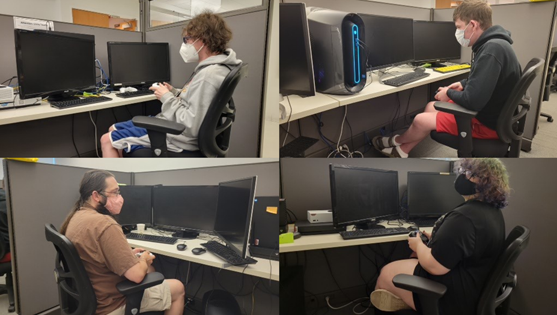
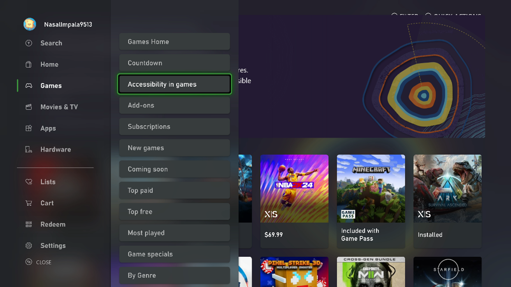
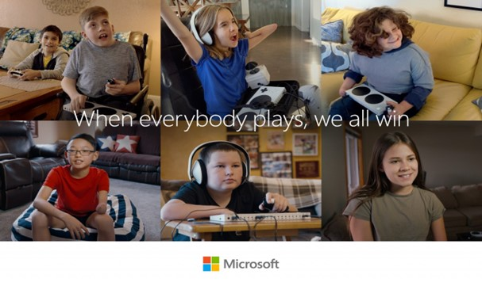

# Microsoft Gaming Accessibility Testing Service

## Overview

Passion for game accessibility has grown exponentially among developers and players alike in the past decade. Microsoft estimates that there are ~450 million players with disabilities globally, so we’re heartened to see that game developers are actively seeking out resources that guide inclusive game design to ensure that their games are fun for everyone who wants to play!  

The Microsoft Gaming Accessibility Testing Service (MGATS) is an optional program through which game developers and publishers of Xbox and PC titles can submit their products for secure, confidential accessibility testing **conducted by accessibility subject matter experts and players with disabilities**.

## About testing and reports

Testing is performed against the [Xbox Accessibility Guidelines](./guidelines.md) (XAGs). These guidelines were developed in partnership with industry experts and the Gaming & Disability Community. The XAGs can be used to generate ideas during design, serve as guardrails during development, and act as a testing checklist to help ensure games are inclusive for those with disabilities.

Each test report consists of five key elements:

- **[Accessibility Feature Tags](./accessibility-feature-tags.md) testing** – The  MGATS team will test titles against the criteria for each Accessibility Feature Tag and inform developers of which tags can be applied to their store page right away, and what options or features are necessary to qualify for even more Accessibility Feature Tags.

- **Accessibility Highlights** – Positive observations that draw attention to features within a title that already make strides toward inclusive game design.

- **Players with Disabilities Feedback** – Players with a wide array of disabilities provide feedback using both qualitative and quantitative measures of their experience. The MGATS team firmly believes that people with disabilities know what is best for them and ensures that they are a part of our process at every stage. MGATS values the ideal of “Nothing about us without us.”

- **Concerns** – Areas of the game that fail to meet the criteria outlined in the Xbox Accessibility Guidelines, recorded in each report with reproduction steps, expected results, actual results, and video / screenshot examples.

- **Resources** – A regularly updated list of additional resources developers can use to help them on their accessibility journey, including links to Gaming & Disability non-profits, industry events focusing on accessibility, assistive hardware solutions, information regarding the Twenty-First Century Communications and Video Accessibility Act, accessible game design, and more.  

Once delivered, developers and publishers have the option to review the report with an industry-recognized Microsoft gaming accessibility expert to answer any questions they may have.  

To learn how to submit your product through MGATs, contact Xbox Partner Accessibility Questions [(xpaq@microsoft.com)](mailto:xpaq@microsoft.com).

## FAQ

### Is this service only for Xbox / Windows titles? Will other platforms be supported?

Currently, Xbox and PC platforms are supported. Other platforms (like Steam) may be able to be supported on a case-by-case basis. Reach out to [xpaq@microsoft.com](mailto:xpaq@microsoft.com) for more information.

### How soon can you start testing?

Depending on test volumes, testing usually starts 1-2 business days after receiving a title.

### How long does testing take?

We endeavor to deliver reports within 7 business days of the start of testing.

### Is there a limit how many times a specific title can go through this service?

There is no limit to how many times a product can go through the testing service.

### What is the cost of the service?

The cost of MGATS testing is determined based on the complexity of a game and covers between ~ 150 to 250 hours of testing. Games with a single game mode and no multiplayer communication have a lower cost, while those with multiple game modes and/or multiplayer community have additional costs to cover test cases specific to those features. For more information on pricing, please contact [xpaq@microsoft.com](mailto:xpaq@microsoft.com).

### Interest in feedback from Players with Disabilities only?

The MGATS program also provides a smaller scale test scope: MGATS – Players with Disabilities Focus. This program focuses on gathering feedback from Players with Disabilities (PwDs) testers. It will cover PwDs personal experiences and suggestions regarding core scenarios of a game such as its golden path, settings, navigation, and in-game communication services (if any). The MGATS team employs testers with a variety of disabilities, including those related to Vision, Hearing, Speech, Mobility and Cognition. Depending on the nature of the game, the mix of PwD testers will vary.

Their comprehensive findings will include:
- impact of design elements on a player's specific disability
- reproduction steps
- suggested solutions
- annotated screenshots
- links to any associated Xbox Accessibility Guideline (XAG)

The only difference from the original MGATS is that this new offering is centered around core functional scenarios performed solely by Players with Disabilities.  The original MGATS is driven by Xbox Accessibility Guidelines performed by a mix of accessibility subject matter experts and Players with Disabilities.

### Can games be tested pre/post-release?

Microsoft encourages partners to submit their products early in the development process (ideally, once a stable, representative vertical slice is available), in order to provide the widest window for partners to address possible concerns and improve their accessibility before release. That said, testing can take place at any time before or after a title is released.

Shown Above: A visual depiction of an ideal timeline of how we envision titles to submit for an MGATS test pass and validation. The timeline also shows how if concerns are addressed during test they can result in positive sentiment, while if they are left unaddressed some players may be left out, leading to more negative sentiment.

### Does Microsoft monitor to ensure games on its platforms are accessible?

Microsoft employs a sophisticated tool to track the sentiment around titles after release and takes note of specific issues players experience in Retail. Partners will be notified if and when negative sentiment begins to accumulate. As many sentiment issues arise in the sphere of accessibility, it’s best to find and fix issues in an MGATS test pass before release to help a title make the best impression it can upon release and when customer sentiment begins to circulate.

### Do I have to fix the issues that are found during testing?

The MGATS program provides suggestions and guidelines to drive accessible game design, but does not require that these changes be implemented. Accessibility insights are organized by level of impact to help developers prioritize their accessibility updates.

### Once I have addressed a concern, will I be charged to ask for it to be validated?

After an accessibility report has been delivered, the MGATS team is happy to review a title’s changes free of charge! Upon request, a Post-Release Comparison can be performed at any time after a title’s release and will result in a new report detailing positive accessibility changes made to a title, as well as an updated list of which Accessibility Feature Tags can be applied to a title’s store page.

### Does Microsoft have any marketing channels to promote games that have accessibility features?

At this time, Microsoft provides a specific channel on the console Xbox Store to showcase titles that qualify for and have applied Accessibility Feature Tags to their store page. Our data suggests, a game in the **Accessibility in games** channel on console will gain exposure and lead to additional visitors acquiring the game! Users can even filter titles by which Accessibility feature Tags they qualify for on various Microsoft store fronts, helping connect users to the games they’ll have the most fun playing.

### Is this a replacement for Certification testing?

No. No Certification testing is done as part of MGATS.  MGATS is not part of Certification testing.  These are separate services.

### Why is Microsoft offering this service?

For more than two decades, Microsoft has been on a mission to create technology that is both accessible and inclusive of people with disabilities. We are excited to share our Gaming Accessibility learnings with the industry and to collaborate with partners like you to raise the bar for the future of gaming. For more information about Microsoft’s commitment to accessibility, visit [Accessibility Technology and Tools | Microsoft Accessibility](https://www.microsoft.com/accessibility/)

