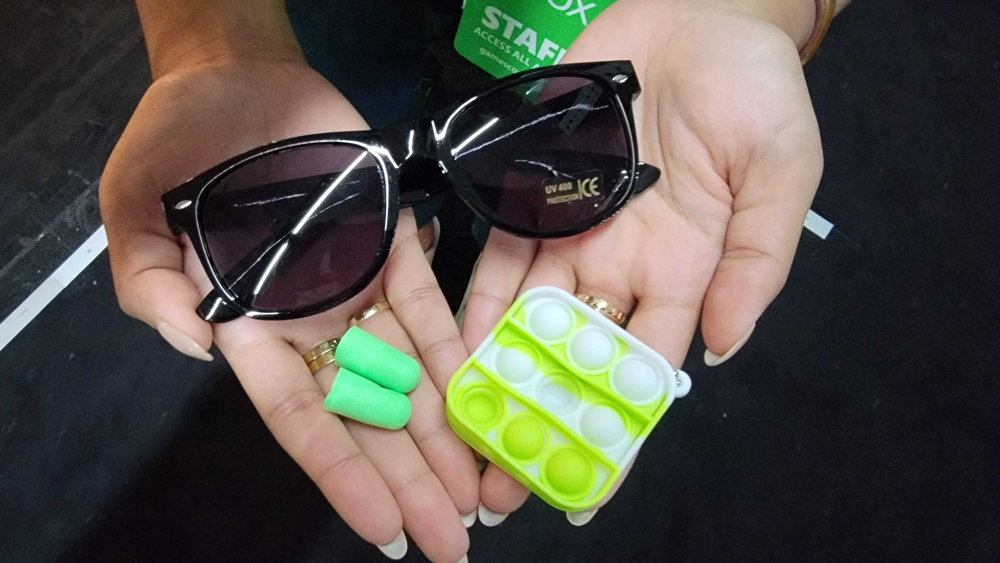

# Playbook for Accessible Gaming Events Guideline 101: Registration

Registration, whether it is before the event or day of, is the first step in your guests' journeys to experience your event. If someone is not able to register for your event, they won't be able to attend. That is why it is critical to ensure that registration materials and websites are accessible, as are registration desks and queues.

## Scoping questions

If you answer "Yes" to any of the following questions, this guideline applies to your event:

-   Do guests need to submit information to you before your event to sign up for it?
    

    
Example (expandable)
  

    > This could be in the form of purchasing a ticket, registering on a website or thru the mail, or providing information at a registration desk when a customer arrives to the event. 
    

-   On the day of your event, are guests required to sign-up or sign-in before participating?

## Implementation guidelines

Consider implementing the following guidelines for your event.

### General Registration Materials

- **Text and Fonts**

	- Use easy-to-read, non-stylized, sans-serif fonts.

	-   Avoid decorative effects such as italics.

	-   Ensure a high contrast ratio between the text color and the background it sits on (at least 4.5:1 and ideally 7:1).

	-   Do not place text over images. If you must, put an opaque box behind the text to make it easier to read.

	-   Use proper sentence case. All uppercase is acceptable for short headers.

	-   Avoid using centered or indented text. Use text justified either to the left or right, depending on the region you are in.

    

    
Example (expandable)
  

    

    > This sign uses a non-stylized, sans-serif font. No decorative effects are added. The contrast ratio between the text and the background is \~ 15:1. The text is in proper sentence case except for the short header. 
    

-   **Language**

    -   Avoid long paragraphs and use short, simple language whenever possible.

    -   Use iconography or pictograms to break up large paragraphs of text.

    -   Add standard accessibility symbols (such as the [International Symbol of Access](https://en.wikipedia.org/wiki/International_Symbol_of_Access)) to materials when appropriate to indicate accessible features of the documentation or of the event.

    -   Whenever possible, avoid the use of pronouns such as "You," and "I."

    -   Avoid the use of hyphens to break apart text as it can make reading difficult.

-   **Accessibility Options**

    -   Ensure information is available that describes what sorts of major accessibility accommodations will be available at your event, such as sign language interpretation, closed captions, audio descriptions, sensory processing aids, quiet rooms, elevators, accessible bathrooms, etc.

-   **Accommodations / Dietary Restrictions**

    -   Provide a way for participants to indicate whether they need accessibility accommodations or dietary restrictions, and what those specific requests are.

    -   Once accommodation requests have been received, communicate back to guests acknowledging that you have received their request and follow-up if you have any questions.

    

    
Example (expandable)
  

    > A guest states that they, “Need an aid (a person to assist them) for the event.” Write back and ask whether they will be bringing their own aid, if they are looking for an event-provided aid, or both.
    

 
### Printed Materials
- **Paper**
	-   Avoid using glossy paper (such as that found in magazines) or standard white printing paper which may cause glare for those using magnification tools. Use a matte finish instead.

    -   Ensure paper is thick enough that text from one side cannot be seen when flipped to the other side, and vice versa.

    -   Use standard 8.5 x 11-inch paper (or regional equivalents) or larger, ensuring documents are not so large as to become unwieldy.

-   **Text and Fonts**

    -   Use a font size between 16 and 18-point.

    -   Use 1" margins.

-   **Returns**

    -   Materials that need to be returned, such as registration forms, should be accompanied by a (ideally) pre-paid, self-addressed envelope.

    -   When possible, an alternative way of registering should be provided, such as a website, email address, or phone number.

### Online Websites

-   **Web Content Accessibility Guidelines**

    -   Registration websites should meet [WCAG 2.1 AA](https://www.w3.org/TR/WCAG21/)
            standards.

-   **Alternative Methods**

    -   If possible, an alternative method of registering should be provided, such as an email address or phone number.

### Registration Desks

-   **Kiosks**

    -   Kiosk interfaces should meet [WCAG 2.1 AA](https://www.w3.org/TR/WCAG21/) standards.

    -   Screen narration should be enabled on the kiosk and headphone jacks should be present to connect to. Headphones should be available on request.

    -   A USB port to plug a physical keyboard or brailler into should be present and physical keyboards should be available upon request. (A large print keyboard is recommended.)

    -   Dedicated staff should be present to assist registrants with use of the kiosk and providing headphones, keyboards, etc.

    -   An alternative method to utilizing a kiosk to register should be made available.

-   **Desks**

    -   Ensure desks can be rolled up to and under by wheelchairs.

    -   Have staff available to help those with disabilities interact with anything on the desk, including picking up and putting on their credentials.

-   **Lines**

    -   Have a separate line and check-in station for people with disabilities. If that is not possible, have staff walking the registration line looking for gamers with disabilities who might be having difficulties standing in line for long times. If noticed, offer to advance people through the line.

    -   If outdoors, ensure lines are shaded and that water is available for those waiting.

    -   Ensure stanchions, barricades or other barriers designed to keep people in line are wide enough (ideally 48+ inches) for large power chairs to move through.

    -   Provide water bowls for service dogs and a designated relief area. (Owners are responsible for cleanup.)

    -   Provide both visual and auditory information and cues with instructions on how to proceed through the queue.

-   **Signage and Aids**

    -   Ensure signs are posted that describe what sorts of major accessibility accommodations will be available at your event, such as sign language interpretation, closed captions, audio descriptions, sensory processing aids, quiet rooms, etc.

    

    
Example (expandable)
  

    

    > The signs above announce some of many accessibility accommodations available at this booth. Iconography, as well as large, sans-serif text is used to improve guests ability to notice and understand this signage.
    

	-   Ensure sensory processing aids (ear plugs, fidgets, dark glasses, etc.) are available at registration upon request.

    

    
Example (expandable)
  

    

    > Dark glasses, ear plugs, and a "Pop It" fidget toy shown available upon customer request.
    

-   **Pre-Registration Information**

    -   Ensure that registration staff have information on the accommodation requests and dietary needs expressed by attendees and the plans in place to fulfill those requests so the staff can confirm these with guests.

## Resources and tools

Article | [Accessible Registration \| uark.edu](https://accessibility.uark.edu/event-planning/accessible-registration.php)

Article | [Best Practices: Accessible Voter Registration (PDF) \| eac.gov](https://www.eac.gov/sites/default/files/bestpractices/Accessibility_Checklist_Voter_Registration.pdf)

Article | [The Ultimate Guide to Creating an Accessible Registration and Event: For Multiple Disability Types \| purplepass.com](https://www.purplepass.com/blog/the-ultimate-guide-to-creating-an-accessible-registration-and-event-for-multiple-disability-types/)

Website | [Web Content Accessibility Guidelines (WCAG) 2.1 \| w3.org](https://www.w3.org/TR/WCAG21/)