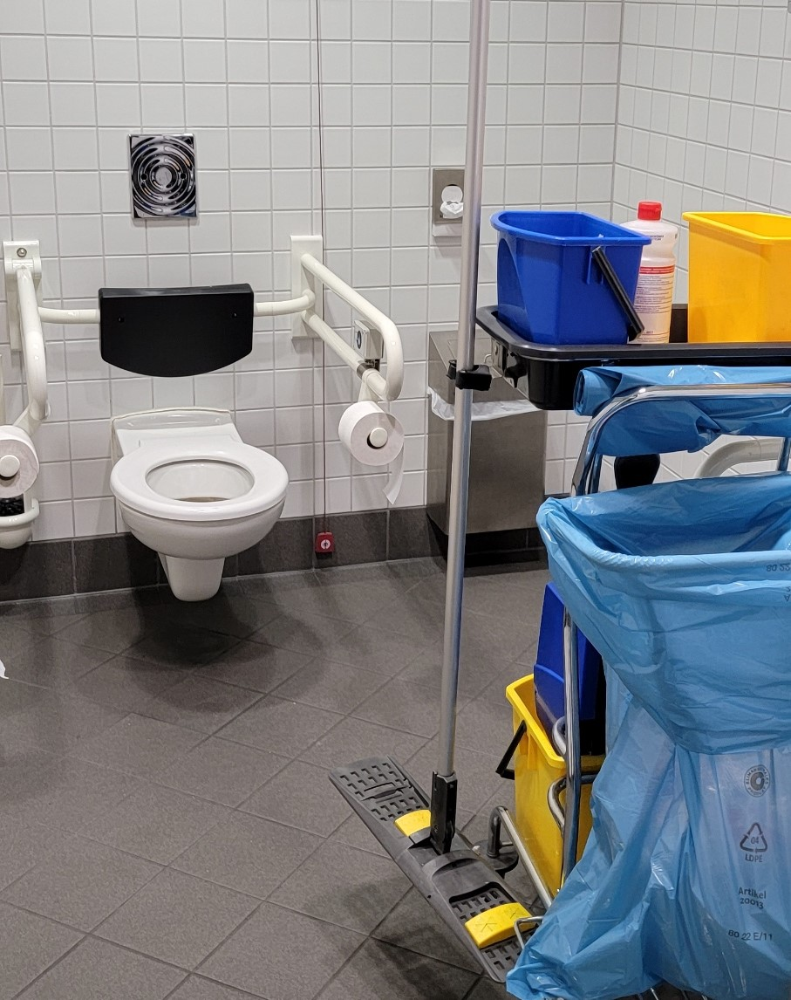

# Playbook for Accessible Gaming Events Guideline 102: Venues

The lack of accessibility at a venue can completely undo any other
accessibility work you've put in. When people with disabilities are
unable to enter or navigate your venue, they are unable to experience
anything else at your event. That is why it is critical that, when
planning your event, you do research up front to ensure that you pick a
venue that is accessible.

It is important not to make assumptions about the accessibility of a
venue. Just because a venue is newer, for instance, doesn't mean it is
necessarily accessible.

***Important Note:** The following guideline is intended as a quick way
to review venues for accessibility. However, this guidance isn't
intended to meet any local, state, or national laws or
regulations. These laws are quite specific, so it is
important to ask a potential venue if they meet these requirements and
if they have documentation proving so.*

## Scoping questions

If you answer "Yes" to any of the following questions, this guideline
applies to your event:

-   Does your event have a physical presence that guests will visit
    in-person?

## Implementation guidelines

Consider implementing the following guidelines for your event.

### Signage

-   **General Guidelines:**

	-   Ensure a non-glare finish and high contrast ratio (ideally
            7:1) between foreground text and the background.

	-   Use large text without serifs.

	-   Position signage at least 48 inches from the ground but no
            more than 60 inches.

	-   Whenever possible, add Braille, tactile elements, and
            (optionally) QR codes.

-   **Identification Signage:** These are signs that identify or
        direct to certain rooms, spaces, or features in public
        accommodations for people with disabilities. In addition to the
        general guidelines:

	-   Use all uppercase letters.

	-   Use raised text.

	-   Add Braille.

-   **Directional and Informational Signage:** Inaccessible
        entrances, elevators and restrooms must have directional signage
        indicating the location of the nearest accessible entrance,
        elevator, or restroom. In addition to the general guidelines:

	-   Use simple arrows and pictograms when possible.

### Doors

-   **Automatic Doors:**

    -   Entrances and exits should have automatic doors.

-   **Width:**

    -   Doors should be between 32 inches and 48 inches in width (it
            is better to err on the side of wider doors).

-   **Maneuvering Clearances:**

    -   There should be plenty of room for a large power chair to be
            able to turn in a hallway or other space to navigate through
            a door.

    -   It is recommended there be at least a 60-inch (perpendicular
            to the door) by 90-inch (parallel to the door) space to
            navigate immediately on each side of the door.

-   **Thresholds:**

    -   Door thresholds should not be higher than 1.5 inches.

### Elevators, Lifts, and Ramps

-   **Availability:**

    -   Anywhere that is accessible to guests should be accessible
            without needing to navigate a step greater than ½ inch or
            stairs. This includes stages.

    -   In cases where such steps exist, an elevator, lift, or
            accessible ramp with railings designed for people with
            disabilities should allow ingress / egress.

-   **Ramp Slope / Width:**

    -   Ramps should have a slope of no greater than 8.3% and be at
            least 48" wide.

-   **Functionality:**

    -   All elevators and lifts should be tested prior to an event
            as well as daily in the mornings before the event opens to
            ensure they function properly.

### Bathrooms

-   **Amenities:**

    -   Bathrooms should have stalls with wide entrances and
            handrails and space for a large turning radius in front of
            the toilet.

    -   At least one urinal should be lower to the ground.

    -   Bathroom sinks should be able to be rolled up to by a
            wheelchair.

    -   Bathrooms should be free of obstacles that hinder access to
            the facilities.

    

    
Example (expandable)
  

     

    > A cleaning cart has been stored in a single-person
                    stall dedicated to individuals with disabilities. It
                    prevents users in large wheelchairs from reaching the
                    toilet. 
    

	-   Ideally, a bathroom will also be on site that offers an adult-sized
    changing table.

-   **Gender:**

    -   Accessible bathrooms should be available for anyone, regardless
        of gender.

### Floor Plans

-   **Pathways:**

    -   Ensure there is enough space in hallways and between other
            obstacles for large powerchairs to navigate easily.

    -   Ensure there are no obstacles that someone might trip over
            or run into.

-   **Surfaces:**

    -   Ensure that flooring is a hard surface (e.g., wood). If
            carpeting is present, ensure it is low pile.

-   **Platforms:**

    -   Avoid floor plans with platforms or other small rises
            requiring a step. This is especially important if you are
            putting in your own flooring on top of the existing flooring
            at an event. (Example: Many booths at conventions put in
            their own, raised flooring that requires someone to step up
            to.) If such steps exist, ensure accessible ramps are
            available.

-   **Water:**

    -   Ensure water fountains of multiple heights are available as
            well as (ideally) bottle refilling stations.

### Lighting

-   **Brightness:**

    -   Lighting in the venue should be bright enough to ensure that
            walkways, ramps, stairs, and other obstacles can be seen.
            This includes preventing shadows that could cause someone
            with a visual disability difficulty when navigating the
            space or avoiding obstacles.

    -   Lighting shouldn't be so bright that it hurts eyes or causes
            glare.

### Seating

-   **Quantity:**

    -   For venues with designated ADA Seating, confirm that you
            will have enough seating for everyone who has registered.

    -   Many individuals with disabilities may have guests with them
            that will want to sit with them. In general, a good rule of
            thumb is to ensure you have two-to-three times the amount of
            ADA seating available based on requests for accommodations.

-   **Prioritization:**

    -   Accessible seating should prioritize guests.

    -   Generally speaking, accessible seating should be close to
            the main attraction being viewed with an unobstructed view.

    -   Seating should have a clear and easy-to-see view of ASL
            interpreters as well as screens displaying closed captions.

### Audio

-   **Quiet Space:**

    -   The venue should offer an area away from any loud noises or
            visual effects where people with sensory processing disorder
            can seek refuge.

    -   Quiet spaces should have signage denoting them as such.

    -   Signage should explain that the room should only be used for
            those with sensory processing needs (not meetings, taking
            cell phone calls, etc.) and kept quiet (no talking,
            listening to music through speakers, etc.).

    

    
Example (expandable)
  

    

    > The sign above clearly sets expectations for the quiet
                room, alerting users that they should not take phone
                calls, listen to music without headphones, and avoiding
                conversations. 
    

## Resources and tools

Website | [The Americans with Disabilities Act \| ADA.gov](https://www.ada.gov/)

Article | [Making events accessible: Choosing a venue \|
SCIE](https://www.scie.org.uk/co-production/supporting/making-events-accessible/choosing-a-venue)

Article | [Seattle Finance & Administrative Services -- Accessible Venue
Assessment Checklist (PDF) \|
seattle.gov](https://www.seattle.gov/documents/Departments/RSJI/Shape-of-Trust/ADA-Accessible-Venue-Checklist-August-2021-City-of-Seattle-Finance-Administrative-Services.pdf)

Article | [Selecting an Accessible Venue \|
vera.org](https://www.vera.org/downloads/publications/selecting-an-accessible-venue-updated.pdf)