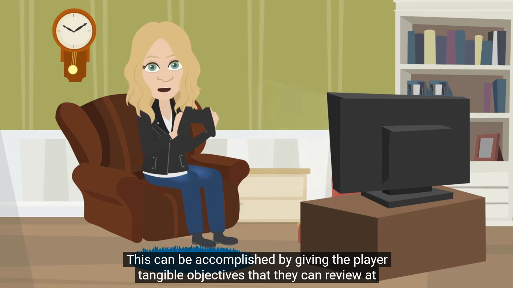

# Playbook for Accessible Gaming Events Guideline 103: Social Media

Most events will have some form of announcement and/or updates planned
for social media. Social media can be a fantastic way to educate your
guests on the accessibility of your event. But a lack of accessibility
in your social media posts may cause frustration or even lead to
people being unable to find information on / register for your event.

Thankfully, with just a few steps, you can ensure your social media will
be accessible to all potential guests.

## Scoping questions

If you answer "Yes" to any of the following questions, this guideline
applies to your event:

-   Do you plan on announcing your event via social media?

-   Do you plan on keeping guests updated on event information via
    social media?

-   Do you plan on providing social media updates as the event
    progresses?

-   Do you plan on providing some form of wrap-up for or celebration of
    your event on social media once it has concluded?

## Implementation guidelines

Consider implementing the following guidelines for your event.

### Images

-   **Alt-text**
     -   Ensure that any images posted have clear and concise
            alt-text.

    -   If an image is posted with text in it, ensure that all text
            in the image is included in the alt-text.

### Videos

-   **Closed Captions**

    -   Ensure video materials with any speaking, sound effects,
            and/or music have an option for closed captions. If the
            platform you are posting on doesn't give users the ability
            to turn captions on/off, burn the captions directly into the
            video.

    

    
Example (expandable)
  

    

    > The above screen capture from a video has closed captions that can be
                    turned on/off. The captions are in proper sentence
                    case and accurate.
    

 
    -   If using open captions (sometimes referred to as "burning
            in" captions), ensure that a large font size is used, the
            font is sans serif, that there is an opaque background
            behind the text, and that the color contrast ratio between
            the foreground color of the text and the opaque background
            is at least 7:1.

    -   Use proper sentence case for closed captions.

    -   Do not rely on automatically generated captions.

    -   Validate all captions before posting.

### Audio Description

- **Audio Described Content**
	-   Ensure video materials with any action that is not already
            described as part of the narration include audio
            descriptions or that links are provided to audio-described
            versions.

	-   Use simple, concise descriptions.

	-   Use complete, natural language sentences.

	-   Identify who is speaking.

	-   Identify the location / scene.

	-   Validate all audio descriptions before posting.

### Photosensitivity

- **Videos**
   -   Ensure your videos are free of flickering, rapid flashes, red flashes, and alternating patterns of different colors.

   -   Ensure your videos are free of stripes of contrasting colors.

### Information

-   **Accommodations**

    -   Ahead of the event, use social media to describe what sorts
            of major accessibility accommodations will be available at
            your event, such as sign language interpretation, closed
            captions, audio descriptions, sensory processing aids, quiet
            rooms, etc.

	

    
Example (expandable)
  

    ![An Xbox Wire Post which reads, "Xbox remains committed to the belief that gaming should be safe, inclusive, and accessible for all. We're ensuring that all areas of the booth are wheelchair accessible and Xbox Adaptive Controllers will be available upon request,
       as well as select demo stations with adjustable height desks. We will also have multiple American Sign Language (ASL) and German Sign Language (DGS) interpreters and "Here to Help" staff to assist players of all abilities. Additionally, we'll have sensory
       aids and a quiet room for anyone who needs them."](../../images/gaming-accessibility/social-media-example.png)

    > An article announcing Xbox's presence at gamescom
                    has information on the accommodations that will be
                    available at the event.
    

## Resources and tools

Article | [Adding an audio description to your videos \|
gov.uk](https://gcs.civilservice.gov.uk/guidance/digital-communication/accessible-communications/adding-an-audio-description-to-your-videos/#:~:text=When%20writing%20audio%20descriptions%20you%20should%3A%201%20write,style%20and%20tone%20of%20the%20content%20More%20items)

Tool | [Cambridge Research Systems Ltd \|
hardingfpa.com](https://www.hardingfpa.com/)

Article | [Everything you need to know to write effective alt text \|
microsoft.com](https://support.microsoft.com/en-us/office/everything-you-need-to-know-to-write-effective-alt-text-df98f884-ca3d-456c-807b-1a1fa82f5dc2)

Article | [Photosensitivity and Seizures \|
epilepsy.com](https://www.epilepsy.com/what-is-epilepsy/seizure-triggers/photosensitivity)

Article | [Photosensitive epilepsy and image safety \|
sciencedirect.com](https://www.sciencedirect.com/science/article/abs/pii/S0003687008001282?via%3Dihub)

Article | [Social Media Platform Guides \|
ucdavis.edu](https://marketingtoolbox.sf.ucdavis.edu/departments/social-media/platform-best-practices)

Article | [The Ultimate Guide to Audio Description \|
3playmedia.com](https://www.3playmedia.com/learn/popular-topics/audio-description/)

Article | [Xbox Accessibility Guideline 118 - Photosensitivity \|
microsoft.com](../xbox-accessibility-guidelines/118.md)