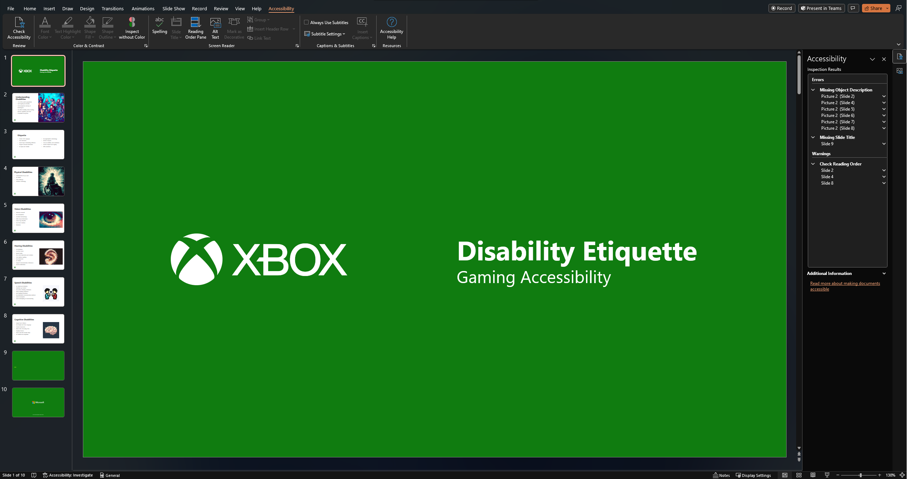
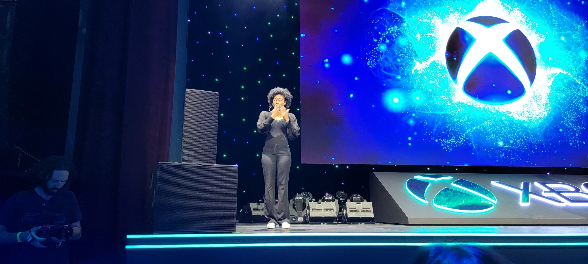

# Playbook for Accessible Gaming Events Guideline 105: Speakers, Videos, and Presentation

Many events will choose to include live speakers, videos, and/or
presentations to inform and entertain guests. Ensuring that guests can
learn from and enjoy this content requires ensuring that such content is
made accessible for those with a variety of disabilities.

## Scoping questions

If you answer "Yes" to any of the following questions, this guideline
applies to your event:

-   Will your event have any sort of presenter (off-the cuff, on stage,
    on screen)?

-   Will your event have any PowerPoint presentations?

-   Will your event have any video content?

## Implementation guidelines

Consider implementing the following guidelines for your event.

### Speakers

-   **Presentation Style**

    -   Have speakers speak slowly and clearly.

    -   Avoid the use of acronyms and idioms.

    -   Use simple, direct language.

    -   Describe visuals on slides or other presentation materials.

-   **Interpreters and Captions**

    -   Provide Sign Language Interpreters that are on stage
            and on an easy-to-see video feed from seating
            reserved for those with disabilities. The interpreter should
            show up on the same screen as any slides and/or video content
            (including video of the speaker).

    -   Provide hand-transcribed closed captions or, in a worst-case
            scenario, auto captions on a screen that is easy to view
            from seating reserved for those with disabilities. (The
            captions should show up on the same screen as any slides and/or video content
            (including video of the speaker).

### PowerPoint Presentations

-   **Before the Presentation**

    -   Provide a link to a downloadable version of your PowerPoint
            presentation before the presentation starts.

-   **Creating the Presentation**

    -   Include alternative text with all visuals.

    -   Add meaningful and accurate hyperlink text and ScreenTips.

    -   Ensure that color is not the only means of conveying
            information.

    -   Give every slide a unique title.

    -   If you must use tables, create a simple table structure for
            data only, and specify column header information.

    -   Make sure slide contents can be read in the order that you
            intend.

    -   Make videos accessible to people who have a vision or
            hearing disability by ensuring they have audio descriptions
            and closed captions.

    -   Use a larger font size (18pt or larger), sans serif fonts,
            and sufficient white space.

    -   Use sufficient contrast for text and background colors.

    -   Use tools to check the accessibility of the presentation
            before presenting or sending out.

    

    
Example (expandable)
  

    

    > In this image, a user is working on a slide deck in PowerPoint and has run the built-in accessibility checking tool. The tool identifies a number of issues for the user to correct.
    

### Videos

-   **Signed Languages**

    -   Ensure video materials with any spoken audio have an option to
            be viewed with in-line Sign Language Interpreters.

    -   For live events, whenever possible, ensure video of sign
            language interpreters is on the same screen or very close to
            the main screen on a secondary monitor.

    

    
Example (expandable)
  

    

    > An American Sign Language (ASL) interpreter stands on stage, close to the
                    main screen, at an Xbox event.
    

-   **Closed Captions**

    -   Ensure video materials with any speaking, sound effects, and/or
        music have an option for closed captions. If the platform you
        are posting on doesn't give users the ability to turn captions
        on/off, burn the captions directly into the video.

    -   If using open captions (sometimes referred to as "burning in"
        captions), ensure that a large font size is used, the font is
        sans serif, that there is an opaque background behind the text,
        and that the color contrast ratio between the foreground color
        of the text and the opaque background is at least 7:1.

    -   Do not rely on automatically generated captions.

    -   Validate all captions before posting.

-   **Audio Description**

    -   Ensure an open-loop system with headphones is available for
        audio description for customers with low/no vision. (Hearing loops, 
        or induction loops, are a type of assistive listening system that transmit sound directly to 
        a listener’s hearing aids or cochlear implants.) Avoid asking users to listen to a second audio 
        stream with descriptions on their own devices, as there will often be significant lag that
        can cause cognitive dissonance.

    -   Ensure video materials with any action that is not already
        described as part of the narration include audio descriptions or
        that links are provided to audio-described versions.

    -   Use simple, concise descriptions.

    -   Use complete, natural language sentences.

    -   Identify who is speaking.

    -   Identify the location / scene.

    -   Validate all audio descriptions before posting.

-   **Volume**

    -   Avoid using overly loud audio, even for content such as game
        demos and music. While louder may be perceived as better by
        some, more often than not audio is too loud and can cause
        problems for people with hearing loss (making it harder to hear
        other things around them) and those who are neurodiverse
        (causing sensory processing issues).

-   **Photosensitivity**

    -   Ensure your videos are free of flickering, rapid flashes,
        flashes of red, and alternating patterns of different colors.

    -   Ensure your videos are free of stripes of contrasting colors.

## Resources and tools

Article | [A Guide to Understanding Hearing Loops (PDF) \| hearingloss.org](https://www.hearingloss.org/wp-content/uploads/HLAA_GITHL_Hearing_Loops_Guide.pdf)

Article | [Creating content for everyone \|
microsoft.com](https://query.prod.cms.rt.microsoft.com/cms/api/am/binary/RE4Y2lz)

Article | [Make your PowerPoint presentations accessible to people with
disabilities \|
microsoft.com](https://support.microsoft.com/en-us/office/make-your-powerpoint-presentations-accessible-to-people-with-disabilities-6f7772b2-2f33-4bd2-8ca7-dae3b2b3ef25#:~:text=Create%20accessible%20slides%201%20Use%20an%20accessible%20presentation,for%20inclusive%20reading%20order%2C%20colors%2C%20and%20more%20)

Article | [Making Audio and Video Media Accessible \|
w3.org](https://www.w3.org/WAI/media/av/)

Article | [Making Events Accessible - Checklist for meetings, conferences,
training, and presentations that are remote/virtual, in-person, or
hybrid \|
w3.org](https://www.w3.org/WAI/teach-advocate/accessible-presentations/)