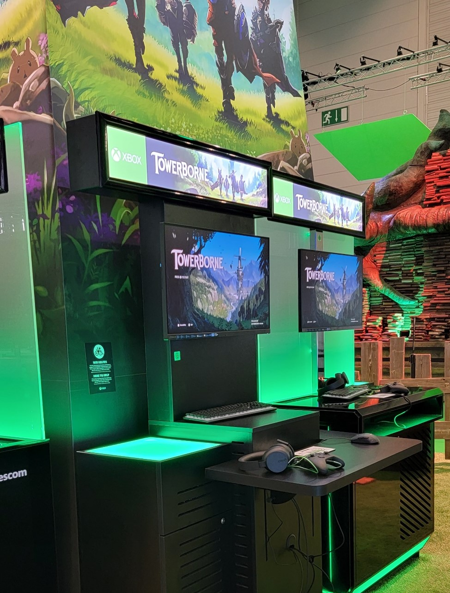
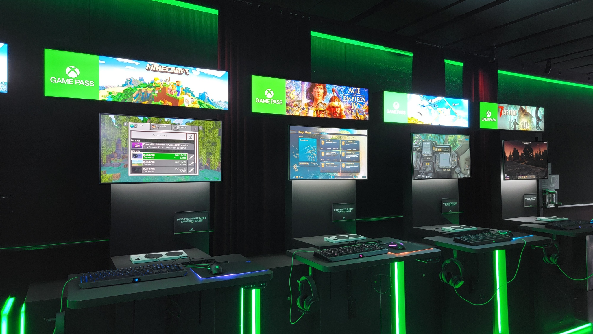

# Playbook for Accessible Gaming Events Guideline 107: Game Demo Stations

Many gaming events will use demo stations to showcase game experiences,
whether they are pre- or post-release. These stations tend to attract a
lot of attention, so ensuring that they are accessible means ensuring
guests will have a good time experiencing the gaming content your teams
have worked so hard on.

## Scoping questions

If you answer "Yes" to any of the following questions, this guideline
applies to your event:

-   Does your event have demo stations or kiosks where attendees can play games?

## Implementation guidelines

Consider implementing the following guidelines for your event.

### Monitors

-   **Height**

    -   Monitors should be adjustable height, ideally being able to
            shift as low as 48 inches from the ground and as high as 72.

-   **Angle**

    -   Monitors should be able to tilt, ideally at a 30-degree
            angle from the center, up and down.

-   **Brightness**

    -   Monitors should be able to easily have their brightness
            adjusted.

### Tables

-   **Height**

    -   Tables upon which controllers and other materials sit should
            be adjustable in height (like a sit/stand desk) on the fly,
            so wheelchairs may roll up to and under them. They should be
            able to raise to as high as \~48 inches and lower as low as
            \~28 inches.

    

    
Example (expandable)
  

    

    > The demo station on the left has an adjustable desk that raises or lowers with the press of a button.
    

-   **Sturdy**

    -   Tables should be sturdy enough to have someone of
            substantial weight use them to support themselves.

-   **Color / Contrast**

    -   Tables should stand out such that they can be easily seen in
            a darker room to avoid customers running into them or
            tripping.

###  Cleanliness

-   **Wipes**

    -   Tables should have sanitizing wipes to clean stations before
            and after use.
    -   A receptacle should be provided to collect used wipes.

    -   Staff should be available to help monitor stations and wipe
            them as needed.

-   **Hand Sanitizer**

    -   Each table should have hand sanitizer available, ideally in
            an automatic dispensing unit.

### Controllers

-   **Standard controllers**

    -   Each station should have a minimum of two controllers for
            guests who wish to copilot two controllers together.

    -   Controllers should have long cables to reach at least 3 feet
            from the edge of the table upon which they sit.

-   **Adaptive controllers**

    -   Each station should have an adaptive controller present at
            it. In cases where this is not possible, stations should
            have cables available to quickly connect an Adaptive
            Controller if needed.

    

    
Example (expandable)
  

    

    > The game stations below each have an Xbox Adaptive Controller connected.
    

    -   A wide variety of additional buttons, switches, and
            joysticks to connect to Adaptive Controllers should be in an
            easily available area for staff when an adaptive setup is
            required.

    -   Buttons should have Velcro backing and be accompanied by
            lapboards that the buttons can be stuck to.

### Accessibility Info

-   **Title-Specific**

    -   Stations should have QR codes with short-URLs and braille
            underneath that, when scanned / entered in a browser, take
            the gamer to accessibility information on the demo. Note
            that it does not need to be final information; just what
            settings are contained in the demo. It is recommended to use
            short URLs so you can redirect them for different pages and
            reuse the signs, since printing braille can be expensive.

### Seating

-   **Chairs**

    -   Providing seating or having easy access to folding chairs
            can be helpful for gamers who have difficulty standing for
            extended periods of time.

## Resources and tools

None currently.
