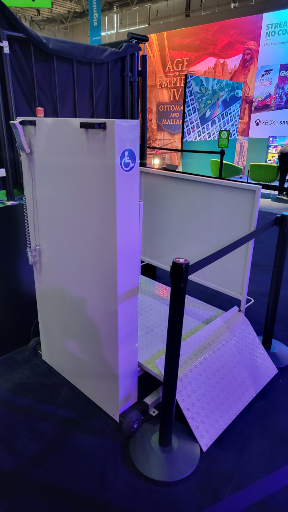
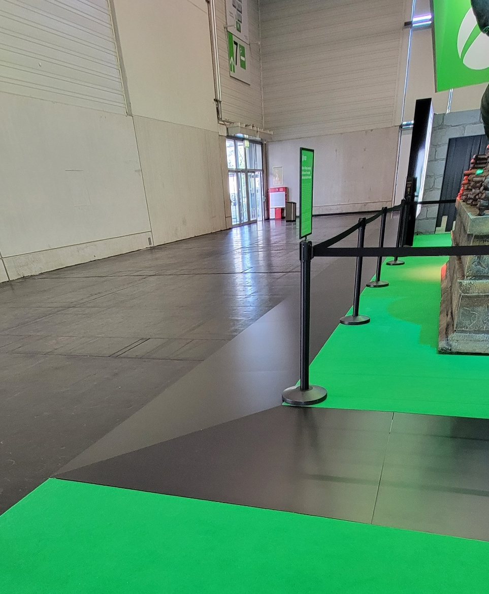
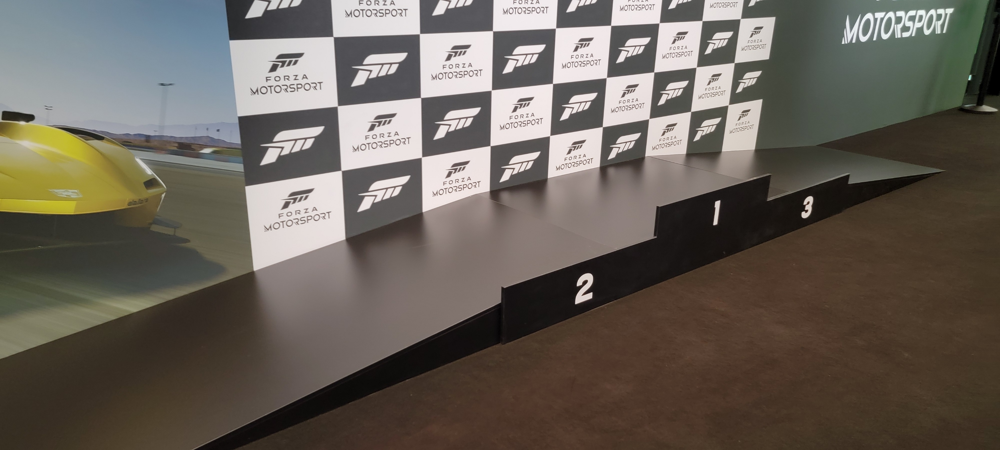
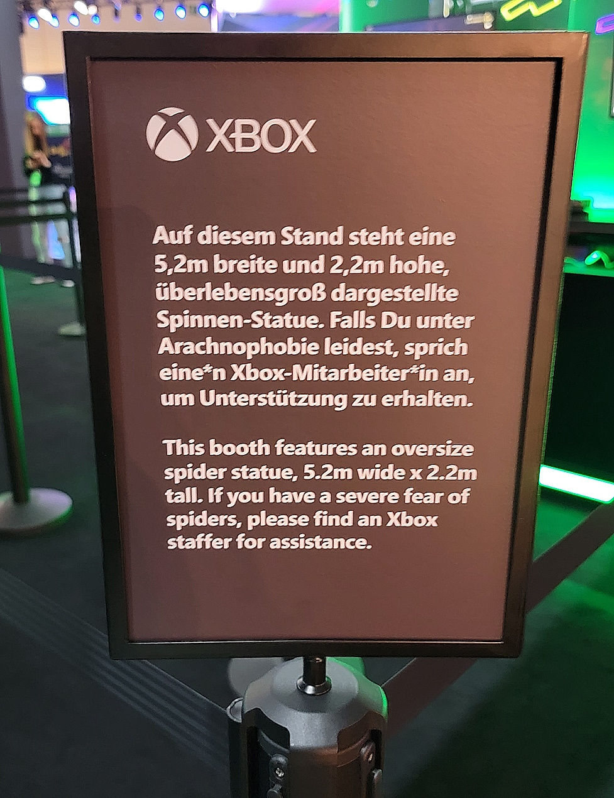

# Playbook for Accessible Gaming Events Guideline 108: Attractions and Activations

With so many various types of attractions and activations possible at an
event, it can be difficult to imagine all the ways one might make them
all accessible. However, by keeping gamers with disabilities in mind
early in your concept and design phase, you can help ensure these
activities are inclusive for a wide range of gamers with disabilities.

Think about people from the vision, hearing, speech,
neurodiversity, and fine motor disability groups. How will members from
those groups interact with your experience?

## Scoping questions

If you answer "Yes" to any of the following questions, this guideline
applies to your event:

-   Do you have attractions and activations like photo booths, games of
    skill, games of chance, body art, claw machines, or other similar
    activities at your event?

## Implementation guidelines

Consider implementing the following guidelines for your event.

### General Guidelines

-   **Queues**

    -   Ensure queues are wide enough for people in large power
            chairs to move through.

    -   Ensure there are no tripping hazards or blocking obstacles
            on the floor or hanging from the walls / ceiling.

-   **Flooring / Ramps**

    -   Ensure flooring is a hard surface or low-pile carpet.

    -   Attractions and activations should be accessible without
            needing to navigate a step greater than ½ inch or stairs. In
            cases where such steps exist, an accessible ramp is ideal
            or, for multiple steps, a wheelchair lift.

    

    
Example (expandable)
  

    

    > This stage has a wheelchair lift for those who require it. The wheelchair lift was put in place despite no planned guests requiring it, just in case there was a last-minute change of plans.
   
    

    > In this photo, ramps wrap-around the entire booth, meaning that guests with mobility needs can enter anywhere. Additionally, this removes potential tripping hazards that some standalone ramps create.
   
    
   
    >Photo stations often require individuals to step up onto a platform. This winners podium photo op has had ramps added to it so everyone can enjoy it.
   
    

    -   Ramps should have a slope of no greater than 8.3% and be at least
        48" wide.

    -   Lifts, when used, should be tested prior to an event as well as
        daily in the mornings before the event opens to ensure they
        function properly.

-   **Staff**

    -   Have staff available at the front and end of queues to bring
            gamers with disabilities who can't wait in line due to a
            lack of endurance or other reasons to the front.

-   **Prizes**

    -   For gamers who are unable to interact with an activation or
            activity that gives prizes, provide an alternative option to
            win those prizes such as a prize wheel that can be spun by
            the guest or staff member (if necessary).

### Cleanliness

-   **Wipes**

    -   Tables should have sanitizing wipes to clean stations before
            and after use.

    -   A receptacle should be provided to collect used wipes.

    -   Staff should be available to help monitor stations and wipe
            them as needed.

-   **Hand Sanitizer**

    -   Each table should have hand sanitizer available, ideally in
            an automatic dispensing unit.

-   **Cosmetics**

    -   Some activations involve body/face painting, temporary
            tattoos, etc. Any time anything touches a body, it should be
            able to be sanitized before touching another person's skin.

    -   A list of ingredients for any cosmetics used should be
            available upon request.

    -   For cosmetics applied by air gun, have N95 masks available
            for those who may be susceptible to any fumes/vapors.

    -   Avoid any cosmetics that have scent added to them.

    -   Clean the area of skin thoroughly with an alcohol wipe
            before applying cosmetics.

### Audio and Special Effects

-   **Volume**

    -   Avoid using overly loud audio, even for content such as game
            demos and music. While louder may be perceived as better by
            some, more often than not audio is too loud and can cause
            problems for people with hearing loss (making it harder to
            hear other things around them) and those who are
            neurodiverse (causing sensory processing issues).

-   **Photosensitivity**

    -   Ensure your lighting effects are free of flickering, rapid
            flashes, flashes of red, and alternating patterns of
            different colors.

-   **Special Effects**

    -   Avoid the use of fog machines or other devices that emit
            fumes or odors.

### Content

-   **Triggering Content**

    -   When possible, avoid attractions with triggering content
            such as gore, sexual violence, violence against children,
            drowning, spiders, etc. If you do end up having this
            content, ensure it is obscured from general view and
            requires individuals to intentionally seek it out.

    -   If you have triggering content, post warnings to prepare
            guests for it.
    
    

    
Example (expandable)
  

    

    > This sign warns users that there is a very large spider exhibit in the booth and encourage guests to contact staff if they have concerns.
    

    
## Resources and tools

None currently.

