# Xbox Accessibility Guideline 101: Text display

## Goal

The goal of this Xbox Accessibility Guideline (XAG) is to ensure that text readability is optimized for all players, including players with low vision. This can be achieved by displaying text at minimum default sizes and spacings and providing configurable style and color options.

## Overview

There are approximately 2.9 billion people in the world with some degree of low vision. The term *low vision* can refer to a broad spectrum of visual disabilities, including blurriness of content (even with glasses or contacts) or conditions that make a person’s view darker, cloudy, or incomplete.  

There are also situational circumstances that can make text hard to read, such as playing on a screen that's far away or playing on a small mobile screen. Sometimes when players are in a situation in which their TV volume should be muted, or conversely, when their environment is very noisy, they rely on on screen text to obtain information that they can't hear.  

If a player can't read menu text, they might be excluded before they can even enter the gameplay experience itself.  

Key information in a game can also be expressed via text-based methods that, when inaccessible, block a player from experiencing a game to its fullest. This can include experiences like non-player communications expressed via text, heads up display (HUD) elements, written on screen objectives or instructions, and communications with other players via text chat.  

## Scoping questions

Is the ability to read text a requirement in your game?  

- Are the navigable menus in your game text-based?  

- Is text displayed on screen during game play?  

    - In the HUD?  

    - Objectives or instructions written on screen?  

    - Waypoints, markers, or other hints that are text-based?  

    - Written communications from non-player characters?  

- Does your game provide players the option to communicate with one another?  

    - Text chat?  

    - Chat wheels?  

    - Alternative communication methods like speech-to-text and text-to-speech features?  

## Background and foundational information

**What is text display?**

Text display is made up of several aspects, including:  

- **Size:** How large or small can the player adjust the text size?  

- **Face:** Can the player make text bold, italic, or light?  

- **Weight:** Can the player increase the thickness of text?  

- **Style:** Can the player choose different font types?  

- **Spacing:** Can the player adjust the spacing between letters and words?  

- **Alignment:** Can the player adjust the horizontal alignment of text?  

- **Case:** Can the player choose the case in which they want sentences presented?  

- **Color:** Is the color of the text visible against its background? For more information, see [XAG 102](./102.md): contrast for detailed information on accessible text color.  

> [!NOTE]  
> The best approach to ensuring that text is accessible for as many players as possible is by providing players with choices to configure the UI to best address their needs.  

**Measuring text size**

Getting an accurate measurement of font size is critical when assessing your work against the XAGs minimum font size guidelines. One way to measure font size is using Microsoft Paint along with the following instructions:

1. Capture an image of the text within your game you’d like to measure.
2. Start the Paint application and import your screenshot.

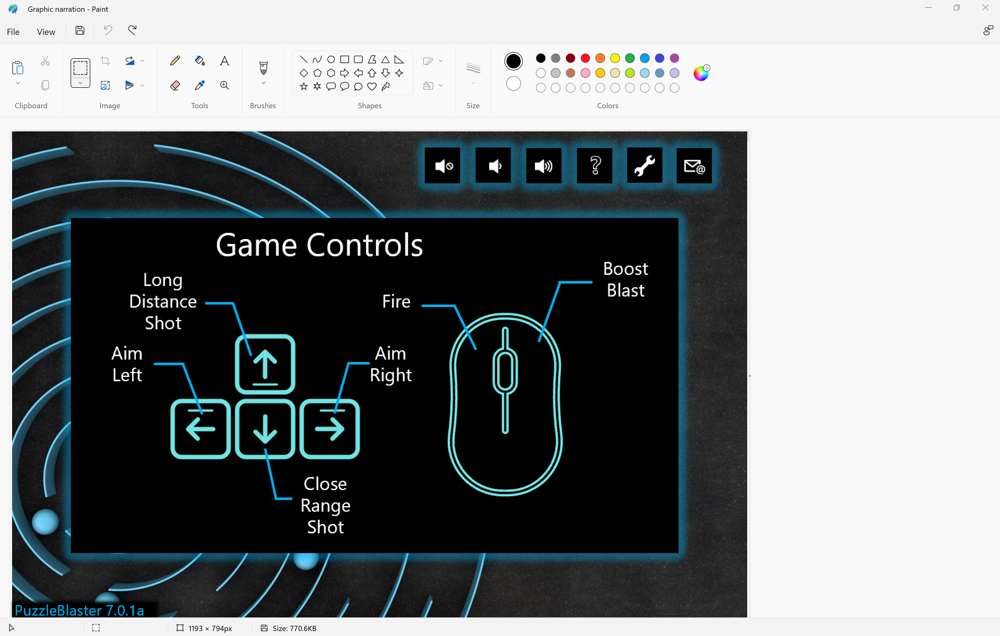

3. Locate a word or sentence within the screenshot containing the lowest visible descender and highest ascender.

![Four letters typed on a line with labels. Capital H and lowercase f, g, and h all sit on a line called the baseline. The lowercase g's bottom tail is dipping lower than the other letters and its lower tip is labeled the descender height. Lowercase h is the tallest and its height is labeled as the ascender height. The top of the capital H is labeled the cap height. The height from the bottom of capital H and lowercase f and h to the top of the lowercase f's horizontal bar and the top of the h's hump is labeled the x-height. ](../../images/gaming-accessibility/xheight_chart.png)

- **Ascender:** The upward vertical stem on some lowercase letters, such as “h” and “b”, that extends above the x-height.
- **Descender:** The portion of some lowercase letters, such as “g” and “y”, that extends or descends below the baseline.
- **Baseline:** the baseline is the imaginary line upon which a line of text rests.

4. Select a starting point, then using the Select tool, skim the whole word/sentence to find the highest points within the given text. Use those higher points for your highest ascending variable. This is further described in the following text.

Take note of any pixels on the outer edges of the text that differ in color from the primary text color. This commonly occurs when text has a colored outline. In the previous image, the text is white and sits on a gray background. The text, however, has a black outline around it, resulting in the pixels surrounding the text, including the pixels near the highest points of the ascenders, and lowest points of the descenders, appearing gray.

When determining which pixels should be included in your height measurement, the following rules can be applied:

- If the contrast ratio of the pixel in question to the background color is higher than 2:1, it can be included in the ascender or descender measurement.

- If the contrast ratio of the pixel in question is lower than 2:1, it should not be included as part of the ascender or descender area.

5. Next, using the Select tool, draw a box from the highest ascender to the lowest descender.

The pixel ratio will be listed in the lower left-hand corner. The pixel height (or 66 x 30px (the second number being the pixel height)) is considered the text size. In the following example image, 30px is the font size.

## Key areas where accessible text display is important

- Text in menu screens:  

    

    
Example (expandable)

    Text display should be accessible across all menu screens and UI elements. This includes all labels, sub-labels, descriptor text, or interaction prompts.

    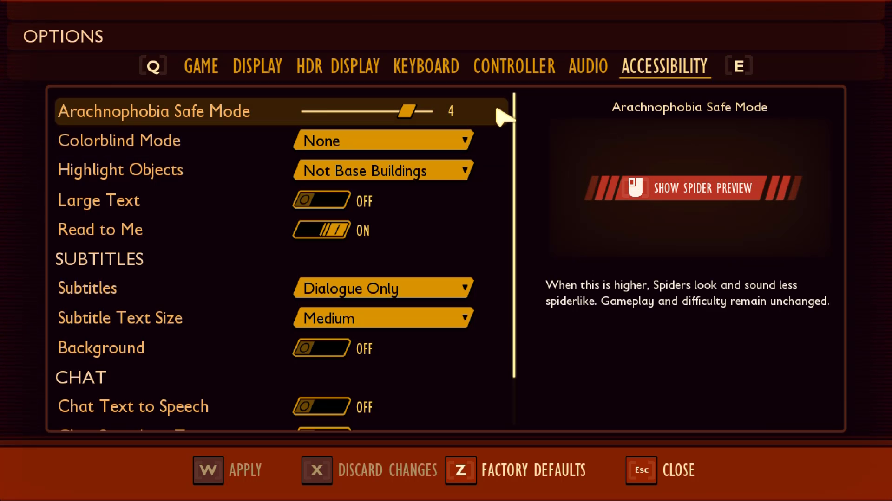

    > In Grounded, text on menu screens is accessible in that it meets contrast ratios and minimum default font sizes.  
    
    

- Text in gameplay environments:  

    

    
Example (expandable)

    Text that appears during the gameplay experience should also be accessible by default or configurable. This can include elements like the HUD meter, instructional cues, or inventory navigation keys.

    

    > In Fenyx Immortals Rising, text within the gameplay environment contains a black outline to increase visibility, regardless of the color of elements behind the text. 
    

- Text in chat windows (input field text, placeholder text):  

    

    
Example (expandable)

    The ability to read the "Type Your Message Here" string cues players that they have an opportunity to communicate with players and where to do so. After a message is typed, accessible text provides the player the ability to re-read their message before pressing the send button. Text in these scenarios should also be accessible.  

    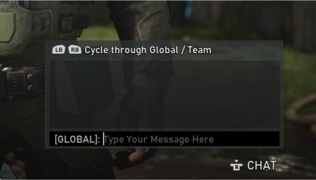

    > In Gears 5, players can use party chat boxes to type messages to others in their lobby.  

    

- Text in chat windows (sent and received messages):  

    

    
Example (expandable)

    Chat boxes and windows are also important. If a player can't read what others in the party chat are saying, they might be excluded from key gameplay experiences.  

    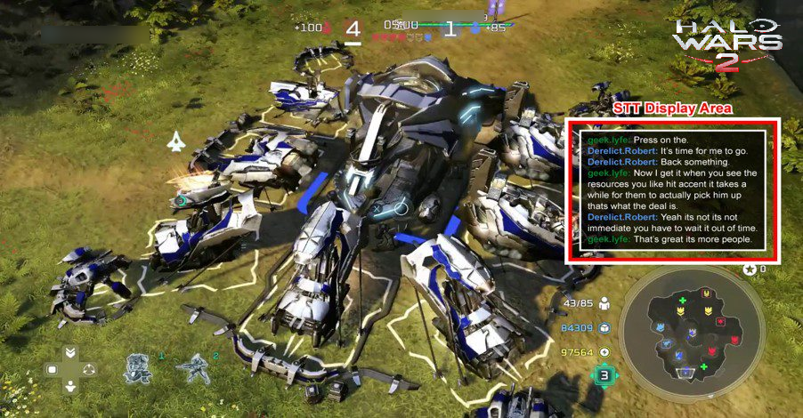  

    > In Halo Wars 2, players can enable speech-to-text (STT) so that any spoken conversations are transcribed into text in the STT display area as previously shown.  
    

 
- Chat&mdash;chat wheel text:  

    

    
Example (expandable)

    *Chat wheel*, also known as *communication wheel*, is an important in-game interface tool for communication. For some, selecting text messages by using the chat wheel is more accessible than typing text messages. If a player can't read the text in a chat wheel, they might be unable to communicate with others.  

    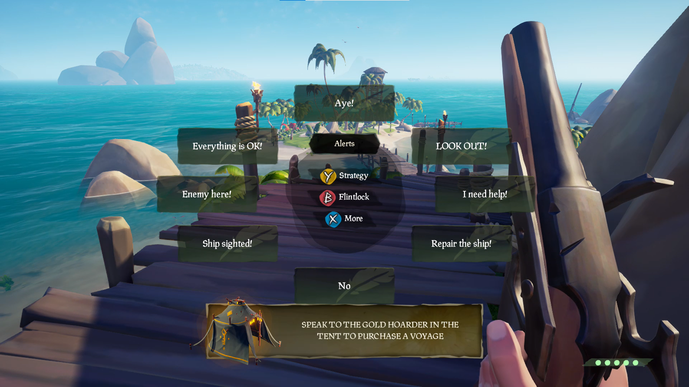

    > In Sea of Thieves, players can use their chat wheel to communicate with others.  

    

- Text for subtitles and captions:  

    

    
Example (expandable)

    If the text display for subtitles and captions is unreadable by a player, key components of the game’s story line or information regarding objectives might be missed.  

    

    > In Gears 5, players can enable subtitles to display character dialogue being spoken aloud. This text should also be accessible, to ensure that players can read it.  

    

- Text within error messages, toasts, and other notifications:  

    

    
Example (expandable)

    Any adjustable text settings, such as increasing size, weight, and contrast, should carry over to all important text&mdash;this includes additional windows that overlay a UI, especially when key information like error messages are being displayed.  

    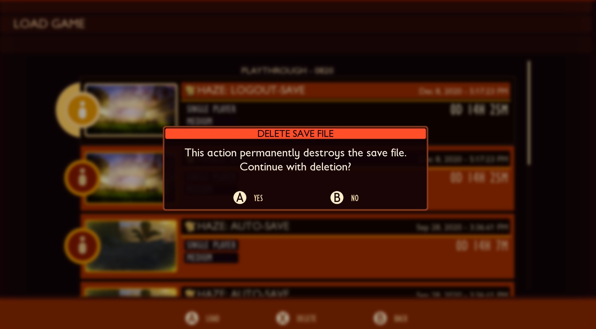

    > In Grounded, an error dialog box overlays the screen. The text in error messages and other pop-up notifications should be accessible, to ensure that players can read it.  

    

- Text on loading screens that provide valuable information:  

    

    
Example (expandable)

    Loading screens often provide information that's valuable to a player&mdash;like gameplay "tips" or information on other game modes. While ensuring that this text is accessible can be more of an "advanced best practice," it's still important to think about all aspects of gameplay.  

    

    > In Minecraft Dungeons, loading screens contain text that tells the player the area on the map that they're traveling to.  
 
    

## Implementation guidelines
 
### Text size  

The following pixel measurements are based on body height, which is the sum of the number of pixels in the descender space, the x-height space, and the ascender space.  

Example (expandable)

> [!NOTE]  
> The following sizes represent the minimum default size that text should be upon game launch for each experience. Developers are encouraged to consider individual player scenarios, for example the typical distance from couch to television, and provide players the option to scale larger or smaller at the player’s discretion accordingly. The following sections include more information on text scaling guidelines.

- **Console:** Font size should equal or exceed:  

    - 26 px at 1080p  

    - 52 px at 4K  

- **PC/VR:** Font size should equal or exceed:  

    - 18 px at 1080p  

    - 36 px at 4K  

- **Mobile/Xbox Game Streaming:**\**  

    - 18 px at 100 DPI  

    - 36 px at 200 DPI  

    - 72 px at 400 DPI  

    - Scale linearly as DPI increases  

**Because mobile devices have much higher DPIs than most TVs or PC displays, comparably sized text requires a greater number of pixels. For context, a 5.5" screen with a 1080p resolution is roughly 400 DPI.  

> [!NOTE]
> Platform-provided screen magnification tools aren't an appropriate mitigation for small text size.  

### Icons and glyph sizes  

- The text contained inside icons and glyphs should also meet the minimum default text size as previously defined for console/PC/VR or mobility/Xbox Game Streaming experiences.

    

    
Example (expandable)

    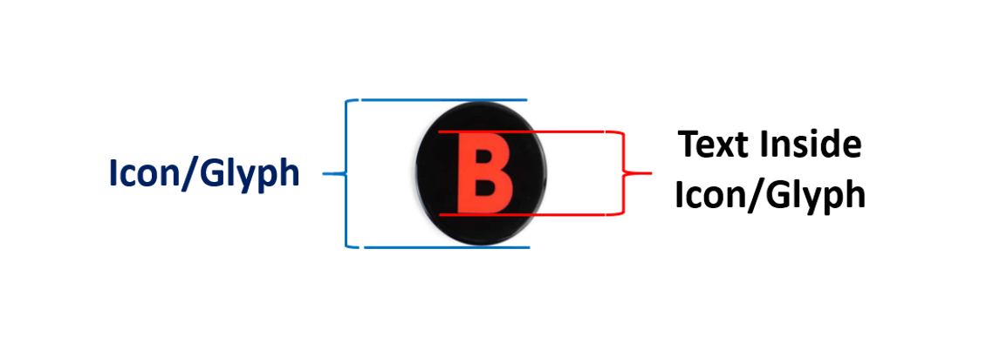

    

- Icons/glyphs should also scale with text scaling up to 200 percent of the minimum default size.

> [!NOTE]
> To ensure glyphs and icons fit within text containers, you may need to increase the size of the text surrounding glyphs and icons.
> 

> 
Example (expandable)

>
> 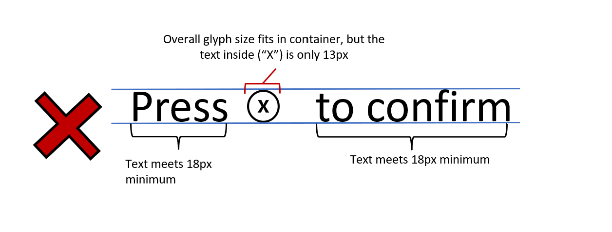
>
> 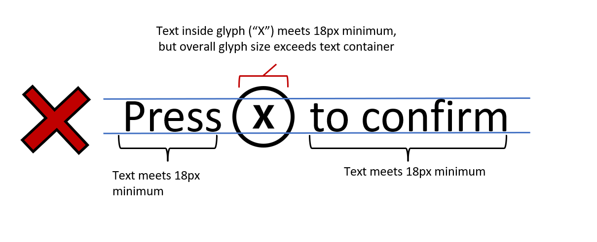
>
> 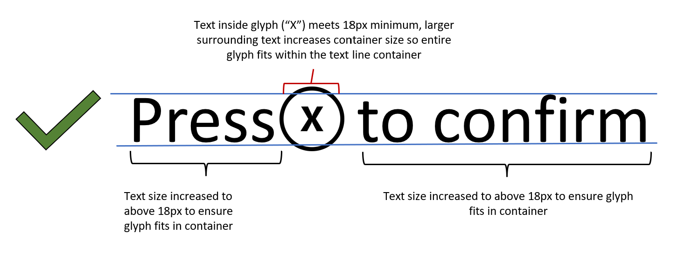
>
> 

### Text scaling  

- Players should be able to resize text up to 200 percent of the minimum font sizes (as previously listed), without the loss of content, functionality, or meaning. As an example, console text at 1080p should be able to be scaled from 26 px to 52 px at 1080p. 

    - Large header text should still be visually differentiated from the body when text is scaled.  

    - Text that scales beyond the visible screen should have a method to be read (scrolling text, text pop-up windows, or appropriate abbreviations).  

    - When text is scaled, the player isn't required to scroll both horizontally and vertically to read text within a single UI. (Scrolling in one direction is OK.)  

    - It's acceptable to allow text to be scaled down (made smaller) than the default minimums as previously shown at the user’s discretion.  

### Font style  

- Include at least one sans serif type-face option.

    

    
Example (expandable)

    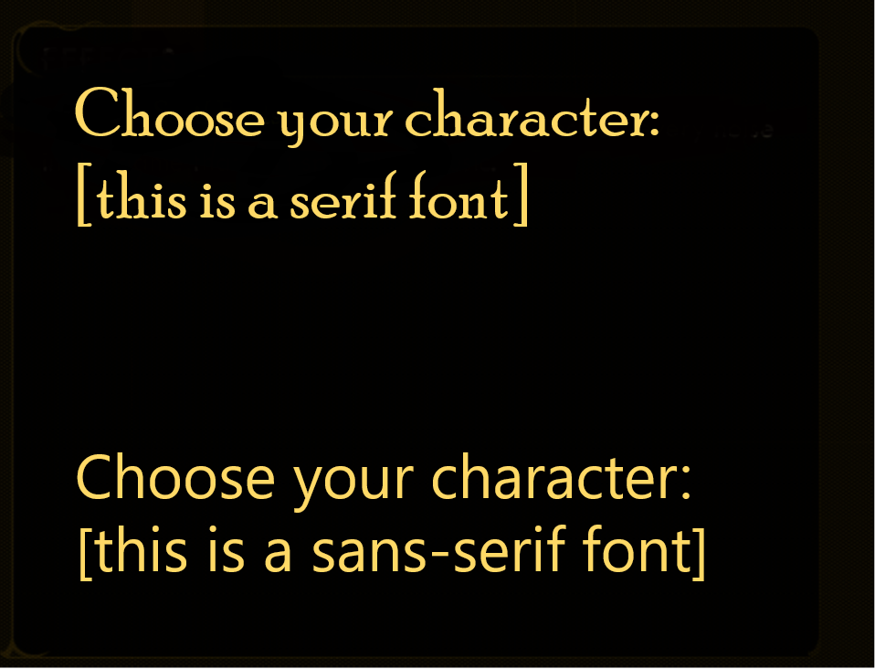

    

- If stylistic fonts are used (for example, blood dripping off font), provide a non-stylized font option.

- Ensure that all fonts include complete character sets for all supported languages.  

### Text spacing  

Greater spacing between letters, words, or paragraph lines can increase text clarity, because the reader can more easily identify separations between words. Configurable spacing can also assist players who are using text scaling or larger font sizes.  

- For blocks of text that are more than two lines, use the following for when set to the standard font size.  
    - Players should have the option to configure their own line width, line spacing, paragraph spacing, letter spacing, or word spacing.  

    - If players aren't provided with these configurability options, the minimum suggested guidelines are as follows.  

        - **Line width:** The line width shouldn't be more than 80 characters or glyphs (or 40 if Chinese/Japanese/Korean)&mdash;or players can adjust the text to meet this requirement. It should be measured when text is resized to 100 percent and doesn't include spaces in the character count.  

        - **Line spacing:** Line spacing (leading) in blocks of text should be at least a space-and-a-half (1.5) within paragraphs&mdash;or players can adjust the text to meet this requirement.  

          Line spacing is measured from the ascender of the first line of text to the ascender of the second line of text.  

        - **Paragraph spacing:** Paragraph spacing is at least 2 times larger than the line spacing&mdash;or players can adjust the text to meet this requirement.  

        - **Letter spacing:** The space between letters is at least 0.12 times larger than the font size.  

        - **Word spacing:** The space between words is at least 0.16 times larger than the font size.  

            

            
Example (expandable)

            

            > This capture from PuzzleBlaster has visual indicators that define where line spacing, line width, and paragraph spacing measurements can be taken.

            

### Text case and alignment

- **Font case:** Provide the ability to display text in proper sentence case rather than in full caps or full lowercase (if used).  

    > [!NOTE]  
    > This requirement refers to lines of text. A one- or two-word label is exempt from this guideline.  

- **Alignment:** Text is left/right-aligned based on the player language preference (not centered or fully justified)&mdash;or players can adjust the text to meet these guidelines.  

## Potential player impact 
The guidelines in this XAG can help reduce barriers for the following players.

Player | Impacted
:------- | :-------:
Players with low vision | **X**
Players with little or no color perception | **X**
Players without hearing | **X**
Players with limited hearing | **X**
Players with cognitive or learning disabilities | **X**
Other: players who are reading text on a small screen, sitting far away from the screen, on a screen with glare, or on a low-contrast display | **X**

## Resources and tools

Resource type | Link to source
:--- | :---
Article | [Clear Text (external)](https://accessible.games/accessible-player-experiences/access-patterns/clear-text/)
Article | [Distinguish This From That (external)](https://accessible.games/accessible-player-experiences/access-patterns/distinguish-this-from-that/)
Article | [Allow the font size to be adjusted (external)](http://gameaccessibilityguidelines.com/allow-the-font-size-to-be-adjusted/)
Article | [Provide a choice of text colour, low/high contrast as a minimum (external)](http://gameaccessibilityguidelines.com/provide-a-choice-of-text-colour-lowhigh-contrast-choice-as-a-minimum)
Article | [Use simple clear text formatting (external)](http://gameaccessibilityguidelines.com/use-simple-clear-text-formatting/)
Microsoft Game Development Kit API | [XGameStreamingGetStreamPhysicalDimensions](https://developer.microsoft.com/games/xbox/docs/gdk/Xgamestreaminggetstreamphysicaldimensions) (This link require sign-in credentials provided by an NDA Xbox program.)
