# Xbox Accessibility Guideline 102: Contrast

## Goal

The goal of this Xbox Accessibility Guideline (XAG) is to provide enough contrast between visual elements and their backgrounds so that these elements can be interpreted by gamers with low vision.  

## Overview

There are approximately 2.9 billion people in the world with low vision. Default settings in a game can often result in UI elements that don't have strong contrasts against their background, making it difficult for players with low vision, or players with color vision deficiencies, to perceive and use these elements.  

A contrast ratio is the difference in luminance values between the foreground and background of an element. Support for contrast configurability can be used as a tool by gamers with disabilities to help increase the visibility of elements on screen against their background. Typically, the "stronger" the contrast ratio, the greater the visibility of an element. If a player is unable to perceive a visual element because of low contrast and visibility, they might be excluded from aspects of gameplay that require the ability to understand or use that element. This can ultimately result in exclusion from gameplay altogether. For example, consider a mini-map on screen that provides information critical to gameplay but doesn't have strong enough contrast between its elements and their backgrounds to be visible to a player. They might now be unable to navigate to their next objective, identify where enemies or checkpoints are present, or perform other critical tasks that are informed by the mini-map.

## Scoping questions

Are important visual elements in your game visible against their background?  

  - Text and its background color in menu UIs?  

  - The color of heads up display (HUD) elements against their background (like health meters, text, and mini-map elements)?  

  - Key gameplay elements against their background (for example, targeting icons are gray and should be discerned against a generally dark game environment background)?  

## Background and foundational information

### Contrast and vision

Maintaining strong contrast ratios between visual elements and their background increases the visibility of these elements for players with low vision. Here are some examples of contrast ratios between text colors and their backgrounds for context. Additionally, this example provides a simulation of how text with low contrast ratios can be more difficult to read if a player has a type of low vision that affects clarity or is in a situational impairment such as playing in direct sunlight or at a distance. Note that with decreased sharpness, text with a strong contrast ratio is much more visible than text with a weak contrast ratio.  

It's also important to note that players with cognitive disabilities, such as difficulty reading, might find text in high contrast user interfaces difficult to perceive. While high-contrast experiences should at a minimum be supported, options for configurable contrast helps ensure that the needs of more gamers can be met.

### Key areas where accessible contrast ratios are important

It's important to ensure that text and visual elements maintain strong contrast ratios against their background throughout all contexts of the game experience. Here are suggestions for key areas to assess.  

#### Text elements  

For a more detailed overview of where important text elements are frequently found in games, see [XAG 101: Text display](.\101.md).

- Text in menu UIs  

- Text that appears on screen during active game play  

- Text in party chat windows (input field text, placeholder text, sent and received messages text)  

- Text for subtitles and captions  

- Text on loading screens that provide valuable information  

- Text on error messages, toast messages, or other title-specific notifications  

#### Non-text visual elements

- Visual cues:
  

  
Example (expandable)

  Non-text visual elements in gameplay like targeting icons, or "halo" effects that relay directional information to the player regarding where they're being shot from, are also areas that are commonly difficult to see without strong contrast.  

  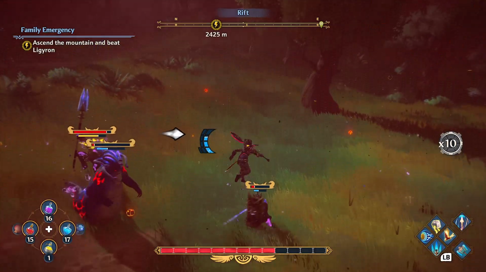

  > Fenyx Immortals Rising uses a white directional arrow with a black outline to visually notify players of an incoming attack and the direction the attack is coming from.

  > [!NOTE]
  > The use of red and green for targeting icons or other important elements can cause difficulty for players with certain types of colorblindness. For more guidance about colorblind accessibility best practices, see [XAG 103: Additional channels for visual and audio cues](./103.md).  

  

- On screen HUD elements such as health meters, directional cues, and map elements:
  

  
Example (expandable)

  Health meters, bonus meters, and on screen objectives also provide important information to players. These elements should also be explored when assessing contrast.

  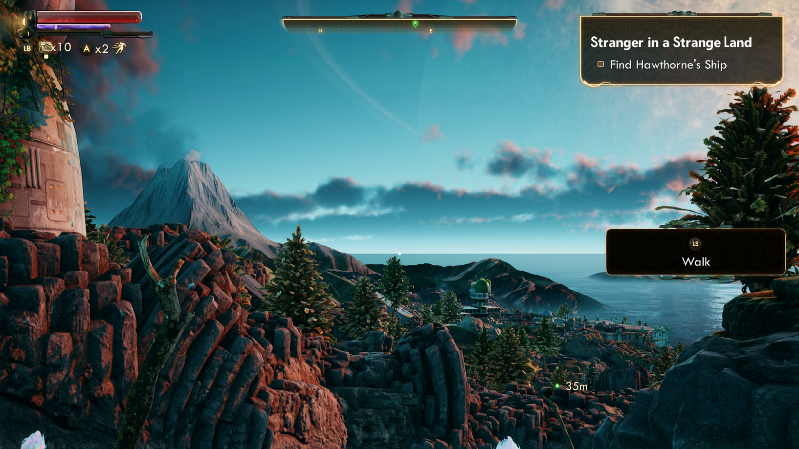

  > In The Outer Worlds, the white outline around the bright red and purple meters, as well as the bright yellow text against the opaque backgrounds of HUD elements, increase visibility.

  

- Buttons, sliders, and other controls:
  

  
Example (expandable)

  Many games have mini-maps on the peripherals of a screen to assist players. Elements of these maps are often difficult to distinguish visually and would benefit from strong contrast ratios between the elements and their background. Similarly, regardless of size, all maps that provide key information for gameplay, text symbols, and other elements that appear on the map screen should also have strong contrast.

  

  > In Forza Horizon 4, map elements have a solid yellow fill underneath a black outline and black text to enhance contrast and visibility of these elements against the rest of the map.  

  

- Symbols or glyphs:  
  

  
Example (expandable)

  It's important for a player to clearly distinguish a slider or button from its background. Slider-type elements are frequently used in accessibility settings menus such as adjusting volumes or text scales.

  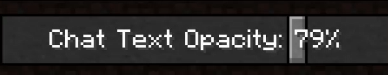

  > In Minecraft, the slider tabs are light gray with a black outline, which is visible against the dark gray background. The white "Chat Text Opacity: 79%" text also maintains high contrast ratios against both the overall background of the slider, as well as the slider itself.

  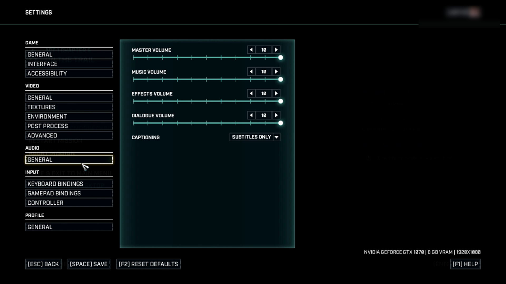

  > In Gears Tactics, the circular slider tab is a bright glowing white circle that maintains high contrast against the dark blue to black gradient of the background.

  
  If symbols, glyphs, or images convey important information to a player, it's important that these elements are easily distinguished against their background.  

  

  > In this example from For Honor, the symbols inside the team shields are presented against a solid background. The white outline ensures that the symbols remain visible against dark backgrounds (like the orange swords symbol against the dark wall) while the black outline ensures that the symbols remain visible against light backgrounds (like the blue castle symbol against the light castle background).

  

- Characters and platforms:
  

  
Example (expandable)

  Outlining characters or other key gameplay elements is helpful for increasing the contrast ratio of the elements against their background. The color used for the outline should also be configurable or provide a strong contrast against all backgrounds they appear against by default.

  

  > In Eagle Island, players can choose to dim their backdrop in the settings menu. When dimmed to 100 percent, the backdrop goes from a forest setting to a solid black backdrop. Additionally, players can "outline characters" and "outline platforms." This adds a white outline around these elements, further increasing contrast and visibility.  

  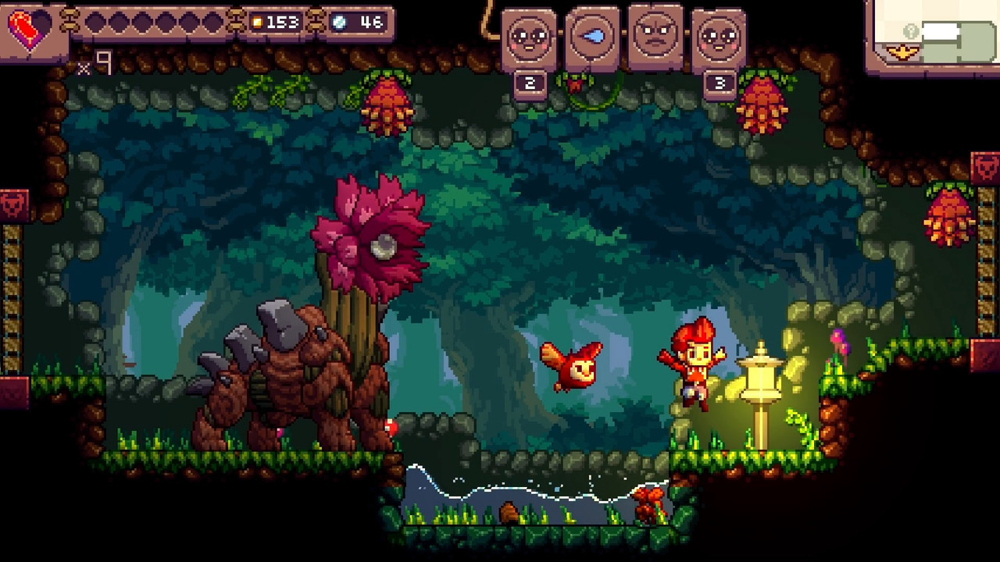

  > This example shows what the backdrop of the game Eagle Island looks like when it's not dimmed, and "outline characters" and "outline platforms" aren't enabled for comparison.

  
 

- Images that contain key information.

### How to measure contrast

There are many tools that can be used to measure contrast of an element and its background to ensure contrast ratios are met.  

Contrast measurement tools:  

1. Accessibility Insights for Windows  

2. Color Contrast Analyzer by the Paciello Group  

[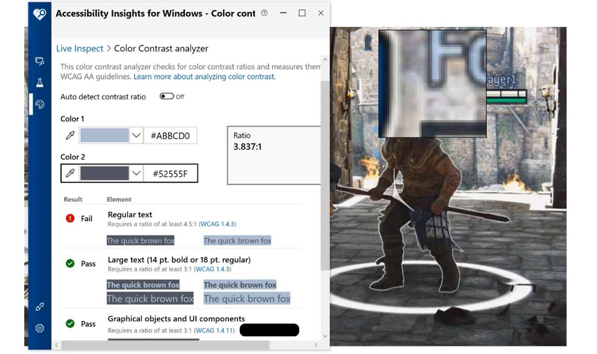](https://youtu.be/PhiKPyAFOSM "Click to open the video example in this window.")

[Accessibility Insights for Windows: measuring contrast video](https://youtu.be/PhiKPyAFOSM "Click to open the video example in this window.")

### General approaches to improving contrast

The best approach to ensuring text is accessible for as many players as possible is by providing players with choices to configure the UI to best address their needs.  

Often, the gameplay environment is in constant visual flux, and on screen elements like text, symbols, or visual cues don’t meet contrast ratios at all times in all gameplay scenarios.  

Here are some general approaches that can help increase contrast.  

- Provide players the option to put a solid background behind any on screen text or give players the option to adjust the opacity of that background.  

- Provide players color options for on screen text and elements so that they can choose what colors are most visible to them.  

- Support a high contrast mode across different aspects of your game.  

- Add borders around text or elements.  

[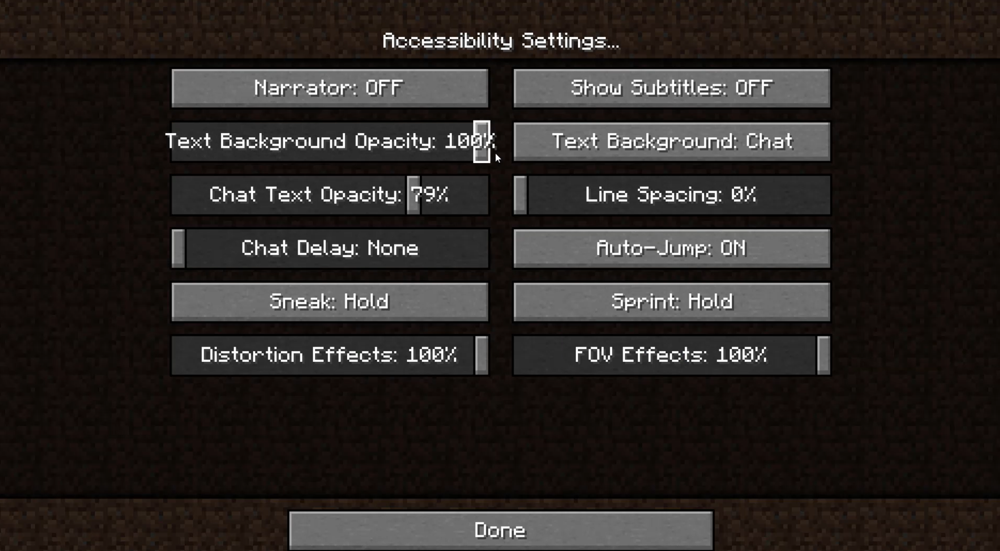](https://youtu.be/3S2nn4kNKzk "Click to open the video example in this window.")

[Text chat background opacity video](https://youtu.be/3S2nn4kNKzk "Click to open the video example in this window.")

> In Minecraft, players can adjust the opacity of text chat background.  

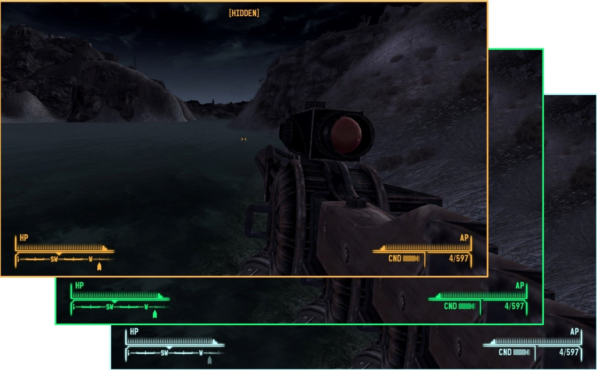

> In Fallout: New Vegas, HUD color can be changed by the player.

## Implementation guidelines

Here are some guidelines to ensure that your game provides the minimum amount of configurability for contrast settings to meet the accessibility needs of more players.  

> [!NOTE]  
> Tools to measure contrast ratios are in the "How to measure contrast" section earlier this topic.  

- Large-scale text and large-scale visual elements should meet a minimum contrast of **3:1** against their background.  

  - On console, large text is defined as:  

    - 52 px at 1080p  

    - 104 px at 4K  

  - On PC/VR, large text is defined as:  

    - 36 px at 1080p  

    - 72 px at 4K  

  - On mobile/Xbox Game Streaming, large text is defined as:  

    - 36 px at 100 DPI  

    - 72 px at 200 DPI  

    - 144 px at 400 DPI  

    - Scale linearly as DPI increases  

- Standard-sized text and visual elements (those that aren't considered large-scale) that provide important information or context for gameplay should have a contrast ratio of at least **4.5:1** against their background.  

- Text on inactive elements should meet a minimum contrast ratio of **3:1** against its background.

  - Inactive elements can include text within symbols, glyphs, or other visual elements that appear within the UI, but cannot be interacted with due to scenarios like:
      - The player has not yet unlocked the game area, item, or option associated with the inactive element
      - The option or visual element is disabled due to a lack of compatibility between the player’s software or hardware technical specifications and the requirements of the inactive option
       - Any other scenario in which a visual element present within the UI cannot be interacted with due to circumstances specific to that player
        
  

  
Example (Expandable)

  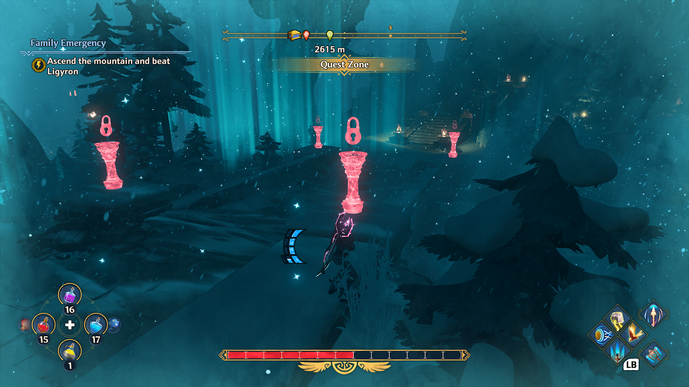

  > Though this is not an example of inactive text, in Fenyx Immortals Rising, in-game elements that have not been unlocked yet appear bright red with a lock icon above them, making them visually stand out within the game environment.  
  
   

   [Video link: Inactive element depiction](https://youtu.be/tgjbJ-mEdPY "Click to open the video example.")

   > In the Sea of Thieves store, when a player moves focus over an item that cannot be purchased individually, the words “bundle only” are overlaid on top of the item. The “bundle only” text meets the 3:1 contrast ratio minimum.  
  
 

- Placeholder text, or text entered in an input field should meet a minimum contrast ratio of **4.5:1** (3:1 for large scale text) against the input field’s background.

  

  
Example (Expandable)

  

  > In Dragon Quest XI S: Echoes of an Elusive Age, placeholder star icons that inform the player of how many letters long their character name can be meets the **4.5:1** contrast ratio.

- A high contrast mode (either light, dark, or both) should be provided. When enabled, the contrast ratios should equal or exceed **7:1** for all UI elements against their background.

  

  
Example (Expandable)

  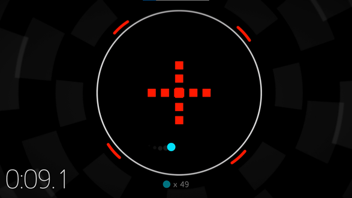

  > The game Hyperdot features both a dark and a light high contrast mode. When this mode is enabled, all visual elements presented have a **7:1** contrast ratio against their background.  
  

> [!NOTE]  
> Despite common misconceptions that high contrast modes are intended to increase the separation between light and dark elements, the true intent of high contrast modes include the following:
>
> - Increase the visibility of important elements
> - Increase the visual separation between different types of important elements 
> - Increase the visual separation between important elements and unimportant elements

  **Contrast ratio summary chart**

  Text size | Contrast ratio  
  :-------- | :--------
  Standard-size text or visual elements | 4.5:1  
  Large-scale text and visual elements | 3:1  
  Inactive-element text | 3:1  
  High contrast mode elements | 7:1  
  Placeholder or input field text | 4.5:1 (standard size) 3:1 (large scale)

- When text is displayed over a non-solid color background, the text contrast ratio should be measured between the text and the lowest contrasting area of the background.  

  

  
Example (expandable)

  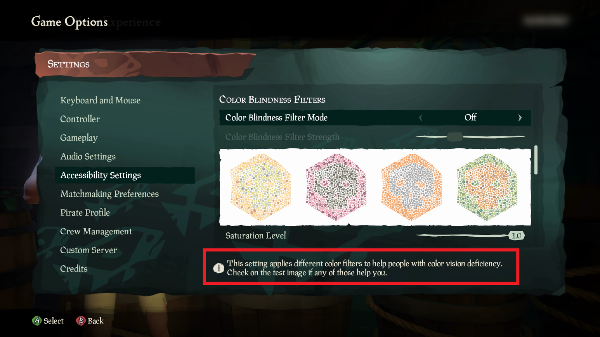

  > In Sea of Thieves, there are patches of lighter and darker turquoise behind the text. When taking the contrast measurement, the lighter of the two turquoise colors should be used for the background color.  

  

- Where available, read the platform-provided contrast settings to determine whether high contrast modes should be turned on/off at game launch by default, and then adjust the game UI accordingly.  

  

  
Example (expandable)

  If a game can read the system's platform settings, they should automatically be applied at initial game launch. If a player has high contrast mode enabled at the system or platform level and a game also offers a high contrast mode, it should be enabled at the game launch until the player otherwise reconfigures the game settings. In this example, the player's system settings have high contrast mode enabled. When they open Microsoft Solitaire, the high contrast version of the game also opens.

  Standard game mode

  

  High contrast mode

  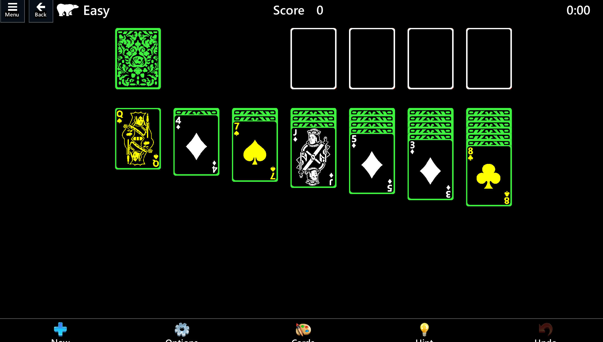

  

- Foreground and background text colors can be configured/set by the player.  

- Avoid relying on color alone to communicate information. When this isn't possible, provide players the option to choose the color of key game elements.
  

  
Example (expandable)

  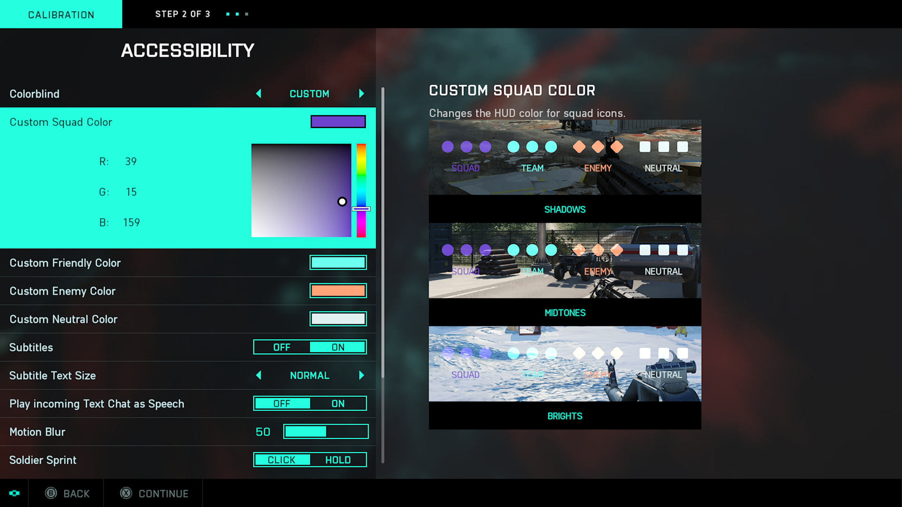

  > Battlefield 2042’s Accessibility menu has colorblind options to customize the HUD icon colors. The options are for Deuteranopia, Tritanopia, Protanopia, and custom. The custom option allows players to choose specific colors and hues to best meet their needs. A preview that shows the player’s selected colors in game in shadowy, midtone, and bright game environments is also provided.

  

- Images shouldn't contain text except for Logotypes.
  

  
Example (expandable)

  An image file shouldn't contain text because that text and its background can't be adjusted to meet contrast ratios if it's within a static image file.

   

  > In this example from Gears 5, the "Versus" text and the sentence descriptor underneath are text elements, as opposed to being part of the background image. Text should be its own UI element that can be overlaid on top of images, ideally with the ability to place semi-opaque to opaque backgrounds behind text to increase contrast ratios. Text shouldn't be a part of the image itself. This can help ensure screen narration compatibility.  

  

- Text or visual elements that are part of a logo or brand name have no minimum contrast requirement.
  

  
Example (expandable)

  Logotypes, such as a game title's logo on a menu screen, don't have to be tested for contrast ratios.  

  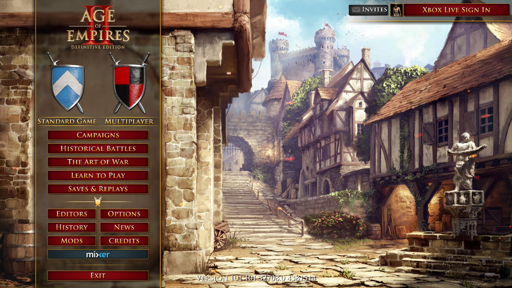

  > In this example from Age of Empires II, the "Age of Empires II" text on the top of the menu wouldn't be subject to meeting contrast requirements, because the text is part of the game's logo.
  

- Text or visual elements that are pure decoration, that aren't visible to anyone, or that are part of a picture that contains significant other visual content, have no contrast requirement.
  

  
Example (expandable)

  Images and elements that are purely decorative and don't provide important information to the player don't have to be tested for contrast ratios.

  

  > In this Gears 5 Versus menu screen, the highlighted elements are purely decorative. Their sole contribution to the page is purely aesthetic. Therefore, they aren't subject to contrast guidelines.
  >  
  > [!NOTE]
  > This image has been edited to include a green rectangular indicator on the top right of the screen and two arrows on the bottom middle of the screen to highlight the decorative images that this example is referring to. These green elements aren't part of the Gears 5 UI.  
  

## Potential player impact

The guidelines in this XAG can help reduce barriers for the following players.

Player | Impacted
:------- | :-------:
Players with low vision | **X**
Players with little or no color perception | **X**
Players without hearing | **X**
Players with limited hearing | **X**
Players with cognitive or learning disabilities | **X**
Other: players who are reading text on a small screen, sitting far away from the screen, on a screen with glare, or on a low-contrast display | **X**

## Resources and tools

Resource type | Link to source
:--- | ---
Article | [Provide high contrast between text/UI and background (external)](http://gameaccessibilityguidelines.com/provide-high-contrast-between-text-and-background/)
Article | [Provide an option to adjust contrast (external)](http://gameaccessibilityguidelines.com/provide-an-option-to-adjust-contrast)
Article | [Provide a choice of text colour, low/high contrast choice as a minimum (external)](http://gameaccessibilityguidelines.com/provide-a-choice-of-text-colour-lowhigh-contrast-choice-as-a-minimum)
Tool | [Accessibility Insights For Windows (external)](https://accessibilityinsights.io/)
Tool | [Colour Contrast Analyser (CCA) (External)](https://developer.paciellogroup.com/resources/contrastanalyser/)
Tool | [Color Oracle (external)](https://colororacle.org/)
Tool | [Contrast ratio tool (external)](https://contrast-ratio.com/)
Microsoft Game Development Kit API | [XHighContrastGetMode](https://developer.microsoft.com/games/xbox/docs/gdk/XHighContrastGetMode) (This link might require sign-in credentials provided by an NDA Xbox program.)
