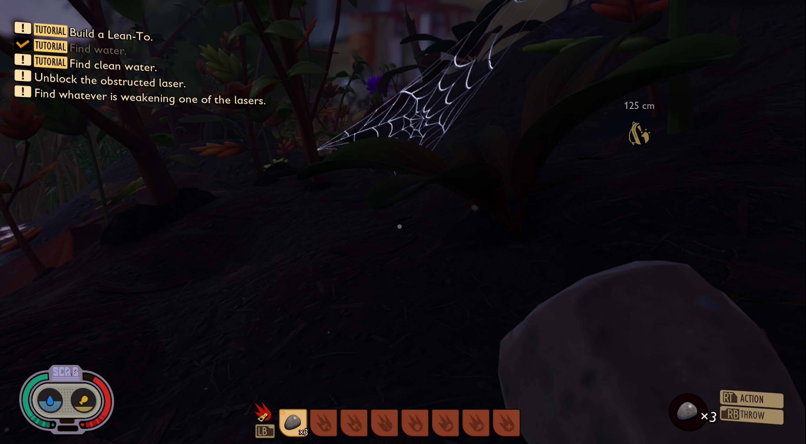
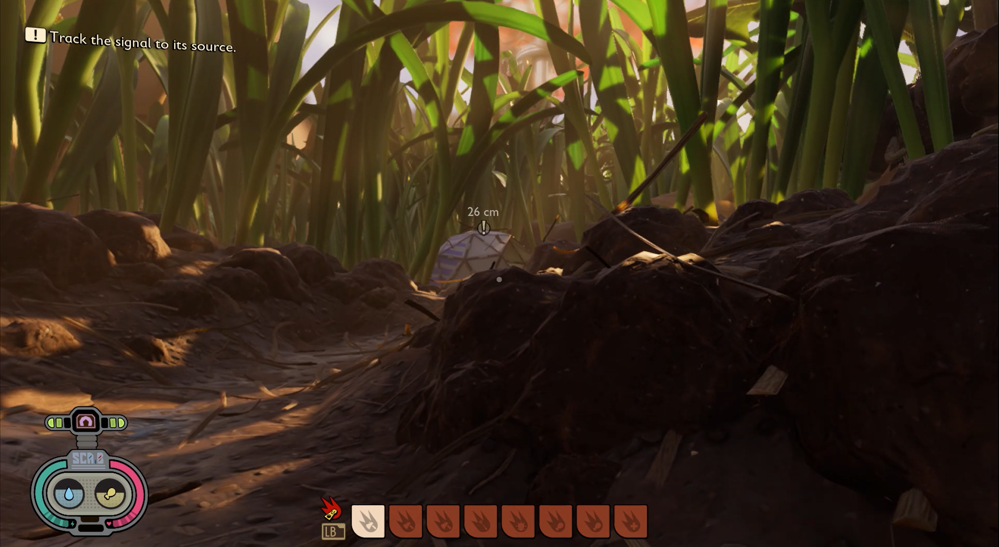
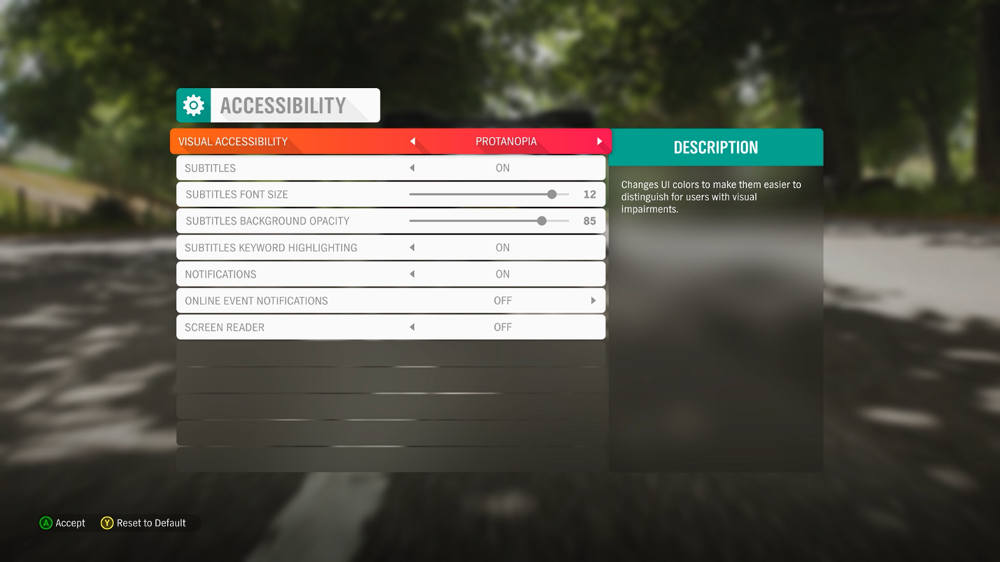
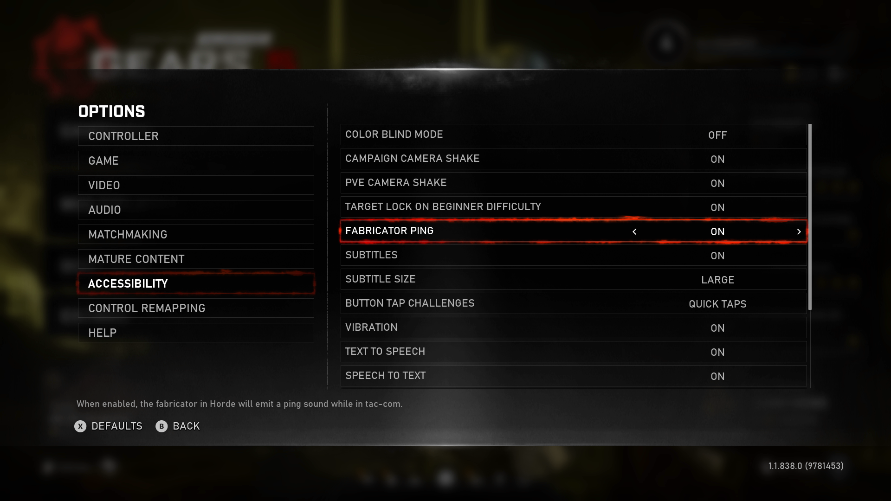
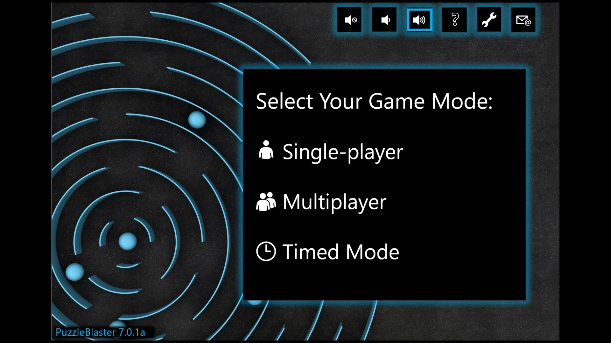
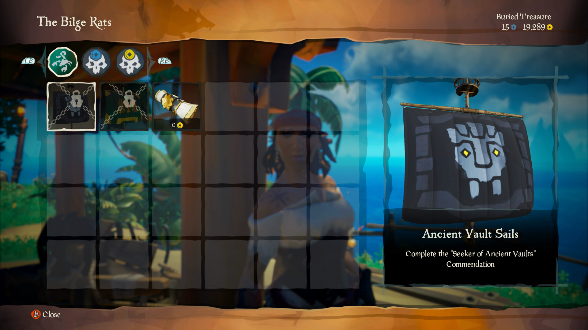
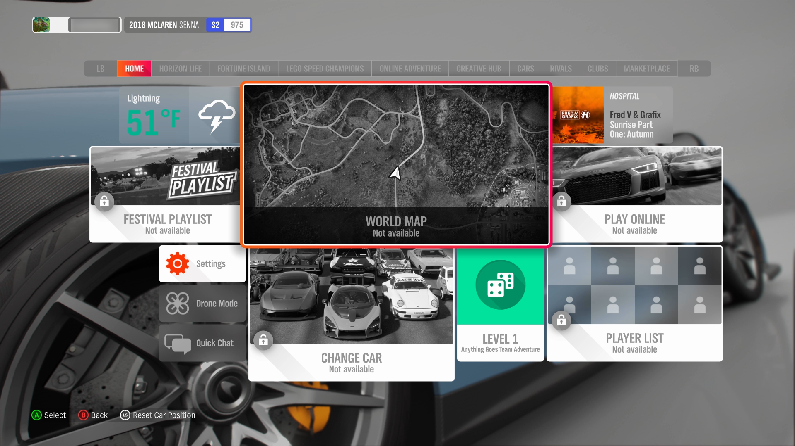

# Xbox Accessibility Guideline 103: Additional channels for visual and audio cues

## Goal

The goal of this Xbox Accessibility Guideline (XAG) is to express visual and audio cues by using multiple sensory methods. This is to ensure that key information is perceivable by players who are blind or have low vision and players who are deaf or hard of hearing.

## Overview

Visual and audio cues are often key to gameplay. They inform a player of events like gunfire, taking enemy damage, the presence of interactable objects, a new objective, and more. When this type of information is only presented visually or audibly, players who have vision or hearing loss can miss out on key information that's necessary to their gameplay. For example, enemy gunshots can be expressed audibly&mdash;but if a player can't hear them because of hearing loss or a situational circumstance like playing in a loud room without a headset, their character might lose health and die before the player has a chance to take cover. Similarly, if these gunshot cues were only expressed visually on screen, a player who is blind or otherwise can't rely on visual cues might have a similar experience. When cues are provided through multiple sensory methods, relying on sight or hearing alone is no longer a requirement for success.  

Additionally, it's important to ensure that visual cues are perceivable to players with color vision deficiency or colorblindness. It can affect the brightness of colors, the shades of colors, and ultimately might affect the ability to discern the difference between colors. This can cause elements in the gameplay environment to disappear or become hidden for the player.  

## Scoping questions

How does your game relay information to a player (by sound, visual cues, haptic)?

- Does your game provide audio or visual content that, if not acted upon, would result in a negative consequence for the player (for example, the game cues players that they're being shot at by using audible gunshot noises. If a player isn't aware of this and doesn't take cover, their character will die)?

- Does your game use color to identify or distinguish important elements or information (like blue flowers are poisonous, and green flowers are safe to eat)?

## Background and foundational information: Additional channels for visual and audio cues

### Options for multisensory communication of information

Ensuring that information is presented to a player by using more than one sensory channel will enhance the perceivability for all players. The following are suggestions for ways of relaying information that, when combined with one another, helps more players perceive this information.  

### Visual options  

#### Text  

Text or text labels that are visually accessible (for more information, see [XAG 101: Text display](./101.md)) and provide verbal context for what an on screen symbol or element represents can lessen cognitive load.  

Example (expandable)

> The previous image shows the map in Forza Horizon 4 where "new" track options are highlighted in yellow, and the word "new" is also written out for the player to read. Additionally, the speakerphone symbol in the bottom-right corner that says "Rebecca" is a visual way of informing a player that a character named Rebecca is currently speaking. Text labels can help take the guesswork out of what an icon or symbol is intended to indicate, and instead states the intent in words.  

#### Symbols and shapes

Symbols and shapes, when combined with other information channels such as text labels, can help quickly express and reinforce information. Symbols can also be helpful for players who can't read text or might require a longer time to read/process text. For example, an exclamation point symbol as the universal signifier for "alert" or "error" might be easier to understand for some players&mdash;but including an associated text label with additional written context is equally important for others.

Example (expandable)

![The Grounded crafting menu. There are seven tabs: tools, workbench gear, health and snacks, meal prep, utilities, decor, and resources. Next to each tab title is a symbol. Next to tools is the silhouette of a hammer. Next to workbench gear is a shield over a bench. Next to health and snacks is a plus sign. The Pebblet Spear is selected for crafting, but the player doesn't have enough ingredients. This is indicated by showing how many are needed, how many are available, a red triangular caution symbol next to the item, and the number available is red.](../../images/gaming-accessibility/grounded-craft-menu.png)

> In Grounded, text labels are accompanied by symbols that represent the text. For example, the "Tools" tab label has hammer symbols next to it. The "Health & Snacks" tab label has the "plus" symbol for first-aid next to it.

> [!NOTE]
> Color is also used to indicate key information such as the "Missing Ingredient" symbols. Color is also helpful for players who can't read but are using context clues to inform their gameplay. However, color isn't the only affordance used to communicate to the player that they're missing ingredients.  

#### Color

In combination with other information elements, color can help reinforce information and provide additional context for players.  

> [!NOTE]  
> Color alone should never be used to represent information.  

Example (expandable)

![The Grounded crafting menu. In the upper-right corner, there are 4 gauges. A green gauge with a lightning symbol, a blue gauge with a water droplet symbol, a yellow gauge with a turkey-leg symbol, and a red gauge with a heart symbol. These gauges correspond to different meters in the game. The Pebblet Spear is selected for crafting, but the player doesn't have enough ingredients. This is indicated by showing how many are needed, how many are available, a red triangular caution symbol next to the item, and the number available is red.](../../images/gaming-accessibility/grounded-craft-menu.png)

> In Grounded, the use of color in addition to the lightning, water droplet, turkey leg, and heart symbols helps players visually differentiate heads up display (HUD) meter elements. The color red is used to represent the warning symbol for missing ingredients. Any other information related to missing ingredients like the "x0 Available" text informs the player how many sprigs, plant fibers, or pebblets the player currently has in their inventory.  

#### On screen elements

On screen visual elements such as enemy fire or damage indicators are also important in supplementing information.

Example (expandable)

[Video link: supplemental on screen visual elements](https://youtu.be/EQ6G9A2wFtk "Click to open the video example in this window.")

> In this example from Grounded, the red halo indicates that damage is being taken, as well as the direction it's coming from. There are also audio cues that notify the player that they're being attacked. However, if a player can't hear these cues, they can still use the visual information being provided to know that they're being attacked.  

### Audio options

#### Spatial audio  

Audio can also be used to inform the player of things like the direction and distance of a cue.

Example (expandable)

> In Killer Instinct, audio cues for giving, receiving, and blocking an attack are properly stereo panned. This gives a player who is blind the ability to track their character's location, as well as the location of their enemy through audio alone.  

#### Audio cues  

Various audio cues such as a ping or bell can be used in addition to other methods of relaying information. In this example, a noise alert is heard when a new objective task appears on screen.  

Example (expandable)

[Video link: audio cues](https://youtu.be/FyGo07-6Sfg "Click to open the video example in this window.")

> In this example from Grounded, the player is given an audio cue to alert them that a new objective has appeared on screen.  

### Haptic options

#### Haptic cues  

Haptic rumbling patterns of a controller can be used as an additional way to alert a player of visual or audio information being presented in a game (for more detailed guidance about the use of haptic cues, see [XAG 110: Haptic feedback](./110.md)).  

> [!NOTE]  
> Haptics should be used in conjunction with at least one other type of cue, because some players might choose to disable the haptics on their input device or could be using a device that doesn't have haptic capability.  

### Color vision deficiency or "colorblindness"  

A game's color palette might seem to provide an experience with enough difference between the colors of key elements. However, for a player with colorblindness, gameplay elements might still appear muted or blend into the background. Cataracts are another eye condition that affects color perception. Cataracts are even more common than colorblindness. When color alone is used to signify an element or action (for example, when enemy characters are outlined in red, ally characters are outlined in green), players who are unable to discern the difference between those two colors will be unable to use this key information to inform their gameplay.  

Given the many types of colorblindness and vast spectrum in which they can affect a person’s vision, ensuring that there are no key game elements that rely on color alone should be the goal wherever possible. If color reliance is unavoidable, providing players the option to assign their own color choice for individual game elements is important.  

Example (expandable)

> [!NOTE]
> The following example images have been edited with color blindness simulator filters that aren't part of the game title's UI. These edited images are intended to show the impact that a color vision deficiency or colorblindness can have on a player's view of various game elements. The games featured in this section contain accessibility options for colorblind players. These examples are altered with colorblind simulation features to show what a player might experience before colorblind accessibility features are enabled within the game. The intent of these simulations is to provide high-level context and awareness to readers who are new to learning about colorblindness.  

Simulation filters or other simulation tools shouldn't be used as a replacement for testing with actual players with colorblindness. Simulation filters can be used as an internal tool during development to check the efficacy of colorblind accessibility features before user testing.

> This capture shows what visual elements on the Forza Horizon 4 UI look like for players without colorblindness.  

> This image has been edited. A Deuteranopia simulation filter has been applied to the image. Deuteranopia is a common form of colorblindness. This example shows how on screen elements like the mini-map and speedometer become difficult to discern. However, Forza Horizon 4 provides several UI color presets that players with some forms of colorblindness can apply to their game to improve their experience.

[Video link: filters for colorblindness](https://youtu.be/70_fZ3oyd_4 "Click to open the video example in this window.")

> Players can choose between Deuteranopia, Protanopia, and Tritanopia (three forms of colorblindness) or a general High Contrast Mode.  

## Implementation guidelines

- Any visual content that's critical to understanding gameplay or comprehending the narrative should be expressed by using at least one other sensory method. As an example, visual gunfire indicators should also be represented by using spatial audio or haptic feedback.  

    

    
Example (expandable)

    

    [Video link: supplemental on screen visual elements in Grounded](https://youtu.be/EQ6G9A2wFtk "Click to open the video example in this window.")

    > In this example from Grounded, visual content such as the red attack indicators and health meter depletion are critical to gameplay. In addition to these two visual cues, audio cues such as the player grunting when hit and the beeping pattern for when the player's health has been completely depleted, are also present.
    Further, Grounded implemented distinct sounds for different types of attack scenarios, including the sound of a "hollow" swing for when a player swings a weapon but doesn't injure an enemy, the sound for when enemy contact is made, and the "explosion" sound for when an enemy bug is killed.  

    

    [Video link: supplemental on screen visual elements in Assassin's Creed Valhalla](https://youtu.be/iNEC5Cwp-Aw "Click to open the video example in this window.")

    > In Assassin’s Creed Valhalla, players can activate “Odin’s Sight” to perform a quick scan of their nearby surrounding environment. When collectible or interactable items are present, both a visual on-screen indicator of a glowing gold circle as well as a spatial audio cue of where that item appears within the game environment in relationship to character’s location are provided. 
    

- Game-critical content that's represented through multiple visual affordances (like shape or spatial location) should have an additional means of identification not reliant on vision, such as haptic feedback, spatial audio, or screen narration. Blind and low-vision players might not be able to identify cues that are represented solely by visual means, even if multiple visual methods are used.

    

    
Example (expandable)

    

    > In Gears 5, a feature called the "Fabricator Ping" can be enabled. It emits a ping that increases in volume and frequency the closer the player gets to the fabricator. For players who are unable to see the on screen icons that indicate the location of the fabricator, audio cues like these are another means of communicating this information.
    

- Where menu narration is supported, use images with text alternatives for graphical symbols. Don't use Unicode font glyphs with the desired graphical appearances but with different meanings.

    

    
Example (expandable)

    The following examples show the difference between the use of Unicode font characters and the use of an image of the character with proper alternative text labels when read aloud by a screen reader. Unicode is technically a "font" type; therefore, each symbol has an associated unique code for every "character." Every character has a programmatic text description that's read aloud by narration software. Each of these characters, their codes, and their assigned text descriptions is on Unicode.org. Although many text descriptions often accurately describe what a character is, the context in which characters are used in a game typically don't verbally describe the intended use of the character within the game context. Consider the following example.  

    

    [Video link: Unicode narration (what not to do)](https://youtu.be/ytIz1Cd9uZ0 "Click to open the video example in this window.")

    > In this video, the developer used Unicode font characters because they visually represented the graphics that they wanted to display. However, the established text descriptions for these characters results in the following being read aloud by the screen reader.
    > 
    >> "Muted Speaker, Speaker Medium Volume, Speaker High Volume, White Question Mark, Wrench, Email"
    >>  
    >> "Bust in silhouette – Single-player"
    >>  
    >> "Busts in silhouette – Multiplayer"
    >>  
    >> "3 o'clock - Timed Mode"

    These descriptions can be very confusing to a player who's using a screen reader. Instead, images of these graphics with proper alternative text labels should be used, such as in the following example.  

    

    [Video link: Unicode narration (what to do)](https://youtu.be/FwenFNtcH98 "Click to open the video example in this window.")

    > In this example, the developer wrote the alternative text labels to be narrated in the following way so they accurately describe the intent of the graphics.
    > 
    >> "Mute Volume, Lower Volume, Raise Volume, Help, Settings, Invite a friend"
    >> 
    >> [No alt text; therefore, no narration because the single person graphic is decorative] "Single Player"
    >> 
    >> [No alt text; therefore, no narration because the double-person graphic is decorative] "Multiplayer"
    >> 
    >> [No alt text; therefore, no narration because the clock graphic is decorative] "Timed Mode"
    

- Any content that's critical to understanding gameplay or comprehending the narrative, and is expressed through color, also needs to be expressed by using at least one additional signifier such as shape, pattern, iconography, or text labels.

    

    
Example (expandable)

    

    > In this example, the game Grounded uses color, as well as shape, iconography, and text labels to portray information. The color red, along with the shape of a warning symbol, and an associated text label at the bottom of the screen describing the intent of this information as "Missing ingredients," are used in combination with one another.  
    

- If color is the primary method of communication for information (like if rare items have a blue highlight and legendary items have an orange highlight), the player should be able to configure those colors by using presets, or ideally, free choice of color.  

    

    
Example (expandable)

    

    > In Call of Duty: Black Ops – Cold War, allies, enemies, members of the player's party, and the player's character locations are represented on a map in the game by triangles. The color of each triangle is the primary indicator of the role each triangle on the map represents. Players are given the option to choose the color of each category's triangle as it appears on the map. This will assist players who have color vision deficiencies or colorblindness in ensuring that they can select the specific colors that are most visible and differentiable for them.  

    

- If a change of color (graying) is used to inform the player of the existence and state of a control that isn't available, another method is also used. (For more detailed guidance about contrast ratios for elements that aren't available, see [XAG 102: Contrast](./102.md)).

    

    
Example (expandable)

    

    > In Sea of Thieves, items for purchase that are currently locked aren't only "grayed out," but they also have a lock symbol on them.  

    

    > In Forza Horizon, unavailable menu elements are grayed out and have a text label that reads "Not available." A lock symbol also accompanies the text labels.  

    

- Any audio content that's critical to understanding gameplay or comprehending the narrative should be expressed by using at least one other sensory method. As an example, the sound of gunfire should also be represented by using a visual graphic that indicates the type and directionality of the sound. Haptic feedback could also be used.  

    > [!NOTE]  
    > Not all platforms support input devices with haptic capability (such as mouse/keyboard). Additionally, players with disabilities might be using specialty input devices that don't provide haptic vibration such as the Xbox Adaptive Controller. They might choose to disable haptic vibrations if it causes irritation or pain. Therefore, haptics should be used in addition to other ways of relaying information.
    
    For more details about the use of haptics in games, see [XAG 110: Haptic feedback](./110.md).

    

    
Example (expandable)

    

    [Video link: supplemental on screen visual elements](https://youtu.be/EQ6G9A2wFtk "Click to open the video example in this window.")

    > In this example from Grounded, audio content such as the player’s character grunting in pain, the sound of enemy bugs present, and the sound of successfully hitting enemy bugs is also expressed visually. The audio content is expressed visually by using red indicators on screen that show where an enemy attack is coming from, visuals of the enemy bugs on screen when they are within the character's field of view, and green "splatters" when an enemy bug takes damage. The player's controller also vibrates to provide haptic indications that key events in the game are occurring.
    

- For text-only dialogue that is not accompanied by a spoken audio track, provide the name of the character speaking and an indication of where the speaking character is spatially located in relationship to the player’s character.
 

## Potential player impact

The guidelines in this XAG can help reduce barriers for the following players.

Player | Impacted
:------- | :-------:
Players without vision | **X**
Players with low vision | **X**
Players with little or no color perception | **X**
Players without hearing | **X**
Players with limited hearing | **X**
Players with cognitive or learning disabilities | **X**
Players with limited ability to use time-dependent controls | **X**
Other: players who are reading text on a small screen, sitting far away from the screen, on a screen with glare, or on a low contrast display; young children, players playing in a noisy room, or playing with the sound off | **X**

## Resources and tools

Resource type | Link to source
--- | ---
Article | [Ensure no essential information is conveyed by a fixed colour alone (external)](http://gameaccessibilityguidelines.com/ensure-no-essential-information-is-conveyed-by-a-colour-alone)
Article | [Provide a choice of cursor / crosshair colours / designs (external)](http://gameaccessibilityguidelines.com/provide-a-choice-of-cursor-crosshair-colours-designs)
Article | [Important supplementary information conveyed by audio is replicated in text/visuals (external)](http://gameaccessibilityguidelines.com/ensure-that-all-important-supplementary-information-eg-the-direction-you-are-being-shot-from-conveyed-by-audio-is-replicated-in-text-visuals/)
Article | [Provide captions or visuals for significant background sounds (external)](http://gameaccessibilityguidelines.com/provide-captions-or-visuals-for-significant-background-sounds/)
Article | [Use distinct sounds / music design for all objects and events (external)](http://gameaccessibilityguidelines.com/use-distinct-sound-music-design-for-all-objects-and-events/)
Article | [Provide a voiced GPS (external)](http://gameaccessibilityguidelines.com/provide-a-voiced-gps/)
Tool | [Colour Contrast Analyser (CCA) (external)](https://developer.paciellogroup.com/resources/contrastanalyser/)
Tool | [Color Oracle color blindness simulator) (external)](https://colororacle.org/)
Article | [Colorblind accessibility in video games (external)](https://www.gamersexperience.com/colorblind-accessibility-in-video-games-is-the-industry-heading-in-the-right-direction/)
