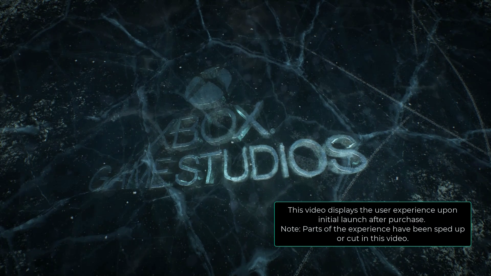
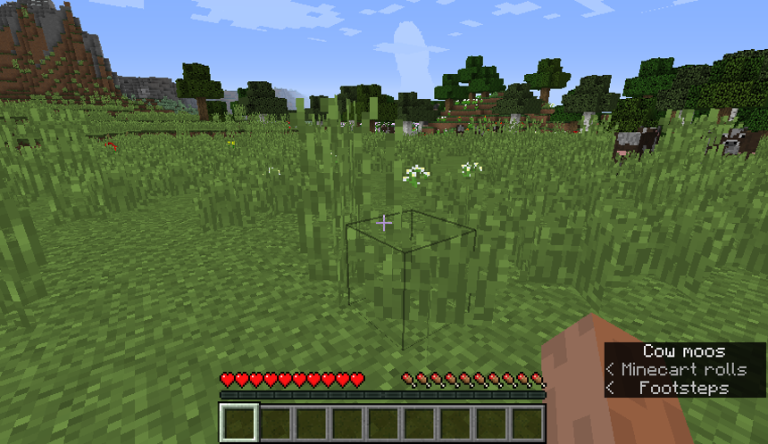
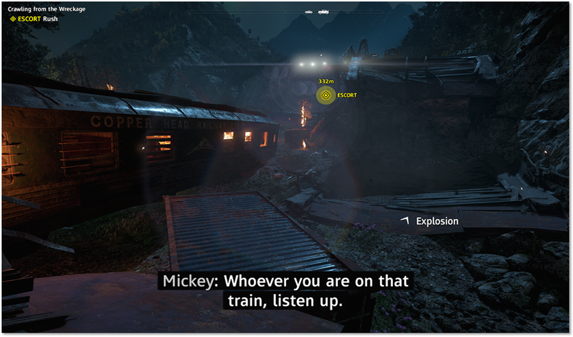
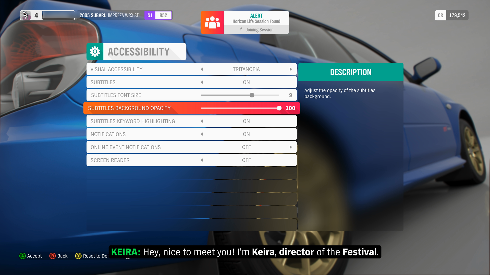

# Xbox Accessibility Guideline 104: Subtitles and captions

## Goal

The goal of this Xbox Accessibility Guideline (XAG) is to ensure that all audio information that's portrayed by a game can also be understood by players who can't rely on audio, such as players who are d/Deaf or hard of hearing.  

This audio information includes full motion videos (FMVs), cutscenes, in-game non-player chatter, and important audio cues (for example, sounds of gunfire or footsteps).  

## Overview

Subtitles are text equivalents for the speech or dialogue of a character, while captions are text equivalents for all audio. Captions include text equivalents for non-speech sounds like background music playing ["Name of song, artist", "lyrics"], sound effects ["dogs barking"], ["knocking on door"], and other audio cues. Captions can also include important information like who is speaking, their tone ["sarcasm"], or where a sound comes from ["over the radio"].  

When subtitles and captions aren't present during game experiences (like FMVs, non-player character (NPC) chatter dialogues, or other audio cues), a player might miss out on a game's backstory, important context within the game's storyline, and key tasks and objectives that inform gameplay.

## Scoping questions

Does your game include any of the following elements that contain audio or dialogue that can be heard by players?

- Does your game include FMVs or cutscenes?  

- Does your game include NPC chatter or dialogue?  

- Does your game include audio cues (for example, sounds of gunfire or footsteps) that inform key components of gameplay?  

## Implementation guidelines

- Subtitles (text equivalents for speech) are provided for all spoken content.  

- Identify the speaker, and use visual spatial indicators to indicate which direction the speaker's voice is coming from if it's not immediately clear.  

    - The speaker's name should be identified in the subtitle line each time a new speaker begins talking. Once the speaker's name is established, the speaker name does not have to re-appear on every subsequent subtitle line while the same speaker is talking. The name of the speaker only needs to appear again in the subtitle line when there is a change in speakers, or if a significant pause (greater than 1-2 minutes) has taken place during the same speaker's dialogue.
    - Color can be used to distinguish who is speaking. However, color should be used in conjunction with another means of portraying information, such as text.  

    

    
Example (expandable)

    

    > Gears 5 identifies the speaker of each subtitle. In this example, the subtitle also informs the player that the current speaker (Baird) is speaking over a radio. Players who can hear the audio track might notice the radio "static" as Baird talks&mdash;making it clear that despite his character not being visibly present on screen, his character is present within the game remotely via radio. By including the "(on radio)" text, players who can't hear the audio track are also informed of this. Other best practice text indicators include using a ">" or "<" arrow if the character is offscreen to the right or left.  
    

    > [!NOTE]
    > In scenarios where the speaker is an unidentified “narrator,” and there are no other speakers, identifying “narrator:” in the subtitle or caption text is not required.

- Players can adjust the option before starting the game, or subtitles are enabled by default. This ensures that players don't get dropped into a long introduction cinematic without being able to follow along.  

    

    
Example (expandable)
  

     
    
    [Video link: subtitles on initial launch video](https://youtu.be/LeGSqMo3c3U "Click to open the video example.")

    > When the Gears 5 title is launched for the first time, subtitles and captions are enabled by default. After the initial FMV is played, players are presented with the accessibility menu screen to configure their accessibility settings moving forward.  
    

- Captions (text equivalents for all audio) are provided for all important sounds that aren't already communicated visually. Spatial indication (like arrows next to the text) should be provided to indicate which direction a sound is coming from if it's not immediately clear (for example, if the sound is coming from something occurring offscreen).  

    

    
Example (expandable)

    For sounds that aren't already indicated visually on screen, captions should inform the player of the sound and its spatial location (if applicable).  

    
    

    > In Gears 5, the music intensifying cues the player that an important event, like encountering an enemy, is about to happen. By including the caption "&lt;music intensifies&gt;", players who can't hear that the music is intensifying can still perceive this information.  

    

    > In Minecraft Java Edition, the sound of cows, Minecarts, and footsteps can audibly be heard offscreen. The "cow moos, Minecart rolls, and footsteps" captions, along with associated arrows ("<" ">") to indicate whether sounds are coming from the left of the player or the right of the player, visualizes this information for players who can't hear it.  

    

    > In Far Cry New Dawn, a visual cue for an "explosion" on screen, as well as an arrow indicating where it came from, informs a player of the presence of an important sound and its spatial location.  

    

- Subtitles and captions can be turned on or off at any time and configured easily through a discoverable setting.  

    - Allow different types of caption information (like main character dialogue, background character dialogue, or ambient noises) to be toggled on or off independently of one another.  

    

    
Example (expandable)

    Players should be able to easily turn subtitles and captions on or off. Different types of caption information should be configurable independently of one another.  

    ![The audio settings menu for The Outer Worlds. Under the conversation category, the player is focused on the first option, conversation subtitles, which is set to minimal. On the right side of the screen, there's an explanation of the three options: on, minimal, and off. On displays subtitles when an NPC talks. Minimal only displays subtitles for the last line that an NPC says when player options are shown. Off doesn't show subtitles for conversations. Below the conversation subtitles option are toggles to turn Bark Subtitles and Cinematic Subtitles on or off.](../../images/gaming-accessibility/tow-audio-settings.png)

    > In The Outer Worlds, players can toggle on or off "Conversation Subtitles," "Bark Subtitles," and "Cinematic Subtitles" separately from one another. The "Conversation Subtitles" setting can be further configured to display all subtitles when NPCs talk, minimal subtitles (only shows the last line from an NPC when player options are shown), or toggled off.  
    
    > [!NOTE]
    > The detailed descriptions of each subtitle setting help players from a cognitive perspective. These descriptions are straightforward, as opposed to leaving players to guess, or learn by trial and error, what the difference between subtitles "on" versus "minimal" means in regard to their gameplay.  

    

- Whenever possible, the title should use the caption/subtitle settings that are configured by the player at the platform level by default.  

    

    
Example (expandable)
 

    Whenever possible, a game should use the caption/subtitle settings that are configured by the player at the platform level.  

    

    > In this example of the Xbox Platform's Ease of Access – Closed Captioning menu, the player is presented with many options for configuring the display of their captions. If possible, a game should use the platform-level captions and their associated configurations to set default settings for a player. Further configurability options within the game that can override or expand on platform-level preferences are encouraged.  

    

- Subtitle and caption text should conform to the following standards.  

    - **Size:** Text size should meet the minimum defined pixel height by default as defined in [XAG 101: Text display](./101.md). (The ability to configure text to be smaller or larger than the default minimum in the settings is also beneficial to players.)
    
    > [!NOTE]
    > Unlike static text in menus, subtitle and caption text for spoken dialogue is typically only displayed on-screen for short periods of time. Given this, developers are encouraged to offer larger minimum default sizes for caption and subtitle text to facilitate ease of rapid reading.

    - **Adjustable size:** Scalable to a large size (minimum of 200 percent of minimum default text size). For more information, see [XAG 101: Text display](./101.md).  

    - **Spacing:** Readability is improved when words and lines of text aren't very close to each other. Avoid offering a font that has small spacing between the characters.  

    - **Length:** Avoid long lines of text (more than 40 characters), especially when the dialogue is fast. When text appears rapidly, longer lines of text are harder to read than shorter ones. Show no more than two lines of subtitles on screen at a time (three can be used in exceptional cases).  

        - When possible, line breaks should be entered manually (as opposed to automatic wrapping or splitting) to ensure that breaks occur at editorially sensible points.  

    - **Case:** Font should be in mixed case. It's much easier to read than all the same case. For example, "Hello. How have you been?" versus "HELLO. HOW HAVE YOU BEEN?"  

    - **Sans serif:** Ensure that at least one san serif font option is available for subtitles and closed captions.  

    - **Background color:** Players should be able to place a solid background behind subtitle and caption text to ensure readability of that text, regardless of the game's background. (For example, white text presented over light desert sand looks virtually invisible to the player.) The color of this background should be configurable by the player.  

    - **Background opacity:** Players should be able to adjust the opacity of the background on a scale from 0 to 100 percent. This supports players who might require high contrast as well as others who might find an opaque background obtrusive.  

    - **Placement:** Ensure that important UI/gameplay elements are designed to avoid being obscured by subtitles when scaled to the largest size. This can generally be achieved by ensuring that placement is toward the bottom of the screen.  

- Provide a visual simulation of what subtitle and caption presentation options will look like based on the player's current configuration settings.  

    - If possible, this preview should be shown in a realistic game context.  

    

    
Example (expandable)
 

    

    > In Forza Horizon 4, the Accessibility settings menu allows players to change subtitle display settings. The game has a preview text option that can be activated by pressing the view button. Players can see what their current display configurations will look like before starting the game.  

    

- Caption and subtitle information should persist during screen recordings, captures, and other user-generated content (UGC). Other players viewing that content can choose to display it.  

- Full transcripts of FMVs should be made available via an accessible website.  

- Sign language interpretation is provided for scripted in-game cutscenes and prerecorded/pre-rendered sequences of media that include speech, such as full motion videos (FMV’s).
    - Signing requires localization, just like spoken languages do. For example, American Sign Language, British Sign Language, and Japanese Sign Language are all vastly different from one another.
    
    

    
Example (expandable)
  

    
    
    [Video link: American sign language for captions](https://youtu.be/zYcwVFdLRRc "Click to open the video example.")

    > In Forza Horizon 5, players can enable American Sign Language or British Sign Language support for in-game cinematics. This feature provides players with an overlay of a sign language interpreter who translates cinematic dialogue as it is being spoken. This allows players to understand more nuance and emotion from the game’s dialogue that is otherwise not traditionally captured in caption or subtitle text.  
    

## Potential player impact

The guidelines in this XAG can help reduce barriers for the following players.

Player | Impacted
:------- | :-------:
Players without hearing | **X**
Players with limited hearing | **X**
Players with cognitive or learning disabilities | **X**  
Other: players who are in noisy environments, gamers who are playing with the sound off to avoid disturbing others | **X**

## Resources and tools

Resource type | Link to source
:--- | :---
Article | [Provide subtitles for all important speech (external)](http://gameaccessibilityguidelines.com/provide-subtitles-for-all-important-speech/)
Article | [If any subtitles / captions are used, present them in a clear, easy to read way (external)](http://gameaccessibilityguidelines.com/if-any-subtitles-captions-are-used-present-them-in-a-clear-easy-to-read-way/)
Article | [Provide subtitles for supplementary speech (external)](http://gameaccessibilityguidelines.com/provide-subtitles-for-supplementary-speech/)
Article | [Ensure subtitles/captions are or can be turned on before any sound is played (external)](http://gameaccessibilityguidelines.com/ensure-subtitles-captions-are-or-can-be-enabled-before-any-sound-is-played)
Article | [Allow subtitle/caption presentation to be customized (external)](http://gameaccessibilityguidelines.com/allow-subtitlecaption-presentation-to-be-customised/)
Article | [Ensure that subtitles/captions are cut down to and presented at an appropriate words-per-minute for the target age-group (external)](http://gameaccessibilityguidelines.com/ensure-that-subtitlescaptions-are-cut-down-to-and-presented-at-an-appropriate-words-per-minute-for-the-target-age-group)
Article | [Provide captions or visuals for significant background sounds (external)](http://gameaccessibilityguidelines.com/provide-captions-or-visuals-for-significant-background-sounds/)
Article | [Ensure no essential information is conveyed by sounds alone (external)](http://gameaccessibilityguidelines.com/ensure-no-essential-information-is-conveyed-by-sounds-alone)
Article | [Provide a visual indication of who is currently speaking (external)](http://gameaccessibilityguidelines.com/provide-a-visual-indication-of-who-is-currently-speaking)
Article | [Ensure that all important supplementary information conveyed by audio is replicated in text / visuals (external)](http://gameaccessibilityguidelines.com/ensure-that-all-important-supplementary-information-eg-the-direction-you-are-being-shot-from-conveyed-by-audio-is-replicated-in-text-visuals)
Article | [Subtitle Guidelines (external)](https://www.bbc.co.uk/accessibility/forproducts/guides/subtitles/)
Best practice example | [Gears of War 5 (external)](http://www.caniplaythat.com/2019/09/05/deaf-game-review-gears-of-war-5/)
Microsoft Game Development Kit API | [XClosedCaptionGetProperties](https://developer.microsoft.com/games/xbox/docs/gdk/XClosedCaptionGetProperties) (This link might require sign-in credentials provided by an NDA Xbox program.)
Microsoft Game Development Kit API | [XClosedCaptionSetEnabled](https://developer.microsoft.com/games/xbox/docs/gdk/XClosedCaptionSetEnabled) (This link might require sign-in credentials provided by an NDA Xbox program.)
