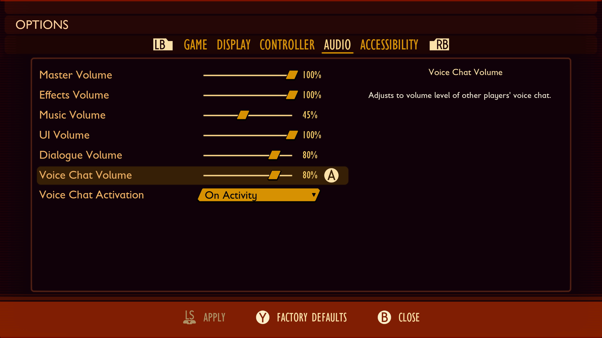
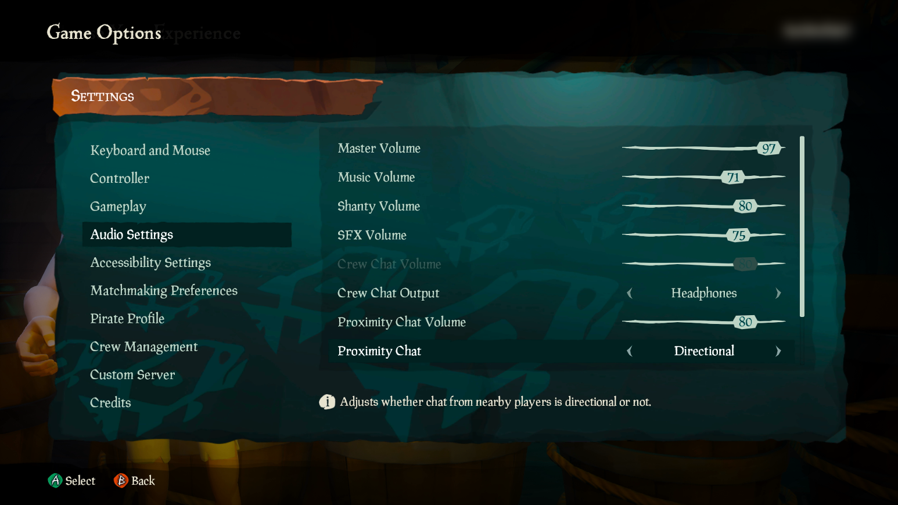
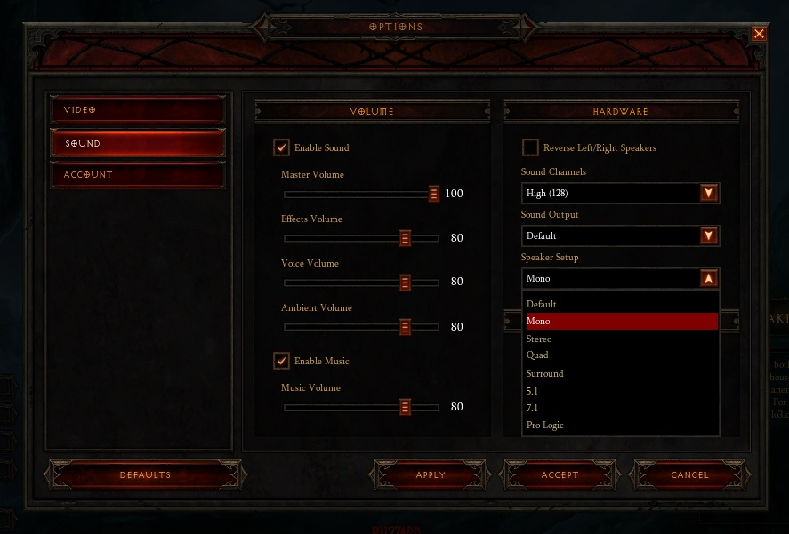
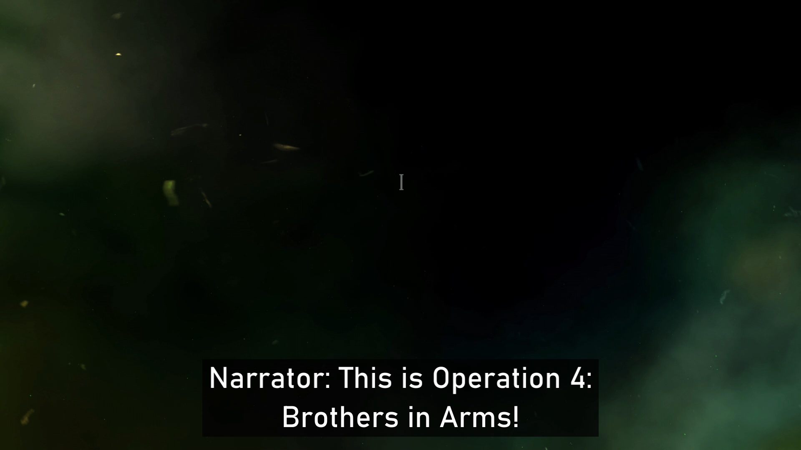

# Xbox Accessibility Guideline 105: Audio accessibility

## Goal

The goal of this Xbox Accessibility Guideline (XAG) is to ensure that players can hear important audio cues, speech output from other players and non-player characters, or assistive technologies like screen readers, as well as audio cues or other distinct audio output options. This can be achieved by providing separate volume controls for each type of audio output (like music volume, effects volume, character dialogue, voice chat, or screen reader), so that players can configure the volume options to best meet their needs.  

## Overview

Audio output such as background music and effects noises in games contribute to the atmosphere of the game and can help players feel more immersed in their experience. However, for players who have difficulty hearing or difficulty concentrating, these outputs might interfere with their ability to hear important speech output from other players, non-player characters, or the announcement of key information on screen via assistive technologies like their screen reader software. If the music volume and speech output volumes are competing against one another, players might miss out on key information.  

Therefore, it's important that the player be able to configure each type of audio output individually. This can allow the player to adjust sounds like background noise and effects to a low enough volume that speech can be heard, without losing the ambiance and immersive experience that's set by the music and effects tracks altogether.  

While these types of configurable options help players who have difficulty hearing, players with other types of disabilities who have difficulty concentrating or are easily distracted might also find this helpful. These options provide a way to eliminate nonessential audio that players might find distracting during their gameplay.  

## Scoping questions

- Is your game multiplayer (for example, a game in which players might be communicating with one another via voice party chat)?  

- Does your game have non-player chatter or other in-game dialogue/speech output that a player must hear to progress through the game or to gain important context for the game’s narrative?  

- Does your game provide sound effects or audio cues that offer information that's important to gameplay?  

- Does your game provide background music, sound effects, or other non-speech audio output?

## Implementation guidelines

- Games should provide a method for players to adjust the volume of the audio, or mute different types of audio, independently from each other, including but not limited to the following:  

    - Music  

    - Voice-over  

    - Active sound effects (those critical to gameplay like engine noise, gunshots, or footsteps)  

    - Background/ambient sound effects (those not critical to gameplay)  

    - Narration  

    - Voice chat  

    

    
Example (expandable)

    Providing options to adjust the volume of different types of audio output separately ensures that players can customize the experience to best fit their auditory needs.  

    

    > In Grounded, players are provided separate controls for six different types of audio output.  

    

- Provide an option to enable spatial audio for sound effects, narration, and any other important game sounds that help the player determine the directionality of the audio.  

    

Example (expandable)
  

    Players should be given the option to enable spatial audio representation of important game sounds. Players can use audio alone to determine directionality of where an audio affordance is coming from in the game.  

    

    > In Sea of Thieves, the player has the option to make voice chat that's in their proximity directional.  

    

- Provide an option that allows the player to convert stereo audio to mono audio sent to both channels.  

    

Example (expandable)

    Players who have difficulty hearing, or hearing loss on only one side, might miss out on key audio cues that are represented spatially. If a character is talking from the right side of the screen, a player with right-sided hearing loss might miss out on this dialogue because that audio output is only being delivered to their right ear. Players should be given the ability to convert stereo audio to mono audio so that all audio is sent to both the left and right audio channels.  

    

    > In Diablo III, players can configure their audio output to mono, stereo, and many others.  

    

- Players should be able to pause audio events, including cinematics with audio.  
    > [!NOTE]
    > Events that play for less than three seconds don't need a method to pause playback.  

    > [!NOTE]
    > Real-time, multiplayer gameplay is exempt from this guideline (players don't need to be able to pause a live multiplayer session).  

    

Example (expandable)

    Players who have difficulty hearing or concentrating might miss critical audio events. The ability to pause audio events so that the player has time to process recent audio outputs, or pause an audio track while their screen reader software is speaking, ensures that no key information is missed.  

      

    [Video link: pausing during full motion videos](https://youtu.be/rwZsKWByeJU "Click to open the video example.")

    > In Gears 5, pressing **A** during full motion videos immediately pauses the video until **A** is pressed again.  

    

- The game should include an option to automatically lower or mute game audio when audio output from assistive technologies such as a screen reader is detected.  

## Potential player impact
The guidelines in this XAG can help reduce barriers for the following players.

Player | Impacted
:------- | :-------:
Players without vision | **X**
Players with low vision | **X**
Players with cognitive or learning disabilities | **X**
Other gamers: playing in a noisy room or playing with device sound off | **X**

## Resources and tools

Resource type | Link to source
:--- | :---
Article | [Provide separate volume controls or mutes for effects, speech and background / music (external)](http://gameaccessibilityguidelines.com/provide-separate-volume-controls-or-mutes-for-effects-speech-and-background-music)
Article | [Provide a stereo/mono toggle (external)](http://gameaccessibilityguidelines.com/provide-a-stereomono-toggle)
Article | [Ensure sound / music choices for each key objects / events are distinct from each other (external)](http://gameaccessibilityguidelines.com/ensure-sound-music-choices-for-each-key-objects-events-are-distinct-from-each-other/)
Article | [Provide a voiced GPS (external)](http://gameaccessibilityguidelines.com/provide-a-voiced-gps/)
Article | [Use surround sound (external)](http://gameaccessibilityguidelines.com/use-surround-sound/)
Article | [Keep background noise to a minimum during speech (external)](http://gameaccessibilityguidelines.com/keep-background-noise-to-minimum-during-speech/)
