# Xbox Accessibility Guideline 106: Screen narration

## Goal

The goal of this Xbox Accessibility Guideline (XAG) is to ensure that all on screen visual information can also be represented aurally through screen narration software. This benefits players who can't read on screen content because of things like blindness, low vision, learning disabilities, or temporary/situational circumstances.

## Overview

Screen narration technologies are often used by players who are blind or have low vision. However, there are also players who might be able to see the screen clearly but are unable to read because of age or learning disability. The screen reader presents information that's visibly on screen through a synthesized audio voice. Elements like menu text, instructions (“press A to select”), and visual information within the active game environment necessary to play are narrated aloud. This eliminates the need for the player to read the screen themselves if they are unable to.  

Screen-reading technologies can be used through either platform-wide technologies or game-specific technologies. Check with your platform provider for further details to determine if any existing platform-level technology can be used by your specific game or if you must create a screen-reading system for your game.  

Whether you're developing for a platform-level screen reader or creating a game-specific screen-reading technology from scratch, it's important to keep the following guidelines in mind. They can help ensure that all necessary pieces of visual information are accurately and holistically expressed to a player using screen reading technologies.  

## Scoping questions  

First, review the items in the following "What aspects of the game should support narration?" section.  

- Does your game include any of these elements?  

- In your game, do these elements present key information to a player?  

- If a player couldn't read any of these key text elements, would they be blocked from configuring, starting, or playing the game in its entirety?  

> [!NOTE]
> Other affordances such as audio cues, spatial audio, or haptic feedback must also be explored as a means of representing visual information through non-visual methods (for more information, see [XAG 103](./103.md)). These types of affordances can provide a better experience than in-game narration of elements. However, it's not always possible to easily represent all types of information this way.  

## Background and foundational information: Screen narration

### Introduction to screen narration

This section contains high-level guidance that's intended to help scope the basic components of games that should have screen narration support.  

#### What aspects of the game should support narration?  

Support for narration means that while an item doesn't have to be narrated by default, if a player enables their console or in-game narration functionality, these areas are read aloud to the player.  

- All on screen text: 

   - Menu labels, sub-labels, roles, values, and description text  

   - Control types/interaction method like “Press A to select”  

   - In-game UI elements: heads up display (HUD) (like inventory or health), objectives, hints/tips, maps, and more.  

      

      
Example (expandable)

      ![Sea of Thieves audio settings menu with areas of the menu labeled. The title "game options" is labeled "heading." The menu title "settings" is labeled "sub-heading." The different game settings options like audio settings or controller are labeled "Menu item/tab." The settings within the audio settings menu like master volume or crew chat volume are labeled "label." The slider next to master volume has a label that says "Role (slider), Value (97)." At the bottom of the settings menu, there's a tip that describes what the setting does. This is labeled "Text (describes the function of each label)." In the bottom left, there are button symbols "A" for select and "B" for back. This is labeled ""image (icon) plus text. Describes interaction slash activation method."](../../images/gaming-accessibility/sot-options-labels.png)

      > In Sea of Thieves, the red and green rectangular indicators show the various types of text that appear on a single menu screen that should be supported by screen narration. Detailed information regarding how to narrate these items is in the the  “How should an item be narrated?" section later in this topic.

      > [!NOTE]  
      > This image has been edited to include red and green rectangular indicators to highlight areas on the screen that this example is focused on. These red and green rectangles aren't part of the Sea of Thieves UI.  

     

      [Video link: narrating on screen information](https://youtu.be/cq_Si7sDpTs "Click to open the video example.")

      > In this example of Gears Tactics, the “tactical communications” dialog box is fully narrated as soon as it appears on screen. Other aspects of the in-game experience are also narrated, including enemy health, hit calculation, hit chance, and crit calculation. This example showcases the concept of narration beyond menu elements. For further guidance on best practice guidelines when narrating HUD elements, tips, hints, and other in-game elements, see the “How should an item be narrated?” and “Resources and tools” sections later in this topic.  

      > [!NOTE]
      > This video has been edited to include green rectangular indicators to highlight areas on the screen that this example is focused on. These green rectangles aren't part of the Gears Tactics UI.  
      

   - Player-to-player communication: incoming party chat messages, chat wheel options, or pre-written messaging options  

      

      
Example (expandable)

      [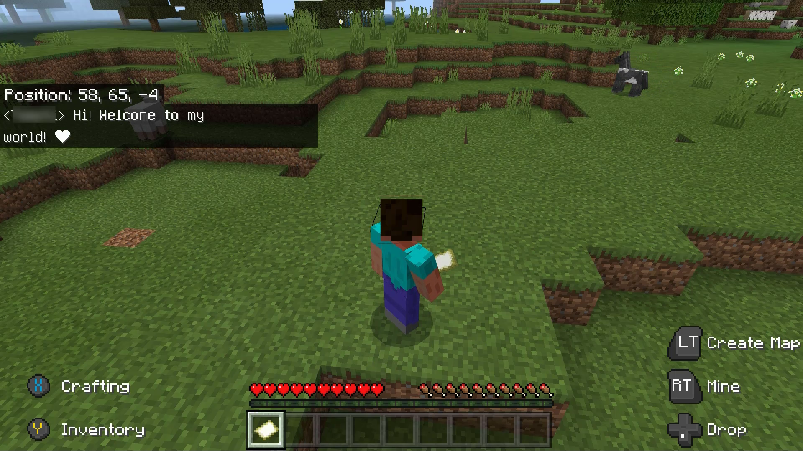](https://youtu.be/W0Nx1Y9DRXw "Click to open the video example.")  

      [Video link: narration of chat](https://youtu.be/W0Nx1Y9DRXw "Click to open the video example.")

      > In a game like Minecraft, where players communicate solely through text chat messages, it's important to narrate incoming chat messages. If a player can't read incoming chat messages, they're unable to respond to other players or be fully involved in the multiplayer atmosphere. When screen narration is enabled in the game, these incoming messages should be read aloud to the player. In this video example, another player messages, “Hi! Welcome to my world! <3”&mdash;this is then read aloud by the screen reader.
      
      In addition to incoming messages supporting narration, outgoing message options such as chat wheel selections and other types of pre-written chat messages should be read aloud when screen narration is enabled. A player should be able to know what message they're sending before it is sent.
      

   - Images, diagrams, and tables
      

      
Example (expandable)

      Images that aren't decorative should have alternative text descriptions that are read aloud via narration. Diagrams or tables that provide information key to gameplay should also have high-level descriptions that are narrated. The content in diagrams and tables themselves should also be fully accessible.  

      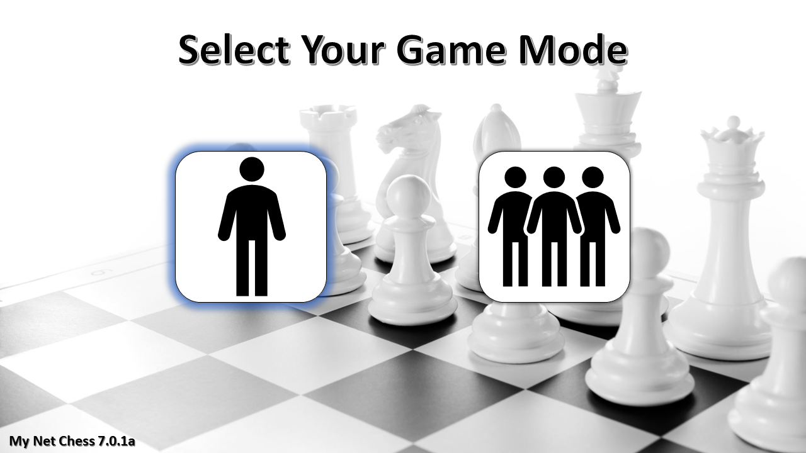
      
      > Images or graphics that provide information that's key to gameplay must also have alternative text descriptions that can be narrated by a screen reader. In this example, the player can choose between single-player or multiplayer mode. The game only has two images: one of a single person standing alone, and another of multiple people standing together. If a player can't see what the images display, they don't know which game mode they're selecting. In this case, the screen reader announces the descriptive text  “single-player” when the icon on the left of the single person has focus. It also announces the descriptive text “multiplayer” when the icon on the right of multiple people has focus ensures that players who can't see screen content aren't blocked from aspects of a game like this.  

      

   - Real-time updates and notifications (incoming chats, toast messages, error messages, friend joining or leaving game)
      

      
Example (expandable)

      [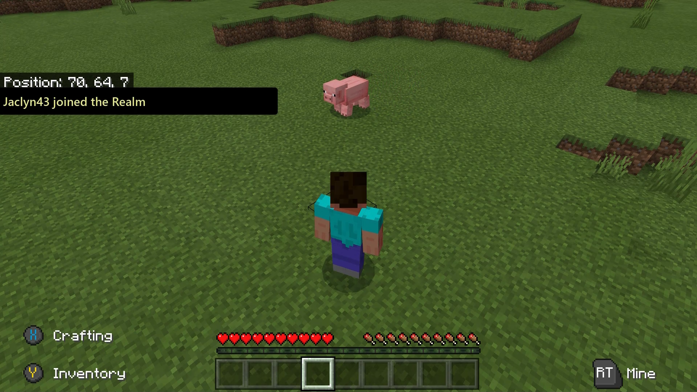](https://youtu.be/nEQtgKXYOE8 "Click to open the video example.")  

      [Video link: narration of real-time notifications](https://youtu.be/nEQtgKXYOE8 "Click to open the video example.")

      > When screen narration is enabled in Minecraft, if a player joins the realm, the text notification is narrated aloud.
      

#### When should narration occur?

When any of the following events occur, these changes should be appropriately narrated.  

- Change in context (opening a dialog box or opening a different app)

   

   
Example (expandable)

   This refers to any major changes in the content of the screen that a player is on. These changes include events like changing from one menu screen to another, a dialog box opening on screen, or other significant events that, if made without player awareness or visibility, would be very disorienting.  

    

   [Video link: narration of context changes](https://youtu.be/9QsNSca35KA "Click to open the video example.")

   > In this example of the Sea of Thieves menu UI, each time a player progresses to a new screen, there is a significant change in context. Therefore, there's an immediate narration of the screen’s current title (“Choose Your Experience" > "Select Your Ship" > "Galleon" > "Select Your Crew Type" > "loading > "opening crew ledger").  

    

   [Video link: narration of context changes](https://youtu.be/4BzyVolZ43E "Click to open the video example.")

   > Some changes in context are player-initiated such as the Sea of Thieves example, while others aren't. In this example of Minecraft, the player selects their realm. When the context changes to the purple loading screen, “Joining Realm” is announced while the load is in progress. When loading is completed and the player is now within the game environment, “Done” is announced to signify this change in context from the loading screen to the game environment. Without this cue, a blind player might not know when they're in the active game environment until a negative event like being attacked by an enemy produces an audio cue or haptic feedback. Announcing that gameplay has started immediately eliminates any uncertainty or potential for negative events to happen to the player.  

   >[!NOTE]
   > It's best to not change focus without player initiation or making it very clear that context will change. In some cases, like loading screens, this is unavoidable.
   

- Focus change (going to another button or going to another game in a game list)  

   

   
Example (expandable)

   [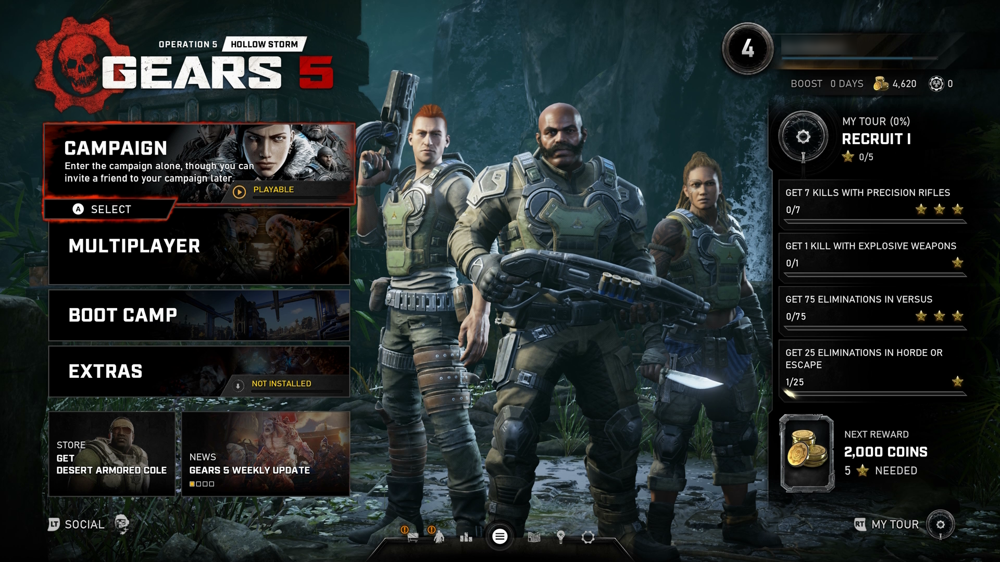](https://youtu.be/TJk4XMlgBx4 "Click to open the video example.")  

   [Video link: narration of focus change](https://youtu.be/TJk4XMlgBx4 "Click to open the video example.")

   > In this example of Gears 5, as focus is changed to a new menu element, narration of that element begins. Narration should generally begin when the new item receives focus.  

   [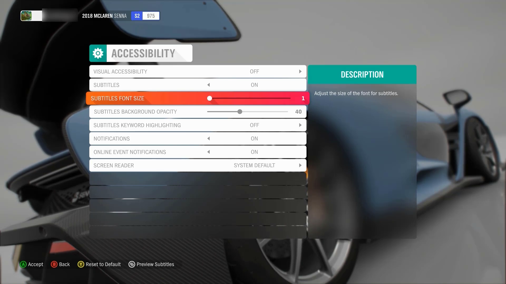](https://youtu.be/PTHDC3q1Y6Q "Click to open the video example.")

   [Video link: narration of value change](https://youtu.be/PTHDC3q1Y6Q "Click to open the video example.")

   > In this example of Forza Horizon 4, the narration announces the change in slider level value every time the player moves the slider.
   

- Real-time notification changes, information change, error messages or alerts  

   

   
Example (expandable)
 

   [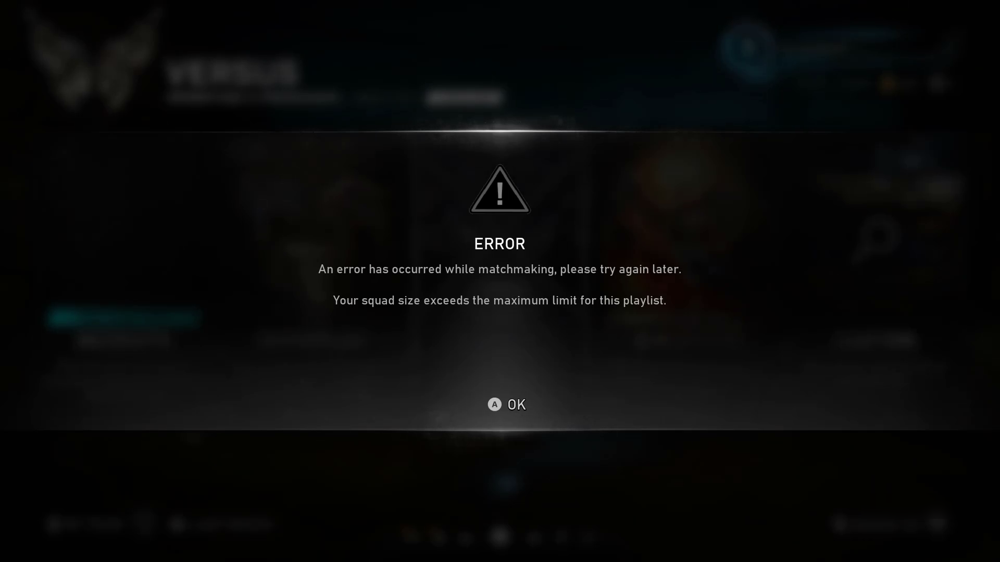](https://youtu.be/1OM553EUfso "Click to open video example")

   [Video link: error narration](https://youtu.be/1OM553EUfso "Click to open the video example.")

   > In this example of Gears 5, a dialog box containing an error message appears. All information in this error box is announced to the player as soon as the dialog box appears, so they are now aware of the context of their screen and how to fix the error moving forward.
   
  

#### How should an item be narrated?

All elements should be labeled, regardless of a player’s primary sense for perception. If a sighted player can see and read a control’s label, a non-sighted player should hear the same label via narration.  

For both web and software, this information is usually given to the player in the order of name, role, value/state, indexing (if required), and interaction information (if required).  

Narration should include the following important information.  

- Labels/names
   

   
Example (expandable)

   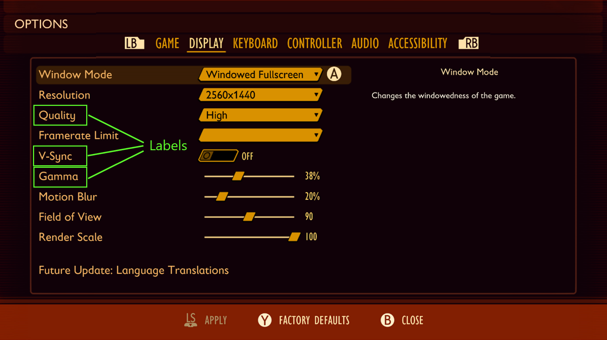

   > In this example of the Grounded settings menu, the following are some examples of how the highlighted “labels” should be programmatically described and read to the player.  
   >  
   > “Quality”  
   >  
   > “V-Sync”  
   >  
   > “Gamma”
   

- Control types/roles
   

   
Example (expandable)

   In theory, everything that a player can navigate to in a game menu is an actionable item. Everything should have a control type. It suggests how to interact with it, so inaccuracy here can lead to a player’s inability to discover how to interact with the control.  

   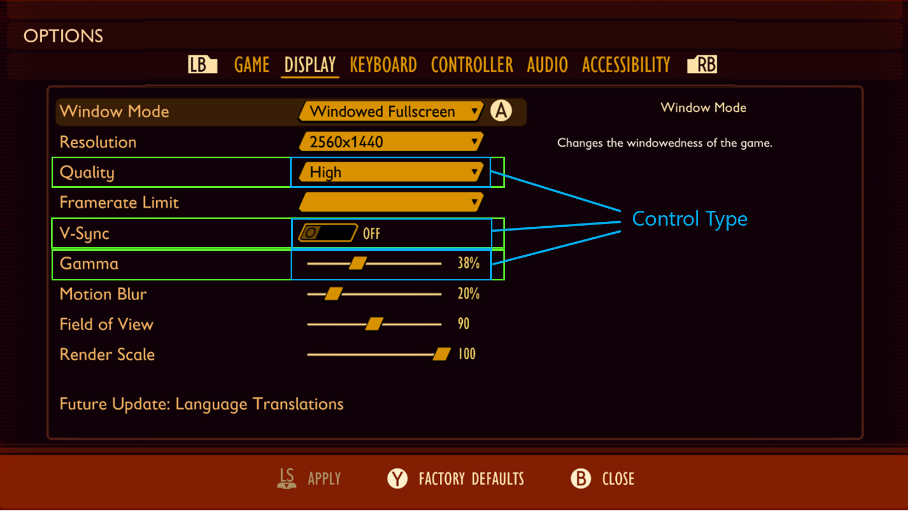 

   > In this example, the following phrases represent how the highlighted labels and control types on this menu should be programmatically described and read to the player.  
   > 
   > “Quality, **combo box**”  
   > 
   > “V-Sync, **toggle**”  
   > 
   > “Gamma, **slider**”
   

- Values/states
   

   
Example (expandable)

   Many, if not all, menu items have variable values, even if the variance is simply “on” or “off.” For drop-down menus/lists, the additional announcement of the control’s state (“collapsed”) is also required.   

   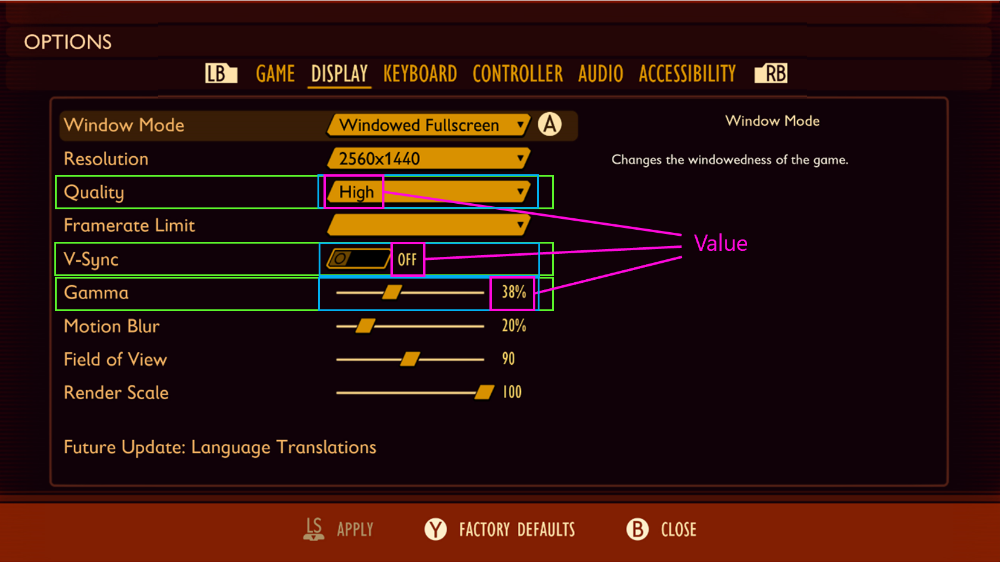

   > In this example, the following phrases represent how the highlighted labels, control types, and values on this menu should be programmatically described and read to the player.  
   > 
   > “Quality, drop down, **collapsed, High**”  
   > 
   > “V-Sync, toggle, **Off**”  
   > 
   > "Gamma, slider, **38%**"  
   

- Indexing/enumeration
   

   
Example (expandable)

   Position and number of items in the menu. Helps non-sighted players remain oriented and confident that they have found all of the controls.  

   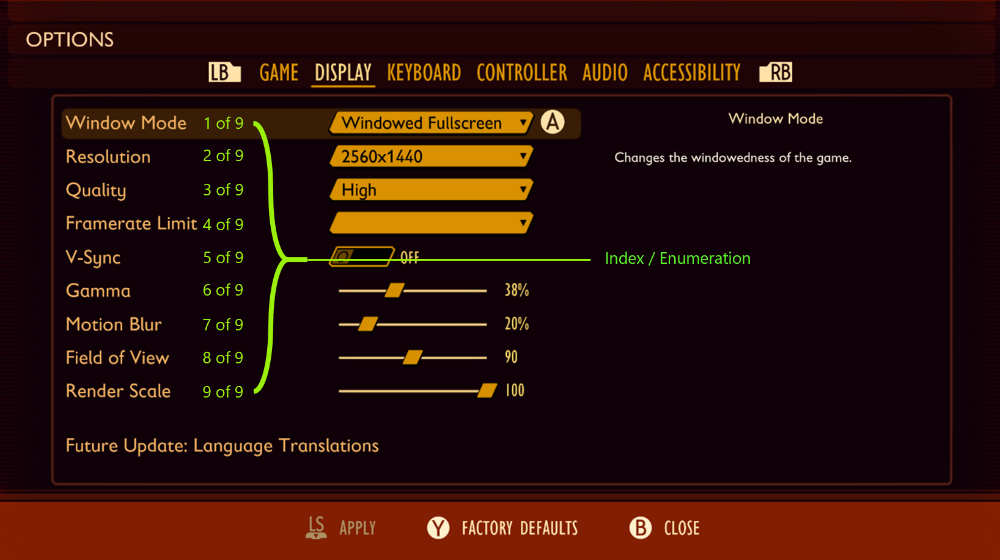

   > In this example, the following phrases represent how the highlighted labels, control types, values, and enumeration of positioning on this menu should be programmatically described and read to the player:  
   > 
   > “Quality, drop down, collapsed, High, **3 of 9**”  
   > 
   > “V-Sync, toggle, off, **5 of 9**”  
   > 
   > “Gamma, slider, 38%, **6 of 9**”  
   

- Navigation/interaction models
   

   
Example (expandable)

   Most games across one platform have standards for controls. On Xbox, the B button is almost always equivalent to Escape, but maybe not every game uses right bumper (RB) and left bumper (LB) to move between submenus in the "Options" menu. Sighted players almost always have button prompts of some sort, where necessary, so the same information should be available via narration.

   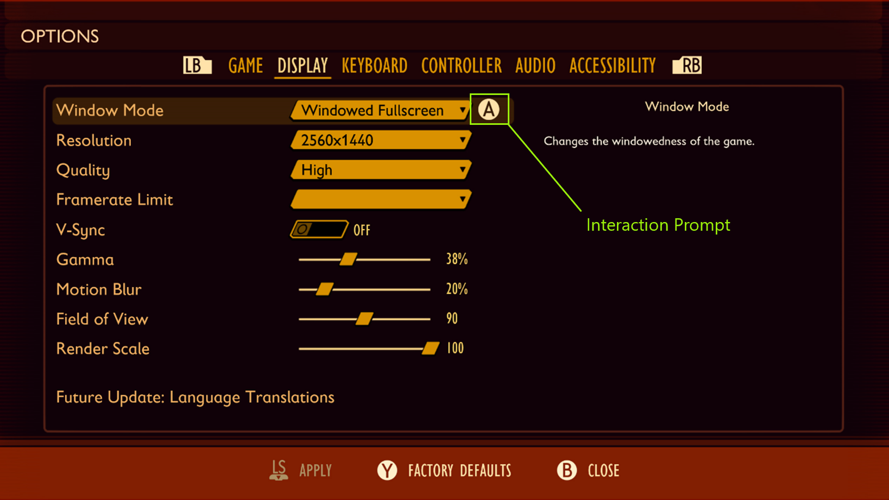

   > In this example, the “A” glyph represents a visual interaction prompt. A player who is using a screen reader should also hear this prompt aloud as, “A to Select.”  
   

### Other key concepts  

- **Confirmation of action:** This means that a player tried to do something, and they know that they did it based on feedback. They also need to know what they’re attempting to act on so they have an expectation of what will happen for each action. For example, the player configures their preferred settings and knows how to save their configuration from the “press A to save” interaction prompt. If they press "A" and nothing happens, they are unsure if their work has been saved. If they press "A" and the game narrates “settings saved,” the player is aware that they have successfully saved the setting that they want and can confidently progress to the next UI screen.  

- **UI hierarchy and intuitive navigation order:** This should be consistent and intuitive for players. For detailed guidance on this area, see [XAG 112: UI navigation](./112.md).  

  > [!CAUTION]  
  > Don’t overdo narration. While it's important to ensure that all necessary information is conveyed to a player with screen reading enabled, too much narration can easily get repetitive and distracting to a player.  

   - For example, instead of narrating a text chat message as, “iheartgames4ever ‘you go left, I’ll go right,’ press d-pad up to activate chat pane. Go to settings to change shortcut. Go to settings to change amount of information you hear when you get a chat.” 

   - You can simplify narration by front-loading the key information and eliminating repetitive narration in real time. However, it's important to ensure that those commands or options can be found in settings or as a single reminder on the chat pane itself.  

      - Simplified example: “iheartgames4ever ‘you go left, I’ll go right’.”

## Implementation guidelines

- All core game UI text (main menu, options, HUD, state changes, players in the game, and time-based events) should support the screen readers that are available on the platform or voice out of the UI through a speech synthesizer. The use of recorded audio files can also be a solution but isn't ideal. (All references to "text" refer to text that can be voiced by using these technologies.)  

   

   
Example (expandable)

   Interactable UI elements should have text alternatives that describe their function so that players know what the content is, why it's there, and what input is necessary to interact with it (if the content is a control).  

   

   [Video link: text alternatives for interactive UI elements](https://youtu.be/KDdjoTTkGDE "Click to open the video example.")

   > In Forza Horizon 4, on the initial screen, the player is brought there after the game has loaded. There are two interactable options that the player must choose from to progress. The game’s screen narration appropriately reads the interactable button prompts on screen as, “Press A button to Start” and “Press X Button for Accessibility.”  
   

- Interactable UI elements that behave as lists, tabs, radio buttons, check lists, or combo boxes, must enumerate how many child items belong to that element, the type of input the element requires, as well as the current state or value of that input element. As an example, “Worlds, Tab, 1 of 3, selected,” or “Music Volume, slider, 52%.” 

   - Enumeration should occur at the end of a narrated string. For example, "Gama, slider, 38%, **6 of 9**."

   - An option to disable enumeration narration can be provided for players who prefer simplified narration.

   

   
Example (expandable)

   [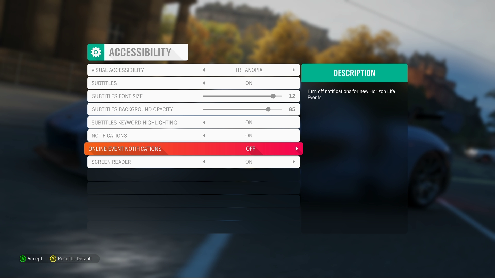](https://youtu.be/sTn6e0eV9eE "Click to open the video example.")

   [Video link: narration of interactable UI elements](https://youtu.be/sTn6e0eV9eE "Click to open the video example.")

   > In this example of the Forza Horizon 4 accessibility menu, the following aspects of the user interface element in focus is appropriately narrated.
   >
   >> “Option highlighted: Online Event Notifications”: Informs the player of the label of the element that currently has focus.
   >>  
   >> “Option 7 of 8”: Helps orient the player and informs them how many “settings” option elements are available within this particular menu. In this case, they know that there are eight menu elements total, and they are currently on the seventh.
   >>  
   >> “Control type: Value Selector”: Informs the player what the input is for this setting (as opposed to a drop-down menu/list, slider, or check box).
   >>  
   >> “Current Value: Off”: Informs the player what their current value is set as. (For example, if they were to take no action in changing this value, this is what their current gameplay setting will remain on.)
   >>  
   >> “Value 1 of 2”: Informs the player that there are two total “Online Event Notifications” value options to choose from. There is one more in addition to their current value of “Off.”
   >>  
   >> *Reads Description of Element*: “Turn off notifications for new Horizon Life Events”: Informs the player of the purpose of this setting. Ensures that players who are using assistive technologies like screen narration receive information at parity with all other players, including sighted players who could read this information if they wanted to.
   >>
   >> “A button Accept,” “B button Back,” “Y button Reset to Default”: Informs the player of the input mechanism or interaction model that's needed to implement any changes that they want to make.

   > [!NOTE]
   > After elements like the description and interaction model/input mechanism are read aloud, these items aren't repeated again after each change of focus or value on this menu. This is because information of this nature hasn't changed while the player is within the context of this UI screen. Such narration can become distracting and repetitive for players.  
   

- The text alternatives for charts, diagrams, pictures, and animations should make the same information available in a form that can be rendered through auditory output. Text alternatives can be used as needed to convey the information in the non-text content.  

   

   
Example (expandable)

   

   > Games that present information in the form of charts, diagrams, pictures, animations, or other graphics should have appropriate alternative text that describes the content. In this example of a diagram that displays the game’s control scheme, the following text alternative should be written and read aloud by the screen reader when the game control's graphics or screen receives focus.
   >
   >> “Game Controls”  
   >>  
   >> “Aim Left – ``<``Pause``>`` Left Arrow Key”  
   >>  
   >> ``<``Double Pause``>``  
   >>  
   >> “Aim Right – ``<``Pause``>`` Right Arrow Key”  
   >>  
   >> ``<``Double Pause``>``  
   >>  
   >> “Long Distance Shot – ``<``Pause``>`` Up Arrow Key”  
   >>  
   >> ``<``Double Pause``>``  
   >>  
   >> “Close Range Shot – ``<``Pause``>`` Down Arrow Key”  
   >>  
   >> ``<``Double Pause``>``  
   >>  
   >> “Fire – ``<``Pause``>`` Mouse Right Click”  
   >>  
   >> ``<``Double Pause``>``  
   >>  
   >> “Boost Blast – ``<``Pause``>`` Mouse Left Click”  

   While the order of the information should be presented in an order that's most intuitive to a player, the main intent is to ensure that all information that can visually be gathered from this diagram is also rendered through the audio output of the screen reader.  
   

- Ensure that text alternatives for graphics convey the purpose and operation of the UI components.
    

    
Example (Expandable)

    

   [Video Link: Text Alternatives](https://youtu.be/ManAQvvrIDw "Click to open video example in this window")

    > In Grounded, the text alternative for the “Arachnophobia Safe Mode” spider preview window is read by screen narration software as “Left mouse button for show spider preview.” This is the proper way to write text alternatives because it reads the mouse icon in the text string as “Left mouse button” instead of “symbol” or another programmatically incorrect alternative text label.

    

- Non-text content that's purely decorative, used only for visual formatting, or isn't presented visually, should not be spoken.
   

   
Example (expandable)

   [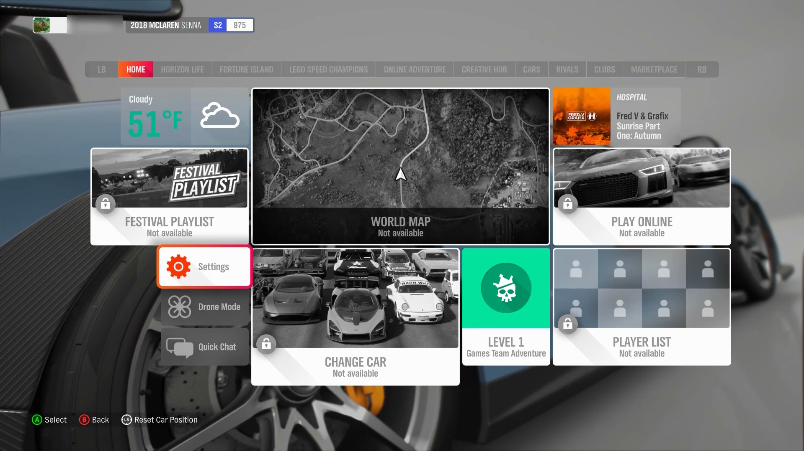](https://youtu.be/Qiki65_O1GA "Click to open the video example.")

   [Video link: decorative images](https://youtu.be/Qiki65_O1GA "Click to open the video example.")

   > In this example from Forza Horizon 4, when the settings menu element receives focus, the narration reads, “Option Highlighted: Settings, Control Type: Button…” Despite the cog-wheel graphic being present on the settings menu element, its presence isn't acknowledged or read aloud by the screen reader because the cog wheel is solely a decorative element. Similarly, the cloud graphics, the images of cars on the “Change Car” menu, the “lock” symbols present on disabled elements, and many others are also not announced by the screen reader because they're decorative. These graphics don't provide any functional information that isn't already present in the form of the text labels on the elements.  
   

- Support a focus order that's aligned with the meaning or operation of the UI. If the navigation sequence is independent of the meaning or operation, align the focus order with the flow of the visual design.
   

   
Example (expandable)

    

   [Video link: focus order aligned to meaning/operation of the UI](https://youtu.be/sBxvuq1iVNY "Click to open the video example.")

   > The "Main Menu" and the "Settings" submenu in Forza Horizon 4 are examples of UIs that don't follow a linear flow of information. Tiles are placed next to, or on either side of, one another, as opposed to linear UIs like the settings menu in Sea of Thieves. In both examples, the focus order implementation meets this XAG guidance. The Sea of Thieves focus order moves linearly up and down, as a sighted player would expect. The menu sequence in Forza Horizon 4 doesn’t follow any clear, linear UI path. However, the focus order does align with the flow of the visual design of the UI (for example, when a player has focus on the “Settings” element button, initiating a control to move the focus down results in the focus landing on the “Drone Mode” button.) If a single down-press had moved the focus from “Settings” to “Change Car” or any other menu element that isn't visually intuitive, this design wouldn't be following the meaning or operation of the UI.  
   

- After navigating to the last item in the UI/menu structure, the player should be taken back to the first item in the UI/menu structure and vice versa.  

   > [!NOTE]
   > This guideline only applies to linear menu structures where focus can be moved either up or down or left or right. Menu structures that allow focus to be moved to elements in any direction (such as a menu with focusable items arranged on a 4 &215; 4 tile) don’t need to loop.
   >
   > We encourage developers to have an option to enable and disable menu looping for all menus.
   > 

   > 
Example (expandable)

   >
   > 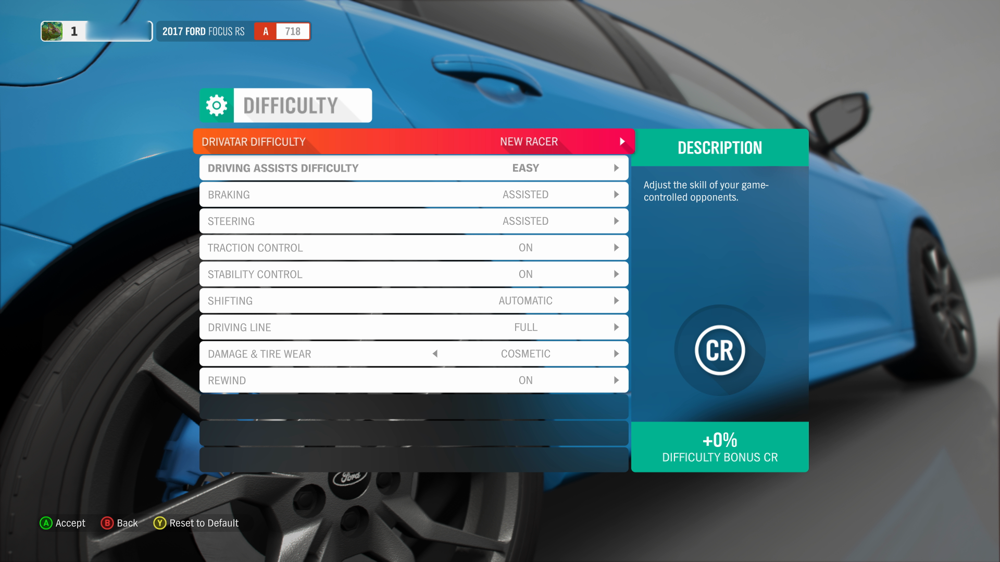
   >
   >> In this screenshot of the Forza Horizon 4 difficulty settings UI, focus can only be moved up and down. As a result, menus with this type of structure should loop the focus back to the first item in the list. This occurs when a player moves their focus “down” to the subsequent item when they’re currently on the last focusable item in the list.
   >
   > 
   >
   >> In this screenshot from the Forza Horizon 4 Horizon Life tab menu, items are arranged so that players can move focus up, down, left, and right. In multidirectional menu structures like this one, focus should not loop to the “first” item in the list upon moving focus from the “last” item in the list.  
   > 

- Players should be able to quickly cancel/repeat narration, regardless of input type (controller, keyboard, mouse, or touch).

- If narration for the current item in focus is actively being read and focus is moved to a different UI element before the narration string has been read in its entirety, the narration for the original UI element should immediately stop, and narration for the new UI element that focus was most recently moved to should begin.

   

   
Example (expandable)

   

   [Video link: player-initiated context changes](https://youtu.be/k1M44e4XV0k "Click to open the video example.")

   > In Assassin’s Creed Valhalla when menu narration is enabled, the current narration string being read aloud immediately stops playing when the player moves focus to a different menu element. After focus is changed, the current menu item that has just received focus is then read aloud. Players are not forced to wait until the entire text string from a previous item is fully read aloud before the text of the newly focused item is read.
   

- Allow players to adjust the speaking rate and pitch of the voice used to narrate the UI.

   

   
Example (expandable)

   

   [Video link: player-initiated context changes](https://youtu.be/X5j5zMA3tRA "Click to open the video example.")

   > In Assassin’s Creed Valhalla, players can adjust the pace in which text is narrated as well as the menu narration voice. Female and male narration voices are provided. Players may choose between these two voice options depending on their ability to more easily hear higher-pitched or lower- pitched sounds, or based on personal preference.

- Context change should be player initiated. After a change in context has occurred, the player should be notified via narration of the new context.
   

   
Example (expandable)

   

   [Video link: player-initiated context changes](https://youtu.be/X5j5zMA3tRA "Click to open the video example.")

   > In this example of the Sea of Thieves menu UI, change of context from one screen to another is player initiated. The player must press the “A” button to select an option before a context change occurs. For example, the player pressed “A” when the “Adventure” option had focus. This selection then initiated a change from the “Choose Your Experience” screen to the “Select Your Ship” screen. This change in context is accompanied by an immediate narration of the new screen’s title; (“Choose Your Experience" > "Select Your Ship" > "Galleon" > "Select Your Crew Type" > "loading, opening crew ledger").  
   

- Players should be notified via narration of events that are relevant to user interactions (changes in component states, value, or description). This includes reoccurring/timed-based notifications such as indications of game state. (For example, loading screens, searching for player notifications, or count-down timers.) In these instances, it's acceptable to read out the state every 7-10 seconds so as not to interfere with other narration/notifications.

   

   
Example (expandable)

   [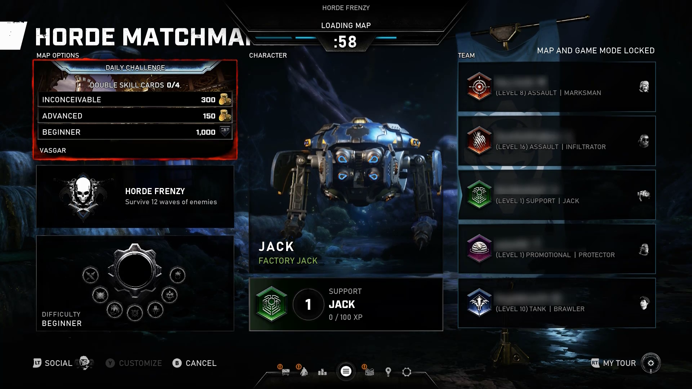](https://youtu.be/jlDaBGRChh4 "Click to open the video example.")

   [Video link: narration of events relevant to player interactions](https://youtu.be/jlDaBGRChh4 "Click to open the video example.")

   > In Gears 5, the number of seconds left in the countdown timer is narrated each second. Although it isn't necessary to announce every second, because every 5-10 seconds is an acceptable cadence, some players might prefer this type of countdown, especially as the countdown approaches closer to zero. Additionally, the second-to-second implementation of the countdown timer narration in this example is acceptable because it doesn't interfere with other narration or notifications. When the player moves focus to an on screen element like “Horde Frenzy,” the timer countdown narration is automatically paused, announces the newly focused item, and doesn't resume until after player-initiated movement has stopped. Further, in this example, narration occurs when the screen context changes from a loading screen to the actual gameplay environment. This informs players that gameplay has started and they're no longer in the loading screen.  
   

- When supporting external screen readers (versus implementing in-game speech synthesis), be sure to do the following:  

   - Programmatically expose the language of the game. This means that if the game is in English (for example, the menus are written in English, all text and instructions are in English, or characters speak to one another in English), the game should properly assign the language attribute for English (for example, en-us), and be sure this information is exposed to external software like screen readers. This ensures that the screen reader is announcing information with the proper pronunciations and dialects.  

   - If non-player character dialogue involves speaking in a language that differs from the main language attribute assigned to the game, this should also be exposed to the screen reader. For example, a game that has text, menu elements, and majority of character dialogue in English appropriately exposes the game’s language as “English – US” to external screen readers. However, there are a few circumstances in the game where a non-player character (NPC) speaks to their mother, who only speaks Spanish. The dialogue between the character and their mother is in Spanish. In this case, the game should also programmatically expose areas in the game where dialogue or other language differs. This ensures that when a screen reader reads the dialogue text aloud to the player, it also uses the proper pronunciations for the Spanish language.  

      > [!NOTE]
      > Proper names, technical terms, words of indeterminate language, and words or phrases that have become part of the vernacular of the immediate surrounding text are exceptions to these guidelines.  

      - Example: The game is primarily in English, however phrases like “hors d’oeuvers” or other common phrases that are technically in another language, are part of a fictional language, or are the proper name/technical term for something (for example, Arc de Triomphe du Carrousel) don't need additional programmatic language attributes.  

   - When writing alternative text descriptions for images, graphics, icons, or diagrams, don't include the type of object in the description. (For example, if you're writing alternative text for an image of a shield, the alternative text should be “Brown shield” instead of “Image: Brown Shield”).  

   - In content that's implemented by using markup languages, elements have complete start and end tags, elements are nested according to their specifications, elements don't contain duplicate attributes, and any IDs are unique. (For detailed articles on using markup languages, see the "Resources and tools" section later in this topic.)  

   - For all UI components (including but not limited to form elements, links, and components generated by scripts), the name and role can be programmatically determined. States, properties, and values that can be set by the user can be programmatically set. Notification of changes to these items is available to user agents, including assistive technologies.  

- Provide a text alternative that describes any time-based media (like providing an audio description for a video).  

- For live content, it's enough if the text alternative provides a descriptive title for the time-based media element. (For example, for a live clock display, the screen reader reads the title as, “Clock displaying current time in Pacific Standard Time Zone,” but doesn't have to repeatedly announce the current time in real time as it changes.)  

- Tables should be made fully accessible to screen narration technologies.

    - This is achieved by ensuring that column and row headers are programmatically associated with relevant cells. This supports a player’s ability to derive necessary contexts about the information provided in each individual cell. High level alternative text descriptions for tables should be avoided.

       

       
Example (expandable)

       The following fabricated tables and accompanying descriptions demonstrate the screen narration text that should be read aloud as a player navigates individual cells of a table.

       

       > These table mock-ups are provided as images for the purpose of this example. However, they are intended to help guide an understanding of how screen narration should be read aloud as a player would navigate between the columns and rows of an actual table contained in a game's UI, website, or other area of documentation.

       **Single Cell Reading**

       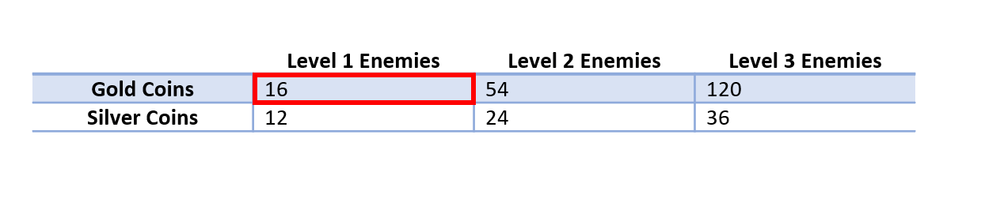

       > When a user moves focus to the current cell indicated in this table, the screen reader should read the following information:
       Column number, row number. Column header, row header. Cell contents.
       The exact text string narrated should be: “Column 2, row 2. Level 1 enemies, Gold Coins, 16.”

       **Movement between cell columns**

       

       > When moving left or right within the same row to a new cell, the screen reader should read:
       The column header, column number, cell contents.
       The exact text string narrated should be: “Level 2 Enemies, column 3, 54.”

       **Movement between cell rows**

       

       > When moving up or down within the same column to a new row, the screen reader should read:
       The row header, row number, cell contents.
       The exact text string narrated should be: “Silver Coins, row 3, 24.”

       

- Provide a mechanism for the player to understand how to pronounce a proper name, technical term, or word of indeterminate language.  

## Potential player impact

The guidelines in this XAG can help reduce barriers for the following players.

Player | Impacted
:------- | :-------:
Players without vision | **X**
Players with low vision | **X**
Players with cognitive or learning disabilities | **X**
Other: players who aren't fluent in the default spoken language, very young players (who can't read) | **X**

## Resources and tools

Resource type | Link to source
:--- | :---
Article | [Provide separate volume controls or mutes for effects, speech and background / Music (external)](http://gameaccessibilityguidelines.com/provide-separate-volume-controls-or-mutes-for-effects-speech-and-background-music)
Article | [How to use Windows Narrator (external)](https://www.howtogeek.com/392013/how-to-use-windows-narrator/)
Article | [UI Automation Overview](/windows/win32/winauto/uiauto-uiautomationoverview)
Article | [Designing for Screen Reader Compatibility (external)](https://webaim.org/techniques/screenreader/)
Article | [Ensure screenreader support for mobile devices (external)](http://gameaccessibilityguidelines.com/ensure-screenreader-support-for-mobile-devices)
Article | [Ensure screenreader support, including menus & installers (external)](http://gameaccessibilityguidelines.com/ensure-screenreader-support-including-menus-installers)
