# Xbox Accessibility Guideline 107: Input

## Goal

The goal of this Xbox Accessibility Guideline (XAG) is to ensure that a player can operate the gaming interface through input mechanisms of their choice.  

## Overview

Games often require the use of a wide array of input mechanisms like a mouse, analog inputs such as thumb sticks or triggers, the use of single-press digital inputs (like controller buttons or keyboards), voice or sound input, and many others. It's common for controller form factors as well as control schemes to often make assumptions about physical abilities without taking into account how diverse the player community is.  

Players can be excluded from a game experience by the input mechanism requirements that a game has; for example, a PC game that can only be played with a mouse and doesn't support keyboard input. This exclusion affects players who are blind and can't use devices (like a mouse) that require hand-eye coordination and players who have low vision. They might have trouble tracking a pointer or cursor on the screen. Players who have hand tremors might also find using a mouse very difficult and might prefer a keyboard instead.  

It's important to evaluate the type of input needed as well as the specific timing or speed needed to activate those inputs to play the game. For example, a player might be required to repeatedly mash two buttons to beat an in-game boss, or hold down the right trigger for 3 seconds to open a door. In these examples, players who can't meet the physical demands of quick, repetitive button presses or holding down buttons for longer periods of time are excluded from progressing through any points in the game beyond a boss battle or a closed door.  

Similarly, when menu UIs are strictly navigable through mouse or analog thumb stick input alone, a player who can only access single-press digital buttons might be unable to configure their settings or begin their game altogether.  

It's OK to have the primary interaction method for components in your game be through a mouse, an analog input, or any other mechanisms of your choice. However, to ensure that all players can enjoy the game, it's best to always provide alternative input options that a player can configure or choose to use. These alternate inputs should provide the player the same functionality as the default input option.

## Scoping questions

Anywhere a player is required to use analog inputs, such as mouse movement or thumb stick movement, the player should also be given the option to use single-press digital inputs to perform the same tasks.  

- Menu navigation: what input mechanisms are required to navigate your menu (mouse, keyboard, D-pad, or thumb stick)?  

- Analog controls: does your game require the use of an analog thumb stick or mouse movement to control a character’s movement?  

- Analog controls: does your game require the ability to use triggers to control a character’s movement (for example, a racing game where triggers control the speed of a car)?  

- Are there areas in your game where a player must press buttons quickly or hold them for prolonged periods of time (2-3 seconds or more)?

## Background and foundational information

It’s important to remember that input accessibility encompasses more than simple control remapping capabilities. While the ability to map a control from one button to a different button is critical to many players, this alone may not eliminate all input-related barriers for a player.

Consider the following additional aspects of input demands that may pose barriers to players, regardless of the ability to re-assign control mappings:

 - **Speed:** Consider the speed at which players must activate controls to successfully navigate game scenarios. For example, in a close-combat situation, the player may only have seconds to rapidly activate controls assigned to different attack methods like punch, block, or swinging a weapon. While re-assigning these controls to other physical locations on a controller or keyboard that the player can more easily reach is helpful, this does not mitigate barriers for players who cannot perform button presses at rapid speeds to defeat enemies. It’s also important to keep in mind that players may be activating their inputs in non-traditional ways that typically take longer than hand-based control activation such as using switch buttons mounted near their head, arms, legs or other body parts that take more time and effort to move.

 - **Complexity:** Game mechanics that require the activation of multiple buttons simultaneously or a rapid succession of button presses in a specific order can also pose additional barriers unrelated to basic control mapping solutions. For example, if a player must execute a combination of button activations, like X + X + RT + A to elicit a specific character attack needed to defeat a boss enemy, but the player cannot remember the combination or order of buttons due a to cognitive or learning disability, they can remain blocked from game progress regardless of their ability to assign X, RT, and A to different buttons on their controller.

 - **Duration:** The amount of time in which a player must hold down a control can also pose barriers to access, regardless of what that control is remapped to. For example, if a player must continuously activate an input to perform key game actions, like holding down RT to keep the car accelerating throughout a 3-minute race in a racing game, and become fatigued, re-assigning “accelerate" to an input other than RT does not effectively eliminate the source of this barrier.

Instead, consider the following approaches that may be offered in addition to remapping that may help eliminate broader input-related barriers for more players:

 - **Control game speed:** Consider allowing players to control the speed in which gameplay occurs. By allowing players to lessen game speed, they may have more time to perform offensive and defensive character controls in-between enemy attacks.

 - **Remappable actions:** Consider providing the ability to remap game actions instead of individual game controls. For example, if players must press A and B at the same time to perform the action of “picking up items,” instead, allow players to remap the action of “picking up items” to simply the X button. This provides players with an opportunity to further customize their gameplay and focus on performing the action at hand without being blocked by their physical ability to hold multiple buttons at once or remember the button combination associated with an action.

 - **Toggles and “auto” holds:** For game controls that must typically be held down for longer periods of time like accelerating, sprinting, firing a weapon, repetitive jumping, etc. consider allowing players to toggle this action on permanently. For example, in Minecraft, players can enable “auto-jump” – instead of activating the jump control each time a step is approached, the character automatically jumps over. This similar approach can be taken for controls like auto-fire, auto-sprint, and more depending on the nature of the game.

## Implementation guidelines

- UIs throughout the game should support digital and analog navigation, including menu UI and in-game UI.  

    

    
Example (expandable)

    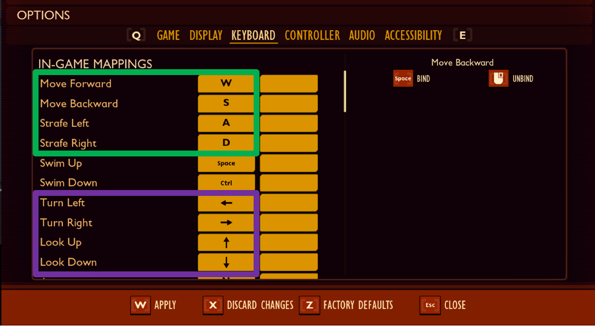

    > In the game Grounded on PC, the player can control their character’s movement with the WASD keyboard keys to walk forward, backward, left, and right. In addition to movement, the character’s ability to look to the right or left side or turn around completely is crucial to gameplay. This can ordinarily be achieved by using W A S D to walk and mouse movements to turn in a particular direction. However, for players who can't use analog movements (like a mouse), the game also provides the option to use keyboard arrow keys (the Up arrow key, Down arrow key, Left arrow key, and Right arrow key) to look in those four directions, eliminating the use of the mouse as an essential input. Further, all keyboard inputs and mouse clicks can be remapped to other buttons or mouse clicks of the player’s choice.  
    

- A UI should be navigable by using single, non-simultaneous key presses.

    

    
Example (expandable)

    [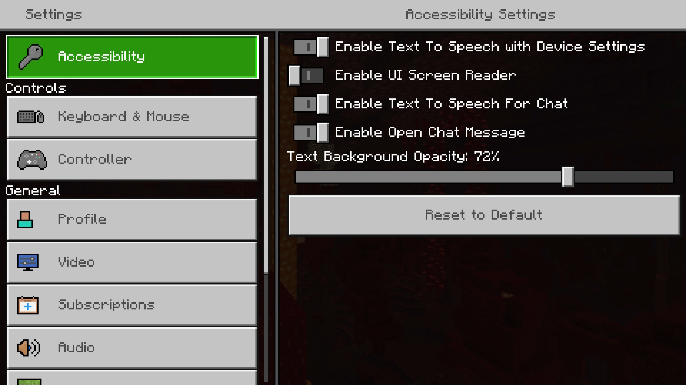](https://youtu.be/2gQcoi2qNqw "Click to open the video example.")  

    [Video link: UI navigation by using single, non-simultaneous key presses](https://youtu.be/2gQcoi2qNqw "Click to open the video example.")

    > While configuring settings in Minecraft, only single key presses are required to adjust settings&mdash;even slider inputs.  
    >
    > In contrast, for some games, a player must hold down a button (such as holding down “A”) while adjusting the slider left or right so that the slider doesn't lose focus.  
    >
    > In this example, the player can simply tap “A” to select once, and then use either the thumb stick, or single digital inputs from the D-pad, to adjust the slider left and right. There's no instance where multiple buttons should be pressed simultaneously or held down to complete actions.  
    

- Players should be given the option to remap all of the controls within the game itself, regardless of platform-level remapping support that might be present. This includes remapping analog and digital controls, inverting both the x-axis and y-axis individually for each individual control stick, and the Esc key on PC games.

    

    
Example (expandable)

    [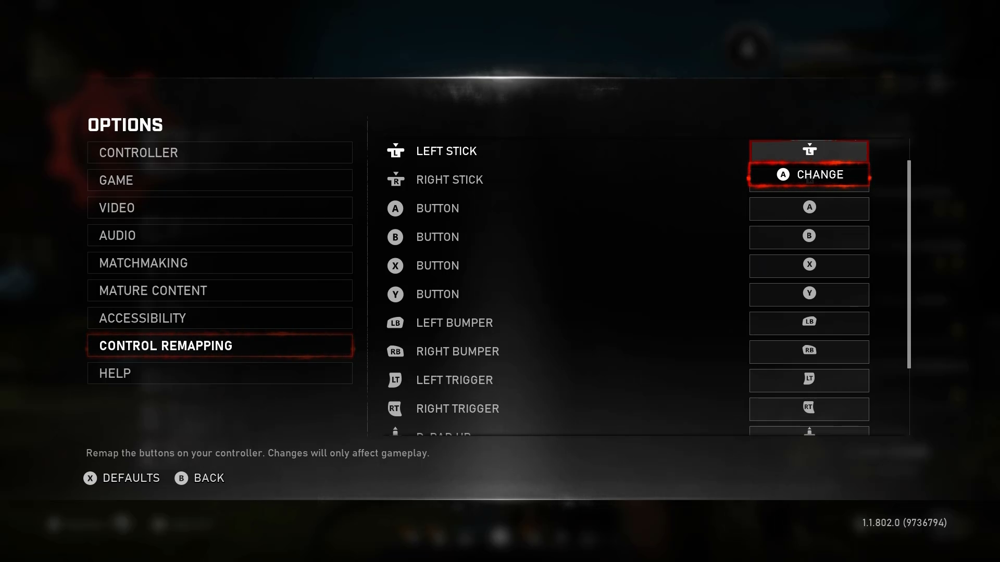](https://youtu.be/tJRrUNQSqnU "Click to open the video example.")  

    [Video link: control remapping](https://youtu.be/tJRrUNQSqnU "Click to open the video example.")

    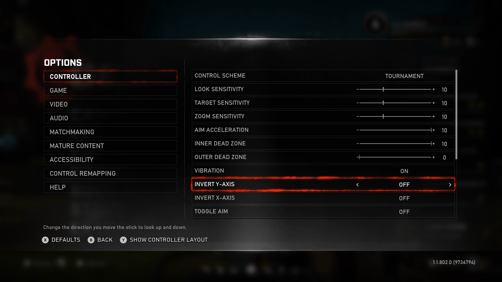

    > Although the Xbox platform has platform-level controller remapping capabilities, Gears 5 also provides game-specific remapping screens for each control and the ability to invert the x-axis and y-axis of thumb-stick movements.  
    

    - This should ideally allow the player to assign an action to all potential game inputs, as opposed to simply swapping button assignments.  

- When a player remaps a control within the game, the labelling of the new mapping is represented correctly across any hints, tips, tutorials, or controller map schemes.  

- All interface components should be fully operable with digital input&mdash;even if the primary mode of input is intended to be analog. This relates to the function, not the input technique. For example, if a player is using analog triggers for gas in a racing game, the game should work properly if the control is remapped to a digital control like the “A” button.  

- Avoid introducing mechanics where a player is required to repeat or execute multiple keystrokes or button presses within a short period of time (like quick-time events (QTEs)).  

    

    
Example (expandable)

    

    

    > Gears 5 allows the player to choose their preferred input mechanism for areas in the game where quick button taps are crucial to gameplay. Players can choose to press and hold a button during these scenarios, or quickly tap buttons. Both options provide the same functionality and increase the ability of the player to progress through the experience without being blocked by an input mechanism that they can't physically activate.  

    > [!NOTE]
    > Quick taps, as well as prolonged button holds, can be difficult for players with mobility-related disabilities. Additional options that don't rely on either of these mechanisms or allow the player to skip “quick tap challenge” areas will provide an even more accessible experience.  
    

- Avoid introducing mechanics where a key or button should be held down for an extended period before the input is registered.  

- Avoid introducing mechanics where a player is required to press two buttons simultaneously to activate a function.

- If inputs that require repeated button strokes, prolonged button presses, or simultaneous button presses cannot be avoided, provide an alternative input option that is either less physically demanding or allow the player to bypass game events that require the use of using these mechanics, or that part of the game experience altogether.

    

    
Example (expandable)

    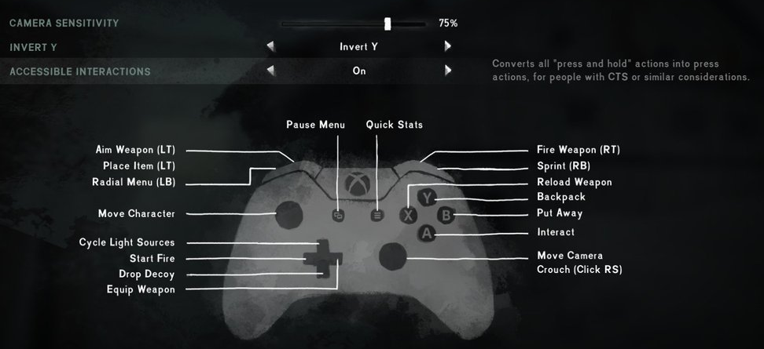

    > In The Long Dark, there is an “accessible interactions” feature, which “converts all press and hold actions into press actions, for people with CTS [carpal tunnel syndrome] or similar considerations.”

    

- Ensure that content can be operated without multi-point gestures&mdash;or the functionality can also be operated by another method, such as a tap, click, double-tap, double-click, long press (less than 3 seconds), or click and hold.

    

    
Example (expandable)

    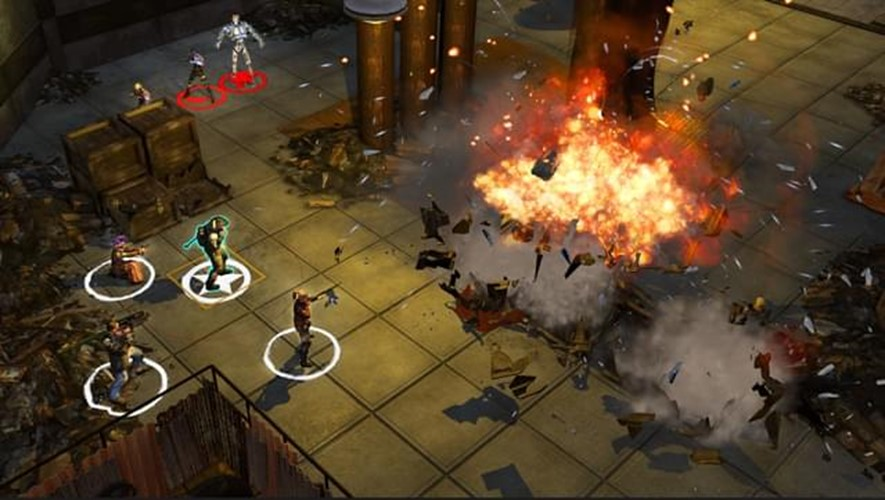

    > In Wasteland 2, character movement can be accomplished by clicking and holding the mouse button and moving the cursor around the map. The party moves by following the pointer. The player can also simply click once, anywhere on the map, and the party will move to that position if they're able. Players who are unable to sustain a prolonged click of the mouse button, in addition to moving the mouse to the location that they want while maintaining the sustained press, can use the single-click-to-move option.

    

    - *Multi-point gestures* are interactions that require two or more points of contact with touch-screen input devices such as mobile phones or tablets. For example, using a “pinch to zoom” gesture or a two or three finger swipe.

- Ensure that content can be operated without path-based gestures. This includes mouse/cursor movements as well as touch-screen, path-based gestures.  
    - Path-based gestures usually require a single point of contact. However, these gestures require a certain level of dexterity and coordination to move the cursor in a specific way like swiping horizontally or vertically, clicking and dragging, or drawing specific shapes to initiate the operation.  

- For content that can be operated with a single pointer (like a mouse/cursor or touch screen), use the following guidance.  

    - The *down click* or *down press* (the *down event*) on an item doesn't automatically activate that item. Activation occurs on the *up event*, which is when the button or press is being released. (For example, when a player hovers their mouse over a button and clicks, the button’s function is not immediately activated as the player presses their mouse button “down.” The button is only activated on the up event, or as the player is releasing the mouse button. This also applies to touch-screen experiences.)
        

        
Example (expandable)

        [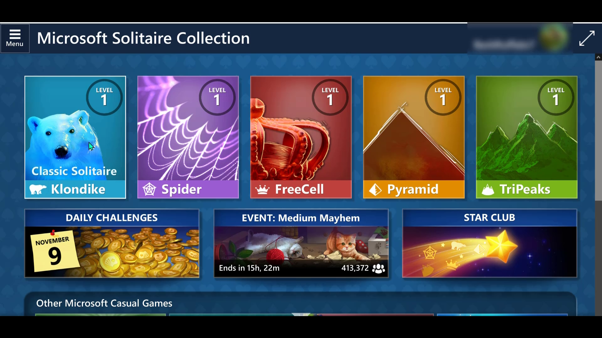](https://youtu.be/16dwj-Aek54 "Click to open the video example.")  

        [Video link: no action on the down event](https://youtu.be/16dwj-Aek54 "Click to open the video example.")

        > This example of Microsoft Solitaire Collection on PC demonstrates how the down event on an item doesn't automatically open the app of the tile being clicked. The tile for the app is only opened after the player releases their mouse button (the up event). If the player hovers over a tile and the mouse clicks in error, the player can move their cursor away from the tile that they don't want before they release their mouse click, thus canceling the opening of the app by the tile.  
        >
        > This feature is important for players who have disabilities that can affect their coordination, precision, or fine-motor movements. Unintentionally clicking a button can be frustrating or result in negative consequences for the player. The ability to move the cursor away before the up event (releasing their mouse button or finger) to cancel an unwanted action makes the experience more accessible.  
        

    - A mechanism is available to cancel the action before completion. (For example, if a player touches down on the wrong location or item, they can move their cursor or finger away from that location before the up event or click release. This cancels the unintended action.)  

    - If a mechanism to cancel the action isn't available, a simple mechanism to undo the action is provided.  

    > [!NOTE]
    > There might be circumstances where activating the function on the down event is essential. If it's essential, the previous guidelines shouldn't be taken into consideration for that specific function. (Essential down-event functions can include experiences like a simulation of playing the piano or shooting a gun. The experience would become very unnatural if activation didn't occur until the up event).  

- Any gameplay-critical input that uses speech or motion controls as a default has an alternative digital input mechanism (for example, a keyboard alternative for a motion-based game).

    

    
Example (expandable)

    Although somewhat uncommon in game experiences today, any non-traditional inputs such as motion controls or speech should have alternative digital input mechanisms. For example, a player who wants to enjoy an experience like the Kinect Adventures raft game but can't jump should have the ability to press a button on a controller or keyboard to simulate a physical “jump.”  

    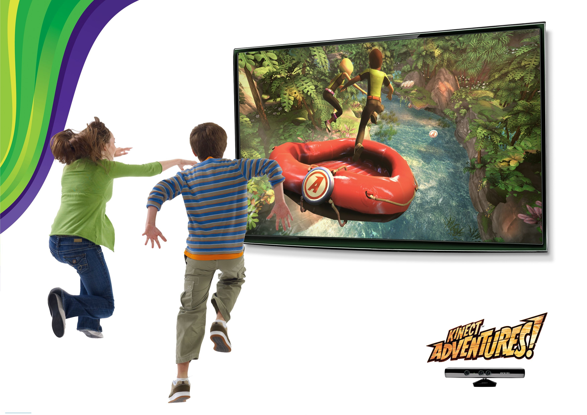
    

- Games should not require the use of two analog sticks (or an analog stick and directional pad) to complete mechanics.

    - Some games natively support a single stick due to the style/genre of game. However, even games that traditionally require two sticks (for example, first person shooters) can include options for single stick control. 

    - Some games recognize a press-in (or "click") of a stick as an input. Even if the game is not using a second stick for directional input, if a click is required on that second stick, that input should be able to be remapped to another button.

    - Some games use D-pad for behaviors beyond character movement, such as weapon or item selection. If a game requires using a D-pad for such input, that input should be able to be remapped to other unused buttons or activated through other means other than analog sticks (such as from a menu).

- For games that support keyboard input, players should be able to access all controls needed to start the game, adjust settings, play the game, and exit from the game back to the platform's home screen using a keyboard alone.

- An option to adjust sensitivity of analog controls individually should be provided at the game level. This includes the ability to adjust the sensitivity of analog thumb sticks, joysticks, triggers, racing wheels, and mouse movement as applicable.

    - Players should be able to increase or decrease sensitivity by at least 50% of the default sensitivity.

### Guidelines for mobile input

The following guidelines are specific to touch-based inputs or controls (typically present on mobile gaming experiences).

The term “touch target” refers to any defined space on the device’s screen that activates a specific control or game input upon contact with the player’s hand or finger.  

- **Offer players the ability to use non-touch input types such as:**
  - Standard controllers
  - Adaptive controllers
  - Physical keyboards
  - Mouse
  - Assistive technologies (platform switch access, voice input, head movement-based controls via the device’s camera, etc.)

- **Support mobile-native input accessibility features.**
   > [!NOTE]
   > Many mobile platforms like iOS and Android natively support switch access, movement-based controls, and voice controls as described in the following text.
   >
   > - **Switch control:** Players who are unable to interact with their devices directly through touch may be using switch-access buttons mounted near other parts of their body such as their head, arms, or legs to navigate their mobile devices. Ensuring your game is compatible with platform-supported switch access navigation allows these players to use these assistive technologies during their gaming experiences as well.
   >
   >   

   >   
Example (expandable)

   >
   >   
   >
   >   [Video link: Apple Switch scanning on Xbox mobile](https://www.youtube.com/shorts/gTgdPLNEnTw "Click to open the video example.")
   >
   >   The My Library page on the Xbox App is switch accessible for iPadOS. Groups of items on the page are scanned sequentially, as indicated by the blue focus indicator. Once the  item group containing the user’s desired UI element has focus, users can activate their switch button to scan one level deeper within that item group. In this example, the user wishes to launch the game “Among Us.” The user scans past the “My Library” title, the “Captures, Games, and Consoles” tab, and the filter and sort buttons until focus is on the grouping of game tiles. Once this grouping is selected, the user scans through each row of tiles until they reach the row of tiles containing Among Us.
   >
   > 

   >
   > - **Voice control:** Some device platforms support mobile device navigation via voice control. Players may be able to use voice commands to activate inputs or game controls.
   >
    >   

    >   
Example (expandable)

    >
    >   
    >
    >   [Video link: Apple Voice Control in Adventure to Fate: Quest to the Future](https://www.youtube.com/watch?v=Ig2dcIlA68k "Click to open the video example.")
    >
    >   In [Adventure to Fate: Quest to The Future Arena](https://apps.apple.com/us/app/adventure-to-fate-future-arena/id1084641332) developed by Randal Higgins at TouchMint, Apple Voice Control can be used to play the game without physical controls. Players can perform all game actions including movement, navigating  the UI, and battling monsters.
    >
    

- **Support gameplay in both portrait and landscape screen orientation.**
    >[!NOTE]
    > Some users have their mobile devices mounted in a fixed position onto their wheelchair arm or table. By supporting play in both portrait and landscape orientation, these players can avoid having to change their mounting position or set up.

    

    
Example (expandable)

    
    
    
    
    In the Microsoft Casual Game, Microsoft Wordament, when a player re-orients their screen from portrait to landscape mode, the game’s UI reflows accordingly and can be played in either orientation.
    

- **Allow players to adjust the size, spacing, and positioning of all touch targets at their discretion.**
    

    
Example (expandable)

    
    
    
    [Video link: Call of Duty Mobile Customizable Touch Controls](https://www.youtube.com/watch?v=Wdgqe4Ja_WU "Click to open the video example.")
    
    In Call of Duty: Mobile, players can customize the size and position of each of the game’s touch targets. They can also save their configurations as a custom layout.
    

- **Provide a range of pre-set touch target layout configurations.**
    

    
Example (expandable)

    
    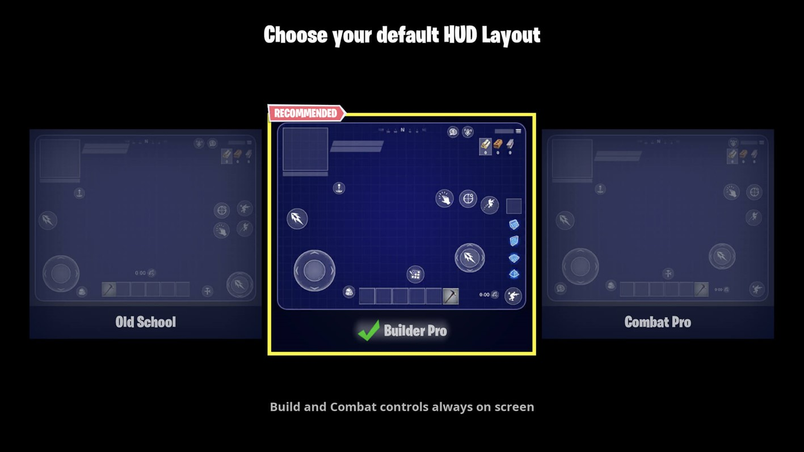
    
    In Fortnite for mobile, three pre-set HUD layout choices are provided. They are labeled based on the type of gameplay the layout best serves including “Builder Pro” and “Combat Pro” options.
     
    

- **The default touch target layout and pre-set layout configuration options should adhere to the following:**

  - **Touch target areas should be large enough to see and interact with easily. The following are the suggested minimum default sizes:**

    - **Mobile phones**:
      - 15 mm high by 15 mm wide, or 15 mm in diameter
      - 59 by 59 px at 100 DPI
      - 118 by 118 px at 200 DPI
      - 236 by 236 px at 400 DPI
      - Scale linearly as DPI increases

    - **Tablets:**
      - 24 mm high by 24 mm wide, or 24 mm in diameter
      - 94 by 94 px at 100 DPI
      - 189 by 189 px at 200 DPI
      - 378 by 378 px at 400 DPI
      - Scale linearly as DPI increases
  
  - **Touch targets should be spaced widely enough to prevent accidental activation of other controls.**
    

    
Example (expandable)

    
    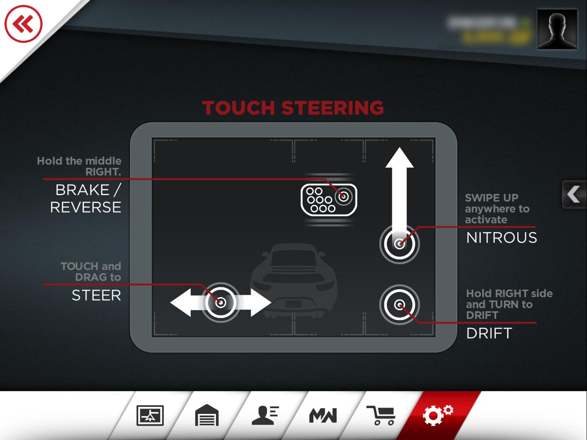
    
    In Need for Speed Most Wanted, the Touch Steering controls are split up on two halves of the screen. The left half of the screen is for steering. The right half is split into two columns; the left column is for braking while the right is for nitrous and drift. By default, these controls have a good amount of space between one another to decrease the likelihood of accidental activation.
    

- **Consider surrounding each touch target with a small amount of inactive space to limit accidental activation of other controls.**
    

    
Example (expandable)

    
    
    
    In this fictional game, each touch target is surrounded by an area of inactive screen space indicated by red, semi-transparent circles and rectangles. Surrounding each touch target with areas of inactive space can help players decrease the likelihood of accidentally hitting touch targets that are close to their intended target. For example, the virtual joystick placed on the left side of the screen is very close to the archer character. However, the inactive area of the screen between the boundary of the touch joystick and the archer character’s foot can help prevent players who moved their joystick too far in the “up” direction from accidently selecting the archer character mid-combat scene.

- **Provide players with an opportunity to cancel a decision or correct a recent interaction mistake. For example:**
  - Allowing a player to Short Press and Drag to cancel a button press.
  - Allowing a player to undo an action via an “Undo” button.
  - Allowing a player to release a held object or entity by pulling it outside of the playable area.
    

    
Example (expandable)

    
    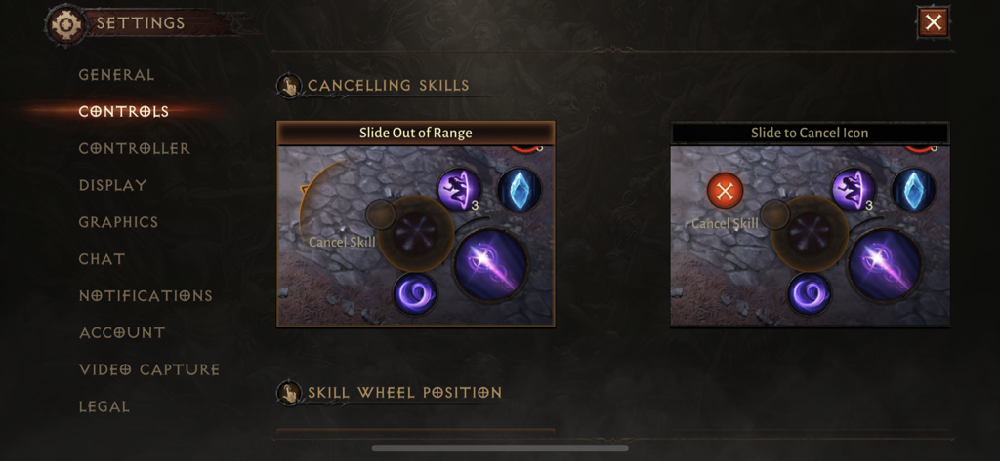
    
    In Diablo Immortal, there are two options for cancelling a skill selection. Slide Out of Range lets players cancel a skill by dragging to outside the skill range. Slide to Cancel Icon lets players drag to a Cancel Skill icon that appears upon touching a skill.
    

- **Allow players to adjust aspects of input such as swipe sensitivity.**
    

    
Example (expandable)

    
    
    
    In Call of Duty: Mobile, touch input is used to adjust the player’s camera angle, zoom, and more. In this menu, players can adjust the swipe sensitivity of each individual type of camera movement.
    

- **Consider offering simplified control schemes or options to reduce the number of controls needed to play the game.**
    

    
Example (expandable)

    
    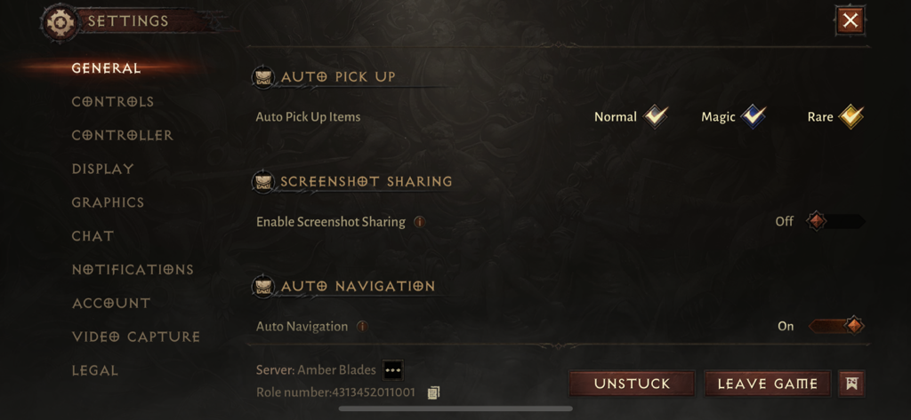
    
    In Diablo Immortal, players can enable the “auto pick up items” option for normal, magic, and rare type items. This  eliminates the need for a designated “pick up” touch control on the screen.
    
    
    
    In Call of Duty: Mobile, there are two fire modes; simple and advanced. In simple mode the gun will automatically fire  when a player aims at their target. This removes the need for a dedicated “fire” touch target and provides a more simplified control scheme.

    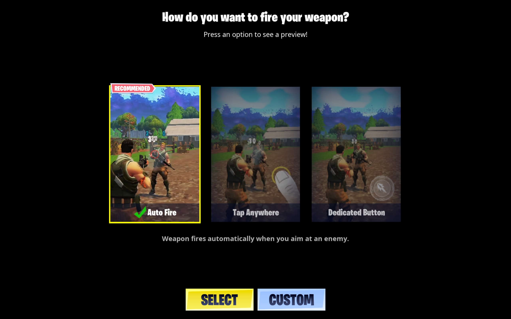

    In Fortnite on mobile, players can choose between three different ways to fire their weapon: Auto fire, tapping anywhere on the screen, or tapping on a dedicated fire button. This allows players to choose an input method that works best for their level of mobility, accuracy, and more.

- **Avoid or provide alternative input options for common challenging input types including:**
  - Prolonged touch target holds
  - Dragging or swiping gestures
  - Rapid taps
  - Multi point gestures
  - Multi-finger gestures or simultaneous button presses
  - Speech input
  - Gyroscopic controls such as tilting or shaking the device
    

    
Example (expandable)

    
    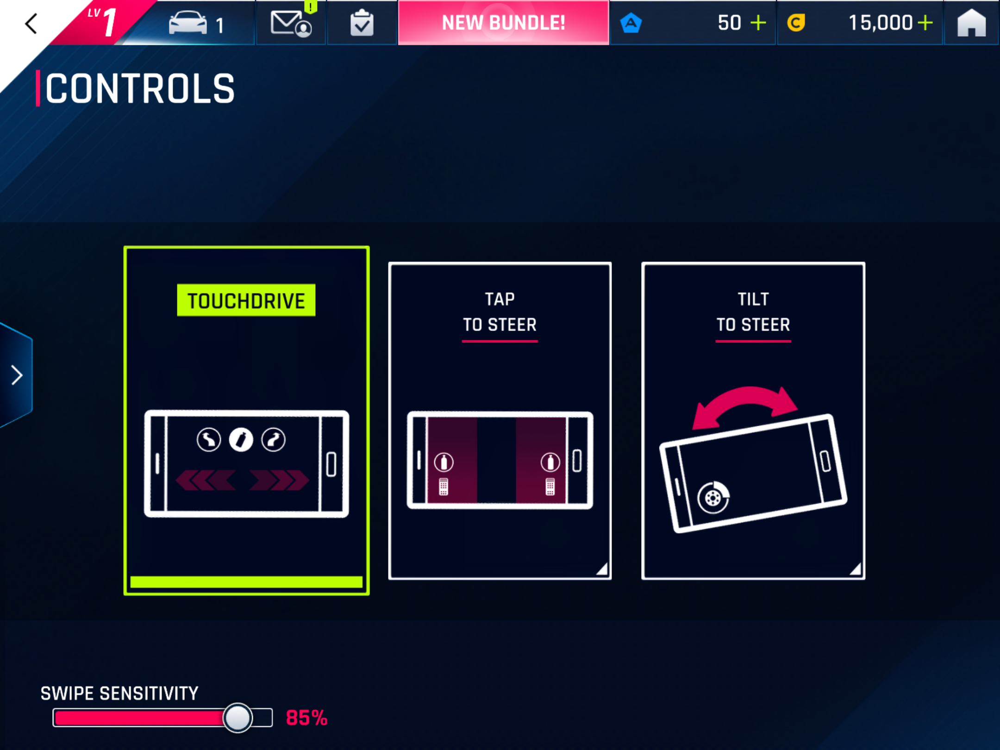
    
    In Asphalt 9: Legends, there are three control type options:  touchdrive, tap to steer, and tilt to steer. All three game modes support an automatic acceleration option for players who wish to avoid prolonged holds and presses.
    
    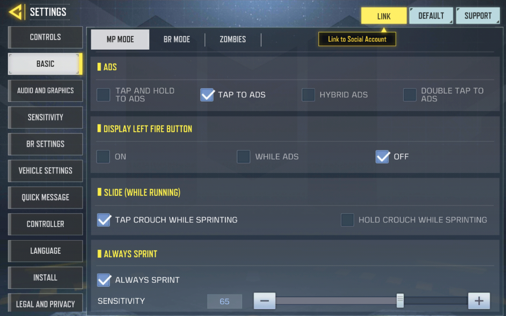
    
    In Call of Duty: Mobile, players can enable options like “always sprint,” to decrease the number of controls needed to play the game. Additionally, they can change the type of input needed to activate certain controls. For example, players can choose between “tap and hold,” “tap,” “hybrid,” and “double tap” to activate their ADS.
    

- **Control activations should occur on touch-end or mouse-up events.**
    >[!NOTE]
    >
    > Touch-end: The control is activated when the user removes their finger from the screen, not the point in which initial contact is made.
    >
    > Mouse-up: The control is activated when the mouse button click is released, not the point  in which it is initially clicked downward.
    

- **Support speech-to-text or dictation-based input. This is important for areas like text-based input fields and text-based party chat experiences.**
    

    
Example (expandable)

    
    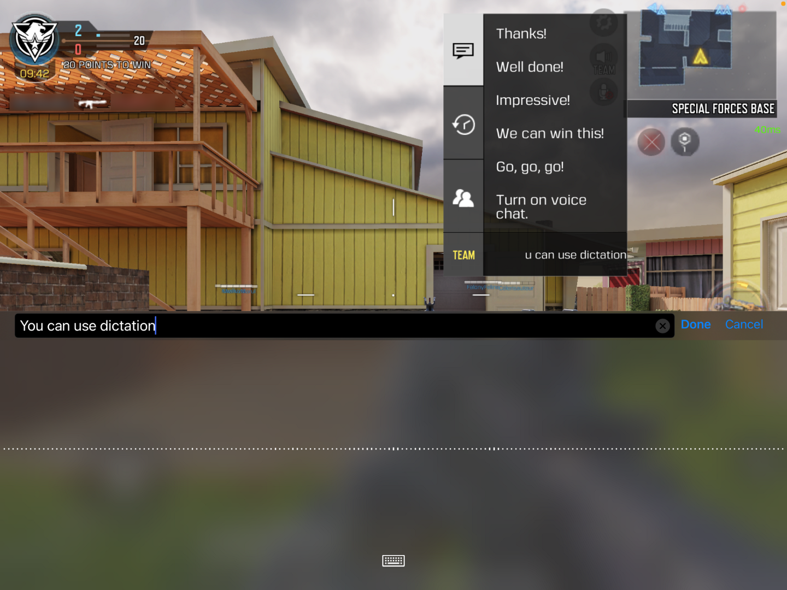
    
    In Call of Duty: Mobile, players can use the dictation functionality in their on-screen keyboard to dictate messages in team chat matches.
    

- **Ensure the customization process itself is fully accessible. This includes all necessary tasks needed to resize controls, move controls, re-assign controls, or select pre-set layout configurations.**

## Potential player impact

The guidelines in this XAG can help reduce barriers for the following players.

Player | Impacted
:------- | :-------:
Players without vision | **X**
Players with low vision | **X**
Players with little or no color perception | **X**
Players without speech | **X**
Players with cognitive or learning disabilities | **X**
Players with limited reach and strength | **X**
Players with limited manual dexterity | **X**
Players with prosthetic devices | **X**
Players with limited ability to use time-dependent controls | **X**
Other: players with chronic pain, players who fatigue easily, players who use assistive technology inputs, players with limited coordination, precision, or strength | **X**

## Resources and tools

Resource type | Link to source
:--- | :---
Article | [Ensure that all key actions can be carried out by digital controls, with more complex input not required, and included only as supplementary / alternative input methods (external)](http://gameaccessibilityguidelines.com/ensure-that-all-key-actions-can-be-carried-out-by-digital-controls-pad-keys-presses-with-more-complex-input-eg-analogue-speech-gesture-not-required-and-included-only-as-supplementary-al)
Article | [Include an option to adjust the sensitivity of controls (external)](http://gameaccessibilityguidelines.com/include-an-option-to-adjust-the-sensitivity-of-controls)
Article | [Ensure that multiple simultaneous actions are not required, and included only as a supplementary / alternative input method (external)](http://gameaccessibilityguidelines.com/ensure-that-multiple-simultaneous-actions-eg-clickdrag-or-swipe-are-not-required-and-included-only-as-a-supplementary-alternative-input-method)
Article | [Avoid repeated inputs (external)](http://gameaccessibilityguidelines.com/avoid-repeated-inputs-button-mashingquick-time-events)
Article | [Avoid / provide alternatives to requiring buttons to be held down (external)](http://gameaccessibilityguidelines.com/avoid-provide-alternatives-to-requiring-buttons-to-be-held-down)
Article | [Provide a macro system (external)](http://gameaccessibilityguidelines.com/provide-a-macro-system/)
Article | [Provide very simple control schemes that are compatible with assistive technology devices, such as switch or eye tracking (external)](http://gameaccessibilityguidelines.com/provide-very-simple-control-schemes-that-are-compatible-with-assistive-technology-devices-such-as-switch-or-eye-tracking)
Article | [Do not rely on motion tracking of specific body types (external)](http://gameaccessibilityguidelines.com/do-not-rely-on-motion-tracking-of-specific-body-types/)
Article | [Ensure controls are as simple as possible, or provide a simpler alternative (external)](http://gameaccessibilityguidelines.com/ensure-controls-are-as-simple-as-possible-or-provide-a-simpler-alternative)
Article | [Use Switch Control to navigate your iPhone, iPad, or iPod Touch (external)](https://support.apple.com/en-us/HT201370)
