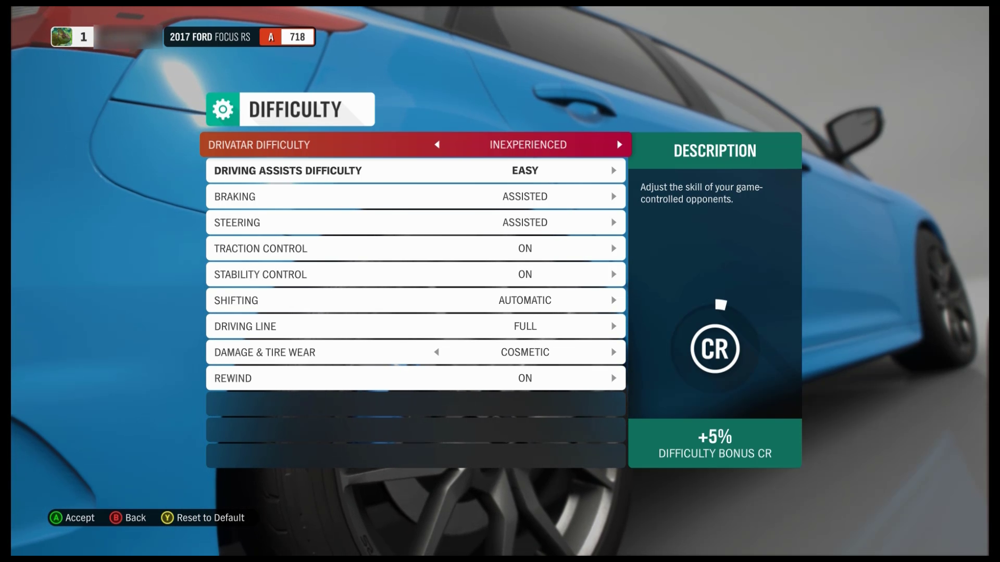
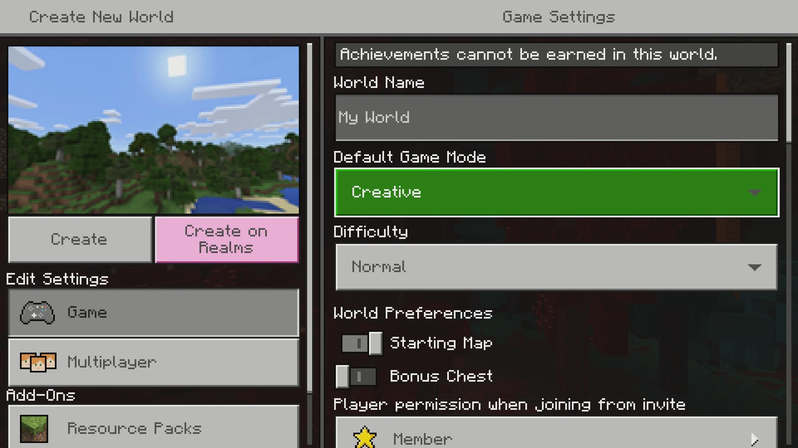
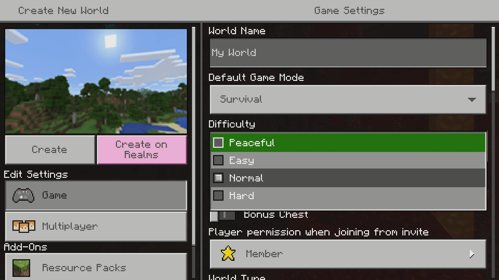
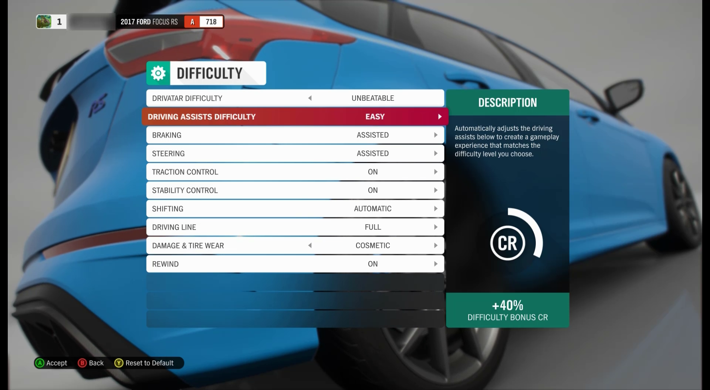
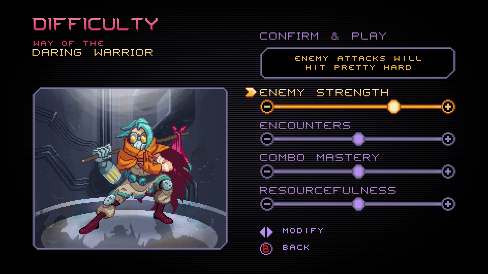
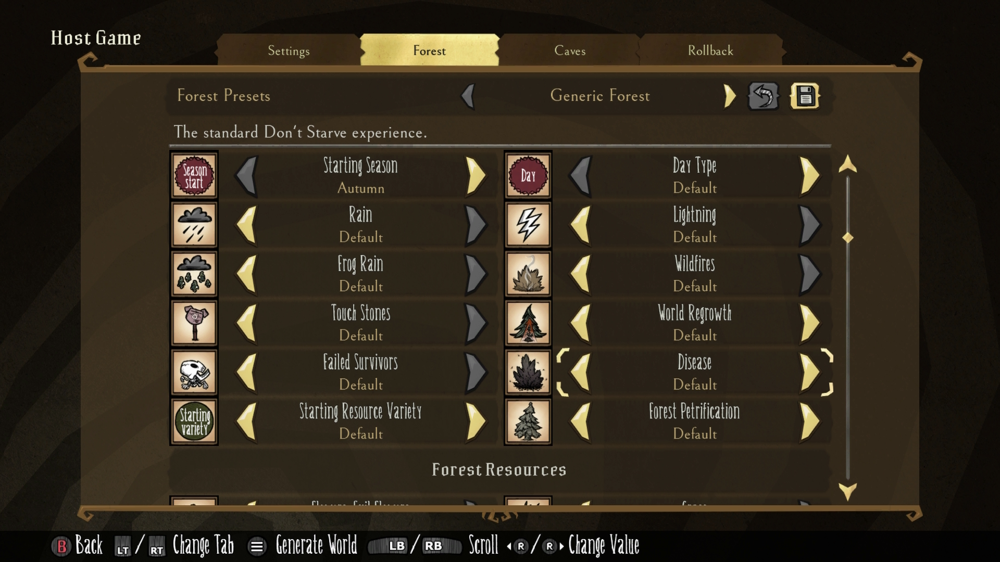
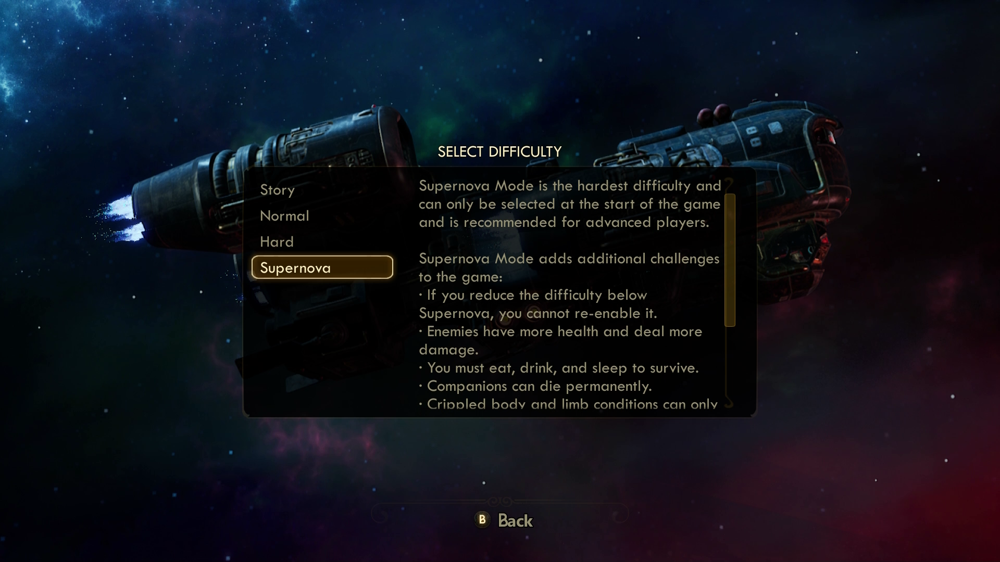

# Xbox Accessibility Guideline 108: Game difficulty options

## Goal

The goal of this Xbox Accessibility Guideline (XAG) is to ensure that game titles provide multiple difficulty options so that all players can enjoy and complete games, regardless of their skill level.  

## Overview

The “difficulty” of a game is a subjective construct. The level of difficulty that a player experiences isn't defined by the game. The level arises from the balance between the player's abilities and the barriers that the game presents. A fixed set of barriers in a game results in different players experiencing different levels of difficulty&mdash;what’s too easy for one player is enjoyably challenging for another player. However, the same game might be too hard for another player. It's important to remember that different aspects of games can provide different types of challenges for players. For example, a game that's rated “difficult” might introduce game mechanics that are challenging for a player with a certain type of disability. However, younger players, casual gamers, or those who are new to gaming might also need to use a lower difficulty setting. Some players purchase games for the sole purpose of appreciating the art or story line. These players, regardless of skill level, might set their difficulty to “easy” or “story mode” to enjoy the game for its art or story line.

Overall, the key goal to keep in mind is ensuring that players have a way to enjoy the game in its entirety by providing options to lessen the difficulty of game experiences that might block a player from progressing. An inability to get past certain levels, game events, or game mechanisms blocks the player from enjoying the remainder of the story line and other content that they set out to enjoy. Games without configurable difficulty modes might block a player from the game altogether.

Difficulty is often thought of as “Easy/Normal/Hard,” but these are broad categories that often encompass a wide set of variables. It's important to recognize that different aspects of games provide different types of challenges. Players might want or need to configure these aspects individually. For example, a game requires players to complete in-game puzzles and fight in combat matches against enemies. A player who has difficulty with quick, fine-motor tasks like button mashing and navigating thumb sticks to successfully fight enemies in combat might want to lessen the difficulty of combat experiences. However, they might not want to decrease other aspects of the game, like the puzzle difficulty level. Conversely, a player who has a visual or cognitive disability might want to adjust the difficulty of the in-game puzzles but maintain the current difficulty for combat against enemies.

Providing multiple options for game difficulty levels in addition to the ability to configure individual core game mechanics can help ensure that a player isn't blocked from enjoying the game in its entirety.

## Scoping questions

Identify core mechanics/scenarios in your game that might contribute to the difficulty of gameplay. Assess how each core scenario can be “graded” to increase or decrease the level of difficulty.

Here are _example_ core scenarios and options for grading to help guide thinking and generate ideas. Individual core mechanics and difficulty grading options will differ for a specific game.  

**Example core mechanics:** Primary game functions that players should be able to perform to progress in gameplay.  

- Players should be able to kill enemies at a distance (requires precision aiming).  

- Players should be able to maintain their hunger, thirst, and mental health meters throughout the game (requires active memory and monitoring, as well as physical mechanisms that are required to restore meters when low).  

- Players should be able to kill enemies in close combat (requires quick, repetitive button mashing).  

- Players should be able to remember their objectives to inform their next steps to progress in gameplay (requires active memory and problem-solving skills).  

- Players should be able to solve puzzles throughout the game (requires varying degrees of cognitive skills and visual/perceptual skills).  

- Players must meet time limits for certain tasks throughout the game (might require quick, physical movements on the input device).  

- Players should be able to remember where key locations are (requires working memory and cognitive problem-solving skills if no map is available).  

**Example grading options:** Components of a game mechanic that can be adjusted to increase or decrease the overall difficulty of that mechanic across a spectrum to accommodate a wider range of player skills.  

> [!NOTE]
> These are example concepts to help generate ideas&mdash;it's best to consult with your studio’s user research partners and the Gaming & Disability Community to determine what options provide the most inclusive experience for your specific game.  

Example 1:  

- Core mechanic: Players should be able to kill enemies at a distance.  

Areas where difficulty can be graded:  

- Number of enemies: no enemies > few enemies > moderate enemies > many enemies.  

- Size of enemy target: N/A (no enemies) > large target > moderately sized target > small target.  

- Enemy health (number of times that players must hit the target): N/A (no enemies) > low health (requires a few shots on the target to kill) > moderate health > high health (requires many shots on the target to kill).  

Other potential resources to decrease difficulty:  

- Ability to turn on aiming reticle.  

- Auto Target Lock features.  

- Other types of precision assists.  

Example 2:  

- Core Mechanic: Players must maintain their hunger, thirst, and mental health meters throughout the game (monitoring current levels).  

Areas where difficulty can be graded:  

- Speed of meter depletion: N/A (player has unlimited health) > large meter (player starts with large meter, and it takes longer to deplete fully) > moderately sized meter > small meter (depletes quickly, requires frequent restoration).  

- Resources available to increase meters: N/A (player has unlimited health) > abundance of resources (items needed to maintain meters are plentiful, easy to find, and easy to obtain) > moderate amount of resources available > scarce amount of resources available, difficult to find.  

- Notification/reminders of health status: N/A (player has unlimited health) > obvious and frequent reminders/tips on how to restore meters > moderate amount of reminders > minimal reminders of meter depletion.  

## Implementation guidelines

- Include multiple levels of difficulty presets (ideally four or more, covering a wide range of values to ensure that players with a wide array of gaming experiences and ability levels can choose a difficulty mode that provides the level of challenge that they want).

    

    
Example (expandable)

    

    > In Ori and the Blind Forest: Definitive Edition, there are four difficulty level options. Each level has a description that provides players additional context on what they should expect for each difficulty level.

    

    [Video link: multiple levels of difficulty](https://youtu.be/MQYYyxk4POY "Click to open the video example.")

    > Forza Horizon 4 has eight different Drivatar Difficulty modes that the player can choose from, including New Racer, Inexperienced, Average, Above Average, Highly Skilled, Expert, Pro, and Unbeatable.

    

    > [!NOTE]
    > Game “modes,” such as “creative mode,” aren’t considered a difficulty option if the creative mode doesn’t provide the same gameplay experiences, resources, and opportunities as the primary game mode.
    >
    > 

    > 
Example (expandable)

    >
    > 
    >
    >> In Minecraft, players can choose Creative Mode or from four difficulty levels in Survival Mode (Peaceful, Easy, Medium, Hard).
    >
    > 
    >
    >> In Creative Mode, the player is given unlimited resources, free flying, and the ability to instantly destroy blocks when mining. Players are also unable to receive achievements in Creative Mode. Because the nature of gameplay mechanics in Creative Mode is vastly different from what’s presented in “Survival Mode,” the game’s Creative Mode option isn’t considered an additional difficulty setting that would be included toward the “ideally 4+” recommended settings.
    >
    > 
    >
    >> However, Minecraft still meets applicable XAGs . Despite Creative Mode not counting as a difficulty preset, the game still provides at least four difficulty presets for the Survival game mode.
    > 

- Provide players with the option to change difficulty at any time without losing game progress, regardless of whether they have already started the game.

- Provide players the ability to regularly save game progress. Ideally, both manual and auto-save options should be provided so that players can continue after failure without significant loss of progress.

    

Example (expandable)

    

    > In Grounded, the player can adjust the Auto-save Interval in one-minute increments of up to 20 minutes. The player can also adjust the number of past auto-saves to keep. These options can help ensure that players don't lose progress. Additionally, if the game auto-saves while the player is in a difficult situation, the player can navigate to a previous auto-save and “start over” from a different point in the game.

    

- Provide the ability for players to discretely adjust the difficulty of different mechanics. This can either be though explicit difficulty settings (like Puzzle Difficulty and Combat Difficulty) or through a set of assists (like Brake Assist and Auto-Aim).

    

Example (expandable)
  

    

    [Video link: adjusting difficulty of discrete game mechanics](https://youtu.be/OzYVvFgMNLc "Click to open the video example.")

    > In Forza Horizon 4, the player can discretely configure the difficulty of individual game mechanics in addition to adjusting the Drivatar Difficulty modes. Mechanics like Driving Assists, Braking Assists, Steering Assists, Traction Control, Stability Control, and more can individually be adjusted from one another.

    

    [Video link: difficulty adjustment of discrete game mechanics](https://youtu.be/NvHOtaCkrIA "Click to open the video example.")

    > In Way of the Passive Fist, players can individually configure their Enemy Strength, Encounters, Combo Master, and Resourcefulness levels.

    

    [Video link: difficulty adjustment of discrete game mechanics](https://youtu.be/SezlRr6QURU "Click to open the video example.")

    > In Don’t Starve Together, players can configure a multitude of aspects of the game that contribute to the overall gameplay difficulty. This includes game mechanics like the abundance of food resources, the regeneration time of resources, the presence of each specific type of monster/enemy, and more.

    

- Provide an ultra-low difficulty mode for the game that enables a wide range of players to progress through the narrative.

    

Example (expandable)
  

    

    > In Grounded, one of the four difficulty modes is “Creative” mode. Players can “craft and explore” without the need to manage resources or deal with threats. This “zero stress” mode provides a way for players to enjoy the game, regardless of their ability to fight enemies, follow objectives, or manage resources.

    

- Consider providing a mode for players to complete the entire game by using a greatly reduced control scheme. This is important for players with especially severe disabilities or those who simply want to experience the game's narrative.

- Ensure that the language used to describe the difficulty presets is descriptive and doesn't denigrate the player (for example, "Wimp Mode").  

    

Example (expandable)
  

    

    [Video link: difficulty language](https://youtu.be/T_ZyJjBL7wA "Click to open the video example.")

    > The Outer Worlds provides four game modes, including a Story mode where “enemies have less health and do less damage.” This mode is geared toward players who “enjoy story more than combat.” The “Supernova” difficulty mode, although not entirely straightforward in its title, provides an extremely detailed overview of what the player can expect when choosing this mode.

    

- Single player, local multiplayer, and local split-screen games should be pausable at any time (excluding saving/loading screens).

    - Both active game play as well as cinematics (intros, video cutscenes, scripted cutscenes) should be able to be paused at any time.

## Potential player impact
The guidelines in this XAG can help reduce barriers for the following players.

Player | Impacted
:------- | :-------:
Players without vision | **X**
Players with low vision | **X**
Players with little or no color perception | **X**
Players without hearing | **X**
Players with limited hearing | **X**
Players without speech | **X**
Players with cognitive or learning disabilities | **X**
Players with limited reach and strength | **X**
Players with limited manual dexterity | **X**
Players with prosthetic devices | **X**
Players with limited ability to use time-dependent controls | **X**
Other: young players, casual players | **X**

## Resources and tools

Resource type | Link to source
:--- | ---
Article | [Offer a wide choice of difficulty levels (external)](http://gameaccessibilityguidelines.com/offer-a-wide-choice-of-difficulty-levels)
Article | [Allow difficulty level to be altered during gameplay, either through settings or adaptive difficulty (external)](http://gameaccessibilityguidelines.com/allow-difficulty-level-to-be-altered-during-gameplay-either-through-settings-or-adaptive-difficulty)
Article | [Offer a means to bypass gameplay elements that aren’t part of the core mechanic, via settings or in-game skip option (external)](http://gameaccessibilityguidelines.com/offer-a-means-to-bypass-gameplay-elements-that-arent-part-of-the-core-mechanic-via-settings-or-in-game-skip-option)
Article | [Include assist modes such as auto-aim and assisted steering (external)](http://gameaccessibilityguidelines.com/include-assist-modes-such-as-auto-aim-and-assisted-steering)
Article | [Provide a manual save feature (external)](http://gameaccessibilityguidelines.com/provide-a-manual-save-feature)
Article | [Provide an autosave feature (external)](http://gameaccessibilityguidelines.com/provide-an-autosave-feature)
Article | [Allow gameplay to be fine-tuned by exposing as many variables as possible (external)](http://gameaccessibilityguidelines.com/allow-gameplay-to-be-fine-tuned-by-exposing-as-many-variables-as-possible)
Article | [Accessibility isn't easy: what "easy mode" debates miss about bringing games to everyone (external)](https://www.ign.com/articles/video-game-difficulty-accessibility-easy-mode-debate?utm_source=twitter)
Video | ["Difficulty vs accessibility" 2022 Game Accessibility Conference talk by Ian Hamilton (external)](https://youtu.be/6M_OrmXURzE?t=20651)