# Xbox Accessibility Guideline 109: Objective clarity  

## Goal

The goal of this Xbox Accessibility Guideline (XAG) is to ensure that players always know what goals or objectives they're supposed to be working toward at any point during gameplay.  

## Overview

Games should ensure that players have an easy way to understand what they must currently do to progress through the game. Additionally, providing on-going progress overviews are key to supporting players. It can be difficult to remember the current objectives for a variety of reasons, including cognitive conditions that affect memory, attention, or distractibility, as well as situational circumstances like not having played the game recently. Some players might need a review of the game.  

The ability to view game objectives and progress can help eliminate the need to memorize this information. Additionally, objective guidance and progress trackers can lessen the cognitive demands on players. Assessing game contexts and deriving appropriate next steps can be difficult for some players, especially when they're playing games with complex story lines or vague guidance. The ability to view prescriptive next steps can unblock players who are unsure of what they must do next to progress in the game.  

## Scoping questions

Consider the actions that players must take to successfully progress in your game. Is the game a “creative, open world,” a player versus player (PvP) game such as a sports match, or a game with a longer story line and established objectives? If the following apply to your game, it's important to ensure that objectives and progress tracking are available for player review.  

- Does your game require completing “tasks” to progress (for example, players must travel to specific locations, “talk” to non-player characters (NPCs), or perform specific actions before progress can be made)?  

- Does your game require prerequisites like the collection of objects to progress (for example, find 4/4 keys to unlock the gate to the next level, obtain all the items in a list to “craft” a new item or weapon needed to defeat a boss enemy)?  

- How many things must players remember simultaneously?  

- How long must this information be remembered for?  

- Is remembering details of an ongoing narrative critical to gameplay? 

- Does your game include large, complex environments?

## Implementation guidelines

- Provide players with the ability to review tasks and objectives at any given time. Descriptions of tasks and objectives should be clear and straightforward.  

    

Example (Expandable)
  

    

    > In Grounded, current objectives appear on screen for players to reference at any time. The game also provides prescriptive subtasks such as “Unblock the obstructed laser” and “Find whatever is weakening one of the lasers” so that players have a clear understanding of how to complete an overall objective.

    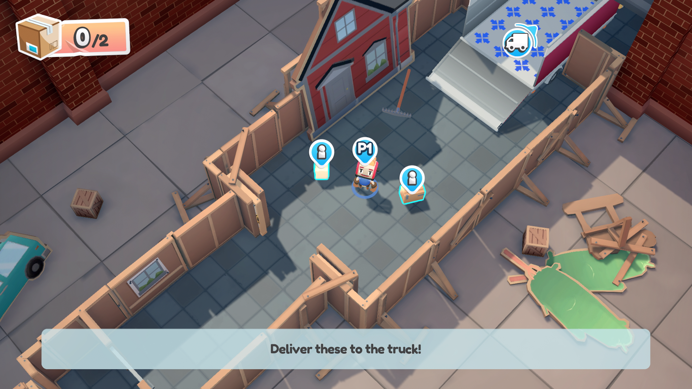

    > In Moving Out, players can press the hint button “Y” at any time to have visual indications of which items still need to be moved and arrows to where they need to be moved to.

    

- Include a log-style list of all the objectives and tasks that a player has completed to date.  

    

Example (expandable)
 

    [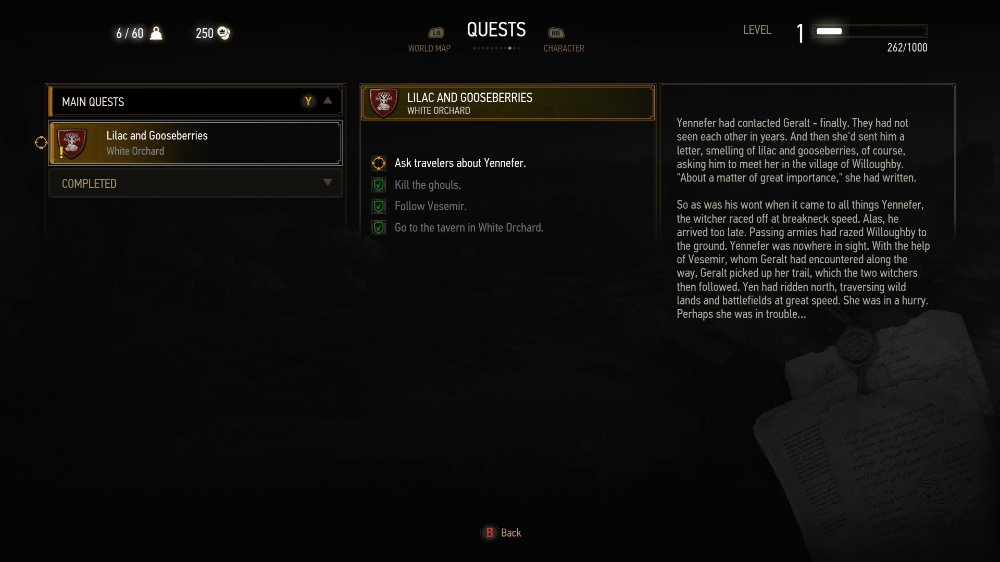](https://youtu.be/J6YzBiQuIwc "Click to open the video example.")

    [Video link: objective and task lists](https://youtu.be/J6YzBiQuIwc "Click to open the video example.")

    > In The Witcher 3: Wild Hunt, players can open their Quests menu at any time. They can select items to view their current main quests, their secondary quests, and review their completed quests. Quests are broken down to clearly describe to players what tasks are needed to complete the quest in its entirety. Language is concise and straightforward. If players would like more quest information, they're also provided an in-depth background on the quest that they're currently viewing. The ability to view main quests, completed quests, and secondary quests as visually separate categories is a great capability that helps avoid information overload and enables the player to focus on the quest of their choice.  

    [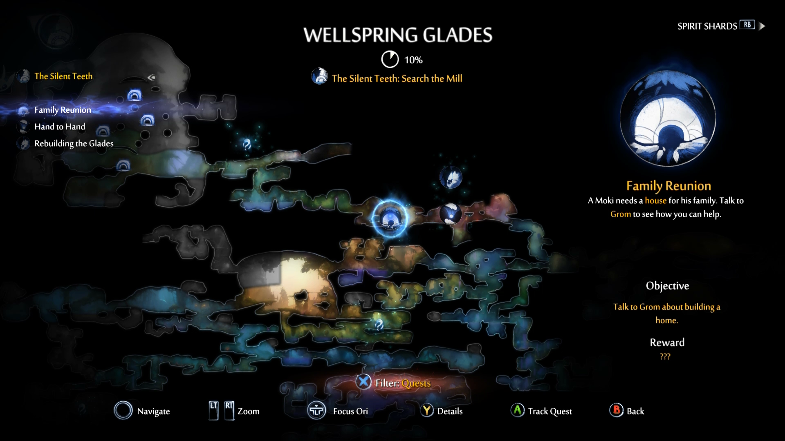](https://youtu.be/BfaMb5vODyE "Click to open the video example.")

    [Video link: objectives and tasks](https://youtu.be/BfaMb5vODyE "Click to open the video example.")

    > In Ori and the Will of the Wisps, players can access their map and view current objectives at any point. Objectives are broken down between the main quest, in yellow, (“The Silent Teeth”), and the side quests. They are listed below the main quest (“The Lost Compass," "Family Reunion," "Hand to Hand," and "Rebuilding the Glades”). The map indicates where key quest locations are, a description of the quest, and an “objective” statement that describes how to complete the objective. Players can also filter their map view between quest-related map markers, Warp Spots, Collectible item locations, and view all.  
    
    

- Provide options to enable waypoint or path markers, hints, or other reminders and directional cues for players when it appears that they've made no progress after a period of time (this varies by game/genre). These options could be included in difficulty presets.  

    

Example (expandable)
  

    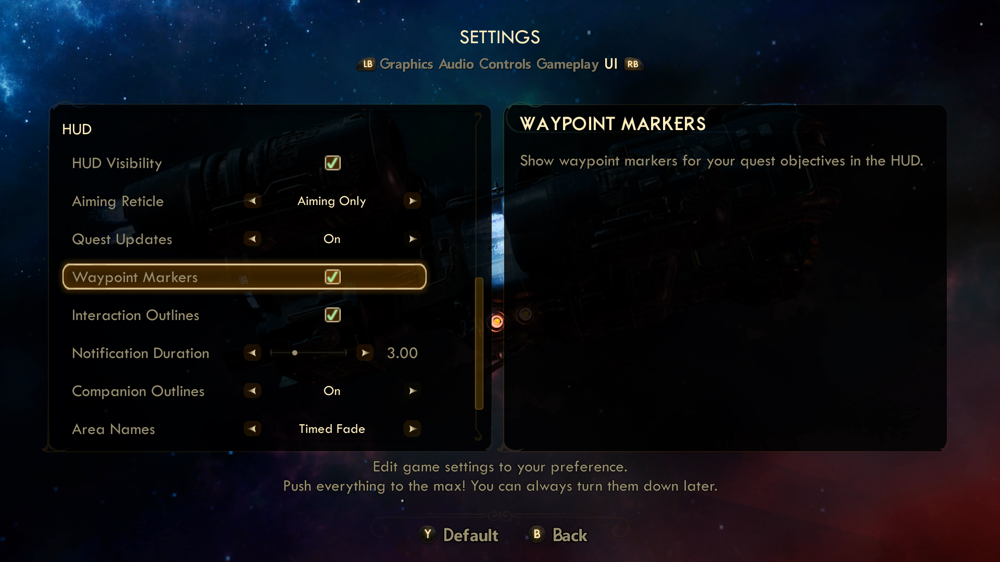

    

    > In The Outer Worlds, players are provided the option to enable waypoint markers and turn on the objective tracker. The waypoint marker gives further guidance to players regarding which direction they should move their character toward and the distance remaining until they reach the next marker.

    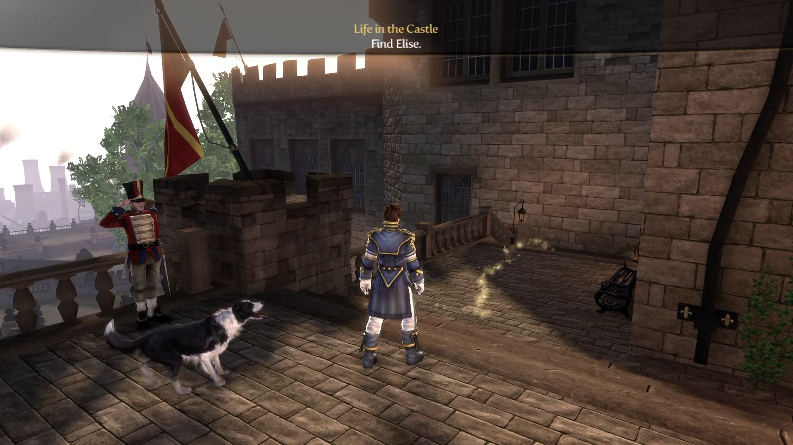

    > In Fable III, the player is guided to the next objective by a clear visual path on the ground. This is a default setting that can be adjusted in the menu. Players can adjust the brightness of the visual path from low brightness to very bright. They can also turn off the glowing path completely.

    

- Provide the player a clear description of any progress made toward meeting prerequisites to progress through the game (for example, “15/20 skulls collected" or "3 of 5 hidden switches found”).  

    

Example (expandable)
  

    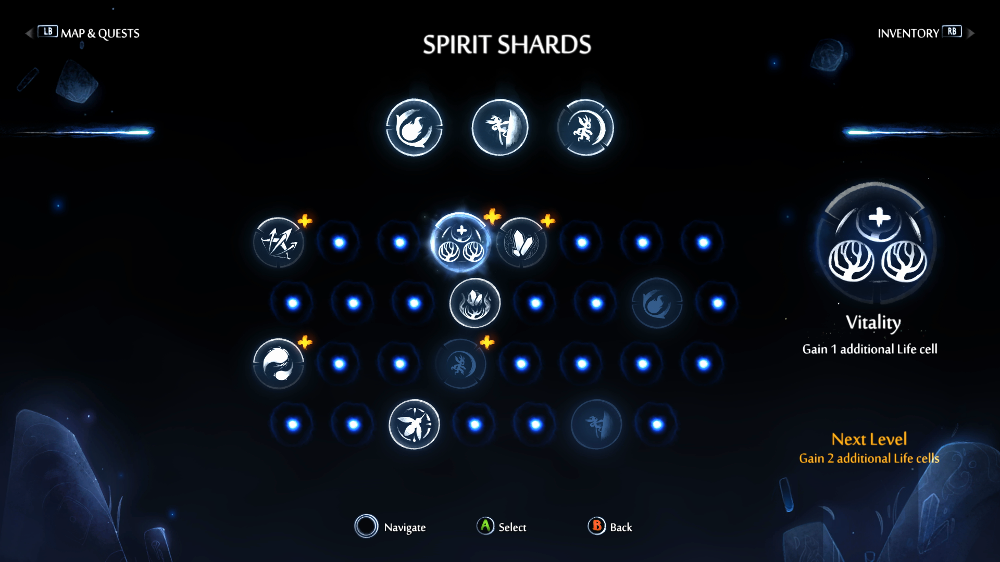

    > In Ori and the Will of the Wisps, players can reference their progress toward collecting key items at any time. In this example, the player is viewing progress made toward the amount of Spirit Shards that they have collected thus far in their gameplay.

    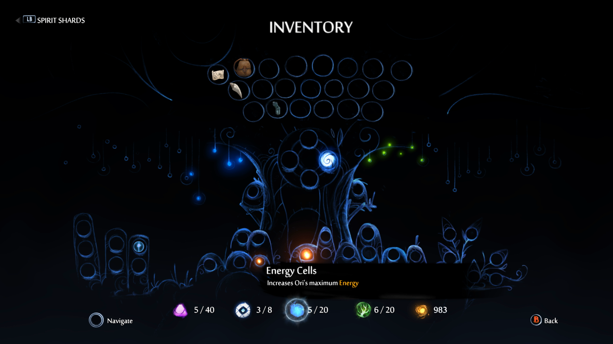

    > Players can also view progress toward collectable items such as inventory, energy cells, life cells, and more.

    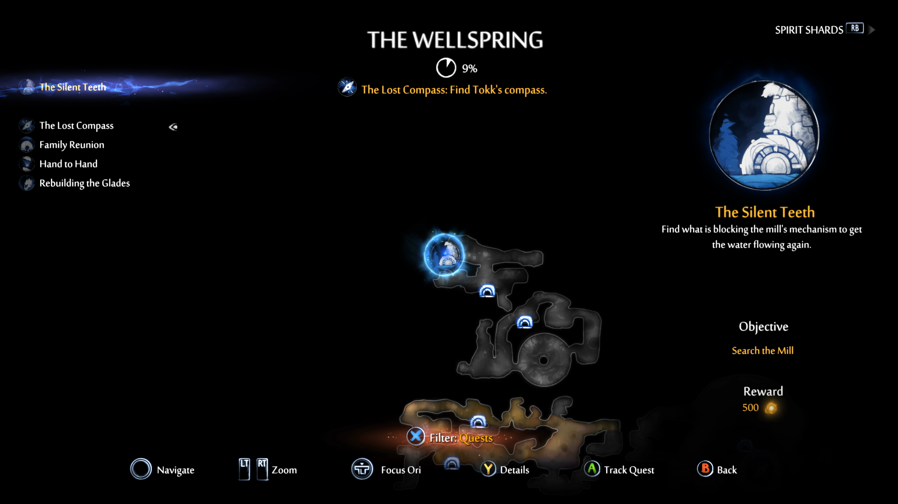

    > Ori and the Will of the Wisps also provides players the ability to view overall progress that they've made in each area of the map. In this example, the UI informs players that their overall progress for “The Wellspring” is 9%.  

    

- Interruptions (like notifications or side quests) that aren't directly related to the objective at hand can be postponed or suppressed by the player.  

    

Example (expandable)
  

    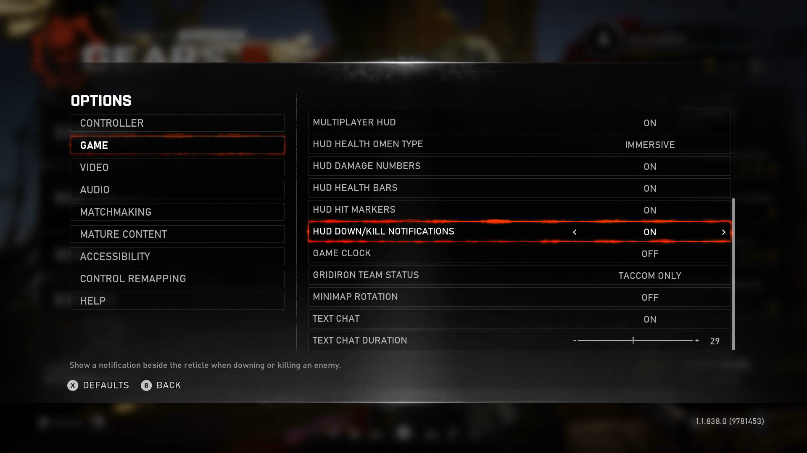

    > Players might want to focus solely on their current quest or objective. The ability to disable other types of notifications, like in Gears 5 and many other games, can help eliminate distractions and enable players to focus on their particular tasks.  

    

- Provide the ability to revisit the game’s narrative (for example, the ability to replay cutscenes or view a written summary of the story thus far).  

    

Example (expandable)
 
 
    [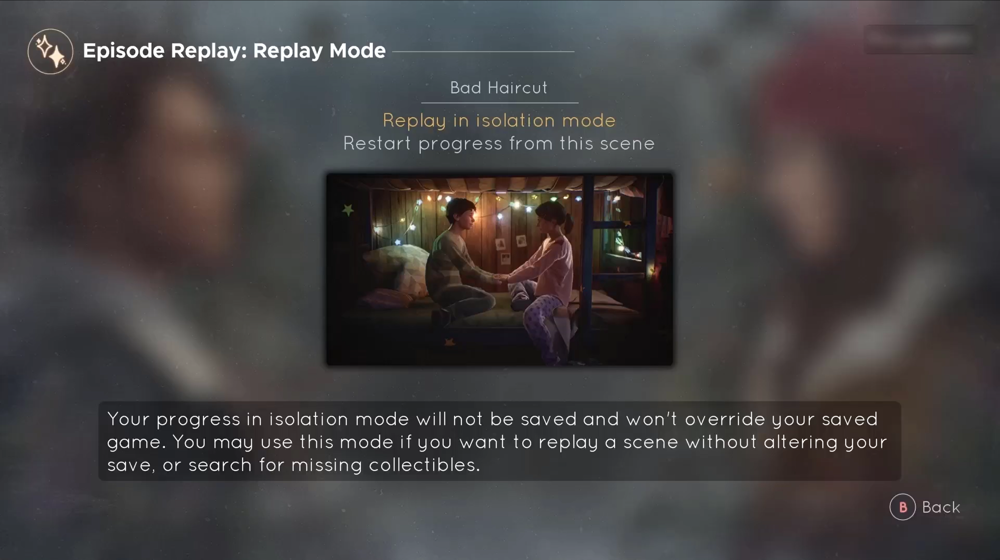](https://youtu.be/mKzUtwtdnUs "Click to open the video example.")

    [Video link: objectives and tasks](https://youtu.be/mKzUtwtdnUs "Click to open the video example.")

    > In Tell Me Why, players can choose from a repository of previous cutscene videos. They can choose to review these in isolation mode, which allows them to simply re-watch a scene, or revisit that area of the game to search for missing collectibles. Alternatively, the player can choose to restart their game progress from a particular scene.

    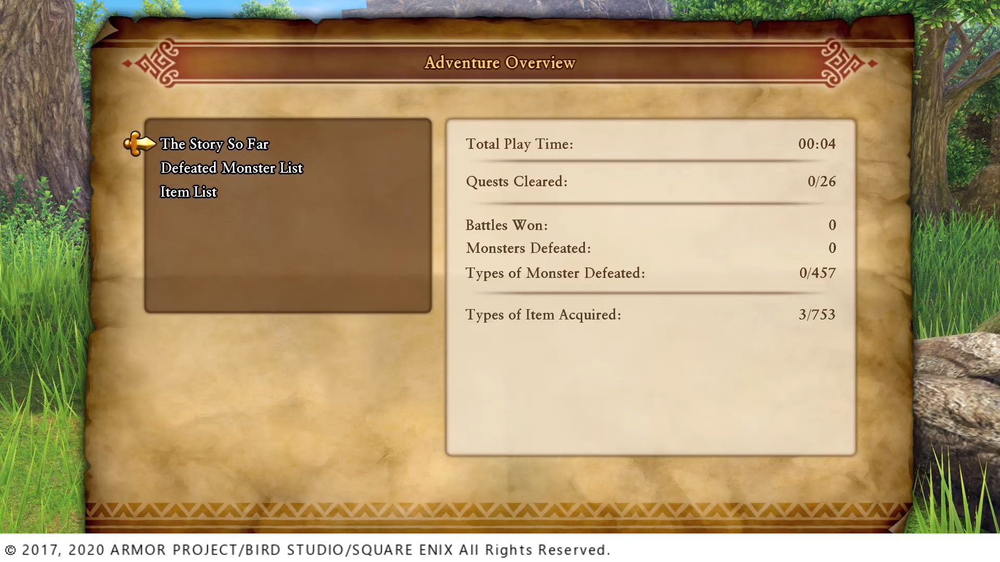

    ![Dragon Quest XI S: Echoes of an Elusive Age screen shot with text reading, "Eleven and a certain girl he grew up with set out on a journey to the summit of the stony pinnacle that stands near their village in order to perform a special ceremony. The Tor towers above them as if to say 'climb me if you dare'! Rab, an elderly white man with big grey mustache, is in the lower right hand corner with a speech bubble saying "Here's what's happened so far!" Copyright on the bottom says "2017, 2020 Armor Project / Bird Studio / Square Enix All Rights Reserved.](../../images/gaming-accessibility/DQ-XAG-109-story-so-far-example-revisit-narrative.png)

    > In Dragon Quest XI S: Echoes of an Elusive Age, players can open the menu at any time and view a summary of what’s happened in the storyline so far. Additionally, every time the game is started, the latest summary is shown automatically.

    

- Saved files should be descriptive. Ideally, they should contain a screenshot, a time stamp, and a brief summary of the player's current progress and objectives.

    

Example (expandable)
  

    

    > Fallout 4’s load screen shows a screenshot for each save, location the game was saved in, and a time stamp for total time played.

    

- Gameplay tutorials that explain or demonstrate core game mechanics should be made available for players.

    - Tutorials should be interactive, such as having the player carry out the game mechanics and controls being taught in the tutorial in a simulated or real gameplay environment or be provided in the form of video demonstrating the mechanics and controls for players to passively watch.

    - Static screens that display game controls or controller mappings are not sufficient and should not be considered a tutorial.

    - Tutorials should be available on-demand for players to access at any point in the game. For example, a tutorial may be a level within the game, or its own separate experience from primary gameplay, but players should be able to re-visit the tutorial at any point in the game, regardless of whether the tutorial has previously been completed.  

    - Players should be provided an option to enable subtitles for tutorials with voiceover, character narration, or dialogue.

## Potential player impact

The guidelines in this XAG can help reduce barriers for the following players.

Player | Impacted
:------- | :-------:
Players with low vision | **X**
Players with cognitive or learning disabilities | **X**
Players with limited reach and strength | **X**
Players with limited manual dexterity | **X**
Other: casual players, young players, those new to gaming | **X**

## Resources and tools

Resource type | Link to source
:--- | :---
Article | [Indicate / allow reminder of current objectives during gameplay (external)](http://gameaccessibilityguidelines.com/indicate-allow-reminder-of-current-objectives-during-gameplay)
Article | [If using a long overarching narrative, provide summaries of progress (external)](http://gameaccessibilityguidelines.com/if-using-a-long-overarching-narrative-provide-summaries-of-progress)
YouTube video | [Microsoft: enable gaming accessibility goals for gamers (external)](https://youtu.be/0HTvHj8ZCjA)
