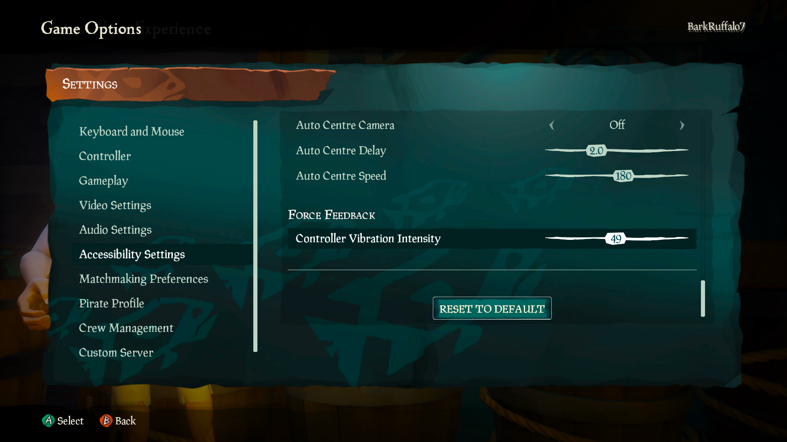
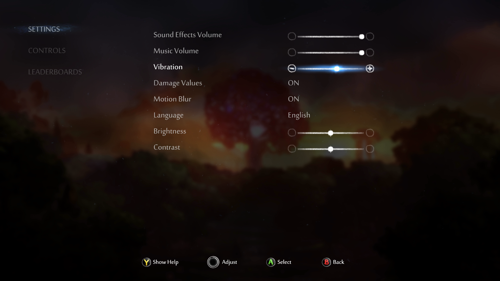

# Xbox Accessibility Guideline 110: Haptic feedback

## Goal

The goal of this Xbox Accessibility Guideline (XAG) is to ensure that players can configure haptic feedback settings for their controller. This addresses the needs of a wide range of players. They include players who benefit from haptic feedback as an additional output modality and players who prefer to disable haptic feedback due to discomfort or pain that this feedback might elicit.  

## Overview

Haptic feedback is enjoyed by many players because of its ability to provide a more immersive gaming experience. The use of in-game haptics as an additional way of providing informational cues also benefits players who aren't able see visual cues or hear audio cues.  

For some players, it's important to note that haptic feedback can be bothersome, distracting, or even painful. Players with sensory processing disorders might interpret haptic feedback more intensely than others and want to turn it off. Similarly, players with chronic pain conditions might experience pain or discomfort as a result of haptics. This is why it's important to provide players the option to configure their own haptic settings. This includes the option to turn haptics on or off, depending on player preferences, and the option to configure the haptic vibration intensity across a spectrum for players who use haptic cues but can only tolerate them at a lower intensity than the default.  

It's also important to note that haptic feedback isn't supported by all platforms or devices such as PC mice and the Xbox Adaptive Controller. Therefore, conveying in-game cues or other important information should be supported through a combination of outputs in addition to haptic feedback. This ensures that players who are using adaptive devices that don't have haptic motors, and those who disable haptic feedback, don't miss any key information.  

## Scoping questions

Does your game support haptic feedback to provide information? If so:  

- Can players disable haptic feedback entirely?  

- Can players adjust the intensity of haptic feedback?  

- Does your game use haptic feedback alone to convey any information?  
   - If yes, additional methods of conveying information should be used to ensure that players who have haptic feedback disabled or are using devices that don't support haptic capabilities don't miss any key information.

## Implementation guidelines

- If haptic feedback is a supported feature, players should have the ability to: 

   - Turn off the feedback.  

   - Adjust the strength of the feedback.  

      

Example (expandable)
  

      

      

      > In Sea of Thieves and Ori and the Will of the Wisps, players can adjust the intensity of haptic controller vibrations across a wide spectrum from no vibration to the highest intensity vibration available.  

      

   - Use other means of feedback. Haptic feedback shouldn't be the only method of conveying information. It should be accompanied by visual and auditory indicators.  

      

Example (expandable)
  

      

      [Video link: additional indicators for haptic feedback](https://youtu.be/GtYuLmaqTWM "Click to open the video example.")

      > In this example from Grounded, haptic cues are given in addition to audio and visual cues. Players can choose to enable haptic feedback. However, because Grounded also provides ample audio and visual cues to represent the same information, players won't miss any key information if they decide to disable haptics.  

      

- Consider adding haptic cues as an optional, additional channel for important visual or audio information.  

For detailed information that's related to this guideline, see [XAG 103: Additional channels for audio and visual cues](./103.md).

## Potential player impact
The guidelines in this XAG can help reduce barriers for the following players.

Player | Impacted
:------- | :-------:
Players without vision | **X**
Players with low vision | **X**
Players with little or no color perception | **X**
Players without hearing | **X**
Players with limited hearing | **X**
Players with cognitive or learning disabilities | **X** 
Players with prosthetic devices   Be aware that people who have prosthetic hands might not be able to perceive haptic vibration from their controller. | **X**
Other: players with sensory processing disorders or chronic pain conditions | **X**

## Resources and tools

Resource type | Link to source
:--- | :---
Article | [Include toggle/slider for any haptics (external)](http://gameaccessibilityguidelines.com/include-toggle-slider-for-any-haptics/)
Microsoft Game Development Kit API | [GameInputHapticFeedbackParams](https://developer.microsoft.com/games/xbox/docs/gdk/GameInputHapticFeedbackParams) (This link might require sign-in credentials provided by an NDA Xbox program.)
Microsoft Game Development Kit API | [GameInputHapticFeedbackMotorInfo](https://developer.microsoft.com/games/xbox/docs/gdk/GameInputHapticFeedbackMotorInfo) (This link might require sign-in credentials provided by an NDA Xbox program.)
Microsoft Game Development Kit API | [GameInputHapticWaveformInfo](https://developer.microsoft.com/games/xbox/docs/gdk/GameInputHapticWaveformInfo) (This link might require sign-in credentials provided by an NDA Xbox program.)
