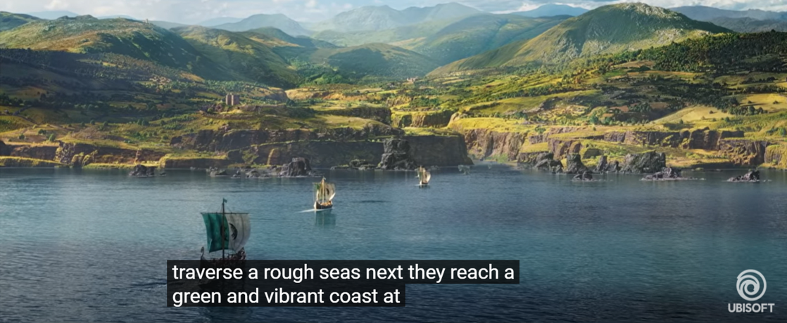

# Xbox Accessibility Guideline 111: Audio descriptions

## Goal

The goal of this Xbox Accessibility Guideline (XAG) is to ensure that full motion videos (FMVs) or other kinds of in-game scripted cinematic events provide an additional audio track that describes all essential visual information and context that occurs in a video or cinematic event. This ensures that players who can't see visual content have an additional means of understanding and enjoying the content.

## Overview

An audio description track is commonly used by players who are blind or have low vision. It helps players understand what is visually happening that might not be obvious from the character dialogue or other audible sounds in a video. FMVs or cinematic scenes in games often contribute to the game’s story line or might provide key insights on how to navigate the game. Whether a player wants to understand the game’s story to its fullest or requires key information needed to play, providing an additional audio description track and allowing players to enable it during FMVs or cinematic events ensures that players have access to the information that sighted players do.

## Scoping questions

Does your game include include FMVs, cutscenes, or other kinds of prerecorded, scripted cinematic events?  

- Have you included audio description tracks that can be enabled by the player?

## Key areas to target

The following are in-game areas where it's important to provide audio description tracks.  

- FMVs that open the game or set the stage for new chapters that are unlocked  

- Cutscenes mid-game  

- In-game “advertisements” or promotional videos for downloadable content  

- Tutorial or in-game “how-to” guides that are presented via prerecorded and scripted FMV  

- FMVs played during loading screens  

  > [!NOTE]  
  > Trailers and promotional videos for games are other areas where audio description tracks should be supported.  

## Implementation guidelines

- All media content that was broadcast previously with audio descriptions on television and that appears in a game or on the title’s website should be audio described.  

    - Example: A game shows a 30-second video clip from a television show in one of its cutscenes. When this clip originally aired on television, audio descriptions were included in the broadcast. As a result, the game that was using this television clip as a cutscene should also provide audio descriptions for this clip when it appears in the game.  

- Appropriately localized audio descriptions should be available for FMVs or in-game scripted cinematic events, if the player wants to enable them.  

    - These descriptions should play during natural gaps during video playback. In cases where natural gaps are insufficient to allow audio descriptions to convey the sense of the video, extended audio descriptions can be provided. This temporarily pauses the video or scripted event to allow enough time for each segment of audio description to play out.  

        

        
Example (expandable)

        

        [Video link: Assassins Creed Valhalla trailer](https://youtu.be/WWDxCQwqMao "Click to open the video example.")

        > This is an example video that displays the correct implementation of an audio description track. Although this content is a promotional advertisement for Assassin’s Creed: Valhalla, the implementation of audio descriptions in in-game FMVs or cutscenes can be structured similarly.  
        > 
        > The example displays the correct content and timing of audio description tracks. When each new scene appears, it's described aloud. The descriptions are concise. However, they provide the audience with enough key details to ensure that visual content is represented in its entirety. The descriptions occur between character dialogue, but it's clearly distinguishable from the audio description track. For example, in the first few scenes of the video, narration is as follows.  
        > 
        >> Audio description: “Dusk, snow-covered mountains surround a North town” 
        >> 
        >> Character speaks: “They are heartless.”  
        >> 
        >> Audio description: “An older bearded Northman greets a boy and girl…” 
        > 
        > In this example, the timing allows for audio descriptions to be read in their entirety without overlapping with character dialogue. If this timing isn't possible, see the Resources and tools section later in this topic. It provides further guidance on implementing optional pauses in video content to allow time for audio descriptions to be read in their entirety.  
        

- If the game doesn't offer audio descriptions, consider providing full transcripts of all FMVs or in-game scripted cinematic events via an accessible website or other accessible format that includes important visual content, such as facial expressions of characters, narratively important actions, non-speech sounds, and dialogue.  

## Potential player impact
The guidelines in this XAG can help reduce barriers for the following players.

Player | Impacted
:------- | :-------:
Players without vision | **X**
Players with low vision | **X**
Players with cognitive or learning disabilities | **X**

## Resources and tools

Resource type | Link to source
:--- | :---
Article | [Provide an audio description track (external)](http://gameaccessibilityguidelines.com/provide-an-audio-description-track/)
Article | [508 Accessible Videos – How to Make Audio Descriptions – Digital.gov (external)](https://digital.gov/2014/06/30/508-accessible-videos-how-to-make-audio-descriptions/)
Article | [Making Audio and Video Media Accessible from Web Accessibility Initiative (WAI) (external)](https://www.w3.org/WAI/media/av/)
Article | [Audio Description of Visual Information from Web Accessibility Initiative (WAI) (external)](https://www.w3.org/WAI/media/av/description/)