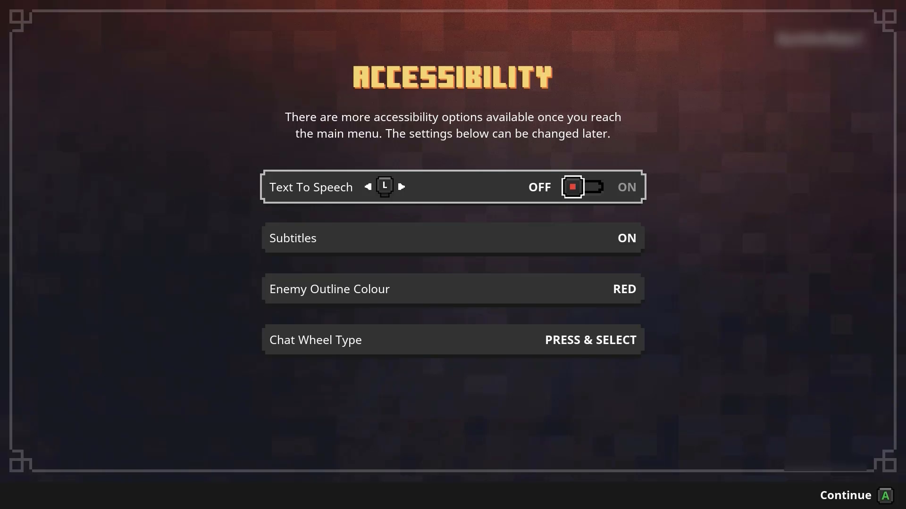
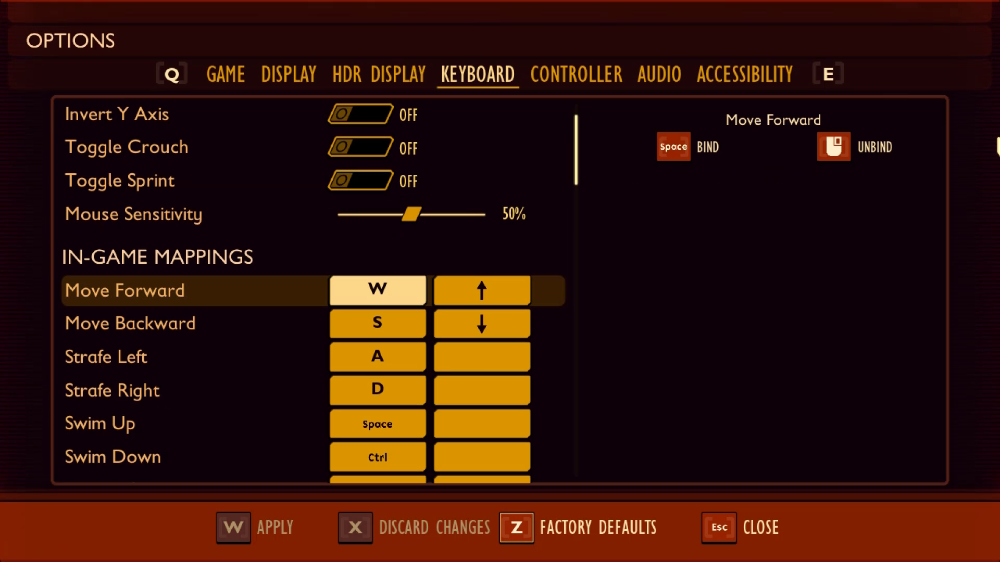
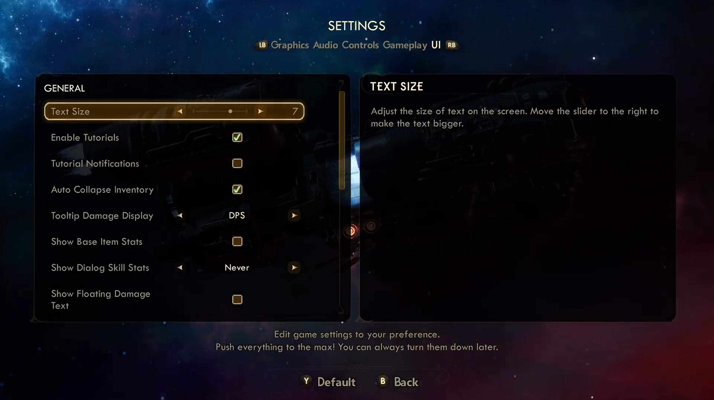
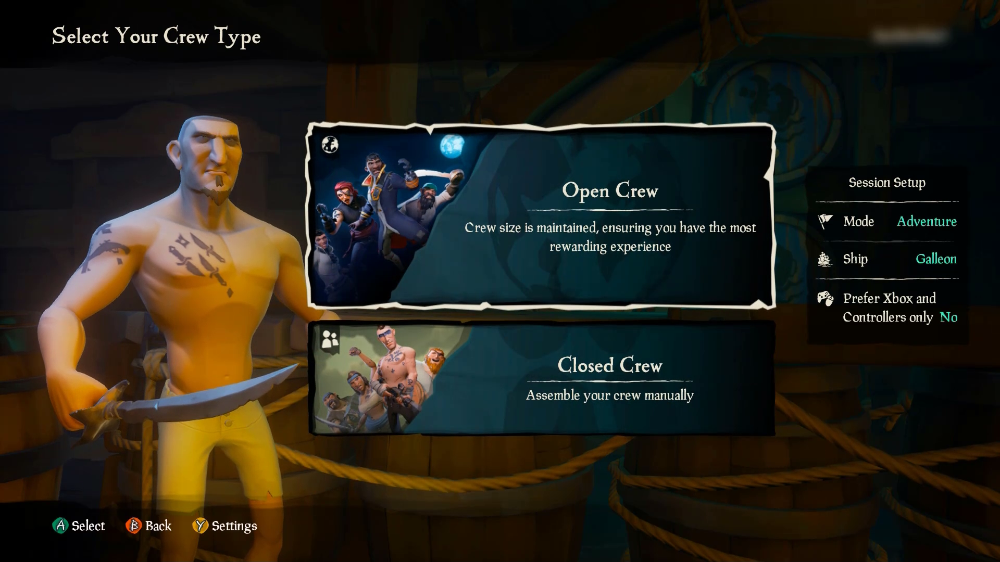

# Xbox Accessibility Guideline 112: UI navigation

## Goal

The goal of this Xbox Accessibility Guideline (XAG) is to provide players with clear and consistent UI navigation experiences throughout the entirety of a game. This can help players who are neurodiverse, have learning disabilities, are new to gaming, or are navigating the experience with various types of assistive technologies.

## Overview

The UI of a game should be consistent and intuitive. If a player is unable to navigate through menu UIs to configure game settings or select appropriate game modes because of confusion or inconsistent UI components, they can be excluded from the game from the very beginning. Similarly, players who use various types of assistive technologies like screen readers can be easily disoriented if the UI has inconsistencies throughout different points in the navigation experience. Assistive technology inputs like voice commands, eye gaze, or digital inputs can also be difficult to use if interaction mechanics throughout the UI are inconsistent. It's important to ensure that the layout and interaction mechanisms of all UIs across the game use similar orders and structures. This enables players to more easily find what they're looking for and configure game options to meet their needs.

Additionally, players who use assistive technologies like screen narration or non-traditional inputs (for example, keyboard-only or digital, mouth-operated joysticks) can be hampered or blocked from gameplay if focus doesn't move in a clear, consistent way. The movement of focus should always be predictable.

## Scoping questions

It's important to ensure that the navigation experience is consistent across all UI experiences when applicable.

 - Does your game contain multiple UI screens or pages (for example, if the game has many different navigable pages such as multiple settings pages, character personalization pages, or “market” pages where players can buy items)?

 - Are UI elements consistently located across each screen when applicable (for example, the “title” of each settings page is always at the top of the page and read first in the screen narration reading order)?

 - Are interaction methods consistent across the UI for elements that appear in multiple locations (like “Press A to select”)?

## Implementation guidelines

- From the game’s initial launch, ensure that all pathways to the accessibility features/settings menu UI are fully accessible.  
This can be done by:
   - Prompting players to configure accessibility settings as the first screen that appears when the game launches. After the player has defined them, any subsequent experiences only need to reflect the accessibility settings that the player made.
   - Meeting all XAGs by default when the game initially launches (for example, text display and contrast ratios meet minimum guidelines, narration and subtitles/captions are enabled by default, and visual distractions are disabled by default).
   - Meeting all XAGs by default when the game initially launches but using platform settings to disable certain items by default, based on the player’s current platform settings (if possible).
      - For example, a player has “Let Games Read to Me” disabled at the Xbox platform level. As a result, the game doesn’t need to launch with in-game narration enabled by default.
      - If the game is unable to read platform settings, narration should be enabled by default for all players.
      

      
 Example (expandable) 

      

      > Minecraft Dungeons presents this accessibility settings menu as the first screen that a player encounters when they launch the game for the first time. Additionally, Minecraft Dungeons reads the Xbox platform’s Ease of Access settings. As a result, for a player who has “Let Games Read to Me” enabled at the platform level, this screen is automatically read aloud to them so that they can adjust these settings.

      </detail>

- The UI navigation order is logical and consistent across the full game.
    

    
 Example (expandable) 

    

    > In Sea of Thieves, the UI navigation is consistent throughout menu screens in the game. Players can use analog or digital input, such as the D-pad, to navigate through menu items. Most menu UI screens are horizontally or vertically linear. However, menus like the Pirate Emporium marketplace that has multiple rows of menu items still follow an intuitive focus order. For example, if the player presses Left on their controller, focus moves to the tile directly to the left of the currently focused item. Interaction mechanisms are consistent throughout (like “A” to select, “B” for back, “LT” and “RT” for moving through pages, or “RB” and “LB” for moving through tabs). If interaction methods were to change from screen to screen, this would be very disorienting and confusing for a player.

    

- The UI is fully navigable by keyboard and controller _digital_ input alone.
    

    
 Example (expandable) 

    

   [Video link: keyboard-only navigation](https://youtu.be/AZWR7Yp30k4 "Click to open the video example.")

    > In Grounded on PC, menu UIs are fully navigable by keyboard-only input. Players are even provided a “Quit” menu option that can be "tabbed" to (by using the Tab key) or “arrowed” to (by using the arrow keys) and activated by pressing the Spacebar through keyboard-only commands. This is helpful for players who can't access a mouse to hover over the “Close” tab on the upper-right corner of a window or those who can't reach the Esc key, which is commonly used as a way of exiting a game window on PC.

    

- All aspects of the game, including menu UI's and gameplay, are fully navigable by multiple inputs (mouse, eye gaze, voice, keyboard, and controller).
    - Some inputs might not be supported by the platform (for example, eye gaze on Xbox). If platforms support multiple input options, games should ensure that their UIs are also navigable by multiple supported inputs.
    

    
 Example (expandable) 

   

   [Video link: multi-modal UI navigation](https://youtu.be/TyG0yE0Dl3Q "Click to open the video example.")

    > In Grounded on PC, players can use controller, mouse, or keyboard input to fully navigate the menu UIs. Additionally, players can remap their input controls to replace those that require analog input with digital input. In this example, the player replaces mouse inputs, like right and left mouse clicks, with keys on the keyboard. The game also allows character movements that are typically controlled via analog mouse input, like turning left and right, to be controlled by digital input such as the Left and Right arrow keys.
    

- Components that are repeated across multiple pages or screens should appear in the same relative order (the same place in the programmatic sequence) each time that they're repeated.
    

    
 Example (expandable) 

   

   [Video link: consistent UI navigation](https://youtu.be/tfo7_Cwzt_c "Click to open the video example.")

    > In this example from Sea of Thieves, the interaction prompts to “select” or go “back” are consistently placed on the bottom-left corner of the screen when applicable. When dialog boxes appear, interaction prompts also appear on the bottom of the window. Although the number of buttons that appear on the bottom-left corner change, depending on the context of the specific UI screen, these elements still appear in the same location and relative order throughout the navigation experience. Any additional interaction prompts (For example, “RT” or “LT” ) are always labeled accordingly.

    

- If an interface can be navigated sequentially, focusable components should receive focus in an order that's logical and preserves meaning and purpose.

- Support a focus order that's aligned with the meaning or operation of the UI. If the navigation sequence is independent of the meaning or operation, align the focus order with the flow of the visual design.
   

   
Example (expandable)

    

   [Video link: focus order aligned to meaning/operation of the UI](https://youtu.be/sBxvuq1iVNY "Click to open the video example.")

   > The "Main Menu" and the "Settings" submenu in Forza Horizon 4 are examples of UIs that don't follow a linear flow of information. Tiles are placed next to, or on either side of, one another, as opposed to linear UIs like the settings menu in Sea of Thieves. In both examples, the focus order implementation meets this XAG guidance. The Sea of Thieves focus order moves linearly up and down, as a sighted player would expect. The menu sequence in Forza Horizon 4 doesn’t follow any clear, linear UI path. However, the focus order does align with the flow of the visual design of the UI (for example, when a player has focus on the “Settings” element button, initiating a control to move the focus down results in the focus landing on the “Drone Mode” button.) If a single down-press had moved the focus from “Settings” to “Change Car” or any other menu element that isn't visually intuitive, this design wouldn't be following the meaning or operation of the UI.  
   

- After navigating to the last item in the UI/menu structure, the player should be taken back to the first item in the UI/menu structure and vice versa.  

   > [!NOTE]
   > This guideline only applies to linear menu structures where focus can be moved EITHER up or down, OR left or right. Menus structures that allow focus to be moved to elements in any direction (such as a menu with focusable items arranged in a 4x4 tile) do not need to loop.
   >
   > We encourage developers to have an option to enable and disable menu looping for all menus.
   > 

   > 
Example (expandable)

   > 
   > 
   >
   > In this capture of the Forza Horizon 4 difficulty settings UI, focus can only be moved up and down, therefore, menus with this type of structure should loop the focus back to the first item in the last if a user were to move their focus “down” to the subsequent item when they are currently on the last focusable item in the list.
   >
   > 
   >
   > In this capture from the Forza Horizon 4 Horizon Tab menu, items arranged in a way that users can move focus up, down, left, and right. In multidirectional menu structures like these, focus should NOT loop to the “first” item in the list upon moving focus from the “last” item in the list.  
   > 

- There should be more than one way to locate content that's part of a complex set of information that spans multiple pages/screens, such as bestiaries, quest logs, or large inventories.

    

    
 Example (expandable) 

    

    > In Minecraft, players can locate specific crafting or inventory items by using the four filtered tabs. Additionally, players can use the search tab to type the name of the specific resource they’re looking for within their inventory using the on-screen keyboard.

    
 

- If the visual layout of a screen changes (because of UI scaling or resolution change), the order in which elements are navigated should update to maintain consistency with the visual layout.  

- Text/UI scaling shouldn't result in having to scroll in two directions to reveal all content.  
     

     
 Example (expandable) 

     

     [Video link: proper reflow of text scaling](https://youtu.be/A_nBs6H978E "Click to open the video example.")

     > In the Outer Worlds, players can scale their text size. Even when the player scales up their text size to the highest value, the UI reflows this text appropriately, and does not require players to scroll through in either direction to reveal all content.

    

- When game map UI is scaled or zoomed in on, provide an alternative way to navigate the map that does not require scrolling such as a supplementary text list of points of interest.
     

     
 Example (expandable) 

     

     [Video link: alternate map navigation](https://youtu.be/lVw0iqKPU74 "Click to open the video example.")

     > In Halo Infinite, players can scroll around the Tacmap to view all landmarks and associated missions they’ve unlocked in the game thus far. Players can also look through a comprehensive text list of all available missions instead of locating them on the map. When the player selects a mission from the missions list, cursor focus is automatically brought to the area of the map in which the selected mission is located.

    

- Provide persistent links back to the main menu screen or the initial interactive screen on all submenus.
    

    
 Example (expandable) 

    

   [Video link: consistent UI navigation](https://youtu.be/tfo7_Cwzt_c "Click to open the video example.")

    > Players should always have a mechanism of easily returning to the main menu or previous screen. In Sea of Thieves (and many other games), regardless of where the player is in the UI navigation sequence, they're always provided the ability (and the important visual interaction prompt on the bottom-left corner of the screen) to press “B” to go back to the previous menu screen.  

    

- If focus can be moved to a UI element of an interface, focus can be moved away from that element by using the same input (keyboard or mouse) method.  
    - If doing so requires any means of navigation that's inconsistent with how the rest of the interface is navigated, the UI should provide clear interaction prompts to indicate how focus can be moved away.  

    

    
 Example (expandable) 

    ![A screenshot from a fake game called "PuzzleBlaster" that shows a "Control Remapping" screen, with a cursor over a "Boost Blast" menu item. Text below reads "Press any key or mouse button to remap," and "Press [ESC] to exit remapping mode."](../../images/gaming-accessibility/puzzleblaster-control-remapping.png)

    > In this example, the player uses their mouse to focus on and select the “Boost Blast” remapping UI element. Although the mouse was the input that was used to move focus to the item, when in remap mode, the player can no longer use their mouse to change focus. Any mouse input will be applied as the new control for “Boost Blast.” Given the change in input to move focus away from an element, the game clearly prompts players that they must use the Esc key on the keyboard to exit remapping mode.  

    

## Potential player impact

The guidelines in this XAG can help reduce barriers for the following players.  

Player | Impacted
:------- | :-------:
Players without vision | **X**
Players with low vision | **X**
Players with cognitive or learning disabilities | **X**
Players with limited reach and strength | **X**
Players with limited manual dexterity | **X**
Players with prosthetic devices | **X**
Other: casual players, younger players | **X**

## Resources and tools

Resource type | Link to source
:--- | :---
Article | [Allow the game to be started without the need to navigate through multiple levels of menus (external)](http://gameaccessibilityguidelines.com/allow-the-game-to-be-started-without-the-need-to-navigate-through-multiple-levels-of-menus)
Article| [Inclusive And Accessible User Interface Design: general guidelines for the web (external)](https://trydesignlab.com/blog/40-tips-inclusion-accessibility-user-interface-design/#5)
Standard | [Understanding Success Criterion 3.2.3: Consistent Navigation (external)](https://www.w3.org/WAI/WCAG21/Understanding/consistent-navigation.html)