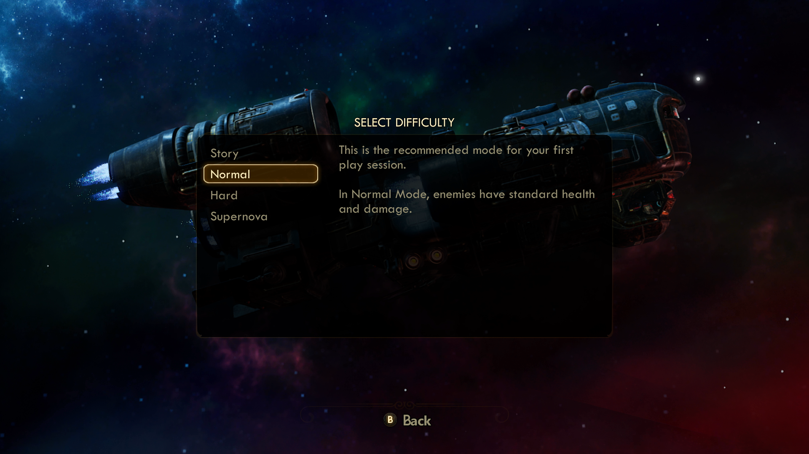
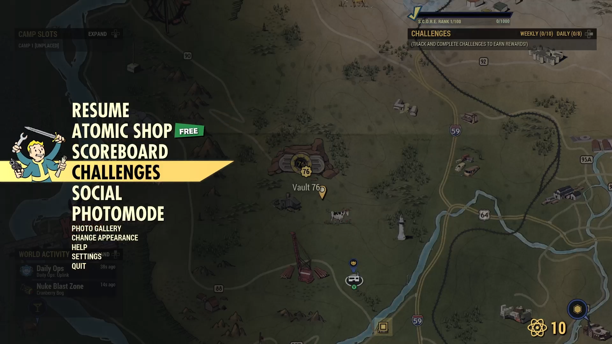

# Xbox Accessibility Guideline 113: UI focus handling

## Goal

The goal of this Xbox Accessibility Guideline (XAG) is to ensure that players, including players with low vision, are always aware of which element in a game UI has focus.

## Overview

Focus indicators are visual markers that indicate to the player which UI element currently has input focus. As a result, if any interactive input action is taken (like press **A** to select), the action is applied to the element that currently has focus. Clear focus indicators are important for all players, including those with low vision, learning disabilities, players using assistive technologies, and players who are new to the game. Focus indicators that aren't easy to visually discern can be problematic for many players. For example, a game that uses a very subtle glow behind text to indicate focus might not be perceivable by a player with low vision, a player with cognitive disabilities, or a player sitting far away from the screen. This can easily disorient players and make it difficult to perform basic navigational tasks like configuring settings or starting the game.

If the focus indicator moves off the visual screen to a “hidden” element, or otherwise simply isn’t visible, players can also be blocked from navigating to the area that they want to access in the UI. The movement of focus indicators should always be clear and visible.

## Scoping questions

Think about the way your game visually indicates which UI element has focus.

 - What method is used to indicate focus (color or outline)?

 - Is this method visible for players with low vision or colorblindness?

 - Is an indication of which control has focus always present?

 - Is this method visible for players on all UI backgrounds in the game (colors, images, or animations)?

 - Does your game contain dialog boxes that overlay another UI (an area that has potential for focus indicators to get lost)?

## Implementation guidelines

 - All UI elements should display a highly visible focus indicator when they receive focus.
   - There are multiple ways to ensure that focus indicators are highly visible. This includes the use of borders around the element, increasing the element's size or font weight upon receiving focus, or combinations of multiple methods to ensure that there is high visibility.
   

   
Example (expandable)

   

   > In The Outer Worlds, the focus indicator outlines the element, introduces a block fill of a different color that contrasts against the rest of the UI background, and changes the font's weight and color. The combination of these elements ensures that it's clear to the player which element currently has focus.

   

   > The Fallout 76 pause menu shows focus by highlighting the item with a high contrast yellow backdrop, displays a character to the left of the item, and that character has a short animation.

   

 - The visual focus indicator should always be visible on screen. Focus indicators should not become invisible on any focusable element, and it shouldn't move to invisible or offscreen elements.
   

   
Example (expandable)

   

   > Focus indicators should never move offscreen or to an invisible element. For example, when dialog boxes appear, like in this warning message from Forza Horizon 4, the focus indicator should move to the first interactable control in the dialog box. It shouldn't be possible to move focus to anything other than interactable controls in the dialog box while it's open. This helps ensure that the player is aware of where the focus indicator is at all times.

   

## Potential player impact

The guidelines in this XAG can help reduce barriers for the following players.  

Player | Impacted
:------- | :-------:
Players without vision | **X**
Players with low vision | **X**
Players with with cognitive or learning disabilities | **X**
Players with limited reach and strength | **X**
Players with limited manual dexterity | **X**
Players with prosthetic devices | **X**
Other: casual players, younger players | **X**

## Resources and tools

Resource type | Link to source
:--- | :---
Article | [Designing for Accessibility: Focus States - DockYard (external)](https://dockyard.com/blog/2020/04/28/designing-for-accessibility-focus-states)
Standard | [Understanding Success Criterion 2.4.11: Focus Appearance (Minimum) (external)](https://www.w3.org/WAI/WCAG22/Understanding/focus-appearance-minimum.html)