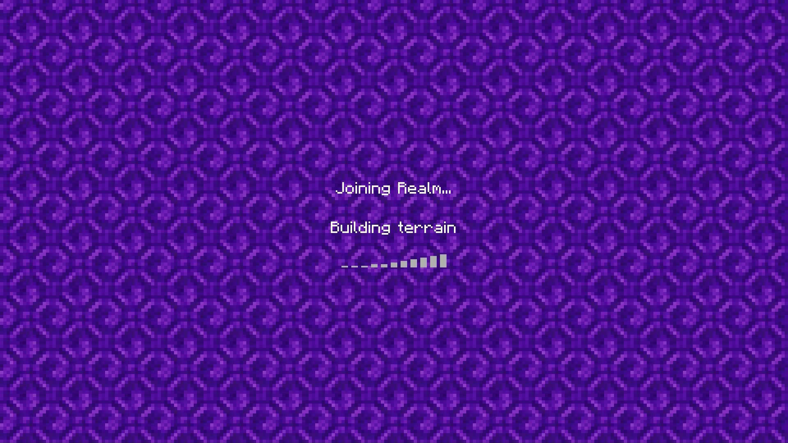
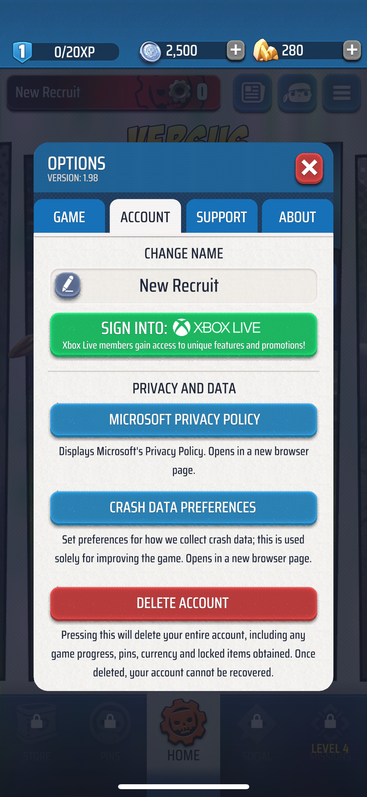
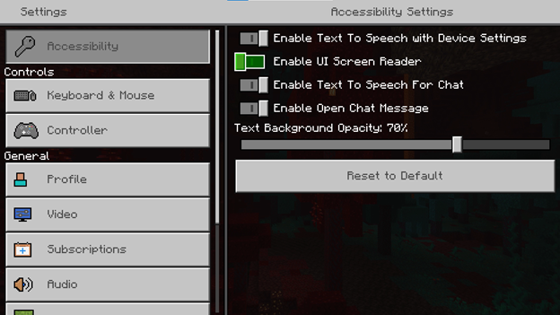
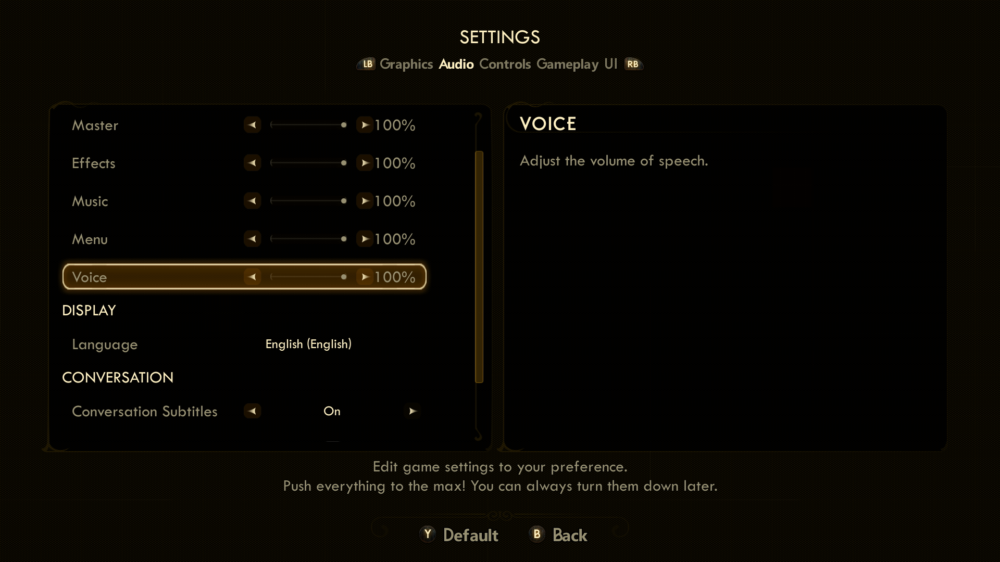
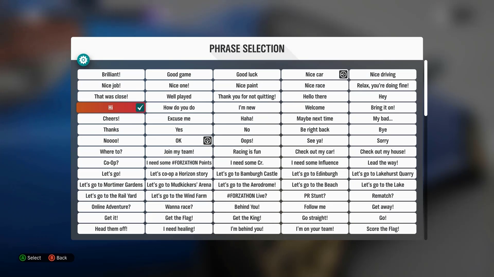
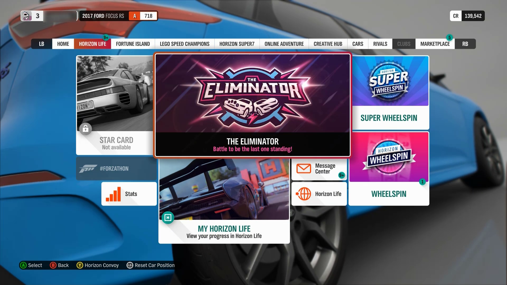
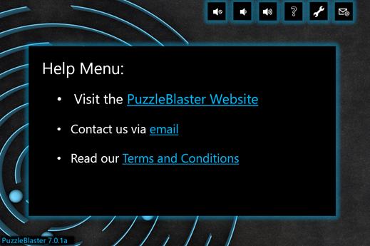
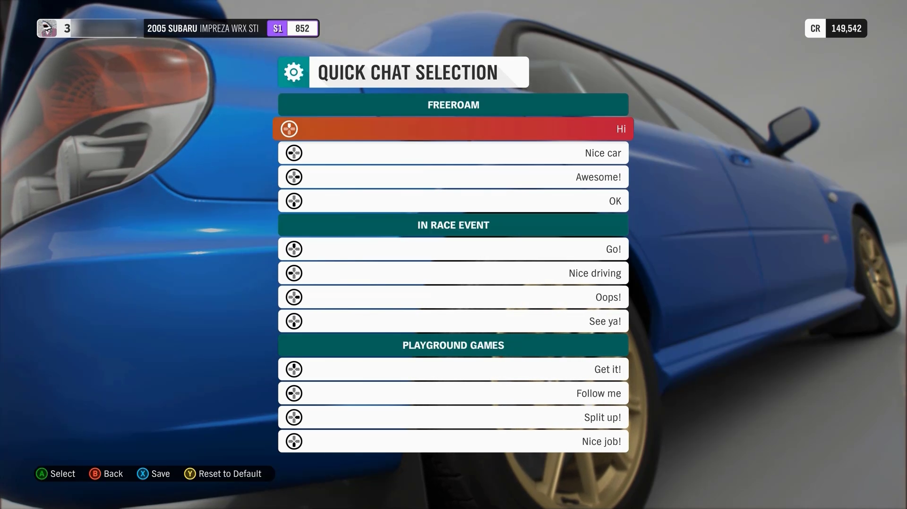
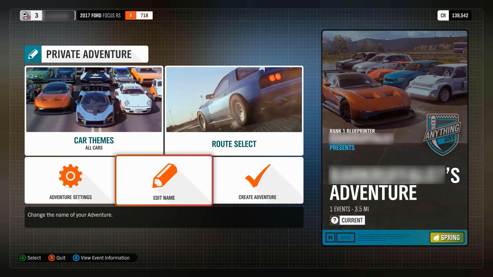

# Xbox Accessibility Guideline 114: UI context

## Goal

The goal of this Xbox Accessibility Guideline (XAG) is to ensure that players have enough context to operate a game’s interface and understand its UI components and their functions. This can be especially helpful for players who need additional time to read screen content, for players with limited short-term memory, and players who are new to the game.

## Overview

The UI should provide an appropriate amount of context to ensure that players can easily understand the purpose of each UI screen and its associated elements, how to successfully interact with each UI element, and what to expect from each interaction. For example, before activating a button, a player should already be aware that the interaction is going to put them in an active gameplay experience, take them to an external link outside the gaming app or page that they're currently on, or change a specific aspect of their settings. When aspects of a UI aren't clearly labeled or obvious to a player, unintended actions can easily occur. Additionally, players can get stuck or blocked from navigating through a UI experience if proper context isn't readily available, such as an example that displays the type of data that's expected to be entered into a form box.

## Scoping questions

Think about the menu navigation experience in your game’s UI.

 - Does your game contain multiple menu screens?  

 - Do menus in your game follow a hierarchical order (settings are categorized and the player must navigate through the menu hierarchies to find a specific setting; for example, Main Menu > Settings > Audio > NPC Volume Control)?  

 - Does your game contain input forms (for example, “enter password” or “type your team name”)?  

 - Does your game contain any buttons or links that open an entirely different application or window when selected?  

## Implementation guidelines

 - All screens and elements on those screens should provide enough context such that a player can understand where they are in the UI hierarchy at any particular time.  

 - UI context shouldn't change without first being initiated by the player. If a change in context isn't player-initiated, a notification should be provided.  
    

    
Example (expandable)

     

    [Video link: context change](https://youtu.be/AWduWO8QEZY "Click to open the video example.")

    > Changes of screen context that aren't player-initiated can be unavoidable in certain game scenarios. They typically includes certain loading-screen experiences and multiplayer lobbies. In this example from Minecraft, the player initiated the original action of joining a realm. However, the change in context from the loading screen to the in-game environment wasn't player-initiated. It occurred after the loading of the realm was complete. Players who can't visually see this change in context on screen might be unaware that loading is complete and that their character is in the active game environment. In Minecraft, for a player with screen narration enabled, the game announces, “joining realm” and “complete” after the in-game experience has begun. At the end of this video example, the player initiates opening the chat window.

    

 - Any interaction that results in shifting focus to another application should be clearly indicated.
    

    
Example (expandable)

    

    > In Gears POP! on mobile, buttons that act as links to a web browser have associated text labels. They inform players that when a button is selected, a web browser “opens in a new browser page.” Any control that opens an additional application or window other than the game itself should have a signifier that preemptively informs players that they will be redirected to a new location upon activation.

    

- Ensure that text alternatives (such as narration and tooltips) convey the purpose and operation of the UI components.
    

    
Example (expandable)

    

   [Video link: tool tip context](https://youtu.be/ManAQvvrIDw "Click to open the video example.")

    > In Grounded, the tooltip narrated for the “Arachnophobia Safe Mode” spider preview window is read by screen narration software as “Left mouse button for show spider preview.” By including this information in the narration, users are provided necessary context about the purpose of the tooltip, as well as the means of operation for the control.

    

- Labels should be visually positioned near the associated element so that the player can derive context.

    

    
Example (Expandable)

    

    > On the Minecraft menu, the labels for each setting are directly next to their associated toggle on/off mechanism. This ensures that players can very easily derive the purpose and resulting actions of interacting with each toggle mechanism.  

    

    > In The Outer Worlds, the menu text labels aren't as close to the slider mechanism as in Minecraft. However, the label and its associated slider are both encompassed within the focus indicator. It's another viable method of establishing necessary context within the UI.

    

> [!NOTE]
> The visual association between label and element should also be reflected programmatically for screen narration users. See [XAG 106: Screen Narration](./106.md) for detailed information on this topic.

- The features and functionality of the player's experience should be the same for everyone, regardless of their use of assistive technology.
    

    
Example (expandable)

    

    [Video link: feature/functionality parity](https://youtu.be/iOkZxY6RLEU "Click to open the video example.")

    > Whether a player is using hardware-based assistive technology like adaptive joysticks or other input mechanisms, or software-based assistive technology like screen-reading programs, a player should be able to perceive, access, and use all the features and functionalities that players not using assistive technologies can.   
    In this example of Forza Horizon 4, the player has screen narration enabled. The game narrates content as the player navigates through the message center&mdash;a feature that allows players to download cars “gifted” to them from the Forza team. The process of navigating to and changing “Quick Chat” preselected messages is also fully narrated. While these are only a few of the many features and functionalities in the game, this example shows that when assistive technologies are supported throughout areas of the game beyond menu navigation or other basics, players can access the same features and functionalities that others can as opposed to being restricted to a limited subset.  

    

- Players should understand what data is expected to be entered into a form or control without requiring additional navigation to discover this information.  
    

    
Example (expandable)

    

    > In this example from Gears POP! on mobile, the game provides detailed contextual cues that ensure players know what to enter into the form box, as well as specific guidelines on what types of characters or words can't appear within the form box. The game also provides important contextual cues like the character count parameters (between 4&ndash;16 characters), the statement that the name “does not have to be unique,” and reminds players that “this name is what other players in the game will identify you by.”

    

- Components reused in different areas that have the same functionality are identified through consistent iconography, labeling, or text. 
    

    
Example (expandable)

    

    [Video link: consistent labeling, iconography, and text](https://youtu.be/2Lrp25Ww8Us "Click to open the video example.")

    > In Forza Horizon 4, the use of the “LB” and “RB” controller buttons to move left and right (respectively) between menu tabs is consistent across various areas of the UI. The use of the lock icon, a dimmed appearance, and “Not Available” text are other components used consistently across the UI to represent restricted functions.  

    

- The text of a link alone, independent of its adjacent, surrounding text, should be descriptive enough for the player to understand where the link will take them.  
    

    
Example (expandable)

    

    > In this example, the visible text for each link describes where the link will take the player, regardless of what text appears before the link. If a player were to only see “PuzzleBlaster Website,” or have their screen narration read “Puzzle Blaster Website – link,” this would be sufficient context. In contrast, a poor example of this guideline would be if the first bullet point appeared as, “To view our website, click here,” *or* if the word “here” were replaced with the actual URL of the website. Neither of these approaches would provide enough context to inform players of where the link will take them without the need to read the preceding text.

    

> [!NOTE]
> Screen readers often allow users to skip through links one at a time, without reading the surrounding text. This is why it’s important to ensure the text of the link alone is descriptive.

- For groups of information, the groups should be meaningfully and uniquely labeled so that the player can understand context and differentiate between the groups.
    

    
Example (expandable)

    

    > In this Forza Horizon 4 example, the quick chat options are displayed in three groups, each labeled to indicate which mode they apply to (“Freeroam,” “In Race Event,” or “Playground Games”). Screen narration also appropriately narrates the groupings for players who might be unable to see the visual cue on screen that's provided to delineate each group (for example, the group heading title written on dark green tiles before each option set).

    

- Provide context-sensitive help for each element on screen where necessary.  
    

    
Example (expandable)

    

    > In Forza Horizon 4, additional context is provided within the UI to ensure that players can easily differentiate between menu functions. In this example, the player is creating a private adventure. The game clearly labels the button with focus as “Edit Name” and provides contextual Help below that explains that this item “Change[s] the name of your adventure.”

    

- Provide methods to accelerate a player’s ability to provide input to a form.
    - For example, for a list of states (like “California” or “Nevada”), allow the player to enter a few letters to bring up the state. This prevents them from having to scroll through a long list or enter the state's full name.  

- Large blocks of text should be split into editorially appropriate sections and have descriptive headings.  
    

    
Example (expandable)

    ![Assassin's Creed Valhalla screenshot with text from an update history. "Update history" at the top is the largest font size and a different font style than the rest of the text beneath it visually marking it a heading. Two headings with associated text are underneath: "Expansion 3 - Dawn of Ragnarok" and "Bug Fixes & Improvements", they are both yellow and in all caps visually marking them as headings of the same level. Under "Bug Fixes & Improvements" is a sub-heading: "Stealth Fixes" which is visually marked in green and all caps. Under the yellow headings is white text detailing the update. This text utilizes regular sentences, bulleted lists as well as dash lists acting as sub-bullets.](../../images/gaming-accessibility/AC-text-blocks.png)

    > In Assassin’s Creed Valhalla, the large blocks of text in the Update history UI are categorized by update type. Each category includes descriptive headings and sub-headings for each new paragraph that describe the nature of the following content. Additionally, bullets and indentation are used to visually break up the text into shorter lines.

    

- A mechanism is available for displaying specific definitions of words or phrases that are game-specific or used in an unusual or restricted way, including idioms, jargon, acronyms, and abbreviations.
    

    
Example (expandable)

    

    

    > In Minecraft, players can access an index that lists various terms, items, or actions in the game. Upon selecting an item, players are provided with a description of aspects like a definition of what the item or term is, how interacting with or using said item will impact gameplay, and in some cases visual examples of what the element looks like in the game.

    

- UI text that is critical to understanding gameplay or managing game settings (text within menu UIs, tutorials, instructions, etc.) should not require a reading ability that's more advanced than a lower secondary education (seven to nine years of school).
  - Narrative text that contributes to the game’s storyline such as journals, character dialogue, other in-game story content, and proper names or titles are not subject to this guideline.

- A visual simulation that depicts how a particular setting or option will alter the player’s UI should be provided.
  - If possible, this preview should be shown in a realistic game environment context.
    

    
Example (expandable)

    

    [Video link: consistent labeling, iconography, and text](https://youtu.be/uwov8u-E8r0 "Click to open the video example.")

    > In Fenyx Immortals Rising, when players navigate to certain options within the settings menu, they are shown an in-game preview of how each option choice impacts the player’s UI within the game environment.  

    

## Potential player impact

The guidelines in this XAG can help reduce barriers for the following players.  

Player | Impacted
:------- | :-------:
Players without vision | **X**
Players with cognitive or learning disabilities | **X**
Other: casual players, younger players, those new to gaming | **X**

## Resources and tools

Resource type | Link to source
:--- | :---
Article | [Include contextual in-game help/guidance/tips (external)](http://gameaccessibilityguidelines.com/include-contextual-in-game-helpguidancetips)
