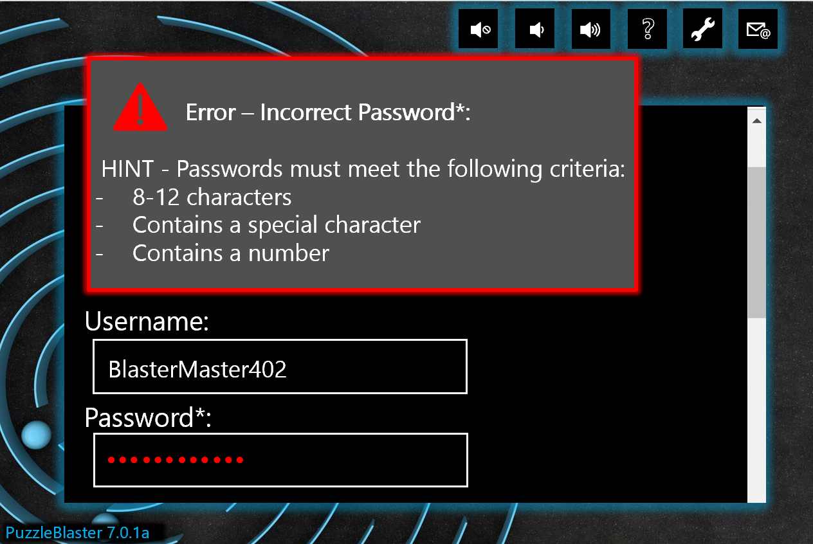
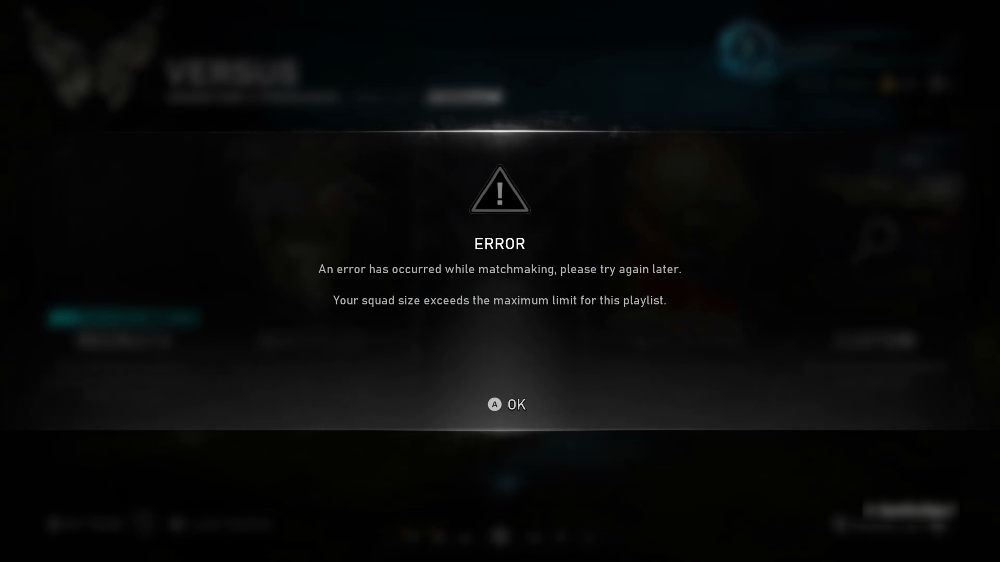
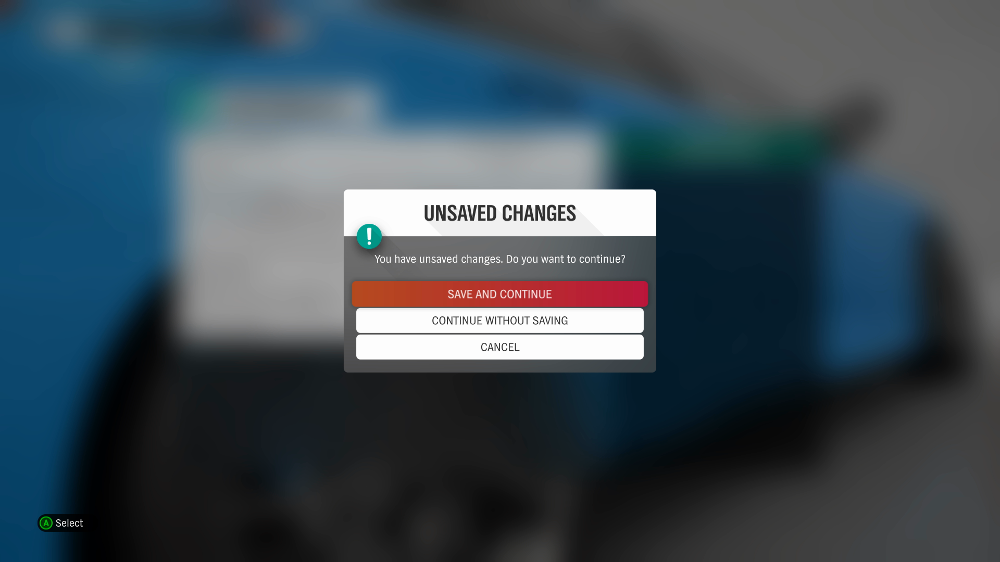
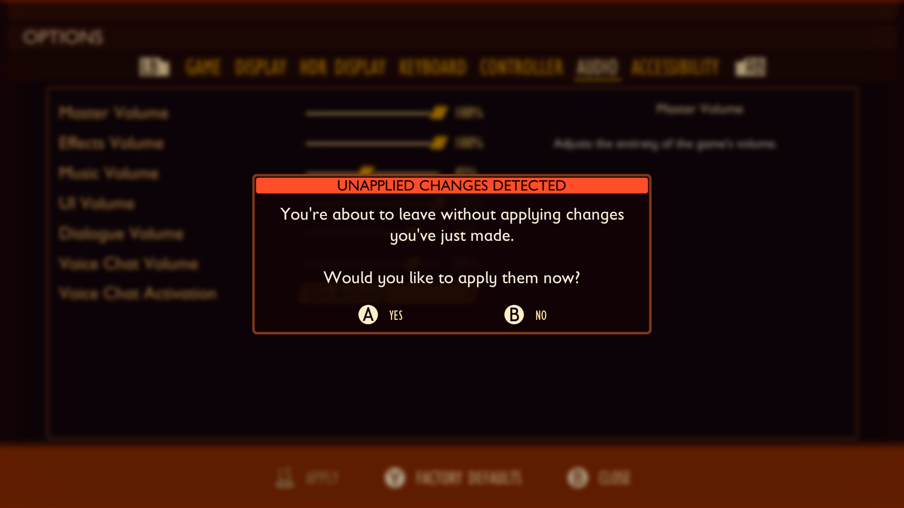
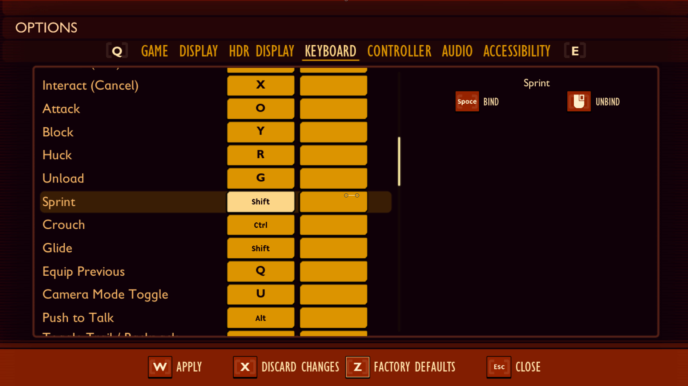

# Xbox Accessibility Guideline 115: Error messages and destructive actions

## Goal

The goal of this Xbox Accessibility Guideline (XAG) is to ensure that players can identify and correct any player-input errors before permanent or destructive action takes place.  

## Overview

Player-input errors, like minor typos or accidental button activation, are quite common. The use of assistive technologies like voice input, adaptive hardware, or other factors that affect input accuracy can contribute to a higher frequency of player-input errors. Players with learning or intellectual disabilities might rearrange numbers and letters. Players with motor disabilities might press keys by mistake. This can negatively affect experiences such as creating accounts (like providing email and password information) or making purchases (for example, unintentional purchases). It might even result in a player losing progress or accidentally deleting settings and configurations. Providing the ability to reverse actions or review and correct information ensures that players have an opportunity to avoid potentially negative consequences before they occur.  

## Scoping questions

Assess player input in your game.  

 - Does your game require players to enter usernames, passwords, or other criteria-based information (like a password to sign in to a player account or a password to access a private server)?  

 - Does your game provide the ability to save information (like game progress or settings configurations)?  

 - Does your game provide opportunities for in-game purchases?  

 - Does your game provide experiences where players are expected to enter text into a form box (like choose your character name or choose your password)?  

 - Does your game allow players to perform irreversible decisions that might harm their experience if carried out accidentally, like dismantling/selling a rare inventory item or permanently dismissing an non-player character (NPC) companion?  

## Implementation guidelines

 -  If an input error is automatically detected, such as incorrectly entering a password, the error and the method to correct the error is described to the player in multiple ways (like through text or voice narration).

      > [!NOTE]
      > Providing information that would jeopardize the security or purpose of the content is exempt from this guideline.  
      

      
 Example (expandable) 

      

      > In this example, the game provides an error alert after a player attempts to sign in to their account. The nature of the error (an incorrect password) is provided in the error message. General password criteria are also provided as additional context. This helps the player correct their password information without providing any exact details that would jeopardize the player’s password security. The error message is also narrated aloud to players with screen narration enabled.

      

      [Video link: error description](https://youtu.be/pihbmOxsZgU "Click to open the video example.")

      > In this error message from Gears 5, the player is provided information on the nature of the error (matchmaking couldn't be completed), as well as additional information that helps the player understand what the error is so that they can correct it (“Your squad size exceeds the maximum limit…”).

      

 - Make error and warning messages easy to visually distinguish from other text on the screen.  
     

    
Example (expandable)

    

    > In Forza Horizon 4, when errors or warnings appear on screen, all other background text or visual UI content is blurred out, making the information easy to distinguish from other UI content. Additionally, the bright red focus indicator, large “Unsaved Changes” text, and exclamation point icon also reinforce the presence of the text in the error window. This information lets the player know that action should be taken.

    

 - Visually emphasize errors and warnings where they've occurred.  
     

    
Example (expandable)

    

    > In this example, the player is creating a new account. When they enter the password that they want, they receive an error notification that the password can't be saved. The notification lists the criteria for the password. The “contains a number” requirement is visually emphasized as the contributing source of the error by underlining the criteria, adding an asterisk, and including the words “not met” as an additional cue for players who are using screen narration and are unable to see other visual cues.

    

 - If any action the player takes will result in stored data that they control being deleted or modified in any way, provide the player an opportunity to review and correct the data or completely reverse the action before committing it.  
     

    
Example (expandable)

    

    > In Grounded, the game provides a warning notification when a player attempts to exit the settings window without first pressing the “apply” button to save changes. This ensures that players don't lose any specific setting changes that they want to apply. This also allows players to press “No,” and cancel applying any changes that were recently made. This ensures that any changes made unintentionally or through player error aren't applied to the player’s game settings.

    

    > In Grounded, another accessibility feature is the ability to reset any settings changes to their “Factory Default” state. This is important because players can essentially start “fresh” from the defaults in configuring their settings without manually reconfiguring every setting that they've made changes to. It also eliminates the need to remember what the default factory settings were for the game.

    

 
 - Offer players a mechanism to review, confirm, and undo permanent or destructive actions (for example, making an in-game purchase, selling an item, or overwriting a game save).
    

    
Example (expandable)

    

    > In Fallout 76, confirming a purchase from a merchant is a two-step process, and each step gives the player an opportunity to accept or cancel.

    

    > In the Cyberpunk 2077 initial character creation menu, when a player tries to progress into gameplay without spending all attribute points, they are given a warning prompt reminding them that unspent attribute points do not carry over into the game and will be lost if not used prior to proceeding to the next menu.

    

 - Don't require button holds for confirmation of destructive actions. Provide alternate options to button holds in these scenarios.  

## Potential player impact

The guidelines in this XAG can help reduce barriers for the following players.  

Player | Impacted
:------- | :-------:
Players without vision | **X**
Players with low vision | **X**
Players with cognitive or learning disabilities | **X**
Players with limited reach and strength | **X**
Players with limited manual dexterity | **X**
Other: players who want to avoid making unintended purchases | **X**

## Resources and tools

Resource type | Link to source
:--- | :---
Article | [Preventing User Errors: Avoiding Conscious Mistakes (external)](https://www.nngroup.com/articles/user-mistakes/)