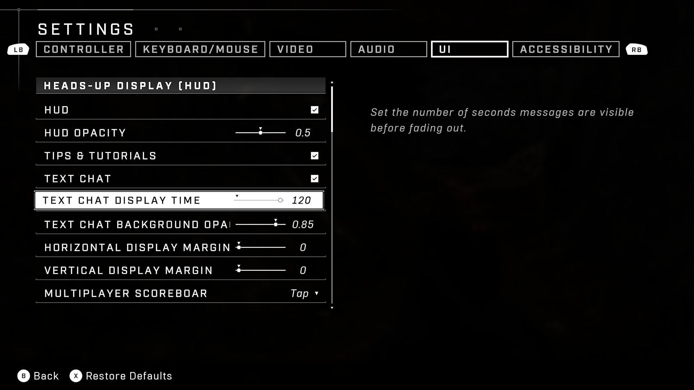
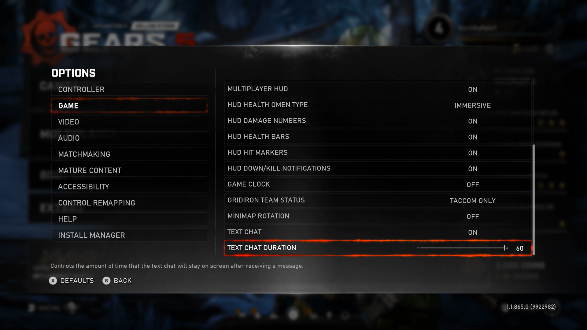
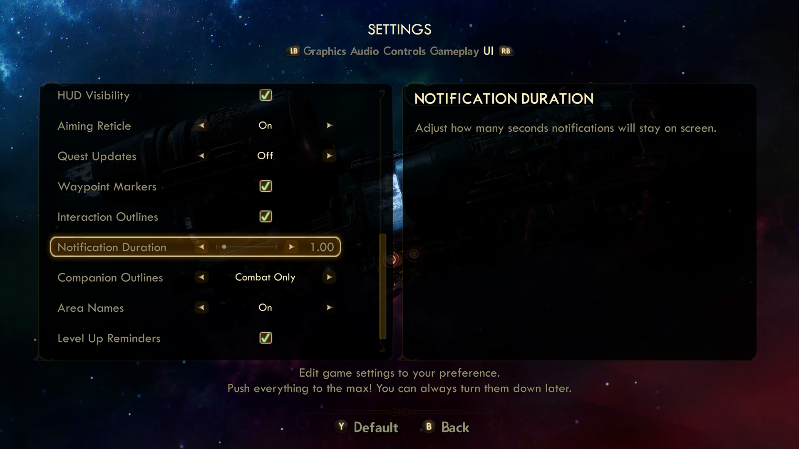
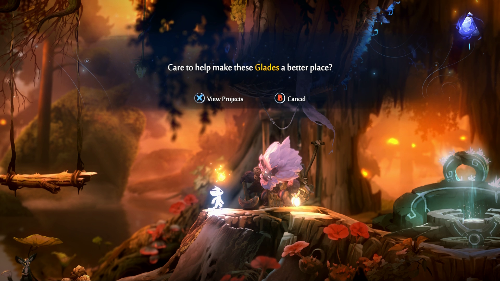
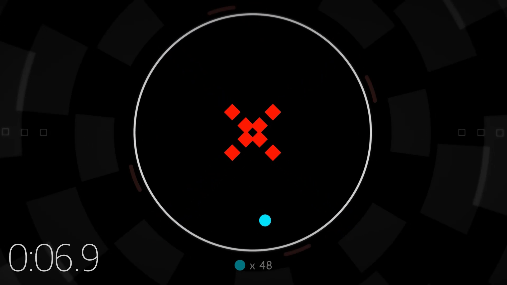
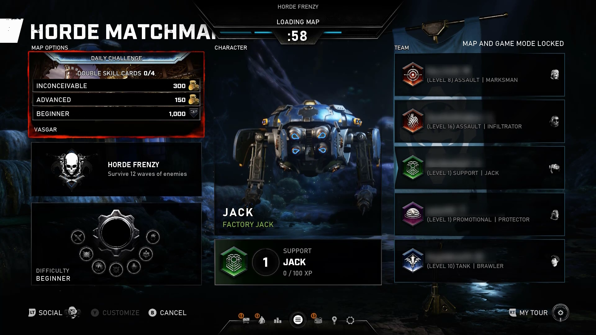

# Xbox Accessibility Guideline 116: Time limits

## Goal

The goal of this Xbox Accessibility Guideline (XAG) is to ensure that players have adequate time to read, interpret, and interact with all the UI in the game.

## Overview

At a high level, the implementation of a time limit in the UI requires the player to perceive the time-limit warning (visually or through screen narration), read and interpret the warning, determine what actions need to be taken, and physically complete the task that's required within the allotted amount of time.  

There are many reasons that a player might need more than the alloted time to complete a task. For example, a younger player who can't read might need time to get a parent from another room to read the instructions to them. Players with disabilities such as blindness, low vision, dexterity impairments, and cognitive limitations might require more time to read content or to physically perform tasks such as filling out online forms. If functions are time-dependent, it can be difficult for some players to perform the required action before a time limit is up. This might result in negative consequences like lost progress, being signed out of an account unintentionally, or even rendering the game unusable.  

It's important to remember that these guidelines only apply to interactions that are not considered to be core gameplay mechanics. For example, most time limits that are presented in a UI menu (for example, “You have been idle for 20 minutes; select ‘stay signed in’ or you will be automatically signed out in 20 seconds”) are applicable to this requirement. However, an actual gameplay mechanic (for example, a countdown timer of three minutes to finish a track in a racing game) isn't applicable to the guidance in this XAG.  

## Scoping questions

Does your game introduce countdown timers or other time limits in areas of the game that aren't related to core gameplay mechanics? Examples include experiences like the following:

 - The player is signed out after being idle if they don't select “stay signed in” within a certain amount of time.

 - The player’s character dies, and the player has 30 seconds to press “A” to respawn at the current point in their game. Otherwise, they're taken to the main menu and lose recent progress.

 - The game includes on screen tutorials, notifications, or chat communication windows on screen that no longer appear after an allotted time.

## Implementation guidelines

- When time limits are imposed for any UI interaction (not related to core game mechanics):
   - Time limits are used only when they're essential and unavoidable.  

   - The player is informed (in multiple ways) when they're about to encounter a time limit.  

   - There's a method to modify the time limit. The player can:  
     - Request a longer session time limit, or no time limit for the session before the time limit begins.  

     - Adjust the time limit before encountering it, up to at least ten times the length of the default limit.  

     - Be warned before time expires and be given at least 20 seconds to extend the time limit with a simple action (for example, "press the A button"), and the player can extend the time limit at least ten times.  

     - Turn off the time limit.  
  

  
Example (expandable)

  

  > In this example, a warning dialog box appears on screen. The warning notifies the player that they have been idle for too long and will be logged out of their account if further action isn't taken within 90 seconds. This time limit for idle activity can be considered an essential security measure. The limit protects the account owner from scenarios like accidentally leaving their account signed in at a public space, allowing unintended players access to stored private information or the ability to make unauthorized account changes.
  > 
  > This warning also meets multiple guidelines. The player is given at least 20 seconds (in this case, 90 seconds) to extend the limit with simple actions like clicking the Extend button or pressing the Spacebar on their keyboard. The game also provides the ability to adjust time limits in the settings menu. This can be accessed at any point, including before a time-limit warning is encountered. Within these settings, the player can adjust the current idle time limit or turn it off completely (ideal for a player who's using a home computer).

  

  > In Halo Infinite, the player can adjust how long text chats will display in the HUD, anywhere from 5 to 120 seconds.

  

- When imposing time limits that control the duration that an important element appears on screen (for example, the amount of seconds a tutorial text window, speaker dialogue, or text-chat/speech-to-text communication window remains visible):
  - The player is able to adjust the number of seconds that these elements appear on screen before encountering them (such as in a settings menu), up to at least ten times the length of the default limit.  
    

    
Example (expandable)

    

    > In Gears 5, players can adjust the amount of time, up to 60 seconds, that text chat will stay on screen after receiving the message.

    

    > In The Outer Worlds, players can adjust how long notifications will stay on screen.  

    

  
   - Alternatively, the player can disable duration limits. Elements can be dismissed or advanced to the next tutorial window or dialogue text on input.
     

     
Example (expandable)

     

      [Video link: advancing text in Ori and the Will of the Wisps](https://youtu.be/7l-badX6m_Q "Click to open the video example.")

     > In Ori and the Will of the Wisps, on screen written dialogue from non-player characters (NPCs) doesn't have a time limit. It appears on screen until action is taken. In this case, players can take as much time as they need to read dialogue. When they're ready, they can press “A” to advance to the next dialogue phrase.

      

      

      [Video link: advancing text in Dragon Quest XI S: Echoes of an Elusive Age](https://youtu.be/i-i-hotvnT8 "Click to open the video example.")

      > In Dragon Quest XI S: Echoes of an Elusive Age, players can choose whether they want voiced cutscenes to advance automatically or manually via button press. When the Autoplay Cutscenes option is disabled, recently spoken dialogue text remains on screen until the player decides to advance to the next portion of the cutscene, giving them as much time as they need to read and comprehend the dialogue. Players can even choose in real time to enable or disable the Autoplay Cutscenes option.

     

- **Exception**: A time limit imposed by the content is exempt from this expectation if at least one of the following is true.
   - The time limit is a required part of a real-time event (for example, an auction), and no alternative to the time limit is possible.  

   - The time limit is essential to the task.
     

     
Example (expandable)

       

    [Video link: time limit exceptions](https://youtu.be/uKM9X7h71v8 "Click to open the video example.")

     > Time limits or timed events that occur as part of core game mechanics aren't included in this XAG. This includes in-game scenarios like countdown timers between checkpoints in a racing game or a time limit before a sports match ends. This example from HyperDot shows the use of a timing mechanism that's part of essential gameplay. Examples like these don't require an ability to extend or alter time limits.  
     > 
     > Despite this, it's important to note that HyperDot also provides players with an extensive list of modifications that can be made to free-play levels, including adjusting the time limit for the level. This type of feature, although not related to this XAG, is a good example of proper implementation of XAG 108: Game difficulty.
     

  
  - The default time limit exceeds 20 hours. 
> [!NOTE]
> Real-time multiplayer events, such as countdown timers in a lobby, aren't required to provide an ability to extend or adjust the amount of time until gameplay will start because this would affect the play of other players in the matchmaking session.  
  

  
Example (expandable)

  

  [Video link: matchmaking time limit exception](https://youtu.be/RHUeYRUQOE0 "Click to open the video example.")

  > In this example from Gears 5, the player is currently in a matchmaking lobby. Other online players are joining the lobby during this time. The countdown timer signifies to players when the matchmaking and loading processes will be complete and when active gameplay will start. This is another game area that doesn't require the ability to extend or adjust the amount of time left before gameplay will start because this would affect the other players in the lobby.  

  

## Potential player impact

The guidelines in this XAG can help reduce barriers for the following players.  

Player | Impacted
:------- | :-------:
Players without vision | **X**
Players with low vision | **X**
Players without hearing | **X**
Players without limited hearing | **X**
Players with cognitive or learning disabilities | **X**
Players with limited reach and strength | **X**
Players with limited manual dexterity | **X**
Players with prosthetic devices | **X**
Players with limited ability to use time-dependent controls | **X**
Other: casual players, younger players, those new to gaming | **X**

## Resources and tools

Resource type | Link to source
:--- | :---
Article | [Avoid repeated inputs (button-mashing/quick time events) (external)](http://gameaccessibilityguidelines.com/avoid-repeated-inputs-button-mashingquick-time-events)
Article | [Allow players to progress through text prompts at their own pace (external)](http://gameaccessibilityguidelines.com/allow-players-to-progress-through-text-prompts-at-their-own-pace)
Article | [Offer a means to bypass gameplay elements that aren’t part of the core mechanic, via settings or in-game skip option (external)](http://gameaccessibilityguidelines.com/offer-a-means-to-bypass-gameplay-elements-that-arent-part-of-the-core-mechanic-via-settings-or-in-game-skip-option)
Article | [Include a cool-down period (post acceptance delay) of 0.5 seconds between inputs (external)](http://gameaccessibilityguidelines.com/include-a-cool-down-period-post-acceptance-delay-of-0-5-seconds-between-inputs)
Article | [Do not make precise timing essential to gameplay – offer alternatives, actions that can be carried out while paused, or a skip mechanism (external)](http://gameaccessibilityguidelines.com/do-not-make-precise-timing-essential-to-gameplay-offer-alternatives-actions-that-can-be-carried-out-while-paused-or-a-skip-mechanism)
