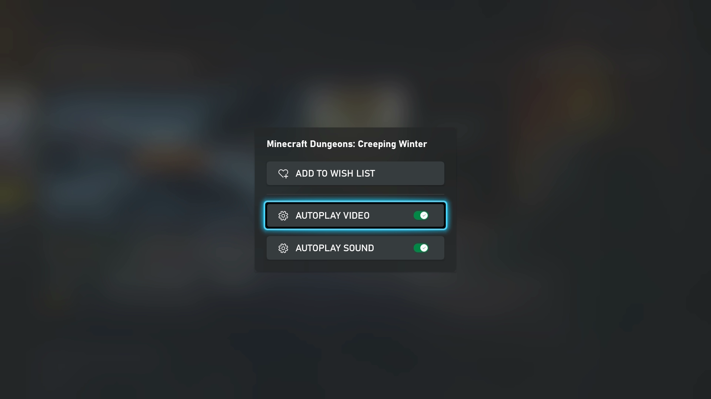
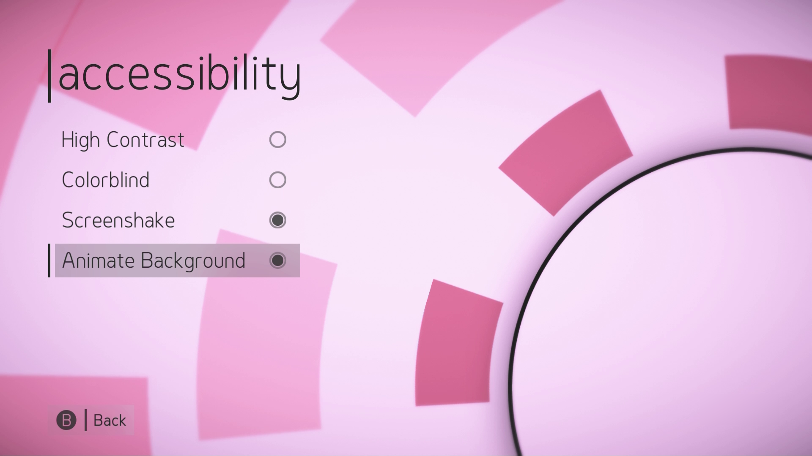
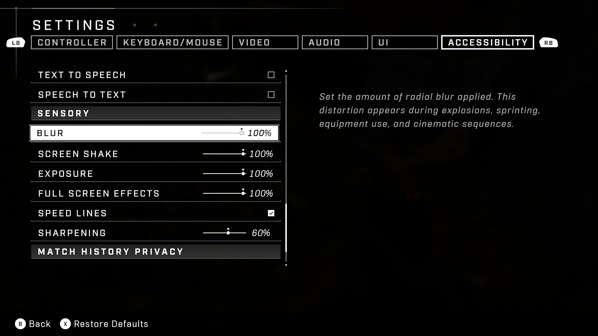
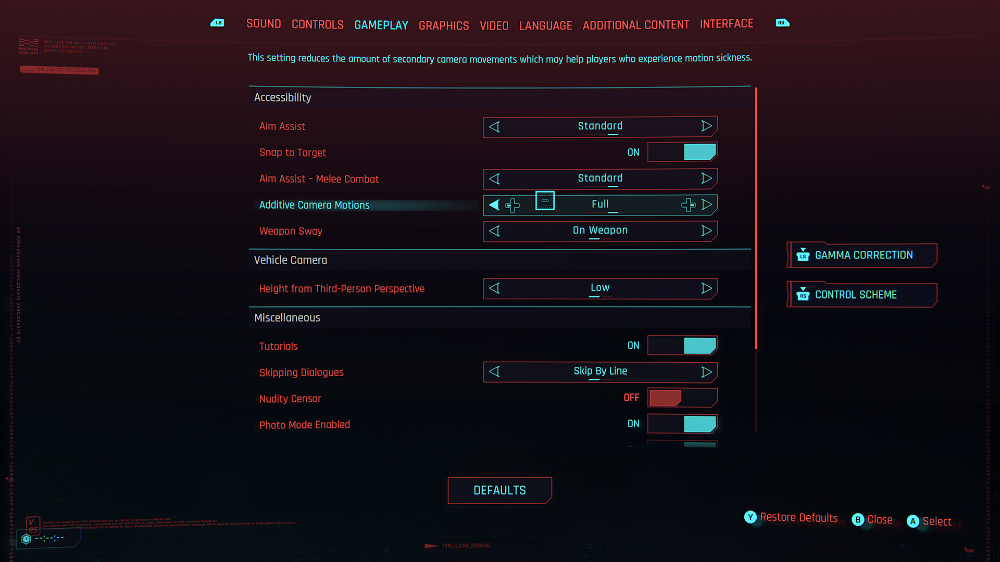
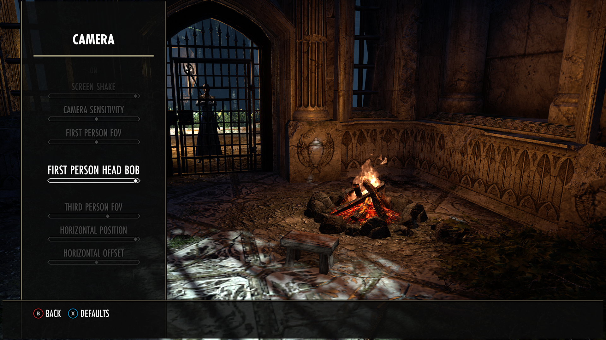
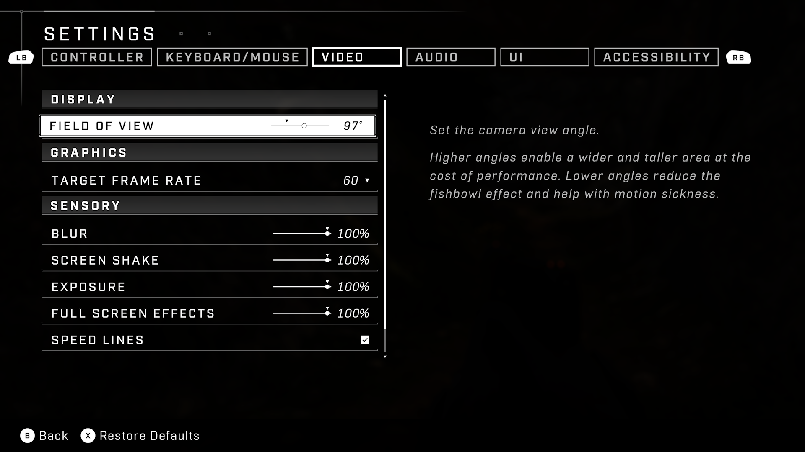
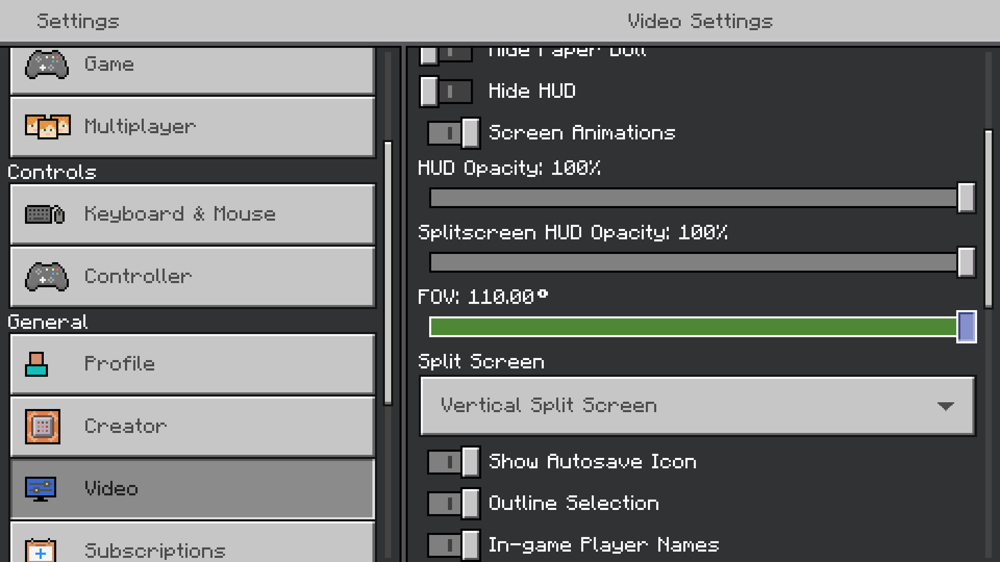
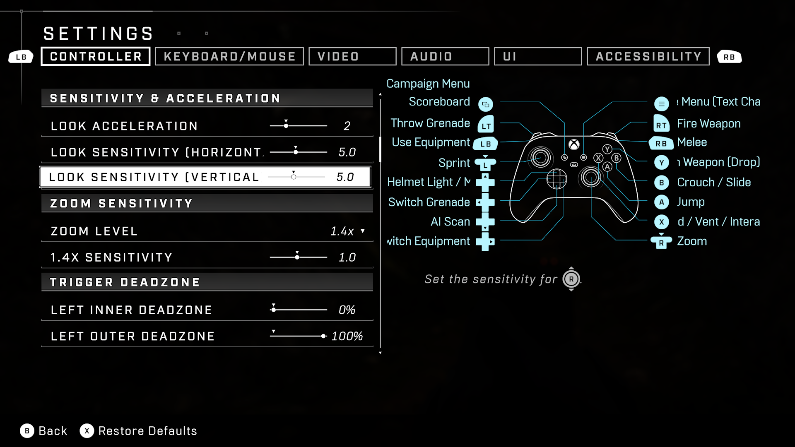

# Xbox Accessibility Guideline 117: Visual distractions and motion settings

## Goal

The goal of this Xbox Accessibility Guideline (XAG) is to ensure that players can pause or completely stop any content that scrolls, blinks, auto-updates, or otherwise moves. Additionally, players should be able to customize game settings related to field of view, camera movement and sensitivity, and other visual settings related to camera or screen movement. This benefits players who are susceptible to motion sickness, players who are easily distracted by blinking, scrolling, or otherwise moving content, and players who are unable to quickly read text before an auto-update or scrolling occurs.

## Overview

The guidelines in this XAG cover two areas of visual element presentation in games. The first area is related to text or visual elements that blink, scroll, auto-update, or otherwise move on screen without being prompted by player input. The second area is related to in-game experiences that may elicit motion sickness for players. In some cases, there is a large overlap between moving or scrolling text-based content and game mechanics that commonly contribute to motion sickness.

Text that scrolls, auto-updates, or otherwise moves while presented on screen can pose barriers for players. Players who have difficulty reading text quickly may run out of time before the text auto-updates. Players can also experience motion-sickness while trying to read text that is scrolling or moving, or while reading stationary text within a UI that has moving elements behind the text. Additionally, moving text can be difficult for screen reader software.

Even when the text itself is stationary, if there are background animations or other visual distractions present on the UI screen behind the stationary text, players with attention deficit disorders or cognitive disabilities might find these movements distracting. Providing players with the ability to pause, hide, or completely remove moving, blinking, or auto-updating content helps ensure that all players can more easily concentrate on text elements. Additionally, when in-game movement behind stationary elements is unavoidable, providing players the option to enable an opaque background behind the text itself can be helpful.

General screen and camera movements can also pose barriers to players by eliciting motion sickness during play. Imagine the following common immersive visual scenario: a player has a first-person view of their character walking down a dirt road. With each step, the player’s entire UI slightly bobs up and down, similar to the actual visual experience of walking on uneven ground. While this visual experience in the game may “trick” the player’s brain into thinking that the player themself is walking, this conflicts with the lack of actual body movement detected by the player’s vestibular and sensory system as they sit on their couch playing this game. This mismatch between the visual perception of body movement and actual body movement contributes to feelings of motion sickness among players.

This is why intentional decisions around settings related to camera field of view, camera bobbing, motion blur, weapon sway, automatic changes in camera angle, and more are critical when creating more accessible experiences.

## Scoping questions  

Does your game include any of the following animated content in the UI when text is present?  

- Moving or animated backgrounds that are present while a player is navigating UIs with text or other important elements that are key to understanding gameplay?  

- Blinking or flashing content that's present while a player is navigating UIs with text or other important elements that are key to understanding gameplay?  

- Auto-updating content like leaderboards or rankings?  

- Does your game include any visual behaviors, excluding those that are core to gameplay, that cause the field of view, camera angle, or other aspects of the UI to move without being initiated by the player such as:

    - Allowing players to choose between first and third person point of view?
    - Allowing players to adjust their camera angle? (for example, games with separate controls for character movement and camera movement)
    - Automatically change camera view or angle (for example, camera auto-centering)
    - Camera-specific behaviors such as "camera shake" or "head bob?"
    - Repetitive side-to-side or up-and-down movement of on-screen elements?
    - Movement-specific behaviors such as "weapon sway?"

## Implementation guidelines

- When moving, blinking, scrolling, or auto-updating content is presented on a UI screen that also contains text, provide players with the following:
    
  - Auto-updating content:
    - A method to control the frequency of updates to on screen content.

      

      
Example (expandable)

        

      [Video link: settings for automatic playing of visual content](https://youtu.be/8mkrwAWtPoI "Click to open the video example.")

      > In the Microsoft Store app on the Xbox console, preview videos play automatically. Players are given the option to disable Autoplay of video, as well as Autoplay of video sound.  
      

    - A method to pause, stop, or hide auto-updating content.
  - Moving, blinking, scrolling, or flashing content:  

    - A mechanism to entirely disable this content.  

    - A mechanism to pause or hide this content.  
      

      
Example (expandable)

        

        [Video link: turning off background animations](https://youtu.be/3HLhVbCzwOY "Click to open the video example.")

        > In HyperDot, players are given the option to turn off the “Animate Background” setting. After being turned off, moving objects that appear in the background of menu screens become static.  

      

> [!NOTE]
> Ancillary gameplay that occurs surrounding the text-based UI experience isn't subject to this.
  

  
Example (expandable)

  

  > The ability to turn off all background movement during active gameplay isn't subject to XAG 117 guidelines. However, providing players the ability to place backgrounds with adjustable opacity behind text that appears during active gameplay, like in this example from Sea of Thieves, can increase text readability.  

  

- Avoid the use of camera shake, camera bobbing effects, motion blur, mouse blur, and more or provide an option to turn off these behaviors.
  

  
Example (expandable)

  

  > In Halo Infinite, players can individually set the intensity or amount of radial blur, screen shake, full screen effects, and speed lines across a sliding scale from zero to 100%.

  

  > In Cyberpunk 2077, players can adjust the amount of additive or secondary camera movements to help players who experience motion sickness.

  

- Avoid any repetitive side-to-side or up-and-down on-screen movement, except that which is core to game play. This includes behaviors such as "weapon sway" or "camera bobbing."
  

  
Example (expandable)

  

  > In Elder Scrolls Online, players can adjust the intensity of first-person head bob movements across a sliding scale.  

  

- Provide adjustable field of view settings.

    > [!NOTE]
    > This allows players to choose a field of view or angle that is least likely to make them sick based on their sitting distance from their screen and other factors.
  

  
Example (expandable)

  

  > In Halo Infinite, players can adjust their field of view angle. Additional context is included that informs players that higher angles will enable a wider and taller area of view while lower angles reduce the “fishbowl” effect and help with motion sickness.

  

  > In Assassin’s Creed Valhalla, players can choose how close the camera view is in relation to the 3rd person view of their character.  

  

  > In Minecraft, players can adjust the Field of View angle up to 110 degrees.

  

  > This capture displays what the in-game environment may look like when using a very high FOV angle. The player has a tall and wide perspective of their environment, resulting in a “fishbowl” effect.

  

  > This capture displays what the in-game environment may look like when using a lower FOV angle. The player’s view does not capture nearly as much of the vertical and horizontal gameplay areas and can help reduce feelings of motion sickness.

  

- Provide camera movement settings like the ability to adjust horizontal and vertical camera movement sensitivity and the ability to disable automatic camera movement.
  

  
Example (expandable)

  

  > In Sea of Thieves, players can not only enable and disable auto camera centering, they can also adjust the amount of time between character movement and when auto centering occurs, as well as the speed in which the camera auto centers.

  

  > In Halo Infinite, players can adjust the “look” sensitivity of their camera controls on both the horizontal and vertical axis.
  

- Allow players to choose between 1st and 3rd person camera views.

## Potential player impact

The guidelines in this XAG can help reduce barriers for the following players.  

Player | Impacted
:------- | :-------:
Players with low vision | **X**
Players with little or no color perception | **X**
Players with cognitive or learning disabilities | **X**
Other: players with epilepsy, players with motion sensitivity | **X**

## Resources and tools

Resource type | Link to source
:--- | :---
Article | [Provide an option to turn off / hide all non-interactive elements (external)](http://gameaccessibilityguidelines.com/provide-an-option-to-turn-off-hide-all-non-interactive-elements)
Article | [Provide an option to turn off / hide background movement (external)](http://gameaccessibilityguidelines.com/provide-an-option-to-turn-off-hide-background-movement)
Article | [Avoid (or provide option to disable) any difference between controller movement and camera movement (external)](http://gameaccessibilityguidelines.com/avoid-or-provide-option-to-disable-any-difference-between-controller-movement-and-camera-movement-such-as-weaponwalk-bobbing-or-mouse-smoothing/)