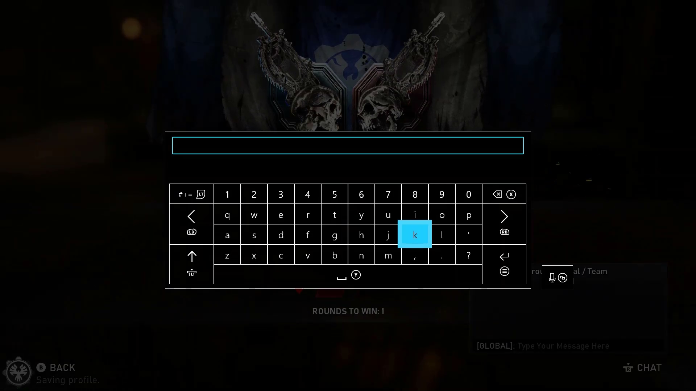
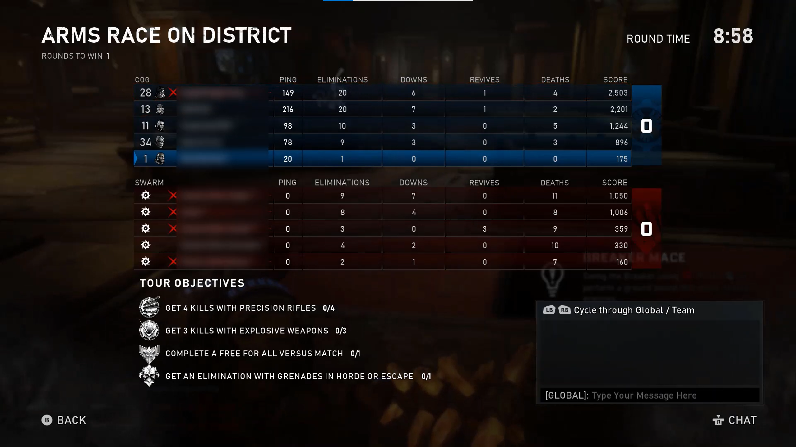
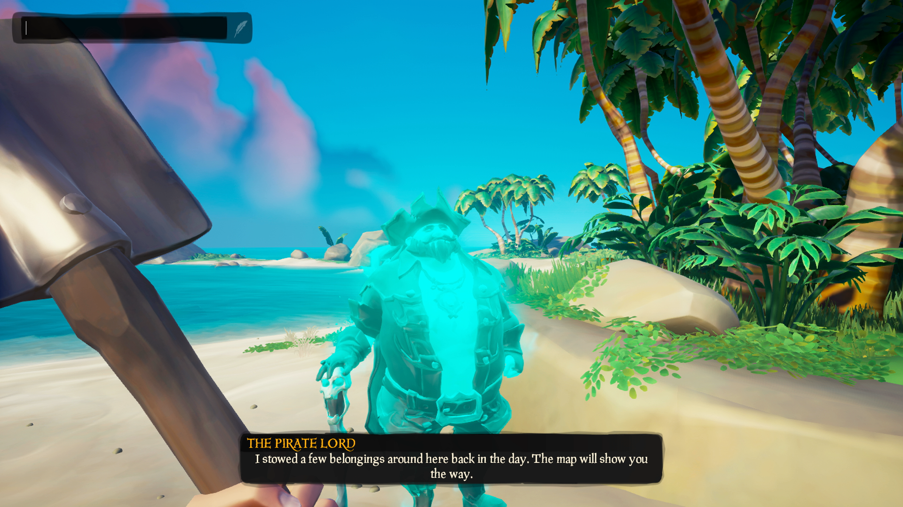
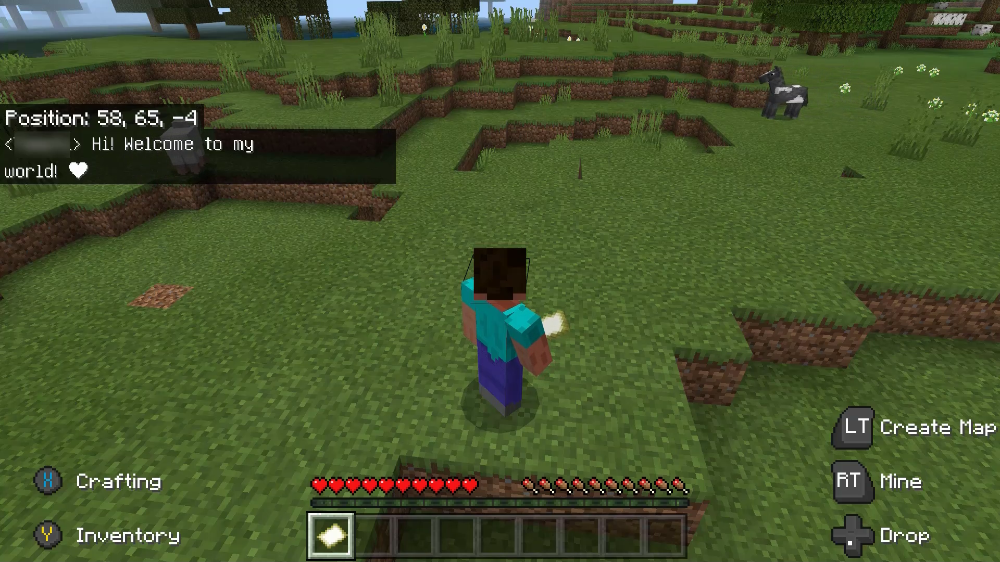
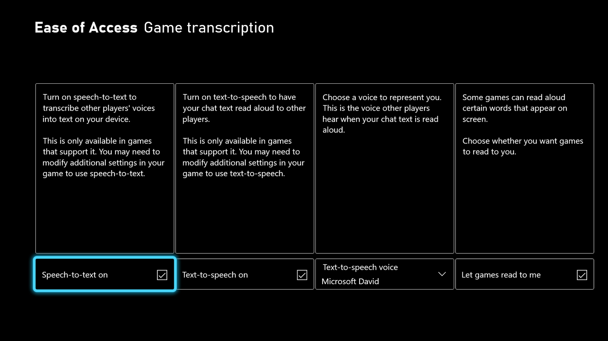
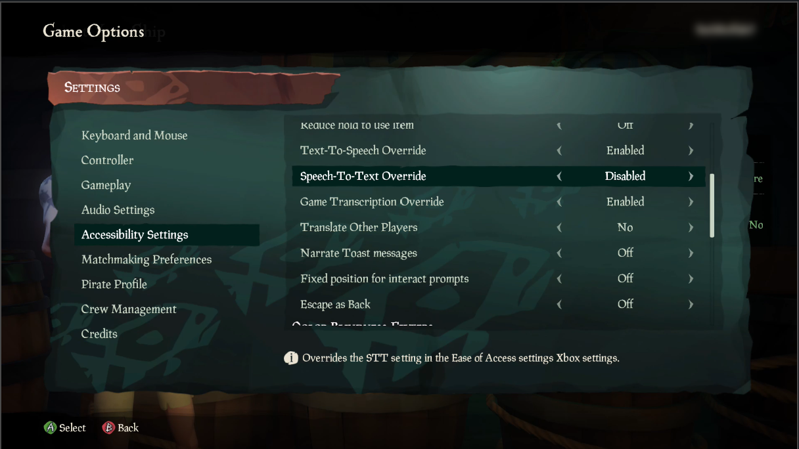
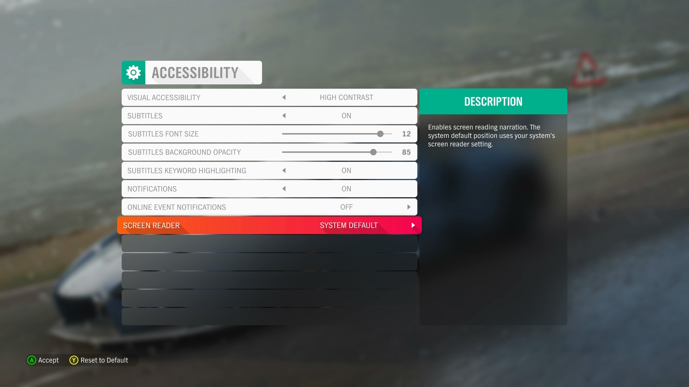

# Xbox Accessibility Guideline 119: Speech-to-text/text-to-speech chat

## Goal

The goal of this Xbox Accessibility Guideline (XAG) is to ensure that all players can participate in communication experiences like text chat or voice chat. This is especially important for players who are d/Deaf or hard-of-hearing, non-verbal, or have low or no vision.

## Overview

Communication experiences are one-to-one or one-to-many exchanges of information between players. They typically occur in the form of online text chat between players or online party chat where players can speak aloud to one another during active gameplay. Communication experiences can also occur outside active gameplay. Examples of these experiences include the ability to talk or send messages while in a multiplayer lobby or sending messages to a player’s inbox that can be read later.  

Players who are d/Deaf or hard-of-hearing might have difficulty communicating with players in party chat. Similarly, players with low or no vision might be unable to read incoming text chat messages. When players are excluded from communication with other players, they can miss out on essential aspects of gameplay, like their teammates discussing strategy. Subsequently, if a player is unable to perceive incoming communication from other players, it's very difficult to respond to or join the conversation.  

A player who is d/Deaf or hard-of-hearing should be able to use a speech-to-text chat feature that transcribes spoken language into text that appears on screen for the player to read.  

Players who don't communicate verbally, by choice or because of a disability, should be able to use a text-to-speech chat feature. The player can enter what they would like to say aloud in chat into a text-entry box. This text is then read aloud to all other players via a synthesized voice. This ensures that the player’s voice is heard. Other players don't have to enable any specific settings for this chat feature. The text is just spoken aloud and heard as if the player had spoken it instead of entering it into a text-entry box.  

> [!NOTE]
> The provision of voice chat isn't the same as making text chat accessible. The provision of text chat isn't the same as making voice chat accessible. Players should be able to communicate through the method of their choosing.  

## Scoping questions

Does your game include any of the following communication-related scenarios?  

- The ability to send and receive text chats between players?  

- The ability for players to communicate verbally via audio chat?  

- The ability to send predefined phrases such as those in chat wheels?  

- The ability to send and receive friend requests, invitations, and other player-to-player&ndash;related notifications?  

- The ability to use non-text communication in the context of a chat such as emotes or emojis?  

## Implementation guidelines

Games should provide the following accessible communication capabilities.  

- **Speech-to-text chat:** Players can enable speech-to-text chat to have all voice-based communication from other players transcribed into text in real time.  

   
 
   
Example (expandable) 

    

   > In this example from Halo Wars 2, the player has enabled speech-to-text chat. The highlighted area labeled “STT Display Area” on the right side of the screen shows a real-time transcription of what other players in the game are saying aloud. (This screenshot has been edited. The red and white box that's surrounding the STT Display Area, as well as the “STT Display Area” text, aren't part of the Halo Wars 2 UI and have been added for this example.)  

   

- **Text-to-speech chat:** Players can enable text-to-speech chat. When enabled, players are provided a text-entry box. All outgoing text that the player enters into the text-entry box is transformed into synthesized audio in real time and broadcast on the voice channel to all other players.  

   
 
   
Example (expandable) 

   

   [Video link: text-to-speech chat text entry](https://youtu.be/hn0I6cM-qQQ "Click to open the video example.")

   > In Sea of Thieves, players can move focus to the text-entry box on the top-left corner of their screen. In doing so, an on screen keyboard appears. Text entered into the on screen keyboard is announced aloud to all players in real time.  

   

   [Video link: text-to-speech chat text entry](https://youtu.be/pOJa8J5rtWo "Click to open the video example.")

   > In Gears 5, a text-entry box is present on the bottom-right side of the screen. Players can right-stick click to open the on screen keyboard. All text sent through the text-entry box is broadcast aloud for all players to hear. The “Global” and “Speech” tags that appear next to the messages are provided to confirm to the player that their text message is visible to players who have speech-to-text enabled and that it was also narrated aloud via a synthesized voice to players who are listening to the party chat.  
   

- **Text-entry box:** A text-entry box should be made available for players to enter text everywhere communication is available.  

   
 
   
Example (expandable) 

   

   > This example shows the text-entry box that's present in Gears 5. It's important to note that the box appears everywhere that communication in the game is possible, including UIs that aren't related to active game play.  
   
   

   > This example shows the text-entry box that's available in Sea of Thieves. It's available in all places that communication is supported throughout the game.  

   

- **Screen narration (text-based communication):** All incoming text-based communications from other players should be voiced out in real time locally to a player with screen-narration settings enabled.  

   
 
   
Example (expandable) 

   

   [Video link: screen narration of text-based communication](https://youtu.be/khKB4qOaPdk "Click to open the video example.")

   > In this example from Minecraft Bedrock Edition, the player has the screen-narration settings enabled. As a result, when a text-chat message is received, the content of the message is narrated aloud to the player.  

   > [!NOTE]
   > This setting differs from text-to-speech chat functionalities. In Minecraft, only text-based chat communication is supported. Therefore, players who are blind must have their screen narration enabled to hear text-based messages read to them.  

   The text-to-speech chat setting is for games that support voice-based chat. A synthesized voice reads entered text messages aloud. This is an alternative to the player themselves talking aloud.  
   

- **Screen narration (non-text communication):** All phrases, emojis, or emotes should be voiced out in real time locally to a player with screen-narration settings enabled.  

   - Emojis should be voiced out with friendly names, such as “Grinning Face” or “Two Hearts,” based on the CLDR Short Names provided by [Unicode.org](https://unicode.org/emoji/charts/full-emoji-list.html).  

   
 
   
Example (expandable) 

   

   [Video link: screen narration of text-based communication](https://youtu.be/khKB4qOaPdk "Click to open the video example.")

   > In this example from Minecraft Bedrock Edition, the text-chat message is narrated aloud to the player. The message is spoken as, “Hi! Welcome to my world! [Red Heart].” The narration software recognizes the red heart emoji and narrates its associated label aloud. This ensures that players using narration don't miss important aspects of a message, even if they aren't text-based.  
   
   

- **Player-initiated character voice:** All player-initiated character communication spoken aloud that conveys intent to another player, such as the audio voice-over of a predefined message from a chat wheel, should be transcribed into text, in real time, and displayed locally to a player with speech-to-text chat enabled.  

   - It's also important to note that the process of reviewing predefined message options is also accessible. Players with screen narration enabled should be able to hear a preview of each message aloud when it receives focus so that players know what they're selecting before sending it.  

- **Read and support platform settings:** Games should, by default, support platform settings that enable speech-to-text chat or text-to-speech chat where those settings exist.  

   
 
   
Example (expandable) 

   

   > Players can use the Game Transcription menu in the Xbox Ease of Access settings to establish their preferred settings for the overall platform. Games that can read platform settings should automatically apply the player’s preferred platform settings. This means that if a player has text-to-speech, speech-to-text, or game narration settings enabled in their platform settings, the game should also launch with those same settings enabled for the player by default.  

   

- **Provide in-game platform setting overrides:** Games should ensure that all core supported features (speech-to-text chat, text-to-speech chat, and screen narration) can be adjusted at the game level. For example, a player has text-to-speech chat enabled at the platform level, and they can disable text-to-speech chat at the game level through a designated menu item in the game’s settings UI.  

   
 
   
Example (expandable) 

   

   > Sea of Thieves reads and applies Xbox platform settings to the game. However, some players might want to enable settings at the platform level but want to disable a setting for a specific game. Sea of Thieves allows players to individually override their platform settings for text-to-speech chat, speech-to-text chat, and game transcription. They can configure the game's specific settings.  

     

   [Video link: in-game platform setting overrides](https://youtu.be/dN_W82ZJwGE "Click to open the video example.")

   > Forza Horizon 4 provides players the option to use the platform settings for narration (“System Default”) or discretely turn narration “on” or “off,” regardless of platform settings.

   

## Potential player impact

The guidelines in this XAG can help reduce barriers for the following players.  

Player | Impacted
:------- | :-------:
Players without vision | **X**
Players with low vision | **X**
Players without hearing | **X**
Players with limited hearing | **X**
Players without speech | **X**
Players with cognitive or learning disabilities | **X**
Other: players who don't want to share their voice online for privacy reasons, players who don't have a microphone or headset | **X**

## Resources and tools

Resource type | Link to source
:--- | :---
Article | [Azure PlayFab Party overview](/gaming/playfab/features/multiplayer/networking/)
Article | [PlayFab Party speech-to-text and text display UX guidelines](/gaming/playfab/features/multiplayer/networking/party-speech-to-text-ux-guidelines)
Article | [PlayFab Party text-to-speech and text input UX guidelines](/gaming/playfab/features/multiplayer/networking/party-text-to-speech-ux-guidelines)
Website | [Full Emoji List (external)](https://unicode.org/emoji/charts/full-emoji-list.html)
