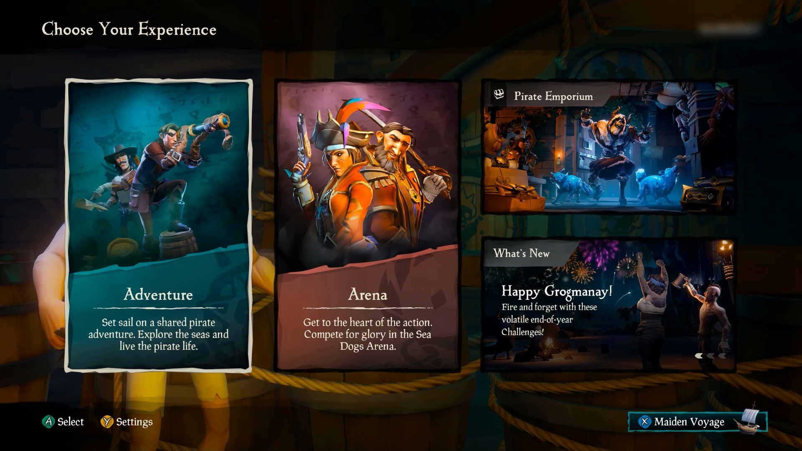
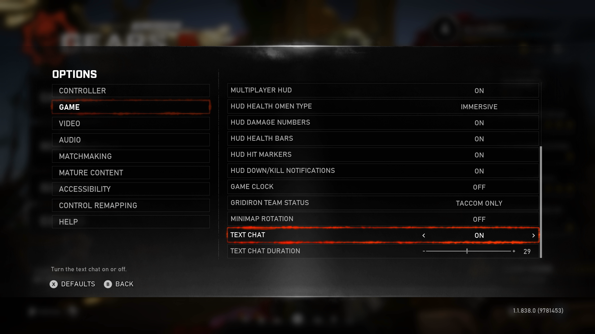
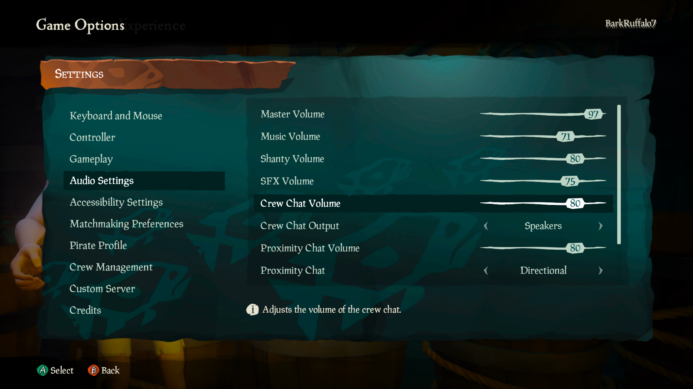
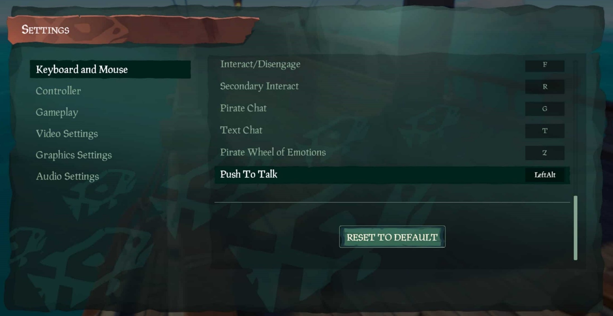
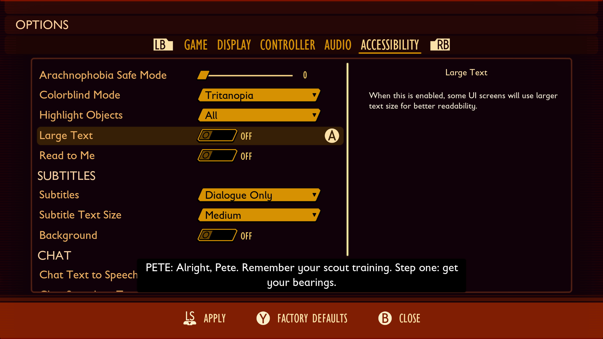
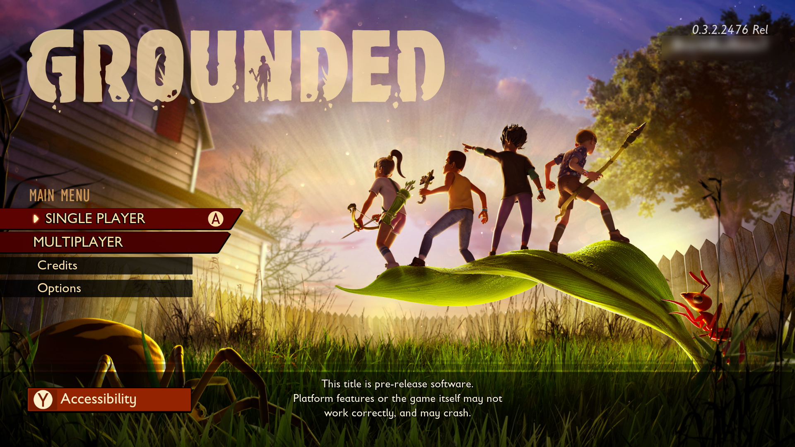
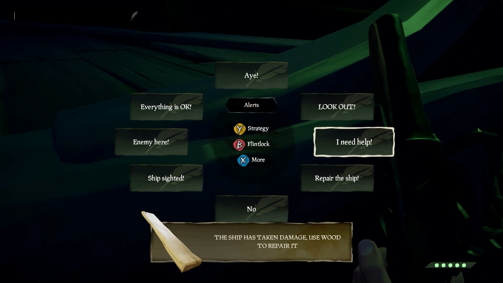
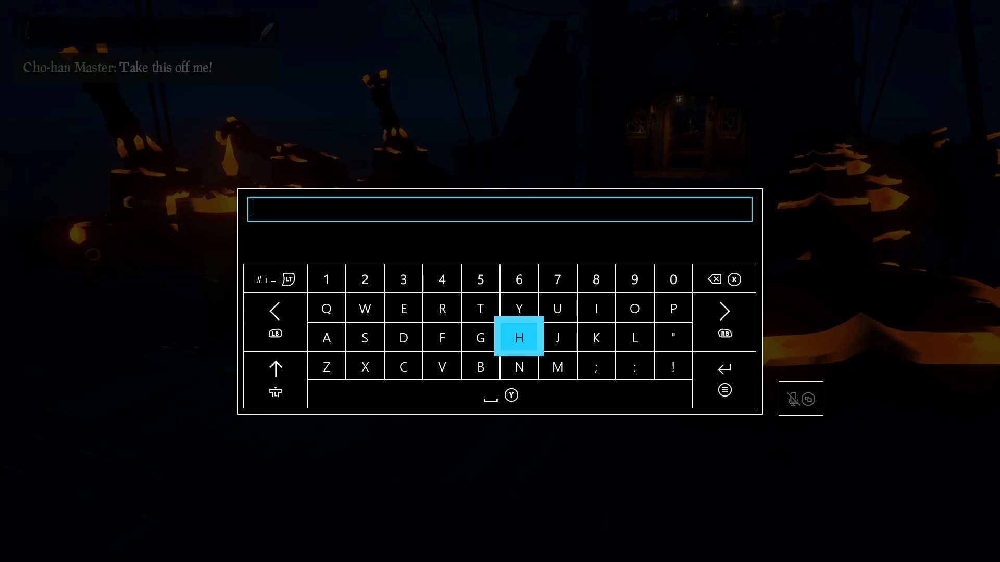

# Xbox Accessibility Guideline 120: Communication experiences

## Goal

The goal of this Xbox Accessibility Guideline (XAG) is to ensure that all players can navigate to, configure, and use communication features in games that support one-to-one or one-to-many player interactions. This is especially important for players who are d/Deaf or hard-of-hearing, non-verbal, or have low or no vision.

## Overview

Accessible communication features like speech-to-text chat, text-to-speech chat, and others are important for ensuring that players with disabilities can communicate with other players in the game.

The ability to use communication features extends beyond the actual communication experience itself. It also requires that the navigation path to communication features and the process of configuring their settings are accessible for players with disabilities. If a player doesn't have an accessible method of navigating to the settings menu and enabling the text-to-speech chat or speech-to-text chat features, they might still be blocked from using these communication features, even though these features are included in the game.

## Scoping questions

Does your game include any of the following scenarios?  

- Does your game provide players the ability to communicate with other players online?  

    - This can include in-game party chat, game chat, text-based chat messages, and sending and receiving player invites.  

- Is the player required to navigate through the UI to access the menu where communication features can be configured?  

- Is the player required to navigate through the UI to access points in the game where communication is available?  

    - For example, in Minecraft, players can communicate with one another after they join a live server. The process of navigating to and joining a server should also be accessible.  

## Implementation guidelines

If a game offers one-to-one or one-to-many communication experiences (like voice chat, text chat, or any other method of connecting players so that they can communicate with one another), it's especially important that the following scenarios be accessible in accordance with all relevant XAGs.

#### Navigating to communication features

The necessary UI path for accessing, launching, or using communication features should be accessible.  

- If a player must navigate through the main menu to turn on communications, the selection, launching UI, and any other subsequent menus on the path to communicating with other players should be usable by a player with a disability.  

    - **Example:** A player must navigate through the main menu to get to the multiplayer screen where they can begin the matchmaking process. After the player has been connected to a lobby, the game loads and then launches into the multiplayer match. In the match, players can begin using communication features. In this example, the experience from the main menu to the match falls under the scope of these requirements. This includes navigating the multiplayer screen to choose a specific type of match, subsequent pathways such as adding players to the game, the loading screen between matchmaking and gameplay, and the point in the game where communication features can be launched and used.

- If a player must select or create a character, join a server, or take some other action to reach the experience that uses communication features, the UI for navigating these selections should be accessible.  

    

    
Example (expandable)
  

    

   [Video link: communication feature navigation](https://youtu.be/MQBSYU3KiDA "Click to open the video example.")

    > In this example from Sea of Thieves, the entire pathway from initial game launch to the point in the game where players can start communicating with other players should be accessible. This means that elements along this pathway should be visually accessible (XAG 101: Text display and XAG 102: Contrast), fully narrated (XAG 106: Screen narration), interactable via applicable input methods (XAG 107: Input), follow UI best practices (XAGs 112, 113, and 114), and follow best practices regarding error messages, time limits, and visual distractions (XAGs 115, 116, and 117).  
    

#### Configuring the communication experience

All of the necessary UI for enabling or managing settings that affect communication features should be accessible. Consider the following examples.  

- The necessary menus for enabling any communication-related accessibility settings, such as the following, should be usable by a player with a disability.  

    - Turning text-to-speech chat and speech-to-text chat on or off; adjusting screen brightness and contrast.  

- The necessary menus for changing audio or other settings that affect the communication experience, such as the following, should be usable by a player with a disability.  

    - Volume settings for player chat, text-to-speech chat, ambient volume, and music.  

- The necessary menus or settings for managing communications-related notifications, such as the following, should be usable by a player with a disability.  

    - The ability to adjust how long notifications appear on screen.  

    - The ability to turn certain notifications on or off.  

Example (expandable)
 

> The process of navigating to and adjusting all game settings that affect a player’s ability to use communication features should also follow applicable XAGs. It's important to remember that visual settings, like text display size, color and contrast, text chat duration, and audio settings that affect the player's ability to hear other players speaking, all ultimately affect the accessibility of a communications experience. The configuration of these settings might require interacting with various mechanisms, including drop-down menus, sliders, buttons, and more. The pathways to these controls, as well as the ability to interact with them, should follow related XAGs.  

[Video link: communications-related notification settings](https://youtu.be/9UoQyuygX78 "Click to open the video example.")

> Some games, including Forza Horizon 4, Grounded, and Minecraft Dungeons, provide prompts to configure accessibility settings on initial launch or from the main menu screens. While configuring communication-related settings should be accessible across all pathways, this approach makes it easier for players with disabilities to more quickly configure the necessary settings.  
    

#### Using communication features

All of the necessary UI for meaningful participation in communications should be useable by a player with a disability. Consider the following examples.  

- Sending and accepting friend requests.  

- Searching for friends and other players.  

- Actions and status of other players, such as muting, online or offline status, current availability, and blocking.  

- Opening and closing chat windows, focusing on and using chat window features, selecting and sending predefined messages in chat wheels, reporting abuse, and any other steps to send communications.  

Example (expandable)
  

[Video link: using communication features](https://youtu.be/dERQWqYDv0w "Click to open the video example.")

> In Sea of Thieves, the communication experience itself is also accessible. Players with screen narration enabled can hear a preview of each message aloud when it receives focus so they know what they're sending before doing so.  

[Video link: accessible text entry](https://youtu.be/egh-rhoxS0Q "Click to open the video example.")

> In Sea of Thieves, the game narrates to the player when the text-entry box receives focus or is closed. This ensures that players know that they're entering a message that will be broadcast to other players.
    

## Potential player impact

The guidelines in this XAG can help reduce barriers for the following players.

Player | Impacted
:------- | :-------:
Players without vision | **X**
Players with low vision | **X**
Players with little or no color perception | **X**
Players without hearing | **X**
Players with limited hearing | **X**
Players without speech | **X**
Players with cognitive or learning disabilities | **X**
Players with limited reach and strength | **X**
Players with limited manual dexterity | **X**
Players with prosthetic devices | **X**
Players with limited ability to use time-dependent controls | **X**
Other: players who don’t want to share their voice online for privacy reasons, players who don’t have a microphone or headset | **X**

## Resources and tools

Resource type | Link to source
:--- | ---
Article | [Azure PlayFab Party overview](/gaming/playfab/features/multiplayer/networking/)
Article | [PlayFab Party speech-to-text and text display UX guidelines](/gaming/playfab/features/multiplayer/networking/party-speech-to-text-ux-guidelines)
Article | [PlayFab Party text-to-speech and text input UX guidelines](/gaming/playfab/features/multiplayer/networking/party-text-to-speech-ux-guidelines)