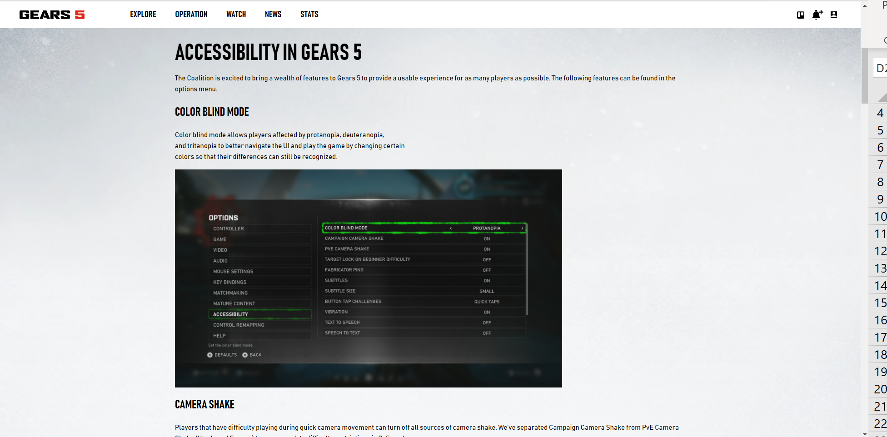
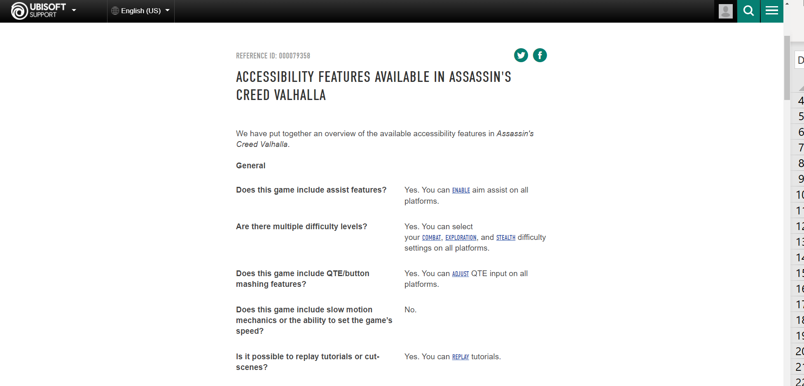
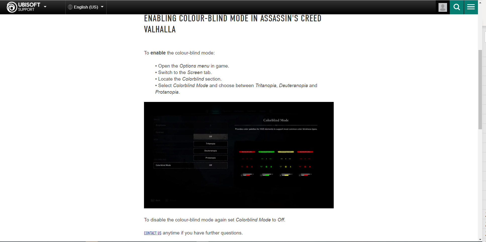
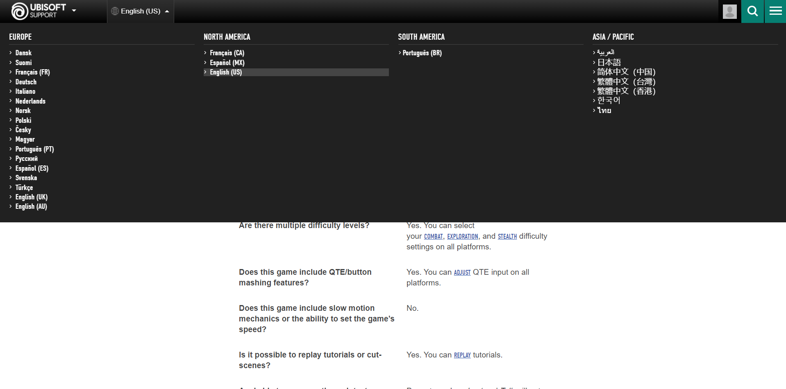
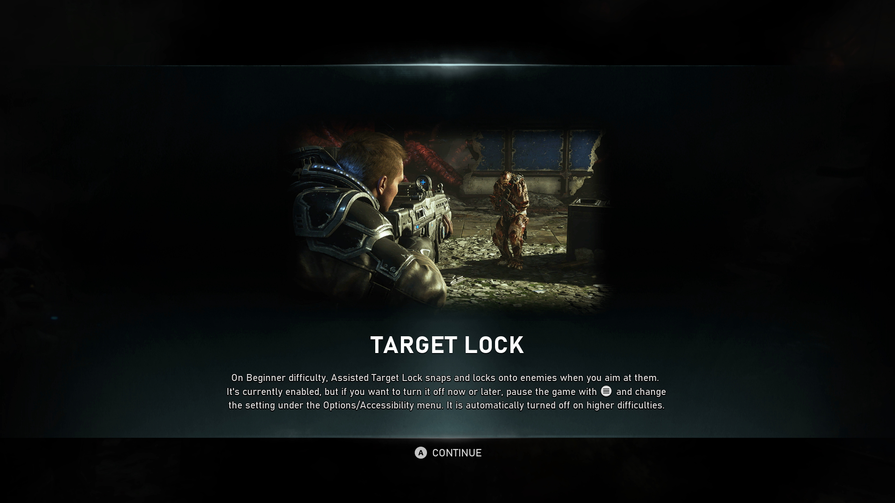
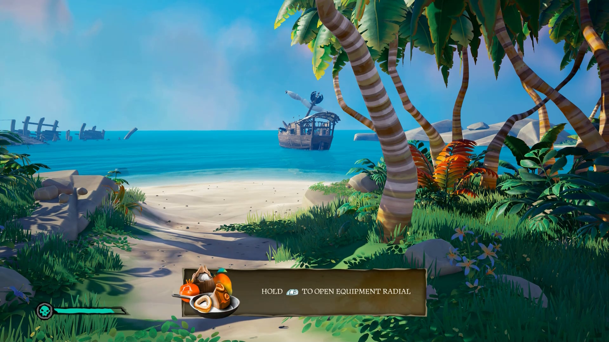

# Xbox Accessibility Guideline 121: Accessible feature documentation

## Goal

The goal of this Xbox Accessibility Guideline (XAG) is to ensure that players can get a sense of whether a title will be playable for them before they purchase it. Additionally, this information will provide support and guidance on accessibility features included in the game that can be used after a player has purchased the product.

## Overview

When a game title lacks an accessibility feature that a player needs, the game might be unplayable immediately or after a certain amount of in-game progress has been made. Information about a game’s accessibility features and settings options should be available for players to review before purchase. For example, if a d/Deaf player purchases a game that doesn't include subtitles for non-player character (NPC) chat or visual affordances to represent key audio cues (like incoming fire or enemy footsteps), the game might be unplayable as a result. In addition to the frustration of wasting money, it can also be emotionally disappointing. When games ensure that accessibility features and options are well-documented on websites that are accessible and easy to locate, players have a better opportunity to assess the game before purchasing it. In addition, when this information is provided before a title launches, it allows excitement to build in the Gaming & Disability Community and can help gamers decide to preorder it or purchase it on launch day.

## Scoping questions

Does your game include any of the following?  

- Does your game contain options for audio configuration, visual display configuration, input configuration, difficulty settings, or anything else that can be adjusted to improve usability for players with disabilities?  

- Does your game contain accessibility-specific features (for example, single-stick mode, toggle aim, auto-reload, screen narration, subtitles and captions, or reduce button hold time)?  

## Implementation guidelines

- All game-related accessibility features, functionality, user guides, and product support options should be described in accessible, easy-to-discover online product documentation.  

    - For websites, this means adherence to [Web Content Accessibility Guidelines (WCAG) 2 Level AA Conformance (external)](https://www.w3.org/WAI/WCAG2AA-Conformance).

    - Each game title should have its own designated web page for accessibility information to provide players with a simplistic and easy-to-consume experience. Using a single web page for accessibility information on multiple titles should be avoided. 

    

    
Example (expandable)
  

      

    [Gears 5 | Accessibility](https://www.gears5.com/accessibility/)  

    > Gears 5 has a dedicated accessibility website that provides an overview of each accessibility feature and setting that the game has.  

      

    [Accessibility features available in Assassin's Creed Valhalla - Ubisoft Support](https://support.ubisoft.com/Article/000079358)

    > Ubisoft games, including Assassin’s Creed Valhalla, offer a dedicated support site that outlines in-game accessibility features in an FAQ-style format.
    
     

    [Enabling colour-blind mode in Assassin's Creed Valhalla - Ubisoft Support](https://support.ubisoft.com/Article/000081047)

    > From the game’s main support site, in this case, Assassin’s Creed Valhalla, players can select linked features that are listed as supported in the game. Players will go to a page that describes the particular feature, how to locate it in the UI, and how to configure it in detail.
    

- All product documentation that's related to accessibility should be localized into relevant local languages. If the game is localized in other languages, accessibility documentation should also be available in the same languages.  

    

Example (expandable)
  

     

    [Accessibility features available in Assassin's Creed Valhalla - Ubisoft Support](https://support.ubisoft.com/Article/000079358) > To see this example, select the language drop-down list in the upper-left corner of the page."  

    > The Ubisoft Support website provides the opportunity to read content in a multitude of languages.  
    

- When in-game Help systems are present, all accessibility features and functionality should be explained in an accessible format.  

    

Example (expandable)
  

     

    > In-game Help systems like tutorial hints or prompts that appear when the game senses that a player might need assistance should also follow accessibility guidelines. In Gears 5, this screen that explains the Target Lock feature also adheres to XAG guidelines (visibility, contrast, and narration).  

    

    [Video link: in-game Help systems](https://youtu.be/eNyAKAk8ie0 "Click to open the video example.")

    > This example from Sea of Thieves shows in-game Help cues and tutorial instructions being presented to the player in an accessible format (like text display, contrast, and narration).
    

- Accessibility documentation, regardless of location (such as on a website or in-game), should use up-to-date and respectful terminology for people with disabilities.

   - While global differences do exist, generally speaking person-first language (for example, "gamers with disabilities") is recommended over disability first language (for example, "disabled gamers").
   
   - Terminology such as "handicapped," "impaired," and "incapacitated" are all examples of antiquated language that is no longer used and may be offensive. Style guides, such as the one provided by the [National Center on Disability and Journalism](https://ncdj.org/style-guide/), can be useful references when crafting documentation.

## Potential player impact

The guidelines in this XAG can help reduce barriers for the following players.  

Player | Impacted
:------- | :-------:
Players without vision | **X**
Players with low vision | **X**
Players with little or no color perception | **X**
Players without hearing | **X**
Players with limited hearing | **X**
Players without speech | **X**
Players with cognitive or learning disabilities | **X** 
Players with limited reach and strength | **X**
Players with limited manual dexterity | **X**
Players with prosthetic devices | **X**
Players with limited ability to use time-dependent controls | **X**
Other: players who don’t want to share their voice online for privacy reasons, players who don’t have a microphone or headset | **X**

## Resources and tools

Resource type | Link to source
:--- | :---
Article | [Provide details of accessibility features on packaging and/or website (external)](http://gameaccessibilityguidelines.com/provide-details-of-accessibility-features-on-packaging-andor-website)
Article | [Provide details of accessibility features in-game (external)](http://gameaccessibilityguidelines.com/provide-details-of-accessibility-features-in-game)
Article | [Disability Language Style Guide (external)](https://ncdj.org/style-guide/)
Standard | [Web Content Accessibility Guidelines (WCAG) 2 Level AA Conformance (external)](https://www.w3.org/WAI/WCAG2AA-Conformance)
Tool | [Accessibility Insights for Web (external)](https://accessibilityinsights.io/docs/en/web/overview/)