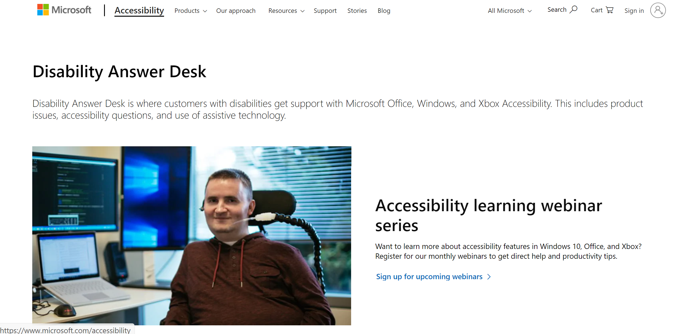
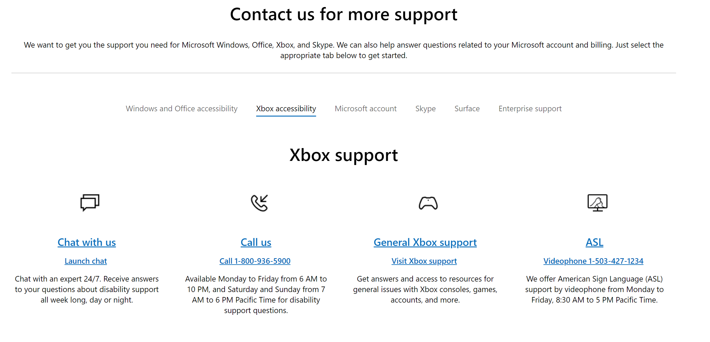

# Xbox Accessibility Guideline 122: Accessible customer support

## Goal

The goal of this Xbox Accessibility Guideline (XAG) is to ensure that players can access customer support resources like call centers, instant message/online chat, and email support by providing multiple accessible methods so that they can use these services.

## Overview

Providing accessible customer support means that the methods of seeking out information and connecting with customer support teams to ask specific questions are usable for customers with disabilities. Ensure that there are multiple options for contacting customer support. They include voice calling for customers who are unable to read, and text-chat and email options for customers who are d/Deaf. Follow web accessibility guidelines on your support website’s home page. These options help players with disabilities get in touch with support staff to ask questions, troubleshoot problems, and provide valuable feedback on their experience.

## Scoping questions

Does your title provide customer support resources?  

- What support resources does your title, studio, or publisher offer?  

    - Does your customer support website follow [Web Content Accessibility Guidelines (WCAG) 2 Level AA Conformance](https://www.w3.org/WAI/WCAG2AA-Conformance) accessibility standards?  

    - Are call center phone numbers, email addresses, or links to opening a live chat forum easily discoverable and accessible (for example, information is screen-reader compatible or visually accessible)?  

## Implementation guidelines

- At no extra cost, players and individuals with disabilities should be able to access call centers and customer support regarding the product in general and the accessibility features of the product.  

- Multiple accessible methods should be made available to contact support, including phone, TTY, email, and chat.  

    

    
Example (expandable)
  

      
  
      

    > The [Microsoft Disability Answer Desk](https://www.microsoft.com/Accessibility/disability-answer-desk) is an accessible resource for customers to get support on product issues, accessibility questions, and the use of assistive technologies. Customers can use text-chat, a toll-free telephone call, a video call with a support specialist who speaks American Sign Language, and more. The Microsoft Disability Answer Desk also has links to community forums and other accessibility-related websites, tools, and training.  
    

## Potential player impact

The guidelines in this XAG can help reduce barriers for the following players.  

Player | Impacted
:------- | :-------:
Players without vision | **X**
Players with low vision | **X**
Players with little or no color perception | **X**
Players without hearing | **X**
Players with limited hearing | **X**
Players without speech | **X**
Players with limited cognitive skills | **X**
Players with limited reach and strength | **X**
Players with limited manual dexterity | **X**
Players with prosthetic devices | **X**
Players with limited ability to use time-dependent controls | **X**
Other: all players can benefit from one or more of these best practices, depending on various personal, environmental, and situational factors | **X**

## Resources and tools

Resource type | Link to source
:--- | :---
Website | [Microsoft Disability Answer Desk](https://www.microsoft.com/Accessibility/disability-answer-desk)
Standard | [Web Content Accessibility Guidelines (WCAG) 2 Level AA Conformance (external)](https://www.w3.org/WAI/WCAG2AA-Conformance)
Tool | [Accessibility Insights for Web (External)](https://accessibilityinsights.io/docs/en/web/overview/)
