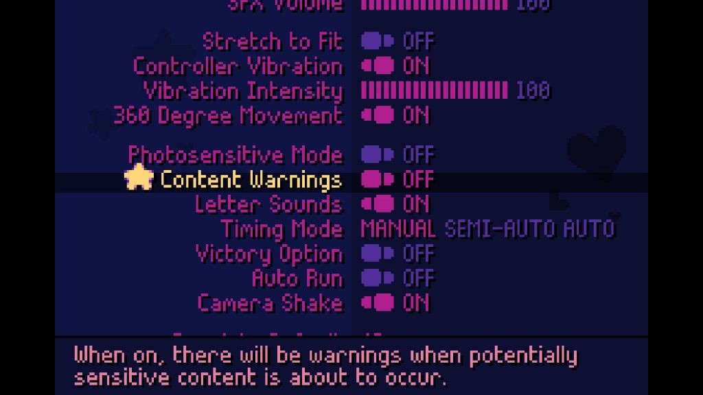
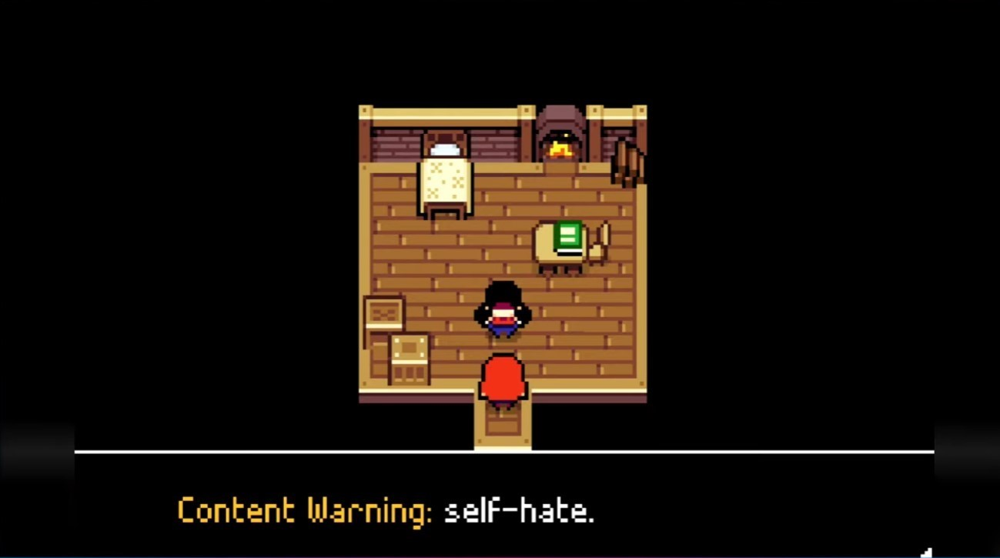
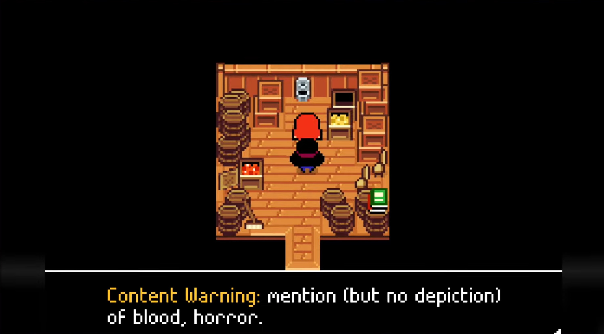
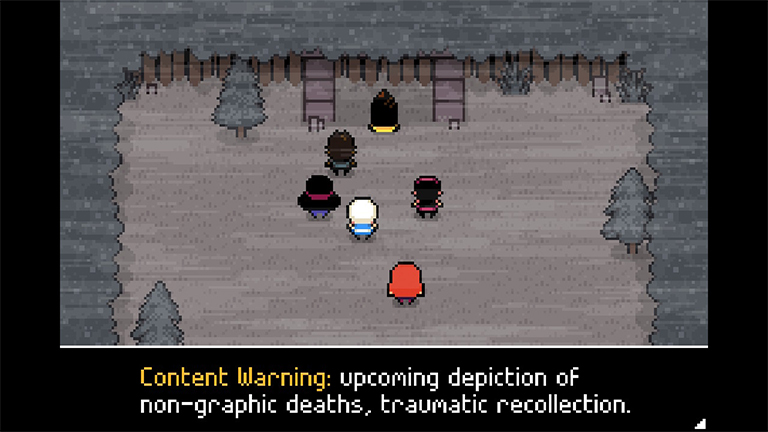
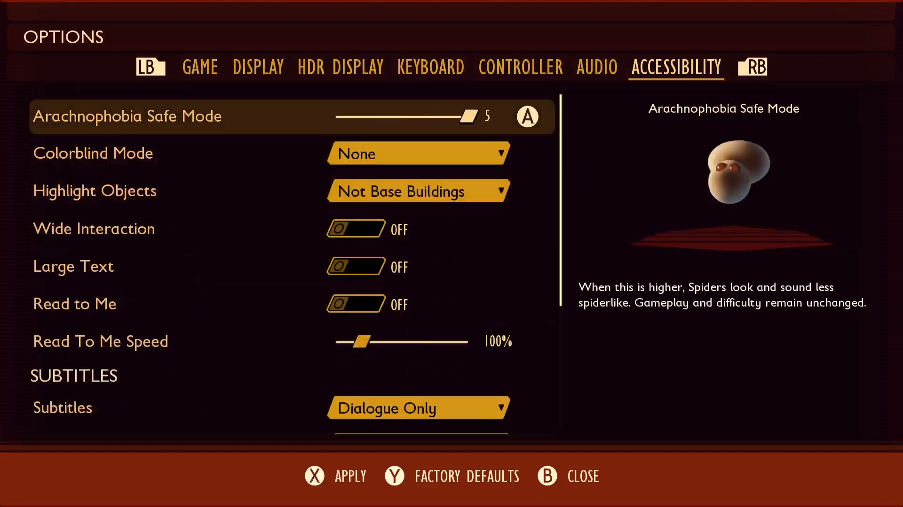
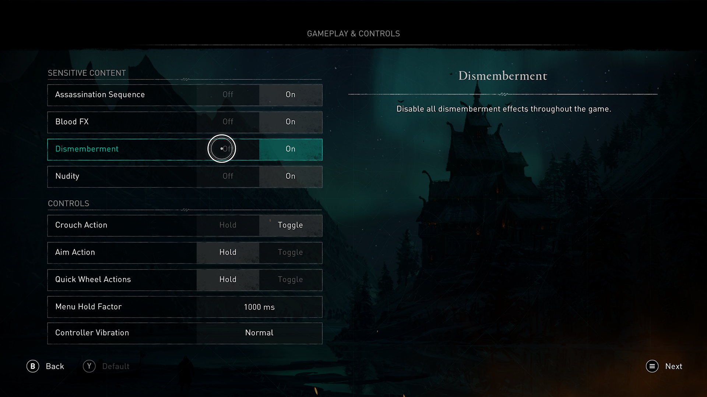

# Xbox Accessibility Guideline 123: Mental health best practices

**Content Warning:** The information in this Xbox Accessibility Guideline discusses topics and subject areas commonly associated with traumatic events, phobias, and other potentially triggering content. The inclusion of this information is intended to educate developers on ways to create safer, more inclusive experiences for all players.
 
## Goal

The goal of this Xbox Accessibility Guideline (XAG) is to ensure that players are aware of in-game content that may negatively impact their mental health or well-being prior to encountering these scenarios in-game. Additionally, players are provided with adequate customization options to avoid, remove, or bypass content of this nature if they choose to do so. This can be achieved by providing proper content warnings, content customization options, and engaging in intentional efforts to avoid the use of stereotyped or stigmatized portrayals of in-game characters with mental health conditions.

## Overview

According to the [United States National Alliance on Mental Illness](https://nami.org/About-Mental-Illness/Mental-Health-Conditions), “1 in 5 American adults experience mental illness each year.” Common mental health conditions include anxiety disorders, personality disorders, depression, eating disorders, obsessive-compulsive disorders, post-traumatic stress disorders, psychosis, schizophrenia, and more. Given the high prevalence of mental health conditions among local and global populations, acknowledging the relationship between gaming content and the experiences of players with these conditions is critical in inclusive game development.

Gaming narratives and storylines commonly reflect real-life experiences, making the content relatable and exciting. However, for some players, exposure to certain types of content or themes during gameplay can elicit negative emotional, physical, or psychological responses. Content depicting sources of common phobias, traumatic events, addictive substances and behaviors, as well as the manner in which characters with mental health conditions are represented in a game can all pose significant barriers for players with existing mental health conditions.

Game creators ultimately have full creative autonomy when choosing the content represented in their games. Many of the topics and subject areas discussed in this XAG, when relevant to the storyline, can play a critical role in the narrative, message, or experience a game seeks to provide. Therefore, the guidance in this XAG is not intended to encourage developers to avoid or remove certain content types from their games. Instead, the intent of this XAG is to increase developer awareness of content that may elicit negative experiences or reactions from players with mental health conditions and identify solutions that can be implemented to promote more inclusive and accessible player experiences.

Additionally, it’s important to recognize that even among players who do not have an existing mental health condition, mental health and well-being can fluctuate daily due to a variety of internal and external factors or experiences. Intentional efforts to create inclusive experiences related to mental health can ultimately make the experience more inclusive for all players.
  
## Scoping questions

Does your game include any of the following elements or subject areas?

- Game content that may elicit adverse emotional, physical, or psychological responses including (but not limited to):
  - Sources of common phobias (spiders, snakes, clowns, injections and needles, heights, water/drowning, and more)

  - Depiction of traumatic events or scenarios commonly related to post-traumatic stress disorder or other mental health conditions such as military combat, physical or sexual assault, domestic violence, violence against animals and children, death of a loved one, discrimination (hate crimes, racially motivated murders, bullying), corrupt or oppressive governments, cults, and more.

  - Portrayal of commonly known addictive substances and behaviors such as alcohol consumption, drug use, simulated or virtual gambling mechanics, and more.

- Depictions or interpretations of game characters with mental health conditions including depression, post-traumatic stress disorder, psychotic conditions, obsessive-compulsive disorders, anxiety, eating disorders, and more.

- Depictions or allusions to behaviors like self-harm, suicide, binge eating, purging, restricting food intake, abuse of drugs or alcohol, and more.

## Background and foundational information

Mental health is a complex subject that is best addressed by healthcare professionals. Therefore, this XAG is not intended to help developers understand mental health conditions or the lived experiences of players with these conditions. Rather, the intent is to help game creators identify common content areas that can elicit negative emotional, physical, or psychological responses among these players. This awareness should be used to:

1. Inform intentional efforts to create more inclusive experiences for players by providing them with information and tools needed to avoid or navigate potentially harmful content areas. For example, online documentation about a game’s content, content warning systems, and other settings that work to limit or reduce the presence of certain kinds of content can be provided.

2. Prioritize collaboration efforts and feedback mechanisms among players with mental health conditions to validate the efficacy of proposed in-game solutions and ensure that characters with mental health conditions are represented in a respectful and accurate manner.

The guidance in this XAG addresses two primary areas of game content: game events, narratives, or elements that contain potentially sensitive content, and methods used to depict game characters with mental health conditions. At a minimum, these two areas can be addressed by developers proactively to help reduce the likelihood of eliciting negative experiences for players with certain types of mental health conditions. This section defines these content areas and the potential impact that exposure to this content can have on players in further detail.

### Barriers related to sensitive content

 - **Traumatic events:** According to the National Institute for Mental Health, Post-Traumatic Stress Disorder (PTSD) can develop in people who have experienced or witnessed a frightening, shocking, or dangerous event. However, it’s important to note that traumatic events associated with PTSD are not always dangerous in nature. Other experiences, such as the loss of a loved one, can also be related to PTSD. 

    While the individual experiences of people with PTSD can widely differ, a player’s wish to avoid places, events, objects, thoughts, and other reminders of their past traumatic experiences is very important to keep in mind. Evaluating the content in your game for potential scenarios or topics known to commonly elicit PTSD-related symptoms and taking appropriate measures to document their presence is critical to creating more inclusive experiences. Some common examples of this content can include (but is not limited to) game content that depicts:

     - Military, war, and combat
     - Shootings, terror attacks, and other forms of violence in which the person is endangered, hurt, or witnesses others being harmed
     - Physical, emotional, or sexual assault
     - Domestic abuse of any kind
     - Corrupt or oppressive governments, cults
     - Discrimination, hate crimes, bullying  
     - Death or loss of a loved one

    When players with PTSD unknowingly encounter gameplay scenarios containing content they wish to avoid, they may experience a variety of symptoms including flashbacks, bad dreams, distressing thoughts, and physical responses like sweating, heart racing, and other physical signs of stress.

    The onset of these symptoms can not only block immediate and future gameplay for the player, but it can also elicit longer term symptoms that impact other aspects of their life. These longer-term symptoms may include negative thoughts about oneself, feelings of guilt or blame, loss of interest in activities, being easily startled, increased irritability, difficulty concentrating, difficulty sleeping and more.

- **Portrayal of harmful actions or behaviors associated with mental health conditions:** Depictions or allusions to behaviors like suicide, self-harm, and more also have the potential to pose serious consequences for some players. Portrayals of suicide or self-harm can potentially prompt a player in making the decision to attempt imitative behaviors related to these actions, especially if the exposure occurs at a time in which the player is particularly vulnerable. Certain approaches taken to depict suicide or self-harm in games can pose a higher risk of imitative behaviors. Some approaches that may increase the likelihood of imitative behaviors can include, but are not limited to the following:

    - Portraying or including specific information about the method of suicide. For example, displaying the precise type of pills and dosage taken in an overdose situation
    - Representing suicide or other harmful behaviors as quick, easy, painless, or effective
    - Inferring or suggesting that a character’s suicide has resulted in a positive outcome for those involved, such as bullies feeling regretful, parents getting back together, families being “better off,” etc.
    - Showing novel suicide methods that may prompt ideas otherwise not thought of

    If the portrayal of character suicide or self-harm is a critical aspect of the game’s story or character development, general approaches that work to decrease the likelihood of imitative behaviors should be taken. One of these approaches is providing relatively vague details and information regarding the method of suicide. Additionally, intentional efforts should be made to accurately portray the circumstances surrounding suicide. This means taking the time to portray the reality of a character’s suffering and avoiding any romanticization of events or character perceptions related to the suicide.

- **Addictions:** According to [Harvard Health](https://www.health.harvard.edu/mind-and-mood/understanding-the-language-of-addiction), addiction is defined as “a physical dependence on a substance or activity”. A person with an addiction may use a substance or engage in a behavior for the immediate psychologically rewarding effects of that substance or behavior despite potentially detrimental long-term consequences. Players who are currently experiencing or have previously experienced addictions to substances like alcohol or drugs, or activities like gambling may prefer to avoid game content that contains these types of elements. For example, a player with a previous drug or alcohol addiction may prefer to avoid game narratives, cutscenes, or missions that portray the use and abuse of drugs and alcohol, bar scenes, or themes of “partying” and drinking alcohol. Similarly, players with a previous gambling addiction may wish to avoid imagery or narratives related to gambling environments such as scenes that take place in a casino or a racetrack.

     Furthermore, many of the common mechanics in games parallel the risk-reward mechanics of gambling. Mechanics that provide players with an opportunity to exchange actual money toward the purchase of items like loot boxes in which the resulting investment outcome is unknown at the time of purchase and largely determined by chance is one example of this.

     Despite a mixed consensus among global gambling commission organizations and gaming industry regulatory bodies in considering things like purchasing loot boxes as being a form of gambling, it is important to keep these considerations in mind.  Players who know they are more susceptible to re-engaging in gambling behaviors following their engagement in similar experiences via their gameplay may wish to avoid games with such mechanics. Therefore, an awareness of the presence of these mechanics prior to purchase is important for these players.

- **Phobias:** According to [Harvard Health](https://www.health.harvard.edu/a_to_z/phobia-a-to-z?msclkid=df1274bcb1f011eca787cd1cb49ceaed), a phobia is defined as a type of anxiety disorder resulting in a persistent and excessive fear of objects, people, animals, activities, or situations. People with phobias typically try to avoid objects or events that elicit this fear, otherwise they typically endure high levels of stress or anxiety during and after exposure.

     Some common phobias that often intersect with game content include:
     - Arachnophobia – the fear of spiders and other arachnids
     - Ophidiophobia – the fear of snakes
     - Acrophobia – the fear of heights
     - Aerophobia – the fear of flying
     - Trypanophobia – the fear of injections or needles
     - Aquaphobia – the fear of drowning
     - Coulrophobia – the fear of clowns
     - Trypophobia – aversion or repulsion to objects with repetitive patterns or clusters of bumps or small holes (bug nests, sponges, honeycombs, lotus seed pods, and more)

     When game visuals or gameplay scenarios visually depict the sources of common phobias, players who are unexpectedly exposed to these on-screen visuals may experience intense physical and psychological reactions that may last for prolonged periods of time. Common symptoms can include emotional distress, fear and anxiety, rapid breathing, shaking, sweating, vomiting, nausea, panic attacks, and more.

    An example of this could involve a zombie themed survival game that generally takes place in an outdoor environment. However, one of missions in the game requires the player to break into a medical facility and retrieve vaccines. Inside the facility, a cutscene reveals broken glass, medical equipment, and injection needles scattered on the floor. A player with trypanophobia, or the fear of needles and injections, may be unable to complete the rest of the mission, and therefore the rest of the game, due to the onset of intense physical or psychological responses. More importantly, the player has now endured a situation that can have longer-term negative impacts on their mental health and well-being as a result of this unprompted exposure.

### Barriers related to character representation

- **Portrayal of Characters with Mental Health Conditions:** While addressing the impact of potentially sensitive or harmful content for players with mental health conditions is one facet of creating an inclusive experience, another is ensuring that game characters with mental health disabilities are properly represented. When any kind of entertainment media, including games, portray characters with disabilities in a way that promotes misaligned, inaccurate, or stigmatized views of the lived experiences of people with that disability, it can result in a multitude of harmful consequences.

    First, players with the disability being improperly represented may experience feelings of negative self-esteem, self-doubt, depression, and more. These misrepresentations can also cause harmful societal effects. Other players who have not had prior experiences or exposure to the conditions portrayed in a game may assume that the game’s portrayal accurately reflects the lived experiences of people in the real world with that same mental health condition. An example of this could be the representation of a game character with schizophrenia as violent, dangerous, and in a state of constant paranoia or delusion, resulting in the assumption that all people with schizophrenia should be considered violent or dangerous. In reality, there are many symptoms characteristic of schizophrenia, that vary dramatically from person to person in presence and severity. Most of these symptoms are not associated with eliciting violent behaviors or behaviors that would categorize someone as a consistent danger or threat to society.

    These kinds of one-dimensional depictions of mental health conditions can lead to further stigmatization and inaccurate perceptions that often result in exclusive or harmful behavior toward these individuals. Other common examples of stigmatizing representations include:

    - Portraying characters with mental health or psychiatric conditions as consistently unpredictable, extremely violent, or void of reality.
    - Simplifying the experience of those with conditions like obsessive-compulsive disorder down to solely someone who performs repetitive, ritualistic behaviors.
    - Portraying characters with learning or cognitive disabilities as “child-like” and infantilizing their experiences.
    - Associating mental health conditions with villainy – suggesting that all people with mental illnesses are to be feared and may abuse others or that mental illness is the sole cause of villainy.

### Approaches to support players through more inclusive experiences

As stated previously, the intent of this XAG is to ensure that players can make informed decisions regarding the types of content they engage with, and to depict mental health disabilities in a manner that is accurate and avoids stigmatization or stereotyping of mental health conditions. This guidance is NOT intended to encourage developers to change, avoid the use of, or remove game elements or content related to the items previously discussed. Game creators have full autonomy in the content they depict and how they choose to portray it to ensure the gameplay experience aligns with their goals regarding the story they want to tell, and the experiences they want players to have.

Here are some approaches that developers can take to support players with mental health conditions when creating games that contain content or character portrayals identified previously:

 > [!NOTE]
 > Specific guidelines and contextual game capture examples to support the clarity and intent of those guidelines can be found in the implementation guidelines section of this XAG. The following information introduces the broader approach methods that implementation guidelines were derived from.

- **Online Documentation players can review prior to purchase:** Online documentation about the themes, subjects, or content that will be represented in a game should appear in an accessible, and easily discoverable location that players can review prior to purchasing the game. This can include game websites hosted by the publisher or studio, or within the product description pages for the game in virtual stores.

- **In-Game Warnings:** Content warnings prior to the start of gameplay are also important in the event that a player did not first consult online documentation about the content of the game prior to purchase. Additionally, if there are multiple instances throughout a game in which potentially harmful content is portrayed, the option to enable warnings that appear prior to each mission, cutscene, or dialogue that contains such content can be helpful for players who may be completing the game over multiple prolonged play sessions. While the content warnings may not help individuals play through the challenging content, they will provide an opportunity for players to self-moderate and choose whether or not they’d like to experience these aspects of the game at this time.

- **Options to bypass cutscenes or missions:** Providing players the option to skip or bypass particular areas of the game that contain harmful content allows players to engage in other areas of the game they find enjoyable, without the fear of exposure to unexpected harmful content. The option to “skip” or bypass areas of the game also means that players can still progress through the game’s storyline despite not wanting to engage with certain tasks or missions in the game and will not be blocked from this progression due to an incomplete mission or task. Ideally, players should also be also to be able to skip or bypass a mission or cutscene during the mission or cutscene itself. This allows players to attempt the content but does not force them to continue to play through it if they change their mind mid-way through. Additionally, players who mistakenly opted to not skip or bypass a mission or cutscene can still access the option to do so even after the event has started.

- **Options to customize the gameplay experience:** If possible, provide a way for players to customize their experience so that potentially harmful elements can be removed completely, or altered in appearance or presence within the gameplay experience. For example, in the game Grounded, players can enable “arachnophobia safe mode.” While this setting does not impact gameplay or difficulty and nor does it remove spiders from the game completely, it allows players to change the visual presentation of spiders to a form factor that is less spider-like. Additionally, basic visual and language settings like removing gore or disabling profanity can be explored.

- **Offer Support Resources for Players:** In addition to content warnings, consider providing locale or region-specific resources to assist those experiencing negative reactions to certain types of game content, such as mental health-related hotlines, or support sites that players can visit to learn more about mental health disabilities. Ideally these support resources should be available for players at any time (i.e. within the game’s menu), and not limited to initial launch screens or during ending credits. These types of support can of course offer immediate assistance to players who need it. Additionally, efforts to provide these resources within mainstream media like games can help de-stigmatize the conversations around mental health and normalize the use of support resources.

- **Collaborate with players with disabilities:**  Developers should work directly with players with the disabilities they would like to represent in their game to ensure that these characters are accurately and respectfully represented throughout the game’s storyline. Additionally, working with players who would benefit from content warnings and settings is crucial in ensuring that these supports are provided in a way that promotes pre-emptive decision-making regarding engagement in content, and that customization settings offered meet the needs of the players who use them.

## Key areas where mental health considerations are important

- Game launch screens
- Gameplay featuring upsetting content
- Full Motion Videos (FMVs)
- Cutscenes mid-game
- Character models
- Character representation
- The game’s script
- The game’s product description page and trailers

## Implementation guidelines

   > [!NOTE]
   > The guidelines in this XAG are applicable to games containing content that may cause adverse emotional or psychological responses including (but not limited to) the types of content listed below:
   >
   > - Depictions of events or scenarios commonly related to post-traumatic stress disorder and other mental health conditions such as military combat, physical or sexual assault, domestic violence, violence against animals and children, death of a loved one, discrimination (hate crimes, racially motivated murders, bullying), corrupt or oppressive governments, cults, and more.
   > - Sources of common phobias (spiders, snakes, clowns, injections and needles, heights, water/drowning, and more)
   > - Portrayal of commonly known addictive substances and behaviors such as alcohol consumption, drug use, simulated or virtual gambling mechanics, and more.
   >
   > - Depictions or allusions to behaviors like self-harm, suicide, binge eating, purging, restricting food intake, abuse of drugs or alcohol, and more.
   > 
   > - Depictions or interpretations of game characters with mental health conditions including depression, post-traumatic stress disorder, psychotic conditions, obsessive-compulsive disorders, anxiety, eating disorders and more.

- Provide detailed descriptions of game content that may cause adverse emotional or psychological responses for players.
    - These descriptions should be available via free online documentation that players can review _prior_ to purchasing the game in addition to appearing within the game itself

      

      
 Example (expandable) 

      

      > The game Tell Me Why features two main characters, one of whom is a trans man. Because trans representation in mainstream media often relies on stereotypes and depictions of transphobic violence, the creators of Tell Me Why posted an [online FAQ page](https://www.tellmewhygame.com/faq/) to provide trans and queer audiences with detailed information about the presence and context of themes like transphobia, misgendering and violence depicted in the narrative. Players can access this information prior to purchasing or starting the game, providing them with an opportunity to make an informed decision regarding their level of comfort in experiencing the depiction of these topics during gameplay.

      </detail>

   > [!NOTE]
   > Any online documentation regarding content warnings or descriptions should be fully accessible to players by adhering to web accessibility standards.

- Provide warnings upon game launch that inform players of content that may cause adverse emotional or psychological responses.
     

     
 Example (expandable) 

     ![A screenshot of the Psychonauts 2 mental health advisory. The text in the advisory reads: "Psychonauts 2 contains artistic interpretations of series mental health conditions including addiction, PTSD, panic attacks, anxiety, and delusions. There are also images that may be upsetting to people with a fear of dentistry, tight spaces, or vomit. These conditions are usually presented in a light-hearted or even comical manner, but might still be distressing to some players. Ultimately, Psychonauts 2 is a game about empathy and healing. If you find yourself experiencing a negative reaction to this content, or if you need mental health resources, please visit takethis.org slash mental dash health dash resources. ](../../images/gaming-accessibility/psychonauts-mental-health-advisory.png)

     > In Psychonauts 2, a mental health advisory appears on screen at the start of the game. This advisory informs players that artistic representations of serious mental health conditions including addiction, PTSD, panic attacks, anxiety, and delusions are portrayed in this game. Additionally, players who have a fear of dentistry, tight spaces, or vomit, are informed that they may encounter potentially upsetting images. A link to the TakeThis.org website is also provided to assist players in locating mental health resources if needed.
     >
     > Players must press the B button specifically to advance past this screen (as opposed to the A button which is used to advance through the screens that appear prior to this advisory). This was an intentional decision made by the creators of Psychonauts 2 to prevent players from rapidly bypassing this information without pausing to acknowledge this input change, and therefore the content itself, thus amplifying the importance of this message.

    ![A screenshot from Hellblade Senua's Sacrifice with a warning screen that states, "This game contains representations of psychosis. People with experience of psychosis as well as professionals in psychiatry have assisted in these depictions. Some may find these depictions disturbing, including those who, themselves, may have had similar experiences. If you would like to find out more about psychosis and mental health difficulties visit: www.HellBladeHelp.info. This game also includes violent scenes that some may find distressing.](../../images/gaming-accessibility/hellblade-warning.png)

   > In Hellblade Senua’s Sacrifice, the game opens with a warning with a link offering resources to learn more about the mental health disabilities depicted in the game.

    </detail>

- Provide an option that allows players to enable in-game warnings prior to entering game areas, cutscenes, or character dialogues containing content that may cause adverse emotional or psychological responses for players.
    

    
 Example (expandable) 

     

    > In the game Ikenfell, content warnings are enabled by default. However, players can choose to turn them on or off. When enabled, content warnings will appear on-screen when potentially sensitive content is about to occur.
    >
    > Additionally, the text for each content warning message is specific to the upcoming event as shown in the following example images. This level of detail provides players with additional context on what they are about to experience prior to each individual event.

    

    

    
    </detail>

- When applicable, provide players with customization options that lessen or remove the presence of potentially harmful content.
    - This includes options to customize the visual appearance of content or characters as well as options to remove or limit elements like gore, profanity, animal killing, etc.  

   > [!NOTE]
   > This provides players an option to experience the rest of the storyline and mechanics of your game without having to experience content that may cause them adverse reactions or psychological responses.

   

   
 Example (expandable) 

   

   

   > In Grounded, a prompt is provided upon initial launch of the game that notifies players that the game contains spiders. It also provides an option to enable “Arachnophobia Safe Mode” that dramatically alters what the spiders look like (makes them look less like spiders) so players can still enjoy the game without experiencing any negative emotional responses when spiders appear on screen.

   

   > In Assassin’s Creed Valhalla, players can turn off sensitive content like nudity, blood, dismemberment, and assassination sequences following the player’s character being killed.
   </detail>

- Provide players an option to skip cutscenes or missions that deal with particularly psychologically or emotionally challenging content.

- Provide resources in-game to support players with mental health conditions or learn more about mental health. This can include regional helplines, websites with mental health resources, and more.

   

   
 Example (expandable) 

   

   > In Hellblade: Senua’s Sacrifice, players are provided a support page link within the game’s content warning advisory. When players navigate to this page, they are offered a variety of resources depending on the country they choose from the drop-down menu.

   

   > In the game Martha is dead, players are provided with a resource link to the organization Safe in Our World. “The main goal of Safe In Our World is to create and foster worldwide mental health awareness within the video game industry; to eliminate the stigma surrounding mental health, to make it a natural topic of discussion, and to promote the dialogue surrounding mental health so people are not afraid to reach out for help if they need it.”
   </detail>

- Ensure all content warnings and related settings are fully accessible. While meeting these guidelines, make sure to follow other guidelines that intersect, such as XAG 101: Text display, XAG 102: Contrast, XAG 106: Screen narration, and XAG 116: Time limits.

- Ensure characters with mental health conditions are portrayed in an accurate and respectful light that avoids stigmatized or stereotyped behaviors and actions including (but not limited to) the following:
    - Portraying characters with mental illnesses or psychiatric disabilities as consistently unpredictable, extremely violent, or void of reality.
    - Simplifying the experience of those with conditions like obsessive-compulsive disorder down to solely someone who performs repetitive, ritualistic behaviors.
    - Portraying characters with learning or cognitive disabilities as “child-like” and infantilizing their experiences.
    - Associating mental illness with villainy – suggesting that all people with mental illnesses are to be feared and may abuse others or that mental illness is the sole cause of villainy.

   > [!NOTE]
   > It is important to work with the disability community to ensure that all disabilities are represented in an accurate and non-stigmatizing manner.

**Thank you to the Gaming and Disability Community, Ninja Theory, Dorian Stewart, Paul Fletcher, Lucie Daniel-Watanabe, the Safe in Our World Team, their clinical advisory board, and the rest of our collaborators for their expertise, guidance, and partnership in creating this XAG.**

## Potential player impact

The guidelines in this XAG can help reduce barriers for the following players.  

Player | Impacted
:------- | :-------:
Players with mental health conditions | **X**
Other: younger players, players who prefer to avoid certain types of content or topics | **X**

## Resources and tools

Resource type | Link to source
:--- | :---
Website | [Take This (external)](https://www.takethis.org/)
Website | [Safe in Our World Mental Health Charity for Gamers (external)](https://safeinourworld.org/)

