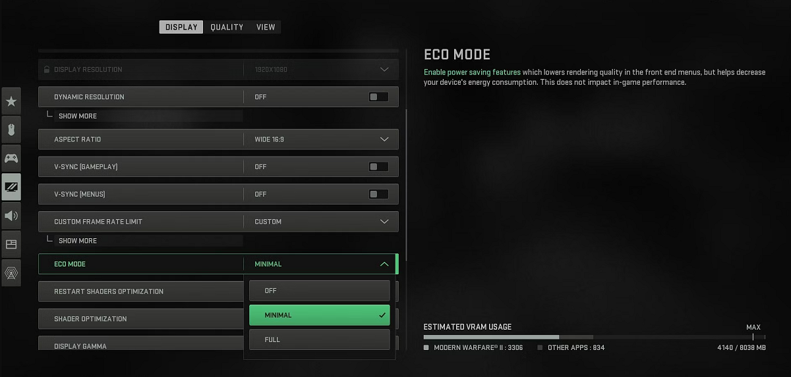
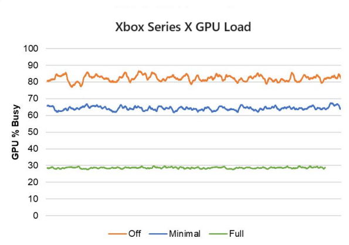
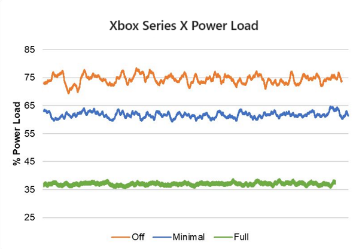
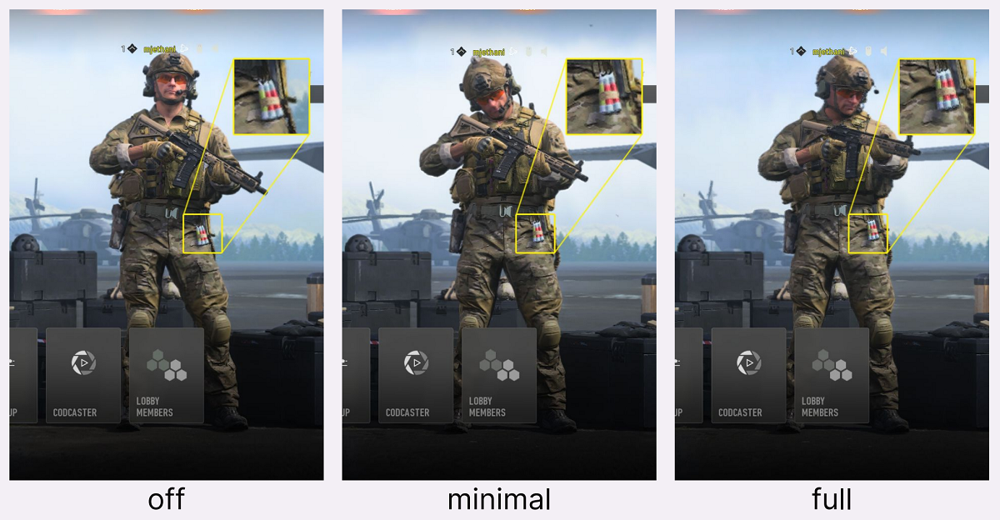

# Call of Duty: Modern Warfare II and Call of Duty: Warzone case study

At Xbox, our commitment to our players and the industry is to reduce the impact that gaming has on the environment. There is a growing awareness among players regarding gaming energy costs and the environmental impact of video gaming. There is also a heightened interest among game publishers in enhancing their environmental stewardship. We want to share a curated selection of examples where a game has introduced energy efficiency optimisations in such a way to be imperceptible to the gamer when immersed in the gaming experience. There are myriad ways to deliver energy saving ideas into a game, ranging from menus or lobbies, to what happens when the title is left idle, or even during gameplay itself under specific conditions.

## Call of Duty gets console and PC Eco Mode

In the Season 5 update of Call of Duty®: Modern Warfare® II and Call of Duty: Warzone™, the Infinity Ward studio incorporated an optional 'Eco Mode' using many of the resources and guidance provided in our Xbox Sustainability Toolkit. This innovative feature was carefully designed to strike a balance between maintaining sharp graphical responsiveness and fidelity while addressing the energy efficiency concerns of both console and PC gamers.

Call of Duty: Warzone is known for its demanding nature, featuring lobbies crowded with over 150 players and cutting-edge graphics that can put a strain on even the most high-end hardware. This level of performance demand often translates to significant power consumption.

To tackle this challenge, the Eco Mode was introduced as a solution. This mode not only helps players reduce their electricity bills but also ensures that their hardware operates at optimal temperatures. In this article, we will delve into the details of this power-saving feature, offering insights into how it was developed. Our hope is that these insights will inspire other game developers to implement similar energy-saving solutions in their titles. Special thanks to Rulon Raymond, Rohit Ravishankar, and Mehek Jethani at Infinity Ward for their partnership.

### Front end menu and gameplay changes

As previously mentioned, the Eco Mode in Call of Duty: Warzone is designed to conserve power without degrading the gameplay experience. Players spend a lot of time in the multiplayer lobbies and these menus can be intensive to render at the highest quality, so this became an excellent starting point. Thanks to the data provided by the Xbox team, we observed that some of these menus were utilising a lot of console power (and more than the industry average of comparable games). Therefore, we wanted to give players the options to configure the rendering settings.

This Eco Mode setting offers three options: Off, Minimal (Default), and Full, each of which adjusts the game's variables to reduce power consumption. The settings affect the game in these ways:

- Off: Same behavior as all previous updates with no power savings.
- Minimal (Default):
  - A small 3D scene resolution reduction when in-game menus are active because this was always locked at 100%. We now drop scene resolution to 66% in minimal
  - The frame rate is capped at 60hz
  - Collectively this yields an average power saving of ~20%
- Full:
  - A large 3D scene resolution reduction when in-game menus are active. We drop the scene resolution to 50% in full Eco Mode
  - The frame rate capped at 30hz
  - Collectively this yields an average power saving of ~50%

It is important to note that this feature will only function within the front-end menus of the Multiplayer lobbies in Modern Warfare 2 and in all lobbies, including DMZ, in Warzone.

### In-game changes

Continuing from the optimisations made within the menus, Call of Duty: Warzone also made some modest but impactful changes during gameplay. We recognise that the multiplayer pause menu is opened semi-regularly during gameplay and we saw this as an opportunity to introduce energy saving features. However, to ensure the player experience is not impacted, we kept all other updates ticking over, such as hit damage and sound etc.

- Off: Same behavior as all previous updates with no power savings.
- Minimal: A reduction in the scene resolution to 66%, matching the multiplayer/battle royale lobby behaviour
- Full: Freezing scene rendering when the multiplayer pause menu is opened in active gameplay

## Measuring the impact of changes

We were able to measure changes in real time thanks to the Power Monitor for PIX tooling supplied as part of the Microsoft GDK. We also worked with a new [PIXGetPowerMetrics](https://developer.microsoft.com/en-us/games/xbox/docs/gdk/pixgetpowermetrics) API feature to sample power values in code and this delivered the following power load and GPU load results. The graphs show how the two eco mode settings (minimal or full) reduce the game's high frame rate feature and therefore lower the GPU power and overall power:  

The results shown above were taken whilst idle in a Team Deathmatch private match lobby. These results can also be summarised in the following way:

|  | Avg % GPU Busy | Avg % Power Load | Approx. Wattage |
| --------------- | --------------- | --------------- | --------------- |
| **Off**  | 82%    | 74%    | 205W    |
| **Minimal**   | 64%    | 62%    | 185W    |
| **Full**   | 29%    | 37%    | 135W    |

In all scenarios mentioned above, you can see by the screenshot comparisons below that graphical fidelity remains fairly consistent as you step down each time. We then reviewed all artistic and graphical changes with our artists and designers to confirm they were happy with the visual impact and associated trade-offs, and then once the team were all unified, we committed the features as final.

Each player can decide which scenario best suits them based on their hardware set up and energy saving desires, but if a player decides to opt-in to the full power saving eco mode, then the scene resolution is almost imperceptibly different.

## Adoption rate by gamers

Approximately two months after these features released in the game, Infinity Ward shared the player adoption and retention by gamers. In other words, how many gamers opted in or opted out. The results are enormously positive demonstrating that over 90% of console players remained in the minimal power saving mode, and of the ~10% who chose to opt-out, approximately one-quarter of them opted-in to increase the power saving. PC gamers demonstrated more inclination to opt out of energy saving, however over three-quarters remained in the lower power saving mode, and ~10% of those who opted out chose to increase the energy saving feature.

|  | Console adoption rate | PC adoption rate |
| --------------- | --------------- | --------------- |
| **Minimal (default)**  | 90.3%    | 77.3%    |
| **Full**   | 2.1%    | 1.9%    |
| **Off**   | 7.6%    | 20.8%    |

## Summary

This project has generated an exciting conversation internally, focusing on how best to fine tune our gaming experience and what comes next. We are certainly considering our 'Eco Mode' as a living feature for future title in the Call of Duty franchise.

Enabling or disabling the Eco Mode or adjusting its profile in Call of Duty: Warzone is a straightforward process. Using the Xbox Sustainability Toolkit to help measure global power changes, our friends in Xbox have been able to measure and verify that the global average power consumption for Call of Duty®: Modern Warfare® II immediately decreased by approximately 3%. This choice will have no adverse effects on the in-game performance while simultaneously conserving power, saving gamers on their energy bills, lowering gaming device temperatures, and lowering the carbon footprint of gaming. It proves to be an excellent choice for gamers.

## Further reading

* [Halo Infinite case study](case-studies-halo.md)
* [The Elder Scrolls Online case study](case-studies-elder-scrolls-online.md)
* [Fortnite case study](case-studies-fortnite.md)
* [The Elder Scrolls Online case study](case-studies-elder-scrolls-online.md)
* [The game developer Energy Efficiency Essentials](../xbox-game-energy-efficiency-essentials.md)
