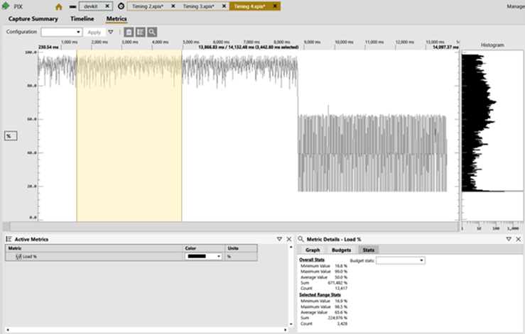
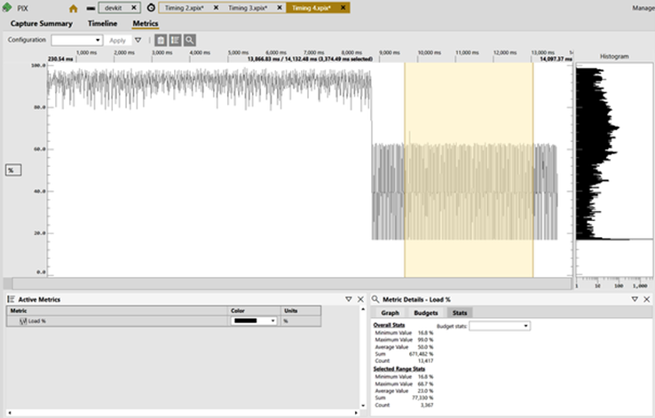
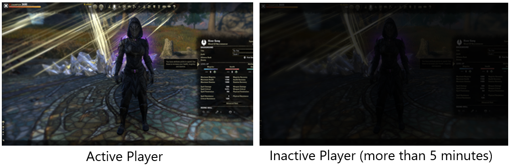
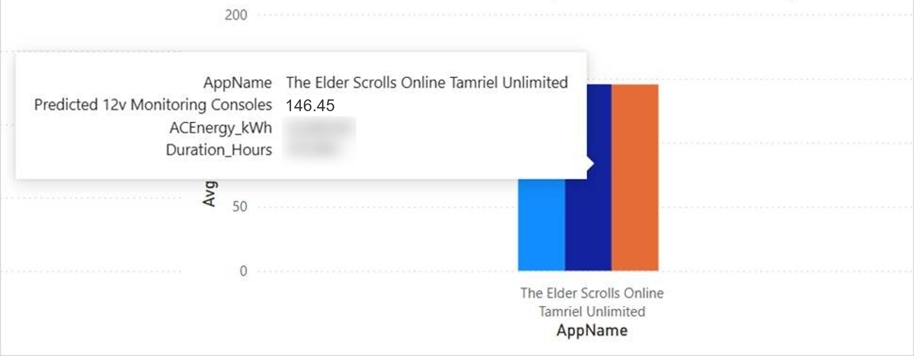
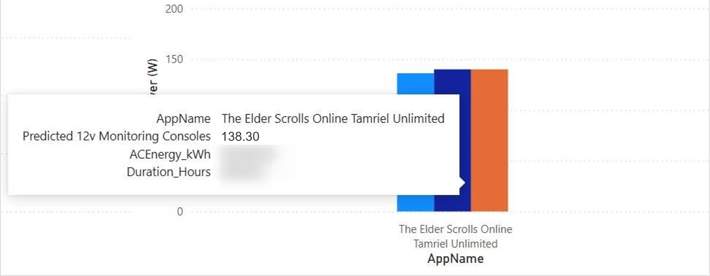

# The Elder Scrolls Online case study

At Xbox, our commitment to our players and the industry is to reduce the impact that gaming has on the environment. There is a growing awareness among players regarding gaming energy costs and the environmental impact of video gaming. There is also a heightened interest among game publishers in enhancing their environmental stewardship. We want to share a curated selection of examples where a game has introduced energy efficiency optimizations in such a way to be imperceptible to the gamer when immersed in the gaming experience. There are myriad ways to deliver energy saving ideas into a game, ranging from menus or lobbies, to what happens when the title is left idle, or even during gameplay itself under specific conditions.

## ZeniMax Online Studios delivers new sustainability optimizations

When thinking about the impact that weaving sustainability optimizations into our game could have on a global scale, ZeniMax Online Studios (ZOS) decided to implement some solutions. Shortly after becoming part of the Microsoft ecosystem, ZOS were introduced to the Xbox Sustainability Toolkit. The initiative was spearheaded by Adam Koby, Project Technical Director. David Guy, Stability/Graphics Engineer performed the research and development for these features. This is what they have say about their journey:

> [!NOTE]
> "In working to improve the sustainability of Elder Scrolls Online (ESO), there were several hypotheses we tested. Some optimizations negatively impacted the player experience and others didn't provide significant sustainability gains. Ultimately, we settled on two areas that we felt we could improve without noticeably impacting gameplay fidelity: Contextual menus and player inactivity."

## Performance improvement in contextual menus

The Xbox Certification team provided ZOS a free Certification sustainability report. That report indicated that power consumption jumped significantly when the player entered menus. The report showed that power usage, when in Performance Mode on Xbox Series X, went from ~113W to ~144W when the player entered menus.

 We then used the performance debugging tool PIX (Performance Investigator for Xbox) with the Power Monitor feature enabled. That tool showed that most of this power consumption was connected to the GPU. We reasoned that this was because we continued to update and render the entire world behind the player, in addition to updating and rendering the UI itself. To reduce energy consumption in menus, we explored several strategies as follows:

### Globally reduce render resolution while in menus

The first method involved dynamically reducing the resolution of the game's 3D render while keeping the menu at full resolution. We started with resolution because it was the most directly tied to the GPU, and we already had an in-house dynamic resolution system to test these changes out.

Although this approach significantly reduced power consumption, it negatively impacted the player experience. Since ESO is an Multiplayer Online Role Playing Game (MORPG), the game must continue to run while the player is in menus. Previously, that meant rendering the game behind the menus with complete fidelity.

Using this method, the 3D render made the underlying gameplay blurry, making it difficult for players to react if something important happens while they were in the menu. Perhaps even more importantly, we use the 3D render of the game to visualize player equipment while in the menu. Dropping the resolution made the browsing experience suboptimal. These results meant the gameplay experience suffered too much to move forward with a globally lower resolution.

### Dynamically reduce render resolution

The second method we prototyped was to use [Variable-Rate Shading (VRS) Tier 2](/windows/win32/direct3d12/vrs) to dynamically drop the resolution of the 3D render, but only for the parts of the screen that were occluded by a UI Panel. While this innovative approach did not harm the player's experience, it did require the generation of a VRS map at runtime. For our prototype, we used a pre-computed VRS map to estimate the expected power consumption reduction. Even with a pre-computed VRS map, the gains we saw were in the sub 1% range. Those gains would have quickly been negated by generating the VRS map in real time.

> [!NOTE]
> "We saw small gains with VRS partly due to our own VRS integration, which isn't used in every render pass. While other titles might see better results than we did, we ultimately deemed this approach not viable for our game."

### Drop frame rate while menus are open

Here we struck gold. Since a high frame rate is less important while the player is in menus, we realized that we could cut half of the rendered frames, and make some significant savings without impacting the player experience. We capped the frame rate to 30 Frames Per Second (FPS) when certain menus are open and the game is in Performance Mode. This method is not used for all menus because some menus render visuals that impact the player experience. Examples include rendered character interactions and systems with rendered objects (like the antiquities system).

**Before idle:**

**After idle:**

> [!NOTE]
> "Elder Scrolls Online targets a 60 FPS framerate on Xbox Series S|X and PS5. This 50% reduction in rendered frames directly created an approximate 50% reduction in power consumption while in menus. This dropped the overall measured power consumption from about 133 Watts down to nearly 78 Watts for the Xbox Series X."

Compared to the other methods we tried, simply capping the frame rate was wildly successful, both in player experience and in limiting power consumption. The information we got from PIX (used on the Xbox devkit)indicated that this change reduced power consumption from ~63% down to ~37% in Performance Mode while in menus. Ultimately, this change has improved the overall sustainability of our game. If you want to see more about how this has changed our environmental impact overall, see the section below on impact after changes were made live.

| Scenario | Avg % Power Load | Avg Wattage |
| --------------- | --------------- | --------------- |
| Menus in 60 FPS  | 63%    | 133W    |
| Menus in 30 FPS   | 37%    | 78W    |
| Benefit   | 41% savings    | 55W savings    |

_Note that the frame rate was dropped only for Xbox Series X|S and PS5._

### Player inactivity

There's no reason for a player's console to work so hard when the player isn't doing anything. After 20 minutes of being inactive, our servers send inactive players to the main menu where power consumption is minimal. Until that happens, though, there is some wasted power that can be saved.

### Frame Rate and Resolution

We decided that after 5 minutes, we can consider the player “idle” and we can change the performance without affecting a player. This means that for an idle player,  we drop the resolution by half and cap the framerate to 30 FPS. These two changes result in power consumption reduction from 65% down to 24% when in Performance Mode, effectively reducing the used wattage on the Xbox Series X from 131 Watts down to 51 Watts during this inactive period. That level of reduction is similar for all platforms where this change was enacted, namely on PC, Xbox Series X|S, and PS5 platforms.

| Scenario | Avg % Power Load | Avg Wattage |
| --------------- | --------------- | --------------- |
| Original measurements when idle  | 65%    | 131W    |
| New measurements when idle   | 24%    | 51W    |
| Benefit   | 63% reduction    | 80W savings    |

## Screen dimming

Another idea we had was to dim the screen while the player is inactive. All major consoles have some OS level setting to do this but there is no PC counterpart, so we implemented it ourselves. When a player’s resolution drops, we also dim the screen on PC builds.
Unfortunately, this metric isn't measurable by the current sustainability toolkit. Even without metrics for our game, we felt the change was worthwhile since data we found shows that screens with lower brightness consume less power. This is especially true for LED/OLED screens.

If you want to see more about how this has changed our environmental impact overall, see the section below on impact after changes were made live.

## Post-launch impact

In games, it is important to consider the impact of scale. ESO has millions of monthly active players, and every player counts. These sustainability improvements released with ESO: Gold Road in June 2024. These changes are not optional and will positively affect the environment. Since these sustainability improvements are largely imperceptible to most players, we see this as a strict improvement to ESO and its impact on the world. We also observed that The Elder Scrolls Online demonstrated a more modest reduction in average power on Xbox Series S because many of the improvements we introduced are specific to XSX graphical output.

**Average power consumption on Xbox Series X before changes:**

**Average power consumption on Xbox Series X after changes:**

Since 2021, ESO has an energy footprint well into the tens of millions of kilowatt hours just on Xbox consoles. During the first week when these changes were rolled out, we saw a 5% improvement in energy efficiency. This means that these improvements on Xbox, over the next 3 years could save the equivalent of nearly 1 million pounds of burned coal or more than 2 million miles driven by an average gas-powered vehicle.

While this is a small number in comparison to the entire global energy footprint and greenhouse gas emissions, it is still impressive that two engineers can make such a big impact, with minimal drawback to our players. Please also consider that this number will increase significantly because ESO is a multi-platform game, and these updates are available beyond the Xbox platform. Readers should recognize that the insights and impact achieved through the Xbox Sustainability Toolkit can be replicated across other gaming platforms, amplifying the positive impact globally. This is exactly the kind of thing that we should be aware of as people working on games. We reach into the lives of millions of people, and if we can leave them with positive experiences with minimal environmental impact, that is exactly the type of work we should be doing.

## Further reading

* [Halo Infinite case study](case-studies-halo.md)
* [Fortnite case study](case-studies-fortnite.md)
* [Call of Duty case study](case-studies-cod.md)
* [The game developer Energy Efficiency Essentials](../xbox-game-energy-efficiency-essentials.md)
