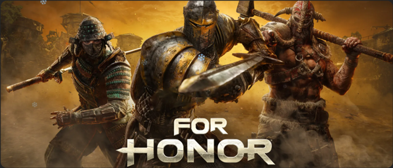
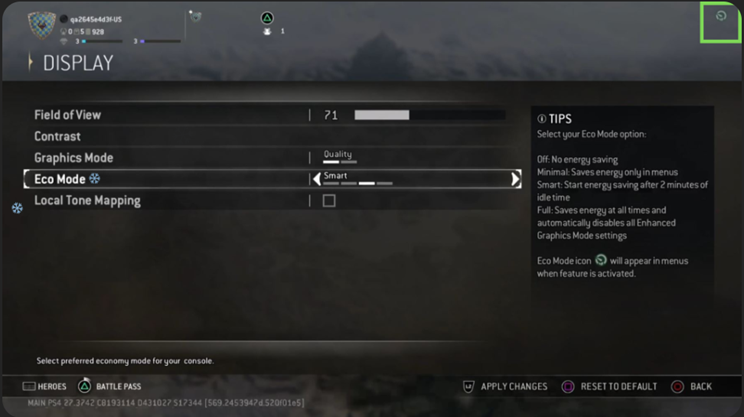

# For Honor case study

At Xbox, our commitment to our players and the industry is to reduce the impact that gaming has on the environment. There is a growing awareness among players regarding gaming energy costs and the environmental impact of video gaming. There is also a heightened interest among game publishers in enhancing their environmental stewardship. We wanted to share a curated selection of examples where a game has introduced energy efficiency optimizations in such a way to be imperceptible to the gamer when immersed in the gaming experience. There are myriad ways to deliver energy saving ideas into a game, ranging from menus or lobbies, to what happens when the title is left idle, or even during gameplay itself under specific conditions.

This project was spearheaded by Abhishek Porwal and Nicolas Mivielle from Ubisoft Montreal studio. This is what they have to explain about their journey below.

## For Honor: Eco Mode Unlocked!

At Ubisoft, our first priority is making great games. When we discover small changes that improve the player experience and use less energy, especially in menus, lobbies, or when a game is paused, we build them in. This supports Ubisoft’s Play Green strategy and complements industry efforts like Xbox’s energy aware updates and the Playing For The Planet Alliance.
The idea stemmed from a broader initiative within Ubisoft to promote eco-friendly practices in our games, giving players more choice. With the growing awareness of environmental issues, and sensitivity around battery life in mobile devices, including our commitment to contribute to carbon neutrality, we wanted to find ways to reduce [our carbon footprint in our downstream activities](https://ubisoftaad.sharepoint.com/sites/CSR-Green/SitePages/Life-Cycle-Assessment-2021.aspx). 

### The story behind developing the energy-saving features

This endeavor was further fueled by a strong connection between the former producer of the game, the Xbox sustainability team, and our Ubisoft Sustainability team. I have been approached by the Sustainability team to participate to [Ubisoft decarbonization goals](https://www.ubisoft.com/en-us/company/social-impact/environment) given that For Honor has been a game with a large community of players, and its LIVE aspect for 8 years now.

During the ongoing development of the performance mode, we found ourselves perfectly poised with hands on the controls and graphics settings finely tuned. This prompted an exploration into the realm of eco-friendly gaming—a notion sparked by questioning whether we could achieve significant gains by adopting an approach opposite to that of the performance mode. 

It’s important to note that these advancements are targeted specifically at current-generation consoles, such as Xbox Series X|S. Thus, the introduction of what we term “Eco Mode”—a gaming mode optimized to reduce the console’s, and therefore the player’s, energy consumption, without impacting gameplay fidelity.

## Energy consumption reduction without affecting gameplay, ensuring a minimum framerate of 30 FPS
Step one of the journey was to conduct consumption tests, and thanks to measurement tooling in the Xbox Sustainability Toolkit, we've been able to measure For Honor is now showcasing a notable **25%-30% reduction in energy consumption**! Initially met with skepticism, these findings piqued interest, so we decide to enrich our value proposition with eco mode introduction and being at the same time a leading game to embrace eco design. 

To let you know, the eco mode optimizes dynamic graphical parameters without compromising gameplay, ensuring a minimum framerate of 30 FPS.

## Our eco mode introduces three distinct options: Minimal, Smart, and Full. 
Added as a new feature within the game settings, the eco mode presents users with a menu to select from these options, as depicted in below screenshots and videos. 
1.	**Off:** Disables the eco mode entirely. 
2.	**Minimal:** Activates eco mode exclusively within menus. 
3.	**Smart:** Automatically engages when idle for more than 2 minutes, applying eco mode. 
4.	**Full:** Enforces eco mode consistently across all aspects of the game. 

Simply accessed via the game’s settings menu, the eco mode provides users with tailored energy-saving preferences. 

On the top right-hand, an icon identifies that your eco mode is on: 
 

## Considerations to balance the reduced power consumption with player experience

We conducted extensive testing across all settings to ensure that we never compromise the player experience. Tests were carried out on the settings, given the hundreds of parameters available for adjustment, aiming to fine-tune without degrading the player experience while also achieving a significant reduction in power consumption. The tests revealed that the GPU were the main consumer of power, necessitating a delicate balance in optimization efforts. 

## Adoption rate by gamers

One of the key takeaways was the importance of how this option was positioned. When Ecomode was first introduced in April 2024, the default setting was Performance mode. Players had to actively go into the settings to select Ecomode manually. At that point, only about 5% of players had enabled it.
In March 2025, Smart Ecomode was set as the default mode in the game, and **95% of players kept it as part of their gameplay experience**.
Ecomode is optional and can be changed or turned off at any time in Settings.

## Summary

In 2024, this initiative won the “Best Green Tech” award from the “Playing for the Planet” Alliance, giving Ubisoft the opportunity to position itself as a pioneer in these more sustainable practices. The gaming industry is massive, and even small changes can make a significant impact when scaled across millions of players. Eco Mode is our way of aligning with these values and offering our community a chance to contribute to a better place.  

## Want to learn more about Ubisoft's Play Green Program?

You can read more about our environmental and sustainability work by navigating to our [Ubisoft Play Green Program](https://www.ubisoft.com/en-us/company/social-impact/environment)

##Further reading

* [Star Wars Outlaws](case-studies-star-wars-outlaws.md)
* [Fortnite and Unreal Engine case study](case-studies-fortnite.md)
* [Call of Duty case study](case-studies-cod.md)
* [The Elder Scrolls Online case study](case-studies-elder-scrolls-online.md)
* [Minecraft case study](case-studies-minecraft.md)
* [The game developer Energy Efficiency Essentials](../xbox-game-energy-efficiency-essentials.md)
