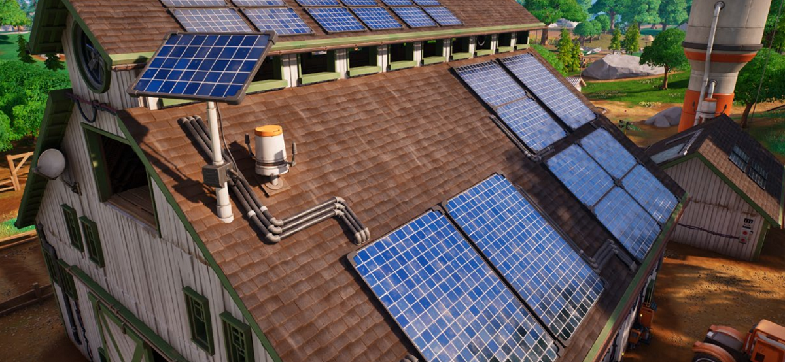

# Fortnite & Unreal Engine case study

At Xbox, our commitment to our players and the industry is to reduce the impact that gaming has on the environment. There is a growing awareness among players regarding gaming energy costs and the environmental impact of video gaming. There is also a heightened interest among game publishers in enhancing their environmental stewardship. We want to share a curated selection of examples where a game has introduced energy efficiency optimisations in such a way to be imperceptible to the gamer when immersed in the gaming experience. There are myriad ways to deliver energy saving ideas into a game, ranging from menus or lobbies, to what happens when the title is left idle, or even during gameplay itself under specific conditions.

## Unreal Engine

By leveraging many of the tools and guidance in our Xbox Sustainability Toolkit alongside existing scalable features in Unreal Engine, the wonderful team at Epic have successfully introduced sizeable improvements to Fortnite's energy efficiency across the entire gameplay experience, and all without lowering visual fidelity or menu responsiveness. Developers using Unreal Engine can easily use these same tools in their titles to deliver similar improvements.

The savings deliver reductions to gamers' energy costs whilst simultaneously lowering the real-world environmental impact of Fortnite running on console and PC.

## White paper: Reducing Fortnite's Power Consumption

Fortnite's team found it possible to make a significant difference with a small development effort. You can read more about how this was achieved in Epic's dedicated white paper: [Reducing Fortnite's Power Consumption:](https://www.unrealengine.com/en-US/blog/white-paper-reducing-fortnite-s-power-consumption).

As a result of these changes, we estimate around 200 MWh per day of savings across Fortnite's total player base, or 73 GWh per year, which is the equivalent to 14 wind turbines running for a year (source: EPA's equivalency calculator and current as of 2023). Just as importantly, Epic have helped to reduce the energy bills of their players on Xbox and other platforms.

Epic's main finding was that it’s possible to make a significant difference to a game’s energy efficiency without a large development effort. Even small configuration changes can make a noticeable difference to overall power consumption, and significant savings are possible with some careful tuning and logic. Epic hopes their work will demonstrate how other developers can make energy savings in their own games using simple tools and changes.

## Summary

Everyone at Xbox would like to thank our partners at Epic for their support and collaboration with this project, with special thanks to Ben Woodhouse at Epic, and we encourage developers to check out the tools, documentation, and whitepaper detailing Epic's energy efficiency improvements for Fortnite on their Unreal Engine resources site.

## Further reading

* [Halo Infinite case study](case-studies-halo.md)
* [Call of Duty case study](case-studies-cod.md)
* [The Elder Scrolls Online case study](case-studies-elder-scrolls-online.md)
* [The game developer Energy Efficiency Essentials](../xbox-game-energy-efficiency-essentials.md)
