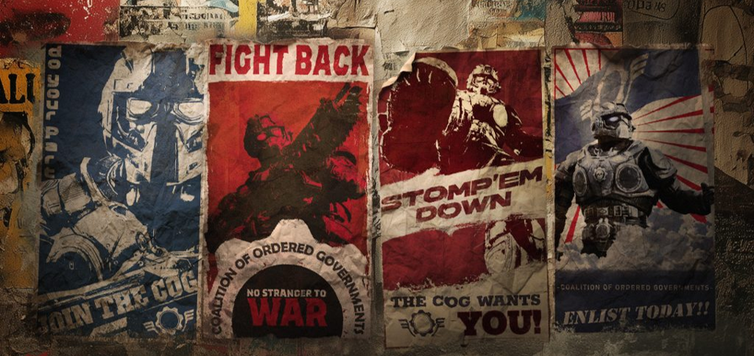

# Gears of War: Reloaded

Gears of War: Reloaded (2025) demonstrates how a AAA title can integrate energy-saving features that are invisible to players, easy for developers to implement, and impactful for sustainability. Developed by The Coalition and published by Xbox Game Studios, the game introduces both automatic and player-controlled optimisations across Xbox Series X|S and PC.

These features were designed to be both **passive** (requiring no player action) and **opt-in** (giving players more choice). We always strive to place the player at the heart of everything we do, so we're giving players more choice to customise their playing experience.

---

## Idle Energy Savings: Automatic and Seamless

One of the most effective optimisations in Gears: Reloaded is the **Idle Energy Savings** feature. When the game detects inactivity, such as pausing, standing still, or switching away from the game window, it automatically reduces rendering workload to lower power consumption.

### Xbox Series X Example

| **State**                  | Avg. Power Draw | Power Reduction |
|---------------------------|----------------:|----------------:|
| Active Gameplay (Idle Off) | ~172 W          | —               |
| Inactive Gameplay (Idle On)  | ~100 W          | −41%            |

### Xbox Series S Example

| **State**                  | Avg. Power Draw | Power Reduction |
|---------------------------|----------------:|----------------:|
| Active Gameplay (Idle Off) | ~80 W           | —           | 
| Inactive Gameplay (Idle On)  | ~59 W           | −26%            |

The power‑saving state engages after ~60 seconds of no input and immediately returns to full performance when interaction resumes. Since this occurs when the player is not actively focused on gameplay, the transition should be functionally imperceptible, with negligible impact on the user experience.

On PC, the same behaviour is enabled by default. The game enters a low-power state when idle or when the window is unfocused.

> “We looked for ways to deliver energy efficiency improvements without being perceptible to players and this became such a great approach to save power without players realising.” – Kate Rayner, Technical Fellow, The Coalition

---

## What The Coalition Did

The Coalition’s implementation was guided by a simple principle: **save energy without affecting gameplay**. Working with power measuring equipment to measure power draw in real time across different game states, the studio was able to understand the impact of these features.

### Implementation Steps

1. **Idle Detection**: Added a short timer (~60 seconds) to detect inactivity.
2. **Rendering Adjustment**: Reduced resolution and frame rate during idle states.
3. **Validation**: Used PIX to compare power draw before and after changes.
4. **Player Experience Testing**: Ensured no perceptible impact on visuals or responsiveness.

Developers could see the drop in wattage immediately after the idle mode engaged, and confirm that the game returned to full performance as soon as the player resumed input, therefore making the changes imperceptible to players during their playthrough.

---

## Eco Modes: Player-Controlled Efficiency

Gears of War: Reloaded also includes **Eco Modes** that players can select in the settings menu. These modes adjust resolution and frame rate to reduce power usage during gameplay.

### Mode Overview

- **Off (Max Performance)** – Full resolution and frame rate (up to 120 FPS).
- **Eco-Performance** – Lower resolution, capped at 60 FPS.
- **Eco-Quality** – High resolution, capped at 30 FPS.

### Power Draw Comparison (Xbox Series X)

| Mode | Avg. Power | Reduction vs. Max |
|---------------------------|----------------:|----------------:|
| Max Performance      | ~174 W      | —                 | 
| Eco-Performance      | ~122 W     | −30%              |
| Eco-Quality          | ~106 W     | −39%              |

These modes are available for both Campaign and Versus gameplay. Players can choose based on their preferences, whether they prioritise visuals, frame rate, or energy savings.

With thanks to the Certification team who leveraged the Xbox Sustainability Toolkit and tools like Power Monitor in PIX, we have also been able to measure and demonstrate the savings delivered between frame rates and resolutions thanks to the comprehensive graphical options offered to players. They really did approach this game to give players as much as control as possible over their experience.

"With Eco Modes, we wanted to give players meaningful choice. Some players value the highest possible frame rate, others prioritize visual fidelity - and Eco Modes let them decide what matters most to them, while unlocking additional power power savings in the process." - Kate Rayner, Technical Fellow, The Coalition

### Power Usage Comparison – Xbox Series X

| Area | Video Mode | Title Average (%) | Industry Average (%) | Title Average Wattage | Industry Average Wattage                           |
|-------------------------|-----------------|-------------------|----------------------|-----------------------|-------------------------| 
| Main Menu               | Off at 120hz     | 51%             | 44%                | 130 W                  | 123 W                     |
|                         | Off at 60hz      | 39%             | 44%                | 113 W                  | 123 W                     |
|                         | Eco-Performance  | 36%             | 44%                | 112 W                  | 123 W                     |
|                         | Eco-Quality      | 28%             | 44%                | 98 W                   | 123 W                     |
| In-Engine Cutscene      | Off at 120hz     | 19%             | 56%                | 89 W                   | 145 W                     |
|                         | Off at 60hz      | 19%             | 56%                | 88 W                   | 145 W                     |
|                         | Eco-Performance  | 19%             | 56%                | 91 W                   | 145 W                     |
|                         | Eco-Quality      | 19%             | 56%                | 84 W                   | 145 W                     |
| Active Gameplay         | Off at 120hz     | 76%             | 55%                | 174 W                  | 148 W                     |
|                         | Off at 60hz      | 51%             | 55%                | 131 W                  | 148 W                     |
|                         | Eco-Performance  | 43%             | 55%                | 122 W                  | 148 W                     |
|                         | Eco-Quality      | 34%             | 55%                | 106 W                  | 148 W                     |
| Contextual (Pause) Menu | Off at 120hz     | 74%             | 53%                | 168 W                  | 139 W                     |
|                         | Off at 60hz      | 59%             | 53%                | 141 W                  | 139 W                     |
|                         | Eco-Performance  | 52%             | 53%                | 132 W                  | 139 W                     |
|                         | Eco-Quality      | 37%             | 53%                | 109 W                  | 139 W                     |
| Constrained State       | Off at 120hz     | 52%             | 50%                | 135 W                  | 132 W                     |
|                         | Off at 60hz      | 52%             | 50%                | 133 W                  | 132 W                     |
|                         | Eco-Performance  | 45%             | 50%                | 122 W                  | 132 W                     |
|                         | Eco-Quality      | 35%             | 50%                | 104 W                  | 132 W                     |
| Multiplayer Lobby       | Off at 120hz     | 51%             | 48%                | 134 W                  | 132 W                     |
|                         | Off at 60hz      | 40%             | 48%                | 115 W                  | 132 W                     |
|                         | Eco-Performance  | 36%             | 48%                | 109 W                  | 132 W                     |
|                         | Eco-Quality      | 28%             | 48%                | 97 W                   | 132 W                     |
| Multiplayer Gameplay    | Off at 120hz     | 59%             | 56%                | 151 W                  | 149 W                     |
|                         | Off at 60hz      | 45%             | 56%                | 124 W                  | 149 W                     |
|                         | Eco-Performance  | 39%             | 56%                | 115 W                  | 149 W                     |
|                         | Eco-Quality      | 31%             | 56%                | 102 W                  | 149 W                     |

This table can also be visualised in the following rather colourful chart:

---

## Developer Guidance: Easy Wins with the Toolkit

The Coalition’s work shows that sustainability features can be added with minimal effort:

- **Idle Mode**: Requires only a timer and a rendering adjustment.
- **Eco Modes**: Use existing graphics presets with minor tuning.
- **Validation**: PIX Power Monitor provides instant feedback on power draw.

For studios who want to perform similar actions in their own games, the Xbox Sustainability Toolkit includes:

- **Energy Efficiency Essentials**: Design guidance for passive and opt-in features.
- **PIX Power Monitor**: Real-time power tracking.
- **Dynamic Power States (DPS)**: Optional GPU scaling (not yet enabled in Gears, but supported).

> “Passive features like idle mode deliver savings to all players. Opt-in features like Eco modes give players control. Together, they’re a powerful combo.” – Kate Rayner, CVP and Technical Fellow, The Coalition

---

## Player Experience: Seamless and Empowering

Players benefit from:

- **Cooler gaming devices**: Lower power draw means less heat and fan noise.
- **Lower energy bills**: Electricity costs can stack up with lots of powerful gameplay
- **Battery longevity**: Players are sensitive to battery life on handheld and portable gaming devices.
- **More choice**: Eco modes let players decide how they want to play.
- **No compromise**: Visuals and performance remain strong across all modes.

Feedback from internal testing shows that many players **leave power-saving features enabled** once they try them. The experience is smooth, and the benefits are clear.

---

## Conclusion: A Win for Players and Developers

Gears of War: Reloaded proves that sustainability can be built into AAA games without sacrificing quality. With automatic idle savings and player-selectable Eco modes, it delivers real energy reductions while preserving the intense gameplay fans expect.

Studios can also follow this model using the Xbox Sustainability Toolkit. The tools are ready, the impact is measurable, and the player experience remains top-tier.

> Ready to get started? Visit /gaming/sustainability/xbox-game-energy-efficiency-essentials and explore the toolkit.
