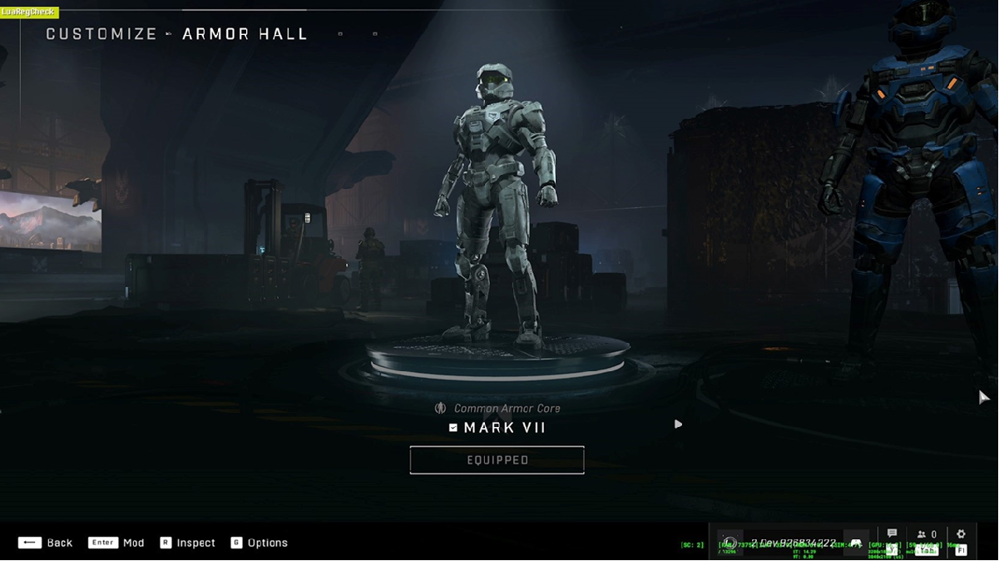
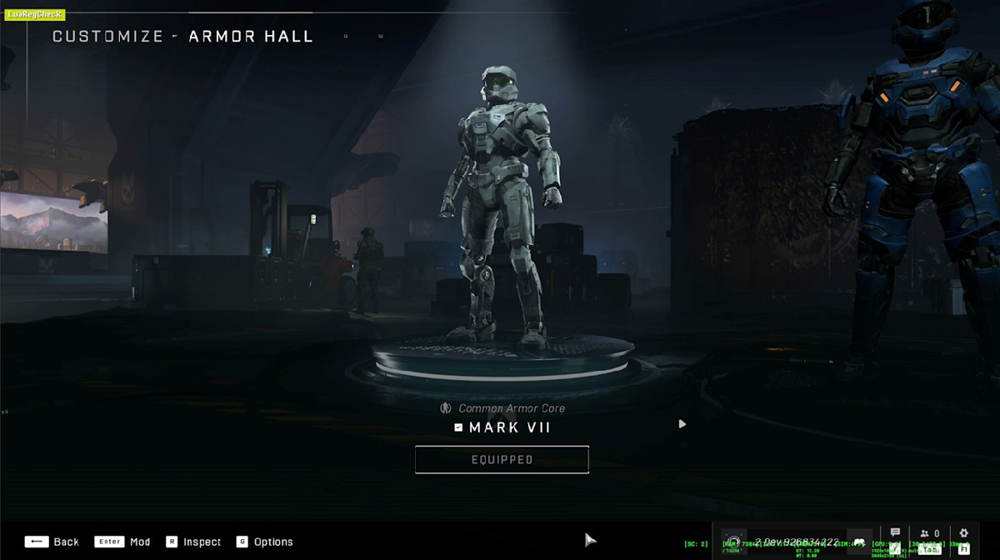
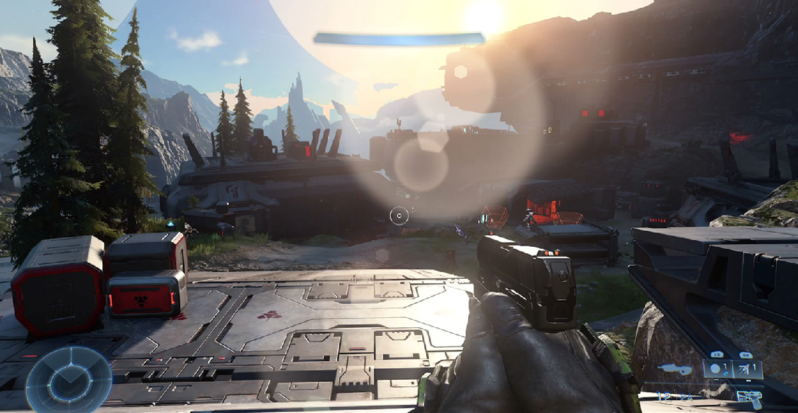
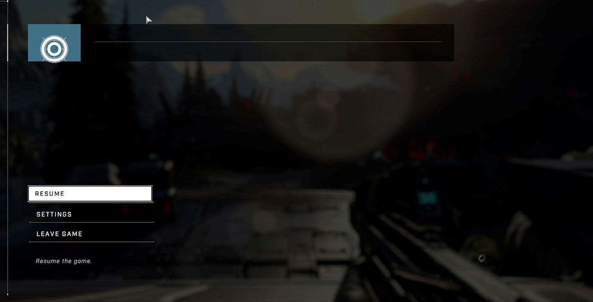

# Halo Infinite case study

At Xbox, our commitment to our players and the industry is to reduce the impact that gaming has on the environment. There is a growing awareness among players regarding gaming energy costs and the environmental impact of video gaming. There is also a heightened interest among game publishers in enhancing their environmental stewardship. We wanted to share a curated selection of examples where a game has introduced energy efficiency optimizations in such a way to be imperceptible to the gamer when immersed in the gaming experience. There are myriad ways to deliver energy saving ideas into a game, ranging from menus or lobbies, to what happens when the title is left idle, or even during gameplay itself under specific conditions.

>[!NOTE]
> Did you know ... If a game consumes an average of 160W and is played for three hours each day for a year, it can use approximately 175 kWh of electricity. Multiply that out over 100k devices and according to [the EPA's calculator](https://www.epa.gov/energy/greenhouse-gas-equivalencies-calculator) that is is equivalent to greenhouse gas emissions from 13.5M pounds of coal burned. With just a modest 10% improvement in energy efficiency, you can deliver an impressive environmental impact.

## Halo Infinite

After hearing a call to action from Xbox’s Director of Sustainability, Trista Patterson, Halo Producer Alex Le Boulicaut and senior tech artist Spencer Kopach, established 343i’s sustainability working group, estimated the electricity required to run Halo games and used this information to motivate collaboration across the studio. 343 became Xbox’s first case to engage in A/B experimentation to reduce energy consumption and carbon emissions associated with game development. Using the Power Monitor tools, 343i established a baseline: on an Xbox Series X running at 4K/60FPS, the average GPU usage is about 92%, which represents an average power consumption of 67.5%. Through further experimentation, 343i realized that, even when the game was paused and blurred to display the settings menu, a 4K image was still rendered in the background that a player could not see. By lowering the resolution in the Pause menu, 343i was able to decrease energy usage by 15% with no negative impact to the player experience. With these insights in mind, 343i is now exploring potential for bigger energy savings.

Halo Infinite's team quickly found ways to lower power consumption in their menus without negatively impacting gameplay fidelity. The following section quickly summarizes the performance improvements they discovered.

## Power consumption in Armor Hall menus

**Stage one of four:** In Halo Infinite's Armor Hall, 343 Industries shipped these menus at 4K and 60 FPS.

* Average GPU: 96.2%
* Average Power: 67.5%

You can can see below that on an Xbox Series X running at 4K/60FPS the average GPU usage is approximately 92%. That represents an overall system average power consumption of 67.5%. This number includes, GPU, CPU, and other components of the console.

**Stage two of four:** The second stage shows what happens if we drop to 30 FPS.

* Average GPU: 49.2%
* Average Power: 42.2%
* GPU Savings: 49.4%
* **Power Savings:** 37.5%

Power consumption goes from 67% to 42%. That is a total saving of 37% when we drop from 60 to 30 FPS. The only problem is that framerate changes can sometimes be very noticeable and can cause undesirable effects if the monitor we are playing on does not support something like Variable Refresh Rate, for example. Overall, producing a framerate drop to maintain the menu's high and snappy fidelity would have required more development time which was undesirable for the team. No problem. For this reason, we decided to focus on resolution instead.

**Stage three of four:** Below you can see similar results when we go from a 4K image to a 1080p one, but maintain 60 FPS.

* Average GPU: 34.7%
* Average Power: 43.5%
* GPU Savings: 64.3%
* **Power Savings:** 33.6%

With this solution, we are going from 67.5% power consumption with our baseline to 43.5% at 1080p – that's about a 34% power saving.

We decided to explore resolution changes because it seemed like the easiest reduction we could make without impacting the image quality that our players expect. The trick was to hide these resolution drops in places the player cannot see them – like our gameplay pause menu. More on this in just a moment.

We are not able to reduce UI resolution for legibility reasons, especially for accessibility, but it's a marginal decrease in power consumption in Halo Infinite and we didn't want to compromise on accessibility.

**Stage four of four:** Lastly, the image below shows what kind of savings could be achieved if we were to lower both resolution and framerate at the same time.

* Average GPU: 27%
* Average Power: 30%
* GPU Savings: 72%
* **Power Savings:** 55.6%

We can reduce power consumption by more than half of our baseline which is 67.5% vs 30% average power consumption. In the future, we would like to further investigate opportunities to reduce both parameters without impacting the player experience. This is something our sustainability team is currently investigating in the background during personal development time.

In the end, Halo Infinite selected only lowering resolution since it was the easiest to implement with the least amount of risk or impact to the player experience.

## Power consumption in gameplay pause menu

During our investigations, our team realized that when the game was paused and the screen was blurred to display the settings, we were still rendering a 4K image in the background despite the fact that our players couldn’t even see these assets. So we decided to lower the resolution of our Pause Menu in order to reduce power consumption without impacting the player experience.

The work was then implemented by one of our Graphics Engineers – Andrew Nolan – who had also developed our progressive resolution system for launch.

The lower resolution in the Pause menu significantly reduced the load on the GPU, which decreased power consumption by 15%. Of course, extra savings could be made by lowering framerate as well.

The image below shows our Campaign gameplay running on Xbox Series X at 4K / 60 FPS. We've measured our Power Consumption with multiple devices and confirmed our total power draw was 64% of our GPU + CPU capacity, or 185 watts total AC power.

The image below demonstrates the benefit of our sustainability feature in action: The game is paused in the same location, but the resolution is automatically lowered to 1080p. We were able to measure a 55% power draw on the GPU + CPU after our change, or 165 watts total AC power.

To summarize, we are saving 15% on our power consumption without any impact whatsoever to the player experience. The result is invisible to the player. Once we developed a functional change, we were able to prove that we could work together and earn the trust of our leadership team.

This first small step was also an opportunity to define a benchmark for our team, and other teams following in our footsteps, and start thinking about bigger power saving opportunities for the future.

## Implementing 2.5D in menus

3D menus have proven they can hold up to high quality standards while also providing a great experience for the gamer. This system works well when you have lots of resources and the time to execute, however if you have resource contention and rapid turn around times then this can quickly start to work against itself. We set out to improve this system so we could iterate faster with smaller teams, while also maintaining our quality standards. With this overhaul, it also provided us the chance to investigate our power consumption within these full 3D menus and see if there is any improvements on the sustainability side that we could implement within the new 2.5D setup for better power consumption.

### What is 2.5D?

In short, 2.5D games can blend the best of both worlds, providing depth perception while maintaining gameplay simplicity. So what is the difference?

3D design:

* Environment: In a 3D game, the game world exists in three dimensions: length, width, and depth. Players can move freely in all directions within this 3D space.
* Graphics: 3D models are used to represent characters, objects, and environments. These models have depth, volume, and can be rotated to view from different angles.

2.5D design:

* Environment: A 2.5D game combines elements of both 2D and 3D. It portrays a 2D environment but incorporates 3D gameplay, or vice versa.
* Graphics: While the character models might appear 3D, the background objects are often represented using 2D sprites rather than fully modelled 3D objects.
* Perspective: The game may use an isometric perspective, which presents 2D objects as if they were 3D due to the viewing angle.

### What are the merits of implementing 2.5D?

Pros:

* Minimal amount of components
* Easy to upgrade
* Full support for UGC characters
* 2D background image can be created in any DCC tool package (e.g. Unity, Faber, Unreal, Maya etc.)
* Background image can be generated in-house or outsourced
* Load times should significantly improve
* Power consumption and energy bills for gamers' devices should be lower

Limitations:

* 3D avatars need to be lit to match the new 2D backplate
* Background cannot support motion
* Cannot support DOF on UGC avatars but you can bake DOF into background image

### Power savings measurements

For this power consumption comparison, we were comparing between Xbox Series X 3D menu versus the new 2.5D menu implementation. Our actual retail version of the game has dynamic resolution, so the resolution of these menus scales dynamically based on the amount of GPU usage, thus maximizing performance and always providing the highest resolution possible. However, via our internal Profile Mode we were able to keep the resolution locked, so that we may get consistent PIX power usage numbers.

Before making any changes we measured the average power consumption in a multiplayer screen configured to the original 3D graphics by using Power Monitor in PIX from the GDK. The 3D menu _before_ any changes were made was measured as averaging **64.8%** of the console's power budget. The following table demonstrates the measurements taken _after_ changing to 2.5D...

Internal resolution | Frame rate | 2.5D power measurement | Notes
---------|----------|---------|---------
2400 x 1800 | 60 FPS | 47.5% | Dropping internal resolution prior to upscale and dropping frame rate will deliver most savings
1920 x 1080 | 30 FPS | 26.3% | Even locking at higher resolution the 2.5D menu provides significant savings
1920 x 1080 | 60 FPS | 35.8% | Dropping internal resolution prior to upscale will deliver more savings

By locking the resolution upper limit and implementing the 2.5D setup, you will see around 30% savings. To push this further, dropping the resolution lower and locking it prior to upscale will buy back even further savings.

### 2.5D development resources and savings

We estimate eight people required for evergreen support which is 11-17 less people required versus the original set up. Total time to completion was 3-4 weeks. Time cost savings is estimated to be 2-3 months saved.

## Further reading

* [Fortnite and Unreal Engine case study](case-studies-fortnite.md)
* [Call of Duty case study](case-studies-cod.md)
* [The Elder Scrolls Online case study](case-studies-elder-scrolls-online.md)
* [The game developer Energy Efficiency Essentials](../xbox-game-energy-efficiency-essentials.md)