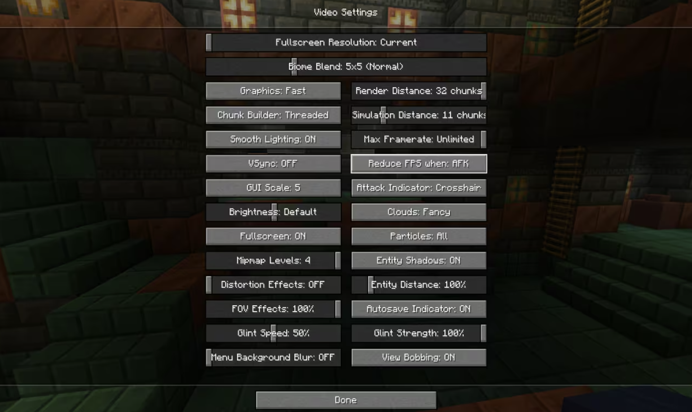
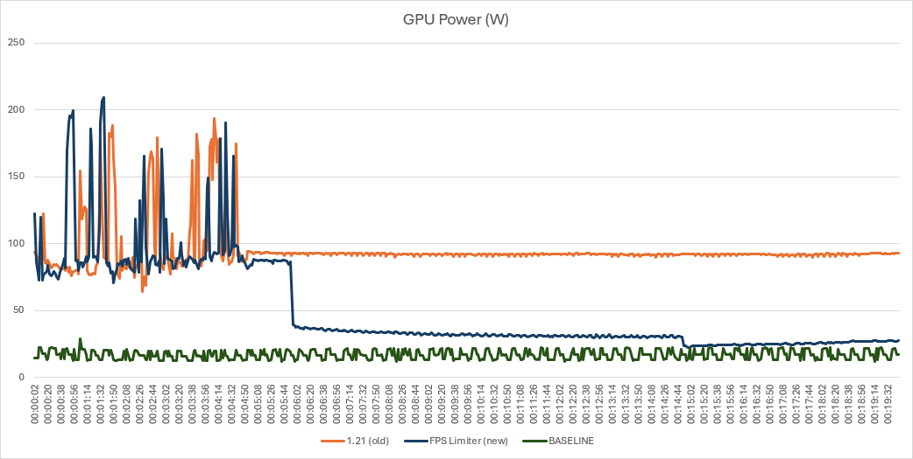
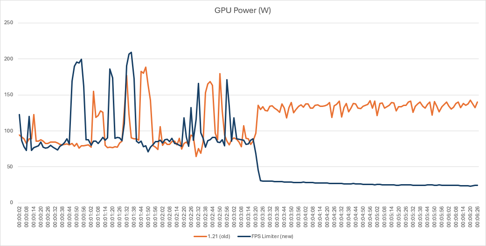
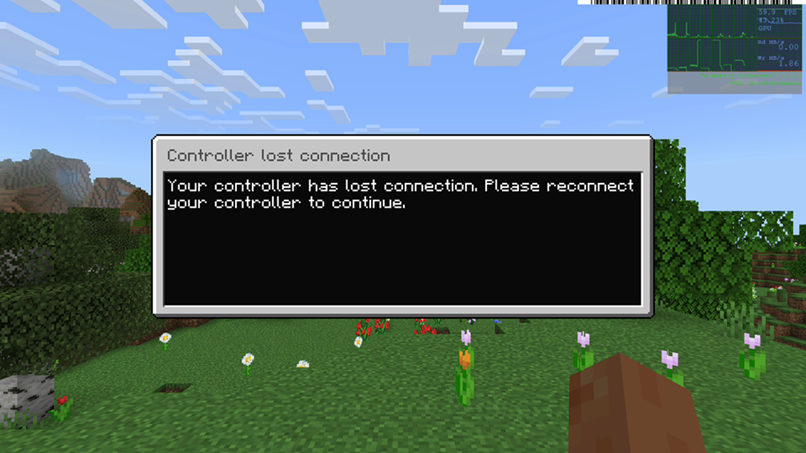
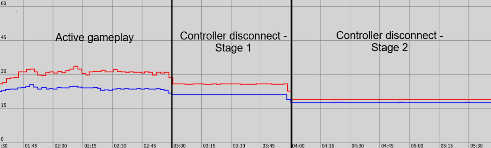

# Minecraft case study

At Xbox, our commitment to our players and the industry is to reduce the impact that gaming has on the environment. There is a growing awareness among players regarding gaming energy costs and the environmental impact of video gaming. There is also a heightened interest among game publishers in enhancing their environmental stewardship. We wanted to share a curated selection of examples where a game has introduced energy efficiency optimizations in such a way to be imperceptible to the gamer when immersed in the gaming experience. There are myriad ways to deliver energy saving ideas into a game, ranging from menus or lobbies, to what happens when the title is left idle, or even during gameplay itself under specific conditions.

>[!NOTE]
> Did you know ... If a game consumes an average of 160W and is played for three hours each day for a year, it can use approximately 175 kWh of electricity. Multiply that out over 100k devices and according to [the EPA's calculator](https://www.epa.gov/energy/greenhouse-gas-equivalencies-calculator) that is is equivalent to greenhouse gas emissions from 13.5M pounds of coal burned. With just a modest 10% improvement in energy efficiency, you can deliver an impressive environmental impact.

This project was spearheaded by Nick Horvath, Engineering Systems Manager; Sue Loh, Performance Tech Lead; Timur Nazarov, Java Game Developer; and David Ekermann, Bedrock Game Developer. This is what they have to explain about their journey below.

## Minecraft improvements available in java snapshot

Energy-conscious Minecrafters can rejoice! Released in August 2024, we introduced a new Frames Per Second (FPS) limiter feature that reduces the framerate of Minecraft while the game is in certain idle states. The FPS limiter only kicks in when the player is not actively playing the game to improve its power efficiency. 

If you have a gaming PC, it’s probably one of the most energy-intensive devices in your home. Globally, PC gaming uses about [230 terawatt hours of electricity annually](https://arxiv.org/html/2402.06346v2#:~:text=We%20have%20estimated%20the%20global,TWh%20(including%20gaming%20consoles).) – the equivalent of 59 million EU households. In the US alone, gamers consume [$6 billion worth of electricity](https://www.motherjones.com/environment/2018/11/video-games-electricity-carbon-footprint/) and emit about 12 million tons of CO2 per year – the equivalent of roughly 2.3 million passenger cars.

Through this feature, we aim to lower the amount of power your computer consumes when running Minecraft, thus helping decrease the greenhouse gas emissions stemming from gaming while also improving battery life on battery-powered devices, and saving your device from undergoing unnecessary stress.

## How does the FPS limiter work?

The FPS limiter feature limits the maximum framerate of the game in certain situations, controlled by a new video setting, “Reduce FPS when.” This setting has two modes:

* Minimized: Limits the framerate to 10 FPS only when the game window is minimized.
* AFK (Away From Keyboard): Limits the framerate to 30 FPS when the game has not received player input for over a minute. After a total of 10 minutes of no input, the framerate is further reduced to 10 FPS. It also limits the game to 10 FPS when it’s minimized. AFK is enabled by default when you install the snapshot, but you can switch to Minimized afterwards.

Unlike the existing FPS limiter setting, which caps the framerate at all times, this new feature allows you to save energy in specific scenarios when you don’t need the game running at the highest fidelity. You can still leave your framerate uncapped in the global setting for maximum performance and set it to reduce the frame rate only in specific situations. This way, depending on your hardware, you should see a notable reduction in power consumption while you passively farm resources overnight, get sidetracked while grabbing a snack, or go down a wiki rabbit hole.

The R&D was spearheaded by Nick Horvath, Principal Engineering Manager at Mojang, and this is how Nick describes the impact assessment journey:

### Measuring power savings from the FPS limiter when AFK

The chart below demonstrates the reduction in average power consumption as measured on a GPU using HWInfo. The y-axis is the estimated average power consumption and the x-axis is time. The GPU used for this test was an NVIDIA GeForce RTX 3080. 
In all test scenarios, the gamer would enter gameplay and leave the title idle on the 5-minute mark. The orange line labelled '1.21' is the experience before the rate limiter feature was introduced and you can see how the line remains static when leaving the title idle for the full 19 minutes. Conversely, the blue line labelled 'FPS Limited' exhibits a reduction in average power consumption on the 6-minute mark, which is 60 seconds after leaving the title idle, and then a further reduction in average power consumption on the 15-minute mark, which is after a further 10 minutes of the title being left in an idle state. Lastly, the green line labelled 'OS Idle Baseline' demonstrates the amount of power utilised by the OS in the background. 

You can also see these results represented in table form below:

| Version | Gameplay | Idle <1 minute | Idle 1-10 minutes | Idle >10 minutes |
| --------------- | --------------- | --------------- | --------------- | --------------- |
| **1.21 (old)**   | 101W    | 93W    | 93W    | 93W    |
| **FPS Limiter (new)**  | 100W    | 82W    | 32W    | 25W    |
| **OS Idle Baseline**   | 17W    | 17W    | 17W    | 17W    |

### Measuring power savings from the FPS limiter when minimized

Following from above, we also introduced an energy saving feature when the game is minimized from active focus. Using the same set up and configuration as above, the chart below demonstrates how power usage drops dramatically after the gamer minimizes the window on their PC.

You can also see these results represented in table form below:

| Version | Gameplay | Minimized |
| --------------- | --------------- | --------------- |
| **1.21 (old)**   | 101W    | 134W    |
| **FPS Limiter (new)**  | 100W    | 25W    |

## Introducing power savings when the controller disconnects on console

In the initial brainstorm stages of potential areas of savings our Perf Tech Lead leveraged Minecraft product telemetry and noticed that on Xbox consoles our dialog for ‘Controller Disconnected’ shows quite often, presumably as gamers step away from active play for various reasons. Not only was the dialog showing for quite sometime, the game continues to render the dialog at a full 60 FPS even though there is not direct benefit.  Similar to the Java menu changes, this dialog served as an initial frame rate reduction for the single player scenario given the assumption the players' eyes are likely not on the screen.  

| Device & Area | Screen Time % | Median FPS |
| --------------- | --------------- | --------------- |
| **Windows**   | 7.1%    | 60 FPS    |
| **Xbox One: controller disconnected screen**  | 14%    | 60 FPS    |
| **Xbox One: pause screen**  | 1%    | 60 FPS    |
| **Xbox Series: controller disconnected screen**  | 10.6%    | 60 FPS    |
| **Xbox Series: pause screen**  | 0.5%    | 60 FPS    |

To understand the improvements made, we needed to measure the average power consumption both before and after the changes. With the help of the Xbox Sustainability Toolkit for developers and the Xbox certification team, we lowered the frame rate when the controller disconnection notice is on screen for greater than 60 seconds. 

The picture below shows the results of our measurements. When reading the graph below, the y-axis is the estimated average power consumption. The red line indicates the power usage percentage from an Xbox Series S and the blue line is the power usage percentage results from Xbox Series X.  While the Xbox Series X and S are listed the dialog change applies to all platforms so the framerate drop code would execute on other consoles as well! 

The chart above gives the targeted results the Certification team captured using Power Monitor in PIX after disconnecting the controller during active gameplay. Active gameplay here means loading into a world with a custom seed, navigating to the same point on both consoles, aiming at the same block and disconnecting the controller. Stage 1 in the screenshot above maintains the 60fps framerate; Stage 2 drops the framerate to 10fps. 

You can also see these results represented in table form below:

|  | Avg % In Active Gameplay | Avg % During Stage 1 | Avg % During Stage 2 | Avg Wattage In Active Gameplay | Avg Wattage During Stage 1 | Avg Wattage During Stage 2
| --------------- | --------------- | --------------- | --------------- | --------------- | --------------- | --------------- |
| **Xbox Series X**  | 24%    | 21%    | 17%    | 102W    | 89W    | 81W    |
| **Xbox Series S**   | 31%    | 26%    | 19%    | 62W    | 52W    | 48W    |

The current state of the Xbox Controller Disconnected Dialog framerate cap is that the team has validated our experiment and an upcoming release Minecraft Bedrock will make the change permanent for the single-player scenario.  The team also has future work to extend this behavior to both multi-player scenarios and additional dialogs as a way to obtain more power savings.

## Keeping sustainability in mind 

As a gaming studio, we are conscious of the impact our products have on the environment, not just while we’re making them but also when you’re enjoying them for years after they’re released. Protecting our environment is a cornerstone of building a better world, and we don’t just want to educate on sustainable living – we want to empower you to reduce your impact through changes we make to Minecraft. This new feature is part of that effort, and through it we hope to improve our game’s impact on the environment.

## Further reading

* [Fortnite and Unreal Engine case study](case-studies-fortnite.md)
* [Call of Duty case study](case-studies-cod.md)
* [The Elder Scrolls Online case study](case-studies-elder-scrolls-online.md)
* [The game developer Energy Efficiency Essentials](../xbox-game-energy-efficiency-essentials.md)