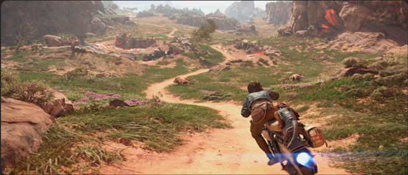

# Star Wars Outlaws case study

At Xbox, our commitment to our players and the industry is to reduce the impact that gaming has on the environment. There is a growing awareness among players regarding gaming energy costs and the environmental impact of video gaming. There is also a heightened interest among game publishers in enhancing their environmental stewardship. We wanted to share a curated selection of examples where a game has introduced energy efficiency optimizations in such a way to be imperceptible to the gamer when immersed in the gaming experience. There are myriad ways to deliver energy saving ideas into a game, ranging from menus or lobbies, to what happens when the title is left idle, or even during gameplay itself under specific conditions.

This project was spearheaded by Stefan Pijnacker & Gregor Ehrenstein from Ubisoft's Massive studio. This is what they have to explain about their journey below.

At Ubisoft, our first priority is making great games. When we discover small changes that improve the player experience and use less energy, especially in menus, lobbies, or when a game is paused, we build them in. This supports Ubisoft’s Play Green strategy and complements industry efforts like Xbox’s energy aware updates and the Playing for the Planet Alliance.

## How a Small Feature Made a Difference for Sustainability in Star Wars Outlaws

During the post-launch stages of Star Wars Outlaws, a power usage report came in from Microsoft. These can also be generated for any title upon request. This report shared how much power the console was using to run Star Wars Outlaws in various stages (main menu, active gameplay, pause menu, etc.). 
 
The game ran close to industry standards on most fronts except the pause menu. Star Wars Outlaws, while paused, used around 75% of the console's power budget, meanwhile the industry standard was around 55-60%.

### Lower framerate during inactivity to 1 FPS

Players can spend a reasonable length of time on the pause menu, and certainly when left in an idle state. After discussing this with the team, the idea came up to force the game to run on a lower framerate during a certain amount of inactivity (30 seconds). This was similar to how we run the game at a lower framerate when Star Wars Outlaws is unfocused on PC. 

Normally, we wouldn’t be able to do this since our projects might have many interactive/animated elements. Luckily, in Star Wars Outlaws’ pause menu, the graphics behind the menu were frozen, together with many game systems. This meant that we could test whether it was possible to make this eco-mode feature without the user noticing or taking away from the game experience. In the end, we were able to lower the game to 1 FPS from the original (30/40/60/144 based on platform), significantly lowering power draw. The implementation was done in such a way that if the user returned to the game, it would immediately resume.  

There is also no clear indication (like stutters, input delay, etc.) that would signal to the user that the game was slowed down.

### Power draw reduced to an average of 18 - 20%

The result of this feature was that while eco-mode was active, power draw would be reduced to an average of 18-20% compared to the original 75%~. If we compare those numbers against the power supplies of the Xbox Series X & S: 
- Xbox Series X: 180-200~ Watts to 45-50 Watts of power drawn   
- Xbox Series S: 90-110 Watts to 25-40 Watts of power drawn

## Conclusion

A change like this can lead to various improvements. Think about lowering energy bills for our players, decreasing Console/PC temperatures, and reducing the carbon footprint of gaming. All the while without interrupting our players' gaming experience.  

If we take the numbers of this feature for example, we can see that staying on the pause menu for an hour on an Xbox Series X would cost around 0.19 kWh ~, but now that number is down to around 0.05 kWh. The 0.14 kWh saved is equivalent to saving 51~ grams of CO2 emissions (based on the American average of kWh per CO2 emission in 2024).  

If ten thousand users idle for just an hour in Star Wars Outlaws, that would result in a reduction of 510kg of CO2 emissions, which is equivalent to 1,299 miles driven by an average gasoline-powered passenger vehicle, according to conversion estimate provided by [The EPA](https://www.epa.gov/energy/greenhouse-gas-equivalencies-calculator). All of that from a relatively small feature that is easy to implement.

### Want to learn more about Ubisoft's Play Green Program?

You can read more about our environmental and sustainability work by navigating to our [Ubisoft Play Green Program](https://www.ubisoft.com/en-us/company/social-impact/environment)

## Further reading

* [For Honor case study](case-studies-for-honor.md)
* [Fortnite and Unreal Engine case study](case-studies-fortnite.md)
* [Call of Duty case study](case-studies-cod.md)
* [The Elder Scrolls Online case study](case-studies-elder-scrolls-online.md)
* [Minecraft case study](case-studies-minecraft.md)
* [The game developer Energy Efficiency Essentials](../xbox-game-energy-efficiency-essentials.md)