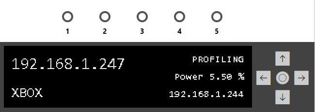
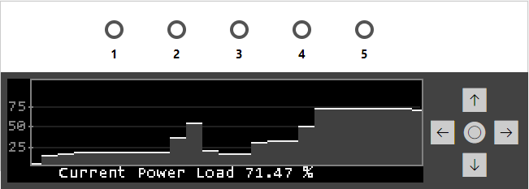

# Sustainability Overview

We believe that Xbox should be a place where everyone has fun. Games built with sustainability in mind make it possible for more gamers to have the choice to play in a more environmentally friendly manner. Outside of regulatory requirements we expect players to be engaged with, and seek opportunities for, reductions in power consumption while still enjoying the high quality experiences they are used to.

The documentation on this site describes tools and approaches to understanding and optimizing your game's power usage in ways that can benefit players on any platform. The goal is to encourage developers to consider the environmental impact of their games and highlight the numerous benefits of incorporating energy saving strategies into their designs. This also means game developers can help reduce gamers' energy bills when playing on high powered devices, better manage game device temperatures, and lower the carbon footprint of gaming, all whilst ensuring gamers can enjoy playing their favourite Xbox games without contributing to energy wastage.

The electricity generated across the globe to power electrical sold products, like gaming devices and video games, is sourced from a combination of carbon-intensive fossil fuels and renewable energy. Therefore, finding energy saving opportunities for gameplay across all gaming devices also offers strong environmental benefits.

Xbox is committed to ensuring players and creators have access to the most powerful and advanced gaming hardware and software.  Where there are opportunities to lower power consumption at no cost to gameplay fidelity, we are excited to explore together with our developer partners.

We want to kick-start the discussions and thought processes around where energy savings could be made, with some examples below, which will help shape current and future development in the field of sustainability.

## Why is this important and what do we want to achieve ?

Some of the biggest names in the game industry have already committed to act on energy and environmental issues via their video games, and Xbox is passionate to support this growing movement. Game developers can contribute a sizeable and influential part by offering more sustainable coding solutions to lower the energy demand and carbon footprint of games and apps in a targeted manner, all **without** negatively impacting gameplay fidelity.

This site and its contents provides information on:

* Highlighting the potential opportunities for power savings which will lower the energy demand and carbon footprint for players
* Identification of areas to begin introducing power use improvements
* Developer tooling to provide developers with an easy way to see the baseline power usage of their titles on Xbox Series consoles
* Partnering and collaborating with our developers and publishers to build ideas and processes around sustainable games development

## Console power vs game performance

One area of confusion for people new to sustainability is the seemingly contradictory statements of producing powerful gaming consoles and then asking developers to consider changes to reduce power consumption, which is understandable.

Pushing the hardware to its limits provides some incredible, high-fidelity, immersive experiences for players and is a key promise of the Xbox Series consoles. We remain committed to helping developers achieve those goals and for players to enjoy those experiences. When we put the player and creators at the centre, thinking inclusively about environmental and power expectations, it's clear that considering opportunities for understanding and offering options here is also important.

All of the suggestions and tooling referenced in this document present options for developers and where they might want to engage with players around the theme of sustainability.

In short, Xbox wants developers to continue making the best games, that play the best on our consoles, using all the available power of the consoles as they see fit.

Xbox currently has no plans to introduce any additional Xbox Requirements (XR) on a game being released based on its power profile.

## How can I predict which scenarios will give my title the best power savings?

The components within a console consume power at differing rates and although we don't publish these values it might be good to consider these rough comparisons :

| Component      | Power Ratio |
|----------------|------------:|
| GPU            |           6 |
| All CPU cores  |           1 |
| Memory traffic |           1 |
| Wifi/Network   |        0.05 |
| SSD            |        0.05 |

All the values are maximums when the components are running flat out, but if the component is being utilised less then it will consume less power. You can easily see that the GPU is by far the largest consumer of power within the console. With this in mind, most of the scenarios discussed below relate to GPU savings, as these are usually the easiest ones to change and the most impactful when starting to review your title.

## Determining the power usage of Xbox titles

One of the first questions when reviewing titles is "How can I tell what the current power consumption is for my title?", which is not an easy one to answer. All consoles have a slightly different power draw due to a combination of the manufacturing processes and variation in components, so finding an exact value can be difficult.

We chose a different approach to represent that power in a simple way, based around a percentage of maximum console power value, called the "Power Load %". When reviewing a title, developers should be able to see this value change depending on what is happening on screen, or after applying power saving changes. If the value goes down then the console is saving power compared to before.

*Note:* The power values can only be collected on Xbox Series X|S family of consoles, as previous console don't contain the hardware counters required.

## GDK Tooling

Since the June 2022 GDK, we have been adding tools that allow developers to view the power values during gameplay. Developers can profile their titles using the following tools :

* Xbox Series X|S Devkit Front Panel main screen has a "Power Load %" value displayed by default

    

* Xbox Series X|S Devkit Front Panel has a dedicated power screen with a scrolling graph showing power over the last 20 seconds or so. You can show this by moving the devkit front panel controller up
    * Both of the above show the power usage as a rolling average across the last 0.5 seconds

    

* PIX System Monitor Counters - Use the options to add the "Power Load %" counter. This shows the same information as the Front Panel graph screen
  
* PIX Timing Captures - "Power Load %" is captured as an instantaneous value with a 1ms granularity, so you can expect to see large variations across a frame as the GPU is either utilised or idle. The values can be seen in the Metrics tab within the Timing Captures

* In the March 2023 GDK there is a new API call [PIXGetPowerMetrics](https://developer.microsoft.com/en-us/games/xbox/docs/gdk/pixgetpowermetrics) which returns the "Power Load %" rolling average. This API is designed to be used by titles that have their own profiling tools and wish to collect this information.

## How do I start to profile my title for power usage?

Profiling games for their power usage is a new scenario that most developers have never considered before. A lot of effort goes into ensuring that a title runs at framerate (CPU and GPU) and now we are suggesting that developers may wish to consider adding another "axis" to their performance tuning and consider the power consumption.

As we have seen, the GPU is the main power consumer so any changes we can make to either the **framerate and/or the rendering resolution** will have the largest impact.

Our main recommendations are to look for areas of the game that the player will not be impacted, or may not even notice the change. The first recommended step is to get an overview of the power profile of your game, ideally when it is in one of these states:

* Loading - Either to the main menu on boot, or during any large streaming loads
* Character creation or setup screens
* Idle gameplay
* In combat (if applicable) or a stressful area of the title
* When showing UI that overlays most of the visible screen - Inventory / load-out screens / item management etc.
* When in the pause menu or an in-game contextual menu (if applicable)

In each of the situations above, review the power values (via any of the tools or API call) and consider whether it makes sense for your title. For example, we have seen some titles that still fully render the game world in the background behind a full screen UI menu. This is not desirable as the console is consuming power with no visible advantage to the player. In this situation you should consider either stopping the world being rendered, or reduce the render resolution to lower the power consumption, especially if the player will be using the UI frequently within your title.

Developers should also consider whether areas of the game, like the pause or full-screen UI, need to run at the full framerate. For example, dropping the framerate from 60fps to 30fps might not be that noticeable within a full screen UI, but saves a large amount of power with no player impact.

Consideration should also be given to the scenario when a player is idle. From our telemetry and player discussions, we know that in certain games the player can be idle while waiting for an in-game event, or they have stepped away from their console for a moment and been distracted. During this time, the console is still consuming power, so adding basic forms of idle detection based on the player's last input will be worthwhile. If the game progressively lowers the resolution or reduces the framerate after a certain time threshold has been reached, then this also adds to the power savings without impacting the player.

Another potential for review is any areas of "pathological" power usage in your title. For example, if the game is running with an uncapped framerate then the GPU will be running at close to 100% utilisation consuming large amounts of power.  In this scenario the developer should consider whether it would be better to cap the framerate at 60fps, or 120fps, to ensure that the GPU has some idle time.

***Note:*** If your title is being actively updated in retail (Games as a Service) then you might want to consider adding additional telemetry events around some of the scenarios above to gauge where your players are spending their time. This data can prove invaluable when planning where to add power saving features.

## What if I want to save even more power?

We believe that consumers are already aware of sustainability themes within games and are now starting to think about the power consumption of their devices as well, especially with the large increases in energy costs in various parts of the world.

In this console generation consumers already have choices about how they play their games. They can choose for their game to prioritise visual quality over framerate, or framerate over visual quality. These game modes are now part of the consumers' vocabulary and most are aware of the "Quality" and "Performance" modes that games offer.

We would like to suggest that a new mode be implemented across games called "Eco" mode that sacrifices visual quality AND performance to make more substantial energy savings. Every title is different and how they choose to save power should be left up to the developers, as they understand their title better than anyone. The key here is to give the player *choices* around what sacrifices they are willing to make to save power while playing the game. Developers might consider:

* **60fps vs 30fps mode**
* **4K vs 1080p vs 960p mode** - This is especially relevant if your title renders to 4K internally, as some players will not have 4K capable TVs and the additional power is wasted. Also, some players who do have 4K capable TVs might want to reduce the resolution to 1080p to save power, which they are not able to do today
* **Idle Timeout** - Allow the user to set an idle time after which the game will progressively reduce the rendering resolution or framerate to save power when the player is away.

All of these options could save significant amounts of power and there may be others that you can suggest that are specific to your title. Offering these options and using the GDK tooling to confirm the savings allows players to make a conscious choice about their gaming impact.

## What if my game isn't being updated or is still in the development phase?

If there are no opportunities to update an existing title to save power then you could be considering what you would like to do for the next title from your studio. We have found in discussions with developers that inside studios there is a lot of support for sustainability themes and savings, but the studios haven't had that discussion yet. We would recommend starting discussions around sustainability early within your studio and what goals, if any, you would like to achieve.

These savings can be directly from the title, saving console power with "Eco" mode options, or even related to power savings within the development studio itself. We have seen studios implement options such as turning off lights, PC's, printers and devkits overnight, as well as reducing air conditioning and other power hungry devices.

By starting the discussion early it gives time for everyone to express their thoughts and ideas and come to a consensus as a studio.

## Next steps

We have presented some guidance and tooling to allow developers to explore how their titles might benefit from offering power savings to consumers and help meet their own company's sustainability goals. In the title this might manifest as fixed measures, like reducing the resolution in menus, not rendering the world behind UI screens, or maybe via options presented to the players via "Eco" mode options. The important thing to remember is that we want to give players the **choice** to make these savings.

We are still early in our collective journey around sustainability and what it means for gaming, so developers are encouraged to engage with work being done by developers and organisations in this space. As we progress further in this field we expect to update this document with more links and references to example work that developers can learn from.

If you would like more information about sustainability features, or just want to discuss your options, then please contact your Microsoft Developer representative who can help you.
