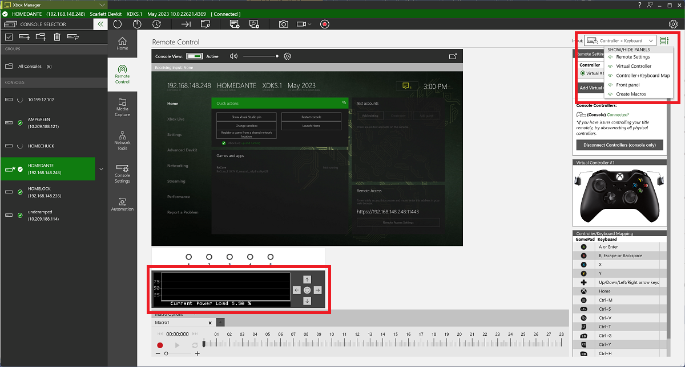

# How to use your Xbox Series devkit to measure power consumption

If you wish to identify areas of potential energy efficiency improvements by tracking power consumption, you will benefit from being able to track power consumption in real time on your console, therefore allowing you to see where peaks and troughs occur relative to what is occurring in the game.

Working with the electrical and silicon engineers in Xbox, we have created a set of tools and code that allow us to display power in a way that can be easily recorded and passed along to developers in a meaningful way. This means we can give developers a single understandable value to represent the power consumption of titles, and the chosen “Power Load %” represents a value from 0 to 100% of the maximum power draw of your devkit, which is normalised and can be compared across consoles consistently.​

You can also learn more about developer opportunities in the [Game Developer Kit](https://developer.microsoft.com/en-us/games/xbox/docs/gdk/sustainability-overview) (this link might require sign-in credentials provided by an NDA Xbox program).

## Front panel display

The front panel display on the Xbox Series devkit is the perfect place to show some new data, so you will find that the display now shows the Power % on the front screen. You can see an example below.

The reason for putting the power value so prominently on the main page is to spark interest from developers as to what the value represents, and to prompt further discussions internally around power. You will also find additional GDK documentation describing the purpose of the counter via the link at the bottom of the page. There is also a different front panel display showing the power values over a 20 second period.

The intended users for these displays are most likely producers, QA testers, and others who do not use profiling tools (like PIX), but wish to track how well their game is managing its power. These screens are intended to display the power at a high level of granularity, as the values are rolling averages for the last 0.5 second of use.​

## Xbox Manager

Xbox Manager is part of the GDK and is a GUI app which provides its users with the ability to deploy and manage apps on consoles that are selected in Xbox Manager. We have built in the ability for users to see the power consumption of their title within Xbox Manager's UI. To do this, there is now an option in the top-right drop down box which exposes the front panel display. The screenshot below demonstrates how to accomplish this:

## API access

In the March 2023 GDK, we added a new [PIXGetPowerMetrics](https://developer.microsoft.com/en-us/games/xbox/docs/gdk/pixgetpowermetrics) API that allows developers to sample the immediate power values in code.  These values can then be included in your own studio profiling tools, meaning you do not need to go outside your own tools to get the data you require.

## Next steps

- [Please click here to learn how to use PIX for sustainability testing](developer-tool-pix-guide.md)
- [Please follow this link to the Game Developer Kit to read more technical information](developer-overview.md)
- [Please click here to learn how Certification deploy this test tool](../certification-testing-process.md)
