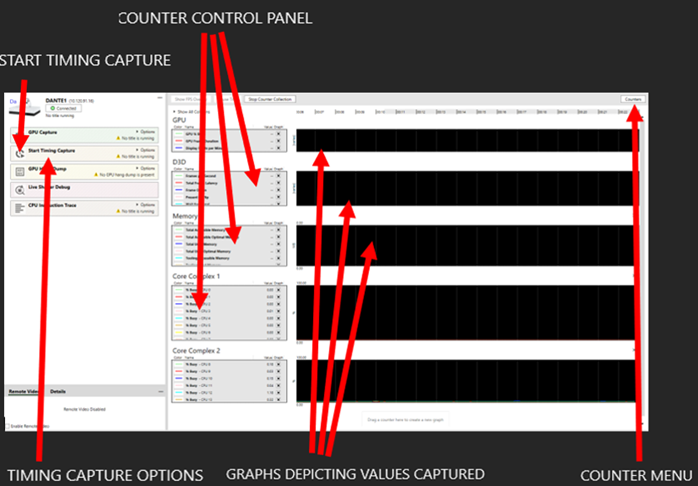
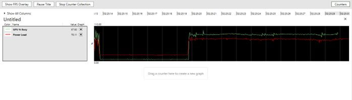
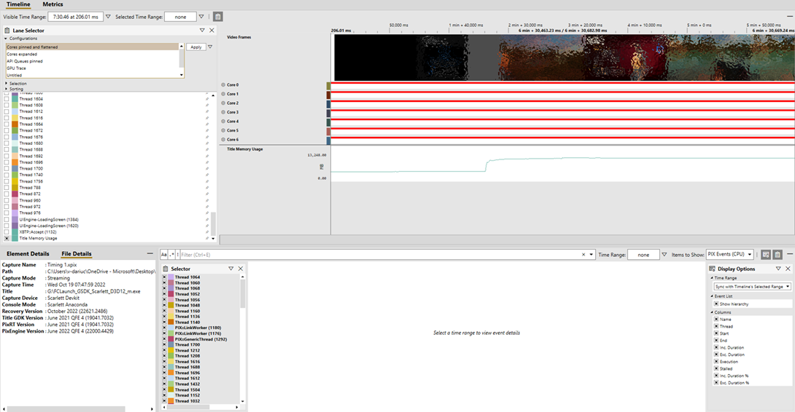
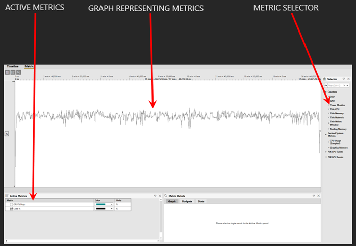
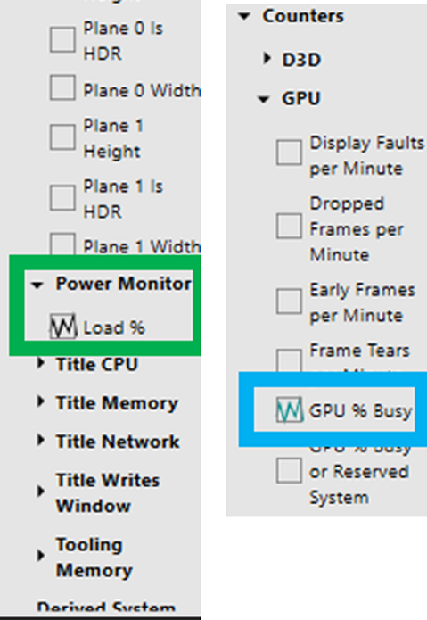
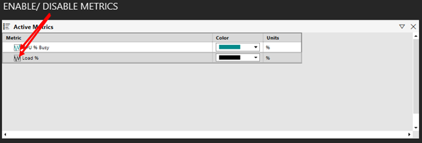
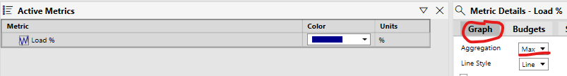
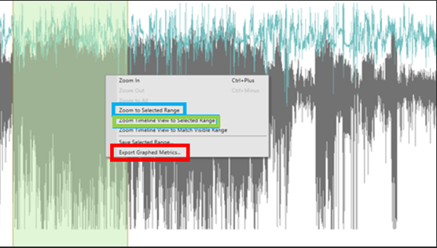

# How to use PIX to measure power consumption

If you wish to identify areas of potential energy efficiency improvements by tracking power consumption, you will benefit from being able to monitor your title's power consumption with a GUI, therefore allowing you to see where peaks and troughs occur relative to what is occurring in the game. You can also learn more about developer opportunities in the [Game Developer Kit](https://developer.microsoft.com/en-us/games/xbox/docs/gdk/sustainability-overview) (this link might require sign-in credentials provided by an NDA Xbox program).

## How to use power monitor for PIX

Performance Investigator for Xbox (PIX) is the go-to software tool for graphical performance. PIX now comes with Power Monitor to help developers understand the power consumption of their games in great detail. To perform this testing for measuring power consumption with a view to finding improvement opportunities, you will need the following prerequisites:

- A PC with the latest GDK installed on the same network as your console
- Performance Investigator for Xbox (PIX) installed via the GDK
- Power Monitor selected in PIX
- Xbox Series X development kit

### Test steps

With all the prerequisites prepared, please following these steps.

1. Launch the GDK Command prompt on your PC and connect to the console by typing _xbconnect [Tools IP]_. The tools IP can be found within the console’s _Settings > Console info > Developer settings_.
2. Launch the Xbox Manager GDK application on the PC, navigate to ‘Console settings’ > ‘Debug’ and tick ‘Enable profiling mode’ – this must be disabled after the power test, ready for when normal XR testing resumes.
3. Launch the PIX GDK application on the PC and observe that the app transitions to the console view.

- The console view contains the following elements that are relevant to power usage tests:
  - Timing Capture Options: This menu contains several options that determine how data is captured and transferred to the PC.
  - Graphs: These graphs update in real time and display a visual representation of the values being captured from data sets listed in the counter control panel.
  - Counter Control Panel: This allows us to remove data sets that are monitored and represented by graphs to both make the data easier to see and to customise the view to the relevant data.
  - Counter Menu: The counter menu allows us to add any required counters that the tool captures.

4. Now that you’re familiar with the console view it’s time to change settings so that capture goes smoothly.

  - Change the following settings within the Timing Capture Options menu:
    - Mode: Streaming Mode
    - CPU Samples: 4k/sec (Balanced).
    - Video Frames: Enabled
    - Compress data for transport: Disabled (unless bandwidth is an issue).

5. (Optional) Remove all of the graphs by clicking the ‘x’ icon at the top right of the graph, navigate to the counter menu, and then drag the following counters to the ‘Drag a counter here to create a new graph’ section:

- GPU% Busy
- Power Load

6. Launch the title and observe that the graph enumerates with captured data. The image below demonstrates a title running.

7. Navigate to the area of the title that needs testing, press the ‘Start Timing Capture’ button or press Ctrl+T to start capturing video and data.

8. Progress through active gameplay, press the ‘Stop Timing Capture’ and observe that the app transitions to the Timeline tab.
This view displays captured results, along with a timeline of the video captured, allowing us to identify at what point during gameplay a certain value was captured.

9. Navigate to the Metrics tab for a representation of power usage.

The metrics tab contains the following:

- The metric selector: This section contains a selection of metrics that PIX can capture, for power usage we need _Power Monitor > Load_ and _GPU > GPU% Busy_.

- The Active Metrics Section: This allows us to enable and disable previously selected metrics, as well as change their colour on the graph.

You will also want to ensure the graphs aggregate based on average. To do this, ensure you have clicked on the metric in the lower left of PIX (as explained above) and then in the right hand panel, select the 'Graph' tab and check the value of the drop-down list. Please ensure Average is selected:

- The Metrics Graph: This section displays a graph representing values captured from metrics in the active metrics tab.
Highlighting a section of the graph allows us to zoom into that section, or to zoom the timeline to the selected section, allowing for a visual representation of what area of the title the data was captured in.

    - Zoom to Selected Range – allows us to zoom the selected range to fill the entire graph section, for a more granular view.
    - Zoom Timeline View to Selected Range – transitions the app to the Timeline view and zooms the timeline to match the Selected Range, allowing us to visualize what area of the title
    - Export Graphed Metrics – exports a .csv file containing every point of data selected, including the value and the timestamp. This can then be opened in Excel and you can create a quick average for a specific section with an =AVERAGE function.

## Certification's console configuration

For each title tested in the Certification lab, we want to do the best we can to retain the same setup to obtain comparable results between different titles. The more variables you can keep the same, the more confidence we can place in comparing results. The information below explains the set up we have used for all the results you see in the [Lab Platform Baselines](../lab-platform-baselines.md) page.

## Next steps

- [Please click here to learn more about how to use your devkit for testing power consumption](developer-tool-devkit-guide.md)
- [Please click here to learn how Certification deploy this test tool](../certification-testing-process.md)
