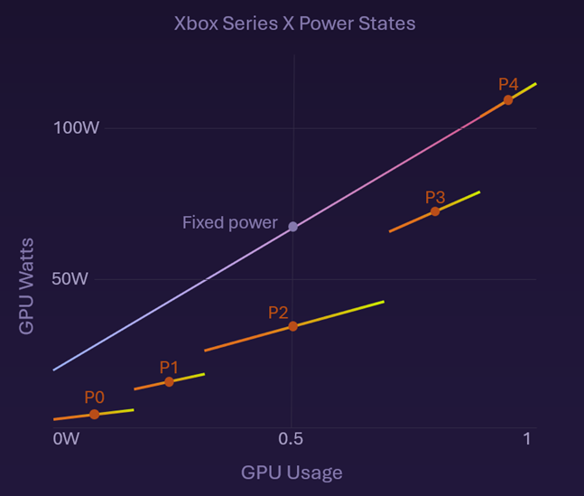

# Introducing Dynamic Power States

***NOTE:*** This feature is **only** available on **Xbox Series** consoles and will have no effect on earlier Xbox consoles.

In today's world, energy efficiency is more crucial than ever, especially in the realm of gaming. With many millions of gaming devices in use globally, even small improvements in energy consumption can lead to significant reductions in our collective environmental footprint. Improvements also translate to lower energy costs for gamers running mains-powered devices. Additionally, for battery-powered devices, improved energy efficiency means longer battery life, allowing for extended gaming sessions without the need for frequent recharging. 

Dynamic Power States (DPS) is an innovative Xbox feature that addresses this need by dynamically adjusting the GPU's power level based on the rendering workload. By scaling the GPU's power state back when it's not fully utilised, DPS can ensure that energy is conserved without compromising performance. This automatic adjustment, driven by the graphics driver based on recent frame time history, exemplifies how technology can be harnessed to create a more sustainable and cost-effective gaming experience.

In the graph below you can the fixed power curve, as the GPU is locked at power state 4 (P4), meaning that when the GPU becomes idle it's still consuming more power than we would like. The GPU is capable of other power states and their profiles and relative power consumptions are shown :



The intent of DPS is to unlock voltage savings for games without impacting performance. How do we achieve this?
1. Enable GPU dynamic power states
2. GPU calculates normalized frame statistics and stores it as historical data
3. GPU automatically changes power states based on the current game demands and the historical data, saving energy

***NOTE:*** Optionally, games are able to reduce their energy consumption even further by adopting the guidance contained within the rest of the Xbox Sustainability Toolkit.

## Implementation example

In Call of Duty© Black Ops 6, Rulon Raymond, Senior Director of Technology for Call of Duty explains: 

>"We spent a few days experimenting with DPS and the results were promising. Specifically, we could see an additional 10-15% power savings in areas **beyond** those we introduced using the Xbox Sustainability Toolkit. We were already throttling parts of the game engine down (for example, while in menus or front-end screen), with no change to the players' framerates, which saved us a lot of power, but DPS allowed us to get additional savings with no effort."

>"At the time of shipping Black Ops 6, our current implementation plan settled on:
>* Enable DPS in all areas of the game where we’re already applying power saving measures
>* Expose a flag that enables DPS at all times, which is off by default.  Since we are very sensitive to even the smallest drop in performance, we will be using this flag to perform some multi-day performance testing and go from there. It would be nice to turn on all the time, but only once we have sufficient data to back that decision."

Two Point Museum have been the first third-party studio to adopt the DPS feature remotely by having Xbox update a cloud setting to enable the energy saving features. Ben Hymers, Technical Director and co-founder of Two Point Studios shares more:

>"We tested Dynamic Power States alongside Constrained+ mode to maximise energy efficiency. Both were enabled via a cloud setting file modified by the Xbox team following our approval. Together, these features reduced power draw by approx. 50-58% in the main menu (depending on the scenario), and cut energy use during constrained mode by 39–63%. Since rollout, we’ve observed a notable decrease in average energy consumption without degrading gameplay fidelity. For instance, power consumption for Xbox Series X has decreased from an average of 135W to 125W. Across our player base, this translates to an annual energy saving of ~6.5 megawatt-hours, equivalent to watching TV nonstop for 65,000 hours, or nearly 7.5 years straight.
>These settings were enabled globally following a successful smoke test that aligned with our standard QA protocols. The testing was completed in parallel with other planned work, requiring roughly an hour of dedicated team time. We also coordinated a staggered release with Xbox to ensure a smooth player experience.  Overall, the integration has been a success, and we’re excited to build on this momentum by enabling these features across more of our titles.” 
 
## How to test DPS within your game (Development only)

To test DPS, *without changing any code or rebuilding*, you can enable it globally using these instructions:
1.	Ensure your devkit has at least the August 2024 Recovery
2.	Create an empty file named DynamicPowerEnable on your PC
3.	Copy this file to the D:\ drive on the console: "xbcp DynamicPowerEnable xD:\" (no quotes)
4.	Launch the game on the console and it will run with DPS enabled
5.	Once testing is complete, you can disable DPS by deleting the file on the console: "xbdel xD:\DynamicPowerEnable" (no quotes) and relaunching your game

Some additional notes:
* To check whether DPS is running and to watch savings in real time, enable the Title Performance Overlay while the game is running (via PIX or the console's settings in Xbox Manager)
* If DPS is enabled, the overlay will include a red line and the GPU power state metric at the bottom right corner will show the current power state, ranging from 0-4. If it's at 4, the GPU is running full speed, lower means it's saving energy.
* If DPS is disabled, the GPU power state will show "N/A"
* To measure specific parts of the game in PIX, use the "Power Load %" metric to measure changes in GPU energy usage

**Note:** Titles cannot use this solution to enable DPS when releasing to Retail, instead you need to use the SetDriverHintX function outlined below.

## How to enable DPS within your game (For Retail release)

After seeing the possible power savings, or if you want finer grained control over when DPS is enabled, you can add code changes to call the existing _SetDriverHintX()_ API.

### SetDriverHintX(UINT feature, UINT value) 

This existing API call on the graphics device has been expanded by adding an additional ENUM value to set the DPS state. If you are using the **June 2024 GDK**, or later, you can use the ENUM value:

>```DRIVER_HINT_SET_DYNAMIC_POWER```

For all **pre-June 2024 GDKs** (or older **XDK** titles) you can use the value directly:

>```0xEFF1C1E7```


###Examples:

To enable DPS:
>```SetDriverHintX( DRIVER_HINT_SET_DYNAMIC_POWER, 1 );```
>or
>```SetDriverHintX( 0xEFF1C1E7, 1 );```


To disable DPS:
>```SetDriverHintX( DRIVER_HINT_SET_DYNAMIC_POWER, 0 );```
>or
>```SetDriverHintX( 0xEFF1C1E7, 0 );```

 This feature can be toggled on and off during gameplay, but it is preferable to leave it enabled **at all times** to get the maximum savings.

**Note:** If your game is toggling DPS then you need to reset the desired value in the PLM _Resume()_ handler, as the DPS state is not saved during the Suspend/Resume transitions.


## How can a game tell when DPS is enabled ?

Games are able to gather information on the frame statistics when runinng. This allows them to alter the rendering (dynamic resolution etc.) to fit the required frame time.

### GetFrameStatisticsX API call

This existing API will gain a new frame statistics type : ```D3D12XBOX_FRAME_STATISTICS_TYPE_POWERSCALING```

And an associated structure :

```
typedef struct D3D12XBOX_POWERSCALING_STATISTICS
{
    UINT8 PlaneIndex; 
    UINT64 GPUBusyDurationScaled; 
    double ScaleFactor;
} D3D12XBOX_POWERSCALING_STATISTICS;```
```

The existing render frame statistics _D3D12XBOX_RENDER_STATISTICS_ returns a value called GPUBusyDuration :
```
typedef struct D3D12XBOX_RENDER_STATISTICS
{
    UINT8 PlaneIndex;
    UINT64 GPUWriteCompleteTime;
    UINT64 GPUBusyDuration;
} D3D12XBOX_RENDER_STATISTICS;
```
This value is currently computed based on the assumption that the GPU clock rate is at P4. We will call this the _normalized_ GPUBusyDuration because the value returned is invariant of the GPU power state. The powerscaling frame statistics, on the other hand, are subject to GPU power state changes and will differ from the GPUBusyDuration.

This is best explained with an example. Suppose there is a GPU workload that utilizes 8ms of execution time at P4 and extends to 12ms when running at P2 (due to a lower clock speed).  The behavior of these two frame statistics would be: 

| Value | Dynamic Power OFF (P4) | Dynamic Power ON (P2) |
| --------------- | --------------- | --------------- |
| GPUBusyDuration | 8ms | 8ms |
| GPUBusyDurationScaled | 8ms | 12ms |
| ScaleFactor |	1 | 0.67 |

***NOTE:*** The normalized nature of the existing GPUBusyDuration measurement is valuable to preserve because it is used for dynamic resolution computations in game engines today.

By separating normalized and scaled measurements, we are able to avoid feedback loops where changing the GPU power state leads to longer execution, which leads to reducing the game resolution, which leads to the platform believing it can lower pstate further, which leads to reducing the game resolution ... and the game ends up in a spiral until the lowest game resolution is reached.

## Next steps

- [Please click here to learn how to use PIX for sustainability testing](developer-tool-pix-guide.md)
- [Please follow this link to the Game Developer Kit to read more technical information](developer-overview.md)
- [Please follow this link to learn more about how to use your devkit for testing](developer-tool-devkit-guide.md)
- [Please click here to learn how Certification deploy this test tool](../certification-testing-process.md)
