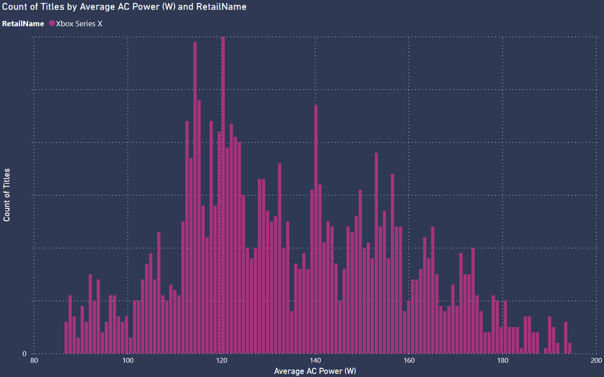
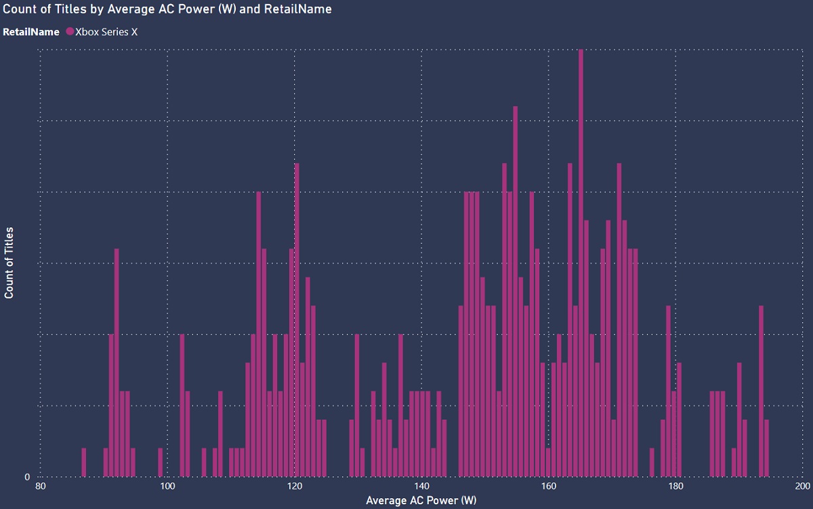
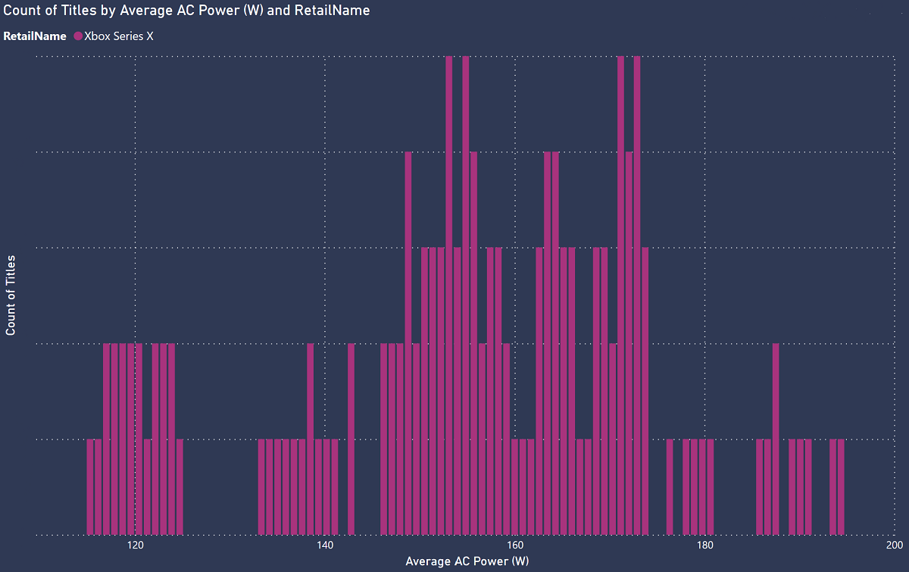
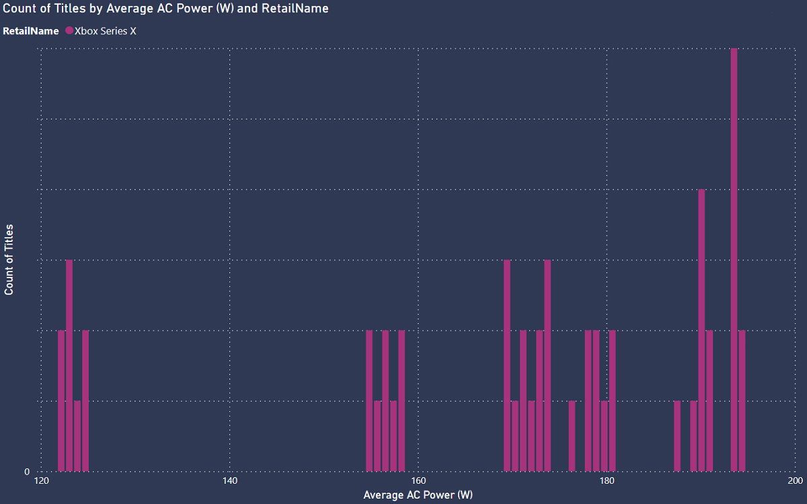
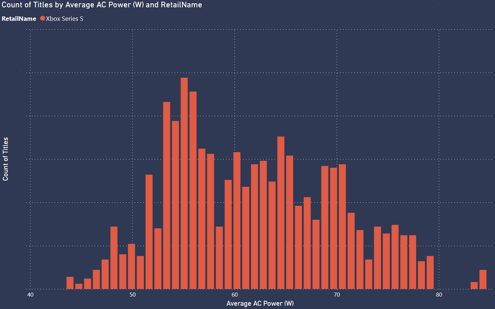
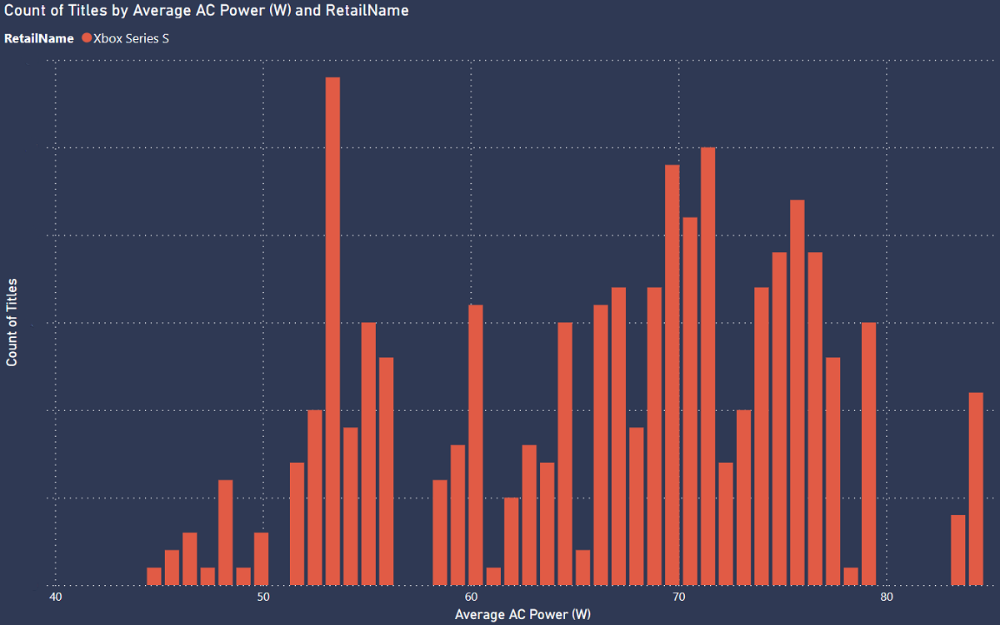
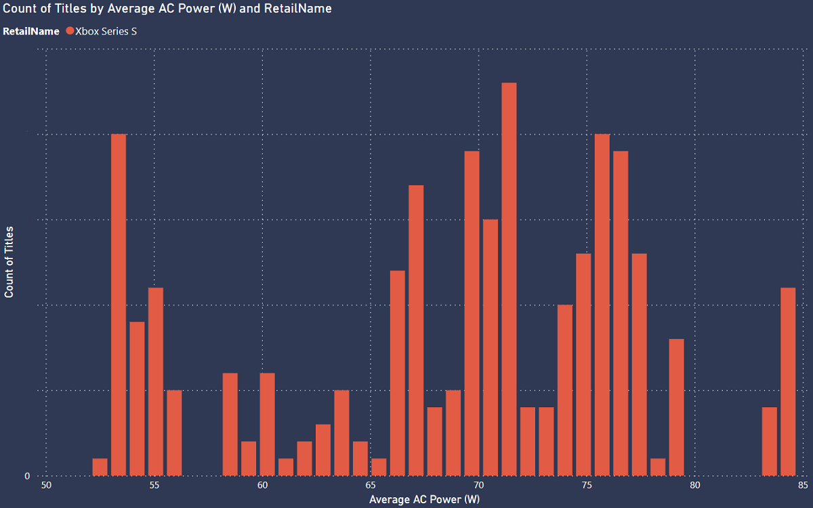

# Introduction to global platform baselines

You will have read the platform baselines for power consumption specific to individual in-game areas as explained in the [Lab Platform Baselines](lab-platform-baselines.md) page.

in 2022, we released a limited run of enhanced Xbox Series X|S consoles with power supply energy monitoring, which provides anonymized insights into console power consumption. This telemetry helps us gather additional insights across a wide range of user setups and usages in the field, such as power consumption from SSDs, USB devices, networking, and power regulation efficiency losses. Using this telemetry, we can train data models to report back on the AC power consumption of titles running across Xbox and then build reports showing a variety of averages for sustainability reasons. Those learnings are shared in this section.

We are also partnering with Carbon Trust and other global tech companies to develop a common methodology for tracking the usage emissions associated with connected devices.

## What does global platform telemetry show us?

As touched upon above, our Xbox Series X|S consoles are able to send anonymized power telemetry back to Xbox services to help us determine the AC power consumption of consoles, as measured at the wall socket, across a range of scenarios, including during game and app usage. We are able to use this data to determine the average power consumption of each game, studio, developer, or publisher, and even to determine more granular details like the averages for genres or platform title features.

**Xbox Series X:**

* Global average game power: 122W
* Global average app power: 51W

**Xbox Series S:**

* Global average game power: 61W
* Global average app power: 31W

> [!NOTE]
> These averages remain somewhat consistent with minimal variation over time but we will periodically update these averages.

### Power distributions

Using a distribution chart, we can see the average power reported by our consoles. The chart below shows the most common AC power (W) reported over the last several months for both Xbox Series S and Xbox Series X.

## Platform averages by feature

Introduction text here. Unless otherwise stated, platform averages include all title capabilities irrespective of the supported features.

**Xbox Series X gaming average, 4K:**

**Xbox Series X gaming average, 4K, 60 FPS:**

**Xbox Series X gaming average, 4K, 60 FPS, HDR:**

**Xbox Series X gaming average, 4K, 60 FPS, HDR, VRR:**

**Xbox Series S gaming average, 1440p:**

**Xbox Series S gaming average, 1440p, 60 FPS:**

**Xbox Series S gaming average, 1440p, 60 FPS, HDR:**

## Averages by genre

Platform telemetry also allows us to see averages by genres.

**Xbox Series X:**

* Action Adventure: 121W
* Card & board: 110W
* Shooter: 127W
* Sports: 125W
* Puzzle & Trivia: 104W
* Platform: 110W
* Role playing: 120W
* Racing & flying: 133W
* Simulation: 126W
* Family & kids: 121W

**Xbox Series S:**

* Action Adventure: 61W
* Card & board: 59W
* Shooter: 64W
* Sports: 60W
* Puzzle & Trivia: 55W
* Platform: 55W
* Role playing: 62W.
* Racing & flying: 65W
* Simulation: 62W
* Family & kids: 60W

## Next steps

To learn more about lab platform baselines that show averages based on individual in-game areas, please click the link below.

* [Xbox Lab Platform Baselines](lab-platform-baselines.md)
