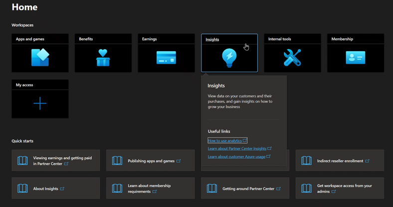
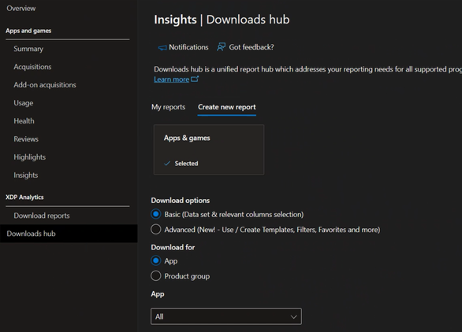
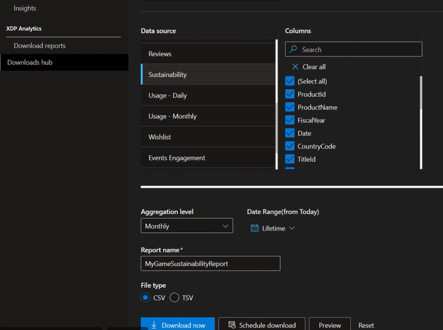
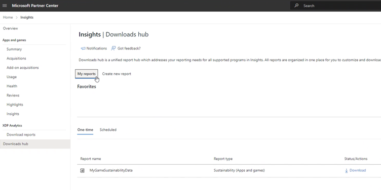
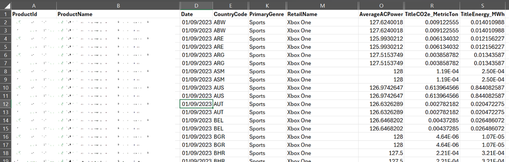
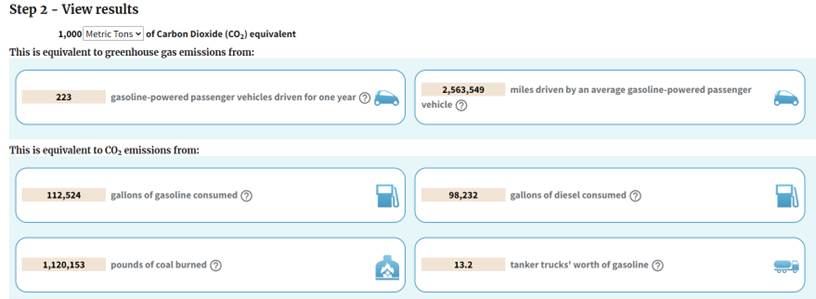

# Sustainability developer data on Partner Center

We are excited to announce that Partner Center now provides you with energy consumption data for your title on the Xbox console. This is a feature that we have added to help you monitor and optimize the environmental impact of your title.

Energy efficiency is a key factor for the sustainability of the gaming and app industry and the well-being of our planet. We are committed to reducing the carbon footprint of our products and services, and we want to empower you to do the same. The other documentation as part of this toolkit demonstrates how energy efficiency opportunities can be easily achievable without lowering gameplay fidelity. By accessing the energy consumption data for your title in Partner Center, you can see how much power, energy, and the carbon footprint your titles are generating on the Xbox console platform. You can also compare your title's performance between months to measure any improvements you might have released.

You can learn more about the dataset on [Downloads Hub datasets - Partner Center | Microsoft Learn](/partner-center/downloads-hub-datasets). We hope that this new feature will help you enhance your title's performance and contribute to the global effort to reduce greenhouse gas emissions and lower our gamers' energy bills.

## Instructions to download and view data for your titles

1. Go to https://partner.microsoft.com and login to your account. If you need a Partner Center account, please contact the relevant person in your organisation and request to be added to the Analytics AAD group and granted "Marketer" permissions to view the insights data. You will also need product-level permissions for your title catalogue. If you're unsure who that might be, please speak to your Microsoft point of contact who might be able to help find the right person

2. From the Dashboard Home, go to Insights

3. Click on Downloads Hub > Create New Report

    

4. The user can choose to download sustainability data for either an App a Product Group of a released title. Therefore, select an App or Product Group and pick your game or app from the drop down list.

    

5. Scroll towards the bottom of Data Source and select Sustainability and select all columns

6. In the Date Range field, choose Lifetime as the time range, then enter your report file name, and then click on Download Now

    

7. Dismiss the Download confirmation

8. Return to the top of the page and click on My Reports

    

9. From here a user can download the report from the section at the bottom of the page and they'll be presented with the following data. Obviously in this instance I have redacted the title name and product Id. On the far right you'll be able to read the key sustainability data, with each row representing a different month, retail name, and country for your product.

    

10. A handy way to quickly convert your energy or CO2 data to real world equivalencies is to use the EPA website. Sum the emissions in the TitleCO2e_MetricTon column, then head to https://www.epa.gov/energy/greenhouse-gas-equivalencies-calculator#results. You can filter to enter Emissions Data on the web page and then input your total Carbon Dioxide or CO2 Equivalent. For example, the real world impact of just 1000 metric tonnes of CO2-equivalent is:

    

## Next steps

* [Learn how to use PIX and Power Monitor for testing](developer-tools/developer-tool-pix-guide.md)
* [Learn how to get the most out of your devkit to test sustainability performance](developer-tools/developer-tool-devkit-guide.md)
